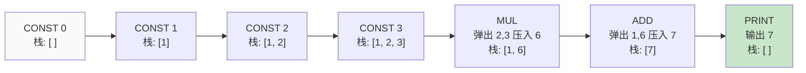

# Ch23: 栈式虚拟机 — VM 主循环

## 学习目标
- 理解栈式虚拟机的核心原理：操作数栈与指令指针
- 掌握 fetch-decode-execute 主循环的实现方式
- 能够实现基本算术指令并追踪栈的变化过程
- 对比栈式 VM 与寄存器式 VM 的设计取舍

---

## 1. 为什么选择栈式虚拟机

### 1.1 两种 VM 架构

| 维度 | 栈式 VM（Stack-based） | 寄存器式 VM（Register-based） |
|------|----------------------|---------------------------|
| 操作数位置 | 操作数栈 | 虚拟寄存器 |
| 指令长度 | 短（通常 1-2 字节） | 长（需要编码寄存器号） |
| 指令数量 | 多（需要频繁 push/pop） | 少（直接操作寄存器） |
| 实现难度 | 简单 | 复杂 |
| 代表 | JVM、CPython、Lua 5.0 前 | Lua 5.0+、Dalvik |

JimLang 选择栈式 VM，因为：
- 指令编码简单（紧凑）
- 不需要寄存器分配算法
- 代码生成更直观（后序遍历 AST 即可）

### 1.2 核心组件

```
VM 的两个核心状态：
┌──────────────────────────────────────┐
│  操作数栈 (Operand Stack)            │ ← 所有运算的中转站
│  [底部 ... 顶部]                      │
├──────────────────────────────────────┤
│  指令指针 IP (Instruction Pointer)    │ ← 当前执行位置
│  → 指向 chunk.code[] 中的下一条指令    │
└──────────────────────────────────────┘
```

#### 操作数栈状态变化（执行 `1 + 2 * 3`）



> VM 执行的核心：每条指令要么往栈上压值（CONST），要么从栈上弹值运算后再压回（ADD/MUL），要么消费栈顶值（PRINT）。

---

## 2. 指令集设计

### 2.1 OpCode 枚举

| 指令 | 操作数 | 栈效果 | 说明 |
|------|--------|--------|------|
| `CONST` | 常量池索引 | → value | 将常量压栈 |
| `ADD` | 无 | a, b → (a+b) | 弹出两个，压入和 |
| `SUB` | 无 | a, b → (a-b) | 弹出两个，压入差 |
| `MUL` | 无 | a, b → (a*b) | 弹出两个，压入积 |
| `DIV` | 无 | a, b → (a/b) | 弹出两个，压入商 |
| `NEG` | 无 | a → (-a) | 弹出一个，压入负值 |
| `PRINT` | 无 | value → | 弹出并打印 |
| `POP` | 无 | value → | 弹出丢弃 |
| `RETURN` | 无 | — | 结束执行 |

### 2.2 字节码编码

```
每条指令 1-3 字节：
  CONST: [OP_CONST] [常量池索引（1字节）]
  ADD:   [OP_ADD]
  PRINT: [OP_PRINT]
  RETURN:[OP_RETURN]

常量池：
  index 0: 1.0
  index 1: 2.0
  index 2: 3.0
```

---

## 3. 栈变化追踪

### 3.1 表达式 `1 + 2 * 3`

```
字节码: CONST 0, CONST 1, CONST 2, MUL, ADD, PRINT, RETURN
常量池: [1.0, 2.0, 3.0]

指令        IP  操作                  栈状态
──────────────────────────────────────────
CONST 0      1  push constants[0]     [1]
CONST 1      3  push constants[1]     [1, 2]
CONST 2      5  push constants[2]     [1, 2, 3]
MUL          6  pop 3, pop 2, push 6  [1, 6]
ADD          7  pop 6, pop 1, push 7  [7]
PRINT        8  pop 7, print "7.0"    []
RETURN       —  结束
```

### 3.2 表达式 `(4 - 1) * (2 + 3)`

```
字节码: CONST 4, CONST 1, SUB, CONST 2, CONST 3, ADD, MUL, PRINT, RETURN
常量池: [4.0, 1.0, 2.0, 3.0]

指令        栈状态
────────────────────────
CONST 0     [4]
CONST 1     [4, 1]
SUB         [3]           ← 4 - 1 = 3
CONST 2     [3, 2]
CONST 3     [3, 2, 3]
ADD         [3, 5]        ← 2 + 3 = 5
MUL         [15]          ← 3 * 5 = 15
PRINT       []            ← 输出 15.0
```

**关键观察**：字节码顺序就是 AST 后序遍历的顺序。编译器只需对 AST 做后序遍历即可生成正确的字节码。

## fetch-decode-execute 主循环到底在做什么

`while (ip < code.length)` 这段代码看起来很普通，但它其实就是整台虚拟机的心脏。

每一轮循环固定做三件事：

1. `fetch`：从 `code[ip]` 取出当前指令
2. `decode`：判断它是哪种 OpCode、要不要继续读操作数
3. `execute`：修改栈、打印结果或改变执行状态

这个模式重要，不是因为名字专业，而是因为它解释了 VM 和解释器的真正差别：

解释器是在“看 AST 节点做动作”，VM 是在“看一串低层工序做动作”。

## 为什么栈式 VM 让编译器更简单

寄存器式 VM 的优势通常在执行效率和指令数量，但它也要求编译器明确回答：“每个中间结果该放到哪个寄存器里？”

栈式 VM 则把这个问题简化成：

1. 子表达式先算
2. 结果自然留在栈顶
3. 父表达式再消费这些结果

这就是为什么课程在教学实现里选择栈式 VM。它不是绝对最快的设计，但它能让编译器、字节码和执行轨迹之间形成最直接的对应关系。

---

## 4. 关键代码

### 4.1 Chunk 数据结构

```java
public class Chunk {
    private final ByteArrayOutputStream code = new ByteArrayOutputStream();
    private final List<Object> constants = new ArrayList<>();

    public int addConstant(Object value) {
        constants.add(value);
        return constants.size() - 1;
    }

    public void emitByte(int b) {
        code.write(b);
    }

    public void emitConst(Object value) {
        int idx = addConstant(value);
        emitByte(OpCode.CONST.ordinal());
        emitByte(idx);
    }

    public byte[] getCode() { return code.toByteArray(); }
    public List<Object> getConstants() { return constants; }
}
```

### 4.2 VM 主循环

```java
public enum OpCode {
    CONST, ADD, SUB, MUL, DIV, NEG, PRINT, POP, RETURN
}

public class VM {
    private final Deque<Object> stack = new ArrayDeque<>();

    public void execute(Chunk chunk) {
        int ip = 0;
        byte[] code = chunk.getCode();
        List<Object> constants = chunk.getConstants();

        while (ip < code.length) {
            OpCode op = OpCode.values()[code[ip++]];
            switch (op) {
                case CONST -> {
                    int idx = code[ip++];
                    stack.push(constants.get(idx));
                }
                case ADD -> binaryOp((a, b) -> a + b);
                case SUB -> binaryOp((a, b) -> a - b);
                case MUL -> binaryOp((a, b) -> a * b);
                case DIV -> binaryOp((a, b) -> a / b);
                case NEG -> {
                    double a = (double) stack.pop();
                    stack.push(-a);
                }
                case PRINT -> System.out.println(stringify(stack.pop()));
                case POP -> stack.pop();
                case RETURN -> { return; }
            }
        }
    }

    private void binaryOp(DoubleBinaryOperator op) {
        double b = (double) stack.pop();
        double a = (double) stack.pop();
        stack.push(op.applyAsDouble(a, b));
    }
}
```

### 4.3 手动构建 Chunk 示例

```java
// 构造 1 + 2 * 3 的字节码
Chunk chunk = new Chunk();
int c1 = chunk.addConstant(1.0);  // index 0
int c2 = chunk.addConstant(2.0);  // index 1
int c3 = chunk.addConstant(3.0);  // index 2

chunk.emitByte(OpCode.CONST.ordinal()); chunk.emitByte(c1);
chunk.emitByte(OpCode.CONST.ordinal()); chunk.emitByte(c2);
chunk.emitByte(OpCode.CONST.ordinal()); chunk.emitByte(c3);
chunk.emitByte(OpCode.MUL.ordinal());
chunk.emitByte(OpCode.ADD.ordinal());
chunk.emitByte(OpCode.PRINT.ordinal());
chunk.emitByte(OpCode.RETURN.ordinal());

new VM().execute(chunk);  // 输出: 7.0
```

---

## 5. 调试：指令反汇编

```java
public void disassemble(Chunk chunk) {
    byte[] code = chunk.getCode();
    int ip = 0;
    while (ip < code.length) {
        OpCode op = OpCode.values()[code[ip]];
        System.out.printf("%04d ", ip);
        switch (op) {
            case CONST -> System.out.printf("CONST %d (%s)%n",
                code[ip+1], chunk.getConstants().get(code[ip+1]));
            case ADD    -> System.out.println("ADD");
            case SUB    -> System.out.println("SUB");
            case MUL    -> System.out.println("MUL");
            case DIV    -> System.out.println("DIV");
            case PRINT  -> System.out.println("PRINT");
            case RETURN -> System.out.println("RETURN");
        }
        ip += (op == OpCode.CONST) ? 2 : 1;
    }
}
```

输出：
```
0000 CONST 0 (1.0)
0002 CONST 1 (2.0)
0004 CONST 2 (3.0)
0006 MUL
0007 ADD
0008 PRINT
0009 RETURN
```

---

## 6. 课堂练习

1. **补全 SUB/DIV**：在 `VM` 中补全 `SUB` 和 `DIV` 指令。注意操作数顺序：先弹出的是右操作数 `b`。

2. **手动写字节码**：写出 `(4 - 1) * (2 + 3)` 的字节码序列，并追踪每条指令执行后的栈状态。

3. **NEG 指令**：为 VM 添加 `NEG` 指令（取负数），只弹出一个操作数。写出 `-3 + 5` 的字节码。

4. **反汇编器**：实现 `disassemble` 方法，为每条指令打印人类可读的格式。

5. **错误处理**：当栈为空时执行 `ADD` 会怎样？添加栈下溢检查。

---

## 7. 课堂练习

### ⭐ 基础：VM 执行

1. 手动追踪 `1 + 2 * 3` 的字节码执行过程（ip、栈变化）
2. 对比解释器执行和 VM 执行 `fib(10)` 的性能差异
3. 使用反汇编器输出一段程序的指令列表

### ⭐⭐ 进阶：指令扩展

1. 添加 NEGATE 指令（一元取反），对比用 CONST(-1) MUL 的方案
2. 添加 PRINT 指令（直接打印栈顶），对比在编译层处理 print
3. 实现字符串拼接的 CONST_STRING + CONCAT 指令

### ⭐⭐⭐ 挑战：VM 优化

1. 用 computed goto（switch 预计算）优化指令分发
2. 实现直接线程码（direct threaded code）
3. 用 JMH 基准测试对比优化前后的性能

## 8. 常见问题 Q&A

**Q1: 为什么用栈式 VM 而不是寄存器式？**

A: 栈式 VM 代码更紧凑（指令不需要指定操作数位置），编译器实现更简单。Lua 5.0 用寄存器式，但实现复杂度高得多。

**Q2: Chunk 的常量池为什么独立存储？**

A: 常量（数字、字符串）大小不固定。独立存储让指令大小固定（1-2 字节），VM 的 ip 递增逻辑更简单。

**Q3: 反汇编器有什么用？**

A: 调试字节码的关键工具。类似 javap -c 查看 Java 字节码。开发阶段几乎离不开它。

## 9. 小结

| 要点 | 说明 |
|------|------|
| Chunk | 字节码数组 + 常量池 |
| 操作数栈 | 所有运算的中转站 |
| ip | 指令指针，VM 的核心状态 |
| OpCode | 紧凑指令，CONST 有 1 字节操作数 |
| 反汇编器 | 调试字节码的关键工具 |

## 下一章预告

Ch24 将引入**调用帧（CallFrame）**，支持函数调用与返回。
