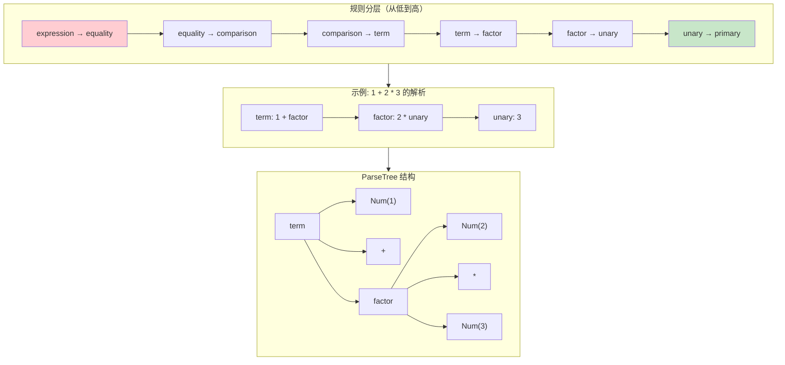

# Ch05: ANTLR4 Parser 与语法规则

## 学习目标
- 理解 Parser 规则与 Lexer 规则的本质区别
- 掌握运算符优先级和结合性的声明方式
- 理解 ANTLR4 如何处理左递归（自动消除）
- 能够阅读和分析 ANTLR4 生成的 ParseTree 结构

## 核心概念

**Parser 规则 vs Lexer 规则**：Lexer 规则（大写开头）描述字符序列的模式，产生 Token；Parser 规则（小写开头）描述 Token 序列的结构，产生语法树节点。Lexer 工作在字符级别，Parser 工作在 Token 级别。两者都用 BNF 风格的规则描述，但处理的对象不同。

**运算符优先级**是语法规则设计的核心挑战。在 ANTLR4 中，优先级通过**规则分层**实现：将表达式拆分为多个层次，每层对应一个优先级，高优先级的运算符在更深的层次定义。例如乘除法比加减法优先级高，因此乘除法规则嵌套在加减法规则内部。

```
expression → equality
equality   → comparison ( ("==" | "!=") comparison )*
comparison → term ( (">" | ">=" | "<" | "<=") term )*
term       → factor ( ("+" | "-") factor )*
factor     → unary ( ("*" | "/") unary )*
unary      → ("!" | "-") unary | primary
primary    → NUMBER | STRING | "true" | "false" | "nil" | "(" expression ")"
```

**左递归**：传统 LL 解析器无法处理左递归规则（如 `expr: expr '+' expr`），因为会导致无限递归。ANTLR4 是个例外——它能自动识别并消除直接左递归，将其转换为迭代形式。这让我们可以直接写 `expr: expr '+' expr | NUMBER`，ANTLR4 会自动处理。

**ParseTree（具体语法树）** 保留了源码的所有结构信息，包括括号、分号等语法符号。每个 Parser 规则对应一个 Context 类（如 `ExpressionContext`），每个备选分支可以用 `#标签` 命名，生成独立的 Context 子类，方便 Visitor 处理。

#### 运算符优先级与规则分层



> 乘法在更深的层次（factor），所以 `2 * 3` 先被归约，然后再处理 `+`。这就是规则分层实现优先级的原理。

## 从直觉到规则：为什么要一层层拆表达式

很多初学者第一次看到 `equality → comparison → term → factor → unary → primary` 这串规则时，会觉得它只是“编译原理课的固定写法”。其实不是，它背后对应的是一个非常具体的解析策略。

如果我们想正确解析 `1 + 2 * 3`，Parser 至少要回答两个问题：

1. `+` 和 `*` 谁先结合
2. 一串同级运算是从左往右还是从右往左

规则分层正是在语法层面把这两个问题提前编码进去：

| 层级 | 解决的问题 |
|------|------|
| `term` | 加减法这一层如何结合 |
| `factor` | 乘除法这一层如何结合 |
| `unary` | 前缀运算如何先于二元运算 |
| `primary` | 什么可以成为最小表达式单元 |

所以这些规则不是“为了写 grammar 而写 grammar”，而是在把语言的运算语义固化成一套机器可执行的结构。

## 为什么 ANTLR4 里仍然推荐显式分层

ANTLR4 能处理直接左递归，这确实让语法写起来更自由。但在课程和工程实现里，显式分层仍然有三个明显好处：

1. 学生更容易把“优先级”映射到语法层次
2. 生成的 ParseTree 结构更稳定，后续转 AST 更清晰
3. 出错时更容易判断问题出在词法、优先级还是结合性

换句话说，ANTLR4 的能力让你“可以写得更短”，但不代表“写得更短就更适合教学和维护”。

## 一个更完整的解析推导

以 `1 + 2 * 3 == 7` 为例，规则是这样逐层接住表达式的：

1. `expression` 进入 `assignment`
2. `assignment` 没看到 `=`，继续进入 `equality`
3. `equality` 发现有 `==`，所以左边先解析成一个 `comparison`
4. 这个 `comparison` 继续进入 `term`
5. `term` 在 `1 + 2 * 3` 里看到 `+`，但右边不是直接数字，而是一个 `factor`
6. `factor` 再把 `2 * 3` 作为更高优先级的子结构先吃掉
7. 最后 `equality` 再把左边的算术结果和右边的 `7` 连接起来

这就是为什么“优先级更高的运算写在更深的规则层次里”会自然得到正确结构。

## 关键代码

```antlr
// JimLang.g4 - Parser 规则（表达式部分）
grammar JimLang;

// 程序入口
program: statement* EOF;

// 语句规则（下一章详解）
statement
    : exprStmt
    | printStmt
    ;

exprStmt : expression SEMICOLON;
printStmt: PRINT expression SEMICOLON;

// 表达式规则（按优先级分层）
expression: assignment;

assignment
    : IDENTIFIER EQUAL assignment  # AssignExpr
    | equality                     # PassThrough
    ;

equality
    : equality (BANG_EQUAL | EQUAL_EQUAL) comparison  # EqualityExpr
    | comparison                                       # PassThrough2
    ;

comparison
    : comparison (GREATER | GREATER_EQUAL | LESS | LESS_EQUAL) term  # ComparisonExpr
    | term                                                            # PassThrough3
    ;

term
    : term (MINUS | PLUS) factor  # AddExpr
    | factor                      # PassThrough4
    ;

factor
    : factor (SLASH | STAR) unary  # MulExpr
    | unary                        # PassThrough5
    ;

unary
    : (BANG | MINUS) unary  # UnaryExpr
    | call                  # PassThrough6
    ;

call
    : call LPAREN arguments? RPAREN  # CallExpr
    | primary                        # PassThrough7
    ;

primary
    : NUMBER                          # NumberLiteral
    | STRING                          # StringLiteral
    | TRUE                            # TrueLiteral
    | FALSE                           # FalseLiteral
    | NIL                             # NilLiteral
    | IDENTIFIER                      # VariableExpr
    | LPAREN expression RPAREN        # GroupingExpr
    ;

arguments: expression (COMMA expression)*;
```

```java
// 使用 ANTLR4 解析并打印 ParseTree
public class ParseTreeDemo {
    public static void main(String[] args) {
        String source = "1 + 2 * 3;";
        
        CharStream input = CharStreams.fromString(source);
        JimLangLexer lexer = new JimLangLexer(input);
        CommonTokenStream tokens = new CommonTokenStream(lexer);
        JimLangParser parser = new JimLangParser(tokens);
        
        // 从 program 规则开始解析
        JimLangParser.ProgramContext tree = parser.program();
        
        // 打印树形结构
        System.out.println(tree.toStringTree(parser));
        // 输出：(program (statement (exprStmt
        //          (expression (equality (comparison (term
        //            (term (factor (unary (call (primary 1)))))
        //            +
        //            (factor
        //              (factor (unary (call (primary 2))))
        //              *
        //              (unary (call (primary 3)))))))) ;)) <EOF>)
    }
}
```

```java
// 使用 Visitor 遍历 ParseTree（求值示例）
public class EvalVisitor extends JimLangBaseVisitor<Double> {
    
    @Override
    public Double visitNumberLiteral(JimLangParser.NumberLiteralContext ctx) {
        return Double.parseDouble(ctx.NUMBER().getText());
    }
    
    @Override
    public Double visitAddExpr(JimLangParser.AddExprContext ctx) {
        double left  = visit(ctx.term());
        double right = visit(ctx.factor());
        return ctx.PLUS() != null ? left + right : left - right;
    }
    
    @Override
    public Double visitMulExpr(JimLangParser.MulExprContext ctx) {
        double left  = visit(ctx.factor(0));
        double right = visit(ctx.unary());
        return ctx.STAR() != null ? left * right : left / right;
    }
    
    @Override
    public Double visitGroupingExpr(JimLangParser.GroupingExprContext ctx) {
        return visit(ctx.expression());
    }
}
```

## 课堂练习

### ⭐ 基础：优先级验证

1. 用 EvalVisitor 计算 `2 + 3 * 4` 和 `(2 + 3) * 4`，验证优先级
2. 手动画出两个表达式的 ParseTree，对比括号对树结构的影响
3. 计算 `1 + 2 > 3`，验证比较和算术的优先级关系

### ⭐⭐ 进阶：添加运算符

1. 为 JimLang 添加幂运算符 `**`（右结合，优先级高于乘除）
2. 在 `.g4` 文件中添加 `power` 规则
3. 输入 `1 + * 2;` 观察 ANTLR4 的错误恢复

### ⭐⭐⭐ 挑战：语法扩展

1. 添加三元条件运算符 `cond ? a : b`
2. 添加位运算符 `& | ^`
3. 分析 ANTLR4 如何处理左结合 vs 右结合

## 小结

| 要点 | 说明 |
|------|------|
| 分层规则 | 每层处理一级优先级 |
| 左递归 | ANTLR4 自动消除 |
| #标签 | 为每个备选分支生成独立 Context |
| ParseTree | 保留完整源码结构 |
| Visitor | 遍历 ParseTree 的标准模式 |

## 常见问题 Q&A

**Q1: 为什么分层就能解决优先级？**

A: 每层规则只能"看到"比自己优先级更高或相等的子表达式。`expression` 调 `comparison`，`comparison` 调 `term`，层级越深优先级越高。括号（grouping）回到最顶层，重新从最高优先级开始。

**Q2: ANTLR4 如何处理左递归？**

A: ANTLR4 自动检测直接左递归（如 `expr: expr '+' expr | NUM`），内部转为循环。这是 ANTLR4 最大的便利之一，旧版工具需要手写消除。

**Q3: 为什么用 #标签？**

A: 不加标签时，一个规则的所有备选分支共享同一个 Context 类，用 `if/else` 判断。加标签后，每个分支有独立 Context 类，Visitor 更清晰。

## 下一章预告

下一章介绍 **CST 到 AST 的转换**：用 sealed interface 和 record 设计 AST 节点。
