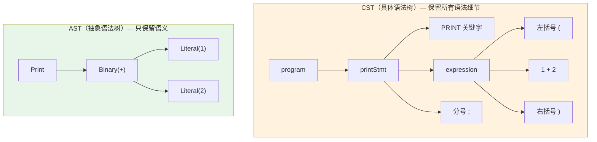

# Ch06: AST 设计与 CST→AST 转换

## 学习目标
- 理解 CST（具体语法树）与 AST（抽象语法树）的本质区别
- 用 Java 21 sealed interface + record 设计类型安全的 AST 节点
- 掌握 Visitor 模式，实现 ParseTree 到 AST 的转换
- 理解为什么要从 ANTLR4 的 CST 中解耦出自定义 AST

## 核心概念

**CST vs AST**：CST（具体语法树）是 ANTLR4 直接生成的树，它忠实反映了语法规则的每一个细节，包括括号、分号、关键字等语法噪音。AST（抽象语法树）是我们手工设计的树，只保留语义上有意义的信息。例如 `(1 + 2)` 在 CST 中有括号节点，在 AST 中括号被丢弃，只保留 `Binary(Literal(1), +, Literal(2))`。

**为什么要自定义 AST**：ANTLR4 生成的 Context 类与语法规则紧耦合，一旦修改 `.g4` 文件，所有依赖 Context 类的代码都需要修改。自定义 AST 作为稳定的中间表示，将前端（ANTLR4）与后端（解释器、编译器）解耦。此外，自定义 AST 可以精确表达语义，添加类型信息、作用域信息等元数据。

**Java 21 sealed interface + record** 是设计 AST 的理想工具。`sealed interface` 限定了 AST 节点的所有可能类型，配合 `record` 的不可变性，让 AST 成为类型安全的代数数据类型（ADT）。`switch` 表达式的模式匹配可以穷举所有节点类型，编译器会检查是否遗漏分支，避免运行时错误。

**Visitor 模式**：`ASTBuilder` 实现 `JimLangVisitor<Expr>`，重写每个 `visit` 方法，将对应的 Context 节点转换为 AST 节点。核心思路是：每个 `visitXxx` 方法接收一个 Context，返回对应的 AST 节点，递归调用 `visit` 处理子节点。

#### CST vs AST 对比（以 `print (1 + 2);` 为例）



> CST 中括号 `()`、分号 `;`、关键字 `PRINT` 都有对应节点，而 AST 把这些语法噪音全部丢弃，只保留 `Print → Binary(+) → Literal(1), Literal(2)` 的语义结构。

## AST 不是“另一棵树”，而是后端的稳定契约

这一章最容易被低估的地方，是很多同学会把 AST 理解成“为了好看，重新造一棵树”。更准确的说法是：AST 是语言前端和后端之间的稳定契约。

前端关心的是：

1. 源码长什么样
2. 语法是否合法
3. 各种语法变体怎么归一化

后端关心的是：

1. 这是字面量、变量、调用还是赋值
2. 这个节点求值时要做什么
3. 这个节点将来应该编译成什么字节码

如果后端直接依赖 ANTLR 生成的 Context 类，就等于把“语法书写细节”和“语义执行逻辑”绑死在一起。一旦 grammar 改动，解释器、编译器、Resolver 都可能被连锁影响。

## 从 CST 到 AST，真正丢掉了什么

很多人会记住“AST 会丢弃括号和分号”，但更关键的是理解：AST 丢掉的是**不影响语义求值的语法外壳**。

以 `print (1 + 2);` 为例：

| 在 CST 中保留 | 在 AST 中的处理 |
|------|------|
| `print` 关键字 | 变成 `Stmt.Print` 这个语义节点 |
| 左右括号 | 只保留内部表达式结构 |
| 分号 | 完全丢弃 |
| 规则中间层 Context | 折叠成真正的语义节点 |

所以 AST 不是简单地“缩短树”，而是在把“源码怎么写”翻译成“程序到底想表达什么”。

## 为什么这一层必须在课程里手写

如果只为了跑起来，完全可以把 ParseTree Visitor 直接写成解释器。但课程坚持单独做 ASTBuilder，是因为这一步能把三件事分开：

1. 语法识别
2. 语义建模
3. 执行或编译

这三个阶段一旦分开，后面你要换解释器、加类型系统、做字节码编译、加优化器，都会轻松很多。这正是“写语言”课程里最值得学生建立的工程意识。

## 关键代码

```java
// Expr.java - 表达式 AST 节点（Java 21 sealed interface）
public sealed interface Expr permits
    Expr.Literal,
    Expr.Binary,
    Expr.Unary,
    Expr.Variable,
    Expr.Assign,
    Expr.Call,
    Expr.Grouping {

    // 字面量：数字、字符串、true、false、nil
    record Literal(Object value) implements Expr {}

    // 二元运算：left op right
    record Binary(Expr left, Token operator, Expr right) implements Expr {}

    // 一元运算：op right
    record Unary(Token operator, Expr right) implements Expr {}

    // 变量引用
    record Variable(Token name) implements Expr {}

    // 赋值表达式
    record Assign(Token name, Expr value) implements Expr {}

    // 函数调用
    record Call(Expr callee, Token paren, List<Expr> arguments) implements Expr {}

    // 括号分组（可选保留，用于调试）
    record Grouping(Expr expression) implements Expr {}
}
```

```java
// ASTBuilder.java - 将 ANTLR4 ParseTree 转换为自定义 AST
public class ASTBuilder extends JimLangBaseVisitor<Object> {

    // 入口：将 program 转换为语句列表
    @Override
    public List<Stmt> visitProgram(JimLangParser.ProgramContext ctx) {
        return ctx.statement().stream()
            .map(s -> (Stmt) visit(s))
            .toList();
    }

    // 数字字面量
    @Override
    public Expr visitNumberLiteral(JimLangParser.NumberLiteralContext ctx) {
        return new Expr.Literal(Double.parseDouble(ctx.NUMBER().getText()));
    }

    // 字符串字面量（去掉两端引号）
    @Override
    public Expr visitStringLiteral(JimLangParser.StringLiteralContext ctx) {
        String raw = ctx.STRING().getText();
        return new Expr.Literal(raw.substring(1, raw.length() - 1));
    }

    // true / false / nil
    @Override
    public Expr visitTrueLiteral(JimLangParser.TrueLiteralContext ctx) {
        return new Expr.Literal(true);
    }

    @Override
    public Expr visitFalseLiteral(JimLangParser.FalseLiteralContext ctx) {
        return new Expr.Literal(false);
    }

    @Override
    public Expr visitNilLiteral(JimLangParser.NilLiteralContext ctx) {
        return new Expr.Literal(null);
    }

    // 变量引用
    @Override
    public Expr visitVariableExpr(JimLangParser.VariableExprContext ctx) {
        return new Expr.Variable(toToken(ctx.IDENTIFIER()));
    }

    // 二元加减法
    @Override
    public Expr visitAddExpr(JimLangParser.AddExprContext ctx) {
        Expr left  = (Expr) visit(ctx.term());
        Expr right = (Expr) visit(ctx.factor());
        Token op   = toToken(ctx.PLUS() != null ? ctx.PLUS() : ctx.MINUS());
        return new Expr.Binary(left, op, right);
    }

    // 二元乘除法
    @Override
    public Expr visitMulExpr(JimLangParser.MulExprContext ctx) {
        Expr left  = (Expr) visit(ctx.factor(0));
        Expr right = (Expr) visit(ctx.unary());
        Token op   = toToken(ctx.STAR() != null ? ctx.STAR() : ctx.SLASH());
        return new Expr.Binary(left, op, right);
    }

    // 一元运算
    @Override
    public Expr visitUnaryExpr(JimLangParser.UnaryExprContext ctx) {
        Token op    = toToken(ctx.BANG() != null ? ctx.BANG() : ctx.MINUS());
        Expr  right = (Expr) visit(ctx.unary());
        return new Expr.Unary(op, right);
    }

    // 括号分组（直接返回内部表达式，丢弃括号）
    @Override
    public Expr visitGroupingExpr(JimLangParser.GroupingExprContext ctx) {
        return (Expr) visit(ctx.expression());
    }

    // 赋值表达式
    @Override
    public Expr visitAssignExpr(JimLangParser.AssignExprContext ctx) {
        Token name = toToken(ctx.IDENTIFIER());
        Expr  value = (Expr) visit(ctx.assignment());
        return new Expr.Assign(name, value);
    }

    // 函数调用
    @Override
    public Expr visitCallExpr(JimLangParser.CallExprContext ctx) {
        Expr callee = (Expr) visit(ctx.call());
        Token paren = toToken(ctx.LPAREN());
        List<Expr> args = ctx.arguments() == null
            ? List.of()
            : ctx.arguments().expression().stream()
                .map(e -> (Expr) visit(e))
                .toList();
        return new Expr.Call(callee, paren, args);
    }

    // 工具方法：将 ANTLR4 TerminalNode 转换为 Token
    private Token toToken(TerminalNode node) {
        org.antlr.v4.runtime.Token t = node.getSymbol();
        return new Token(
            TokenType.fromAntlrType(t.getType()),
            t.getText(),
            null,
            t.getLine()
        );
    }
}
```

```java
// 使用 switch 模式匹配遍历 AST（Java 21）
public String prettyPrint(Expr expr) {
    return switch (expr) {
        case Expr.Literal(var v)              -> String.valueOf(v);
        case Expr.Binary(var l, var op, var r) -> "(" + op.lexeme() + " " + prettyPrint(l) + " " + prettyPrint(r) + ")";
        case Expr.Unary(var op, var r)         -> "(" + op.lexeme() + " " + prettyPrint(r) + ")";
        case Expr.Variable(var name)           -> name.lexeme();
        case Expr.Assign(var name, var val)    -> "(= " + name.lexeme() + " " + prettyPrint(val) + ")";
        case Expr.Call(var c, var p, var args) -> prettyPrint(c) + "(" + args.stream().map(this::prettyPrint).collect(joining(", ")) + ")";
        case Expr.Grouping(var e)              -> prettyPrint(e);
    };
    // 编译器会检查是否覆盖了所有 sealed 子类型
}
```

## 课堂练习

### ⭐ 基础：CST vs AST

1. 对 `(1 + 2) * 3` 分别画出 CST 和 AST，标注 CST 中被丢弃的节点
2. 用 `AstPrinter` 打印 `var x = 1 + 2 * 3;` 的 AST
3. 统计 AST 中 Expr 和 Stmt 节点各有多少个

### ⭐⭐ 进阶：扩展 AST

1. 添加三元运算符 `condition ? then : else`，在 Expr sealed interface 添加 Ternary record
2. 实现 `countNodes(Expr expr)` 统计 AST 节点总数
3. 思考：新增 Expr 子类型时，编译器如何提示你更新所有 switch

### ⭐⭐⭐ 挑战：AST 优化

1. 实现常量折叠 AST Pass：`Binary(Literal(1), PLUS, Literal(2))` → `Literal(3)`
2. 实现死代码消除：`if (true) A else B` → `A`
3. 设计 AST 序列化/反序列化方案（持久化到文件）

## 常见问题 Q&A

**Q1: 为什么不直接用 ANTLR4 的 CST？**

A: CST 与语法规则耦合紧密，改语法就要改所有逻辑。自定义 AST 更简洁、更稳定，后续模块不受前端变更影响。

**Q2: sealed interface 比 abstract class 好在哪？**

A: 编译器保证 switch 覆盖所有子类型。新增子类型时，所有未处理的 switch 会编译报错，避免运行时遗漏。

**Q3: AST 不可变有什么好处？**

A: record 不可变，可以安全共享引用。多遍遍历（Resolver、Compiler）不会意外修改 AST。

## 小结

| 要点 | 说明 |
|------|------|
| CST → AST | 前后端解耦的关键步骤 |
| sealed interface | 编译期类型安全 |
| record | 不可变数据类，适合 AST 节点 |
| pattern matching | switch 遍历 AST，简洁且安全 |
| AstPrinter | 调试利器，可视化 AST 结构 |

## 下一章预告

下一章完成语句（Stmt）AST 设计，整合完整 .g4 语法文件，完成前端。
