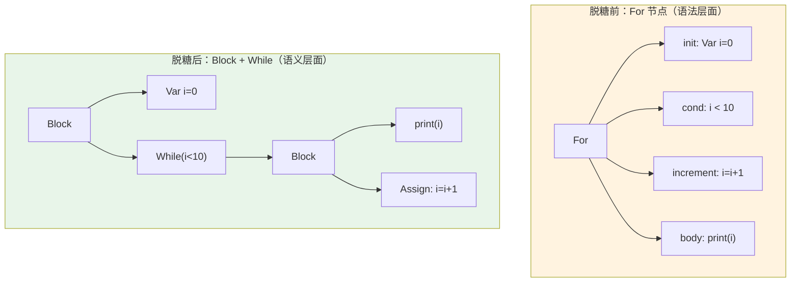

# Ch07: 完整语法规则与语句 AST

## 学习目标
- 掌握 JimLang 全部语句类型的语法规则设计
- 用 sealed interface + record 完成 Stmt AST 节点体系
- 实现完整的 ASTBuilder，处理所有语句和表达式
- 理解语句与表达式的本质区别及其在 AST 中的体现

## 核心概念

**语句 vs 表达式**：表达式（Expr）有返回值，可以嵌套在其他表达式中；语句（Stmt）描述动作，没有返回值（或返回值被丢弃）。`1 + 2` 是表达式，`print 1 + 2;` 是语句。在 JimLang 中，表达式语句（`exprStmt`）是两者的桥梁：将一个表达式包装成语句，丢弃其返回值。

**JimLang 的语句类型**：
- `Print`：打印表达式的值（教学用，避免早期引入标准库）
- `Var`：变量声明，可选初始化表达式
- `Block`：花括号包裹的语句列表，引入新作用域
- `If`：条件分支，支持可选的 else 分支
- `While`：条件循环
- `For`：语法糖，脱糖为 `Block(Var, While(condition, Block(body, increment)))`
- `Return`：函数返回，携带可选返回值
- `Function`：函数声明（参数列表 + 函数体）
- `Class`：类声明（下一模块详解）
- `Expression`：表达式语句，将表达式包装为语句

**For 循环的脱糖**是一个重要设计决策。`for (var i = 0; i < 10; i = i + 1) { ... }` 在 AST 层面被转换为等价的 `while` 循环，这样解释器和编译器只需处理 `While` 节点，无需单独处理 `For`。脱糖在 `ASTBuilder` 中完成，是前端的职责。

#### For 循环脱糖对比



> 脱糖后，解释器和编译器只需要处理 `While` 节点，`For` 的语义被完全等价地表达出来。

## 为什么语句和表达式必须分开建模

这一章到了一个关键拐点：从“表达式世界”进入“完整程序世界”。

表达式更像“算出一个值”，语句更像“推动程序往前走一步”。这两者如果不分开，后面会立刻出现几个问题：

1. `if`、`while`、`return` 这类结构根本不是普通值
2. 解释器会混淆“求值”与“执行”
3. 编译器也很难判断某个节点结束后，栈上是否应该留下结果

所以 `Expr` 和 `Stmt` 分家，不是为了类型好看，而是因为它们在运行时承担的职责根本不同。

## For 脱糖为什么是前端责任

很多同学会问：既然最终都能执行，为什么不让解释器直接加一个 `For` 分支？

可以，但那会把同一类控制流语义重复实现两遍。课程里把 `for` 在 ASTBuilder 阶段脱糖成 `while`，本质上是在做“前端归一化”：

1. 语法层允许用户写更友好的 `for`
2. 语义层只保留一套循环核心结构
3. 后端只需要处理 `While`

这背后其实是一个非常常见的编译器设计原则：**前端多样，后端收敛**。

## 一次完整的 for 脱糖推导

以这段代码为例：

```jimlang
for (var i = 0; i < 3; i = i + 1) print i;
```

在语义层面，它会被逐步改写成：

```jimlang
{
  var i = 0;
  while (i < 3) {
    print i;
    i = i + 1;
  }
}
```

这里每一层变换都对应一个明确目的：

1. 外层 `Block` 负责约束 `i` 的作用域
2. `initializer` 只执行一次，所以放在 `while` 之前
3. `condition` 每轮检查一次，所以成为 `while` 条件
4. `increment` 每轮末尾执行，所以被追加到循环体末尾

只要这四件事顺序正确，`for` 的语义就完整保留下来了。

## 关键代码

```antlr
// JimLang.g4 - 完整语句规则
statement
    : exprStmt
    | printStmt
    | varDecl
    | block
    | ifStmt
    | whileStmt
    | forStmt
    | returnStmt
    | funDecl
    ;

exprStmt  : expression SEMICOLON;
printStmt : PRINT expression SEMICOLON;
varDecl   : VAR IDENTIFIER (EQUAL expression)? SEMICOLON;
block     : LBRACE statement* RBRACE;

ifStmt    : IF LPAREN expression RPAREN statement (ELSE statement)?;
whileStmt : WHILE LPAREN expression RPAREN statement;

forStmt
    : FOR LPAREN
        (varDecl | exprStmt | SEMICOLON)   // 初始化
        expression? SEMICOLON              // 条件
        expression?                        // 递增
      RPAREN statement
    ;

returnStmt: RETURN expression? SEMICOLON;

funDecl   : FUN IDENTIFIER LPAREN parameters? RPAREN block;
parameters: IDENTIFIER (COMMA IDENTIFIER)*;
```

```java
// Stmt.java - 语句 AST 节点
public sealed interface Stmt permits
    Stmt.Expression,
    Stmt.Print,
    Stmt.Var,
    Stmt.Block,
    Stmt.If,
    Stmt.While,
    Stmt.Return,
    Stmt.Function {

    // 表达式语句：丢弃表达式返回值
    record Expression(Expr expr) implements Stmt {}

    // print 语句
    record Print(Expr expr) implements Stmt {}

    // 变量声明：var name = initializer;
    record Var(Token name, Expr initializer) implements Stmt {}

    // 块语句：{ statements... }
    record Block(List<Stmt> statements) implements Stmt {}

    // if 语句：condition ? thenBranch : elseBranch
    record If(Expr condition, Stmt thenBranch, Stmt elseBranch) implements Stmt {}

    // while 循环（for 循环脱糖后也变成 While）
    record While(Expr condition, Stmt body) implements Stmt {}

    // return 语句
    record Return(Token keyword, Expr value) implements Stmt {}

    // 函数声明
    record Function(Token name, List<Token> params, List<Stmt> body) implements Stmt {}
}
```

```java
// ASTBuilder.java - 语句部分（完整实现）
public class ASTBuilder extends JimLangBaseVisitor<Object> {

    @Override
    public Stmt visitPrintStmt(JimLangParser.PrintStmtContext ctx) {
        Expr value = (Expr) visit(ctx.expression());
        return new Stmt.Print(value);
    }

    @Override
    public Stmt visitVarDecl(JimLangParser.VarDeclContext ctx) {
        Token name = toToken(ctx.IDENTIFIER());
        Expr init  = ctx.expression() != null ? (Expr) visit(ctx.expression()) : null;
        return new Stmt.Var(name, init);
    }

    @Override
    public Stmt visitBlock(JimLangParser.BlockContext ctx) {
        List<Stmt> stmts = ctx.statement().stream()
            .map(s -> (Stmt) visit(s))
            .toList();
        return new Stmt.Block(stmts);
    }

    @Override
    public Stmt visitIfStmt(JimLangParser.IfStmtContext ctx) {
        Expr condition  = (Expr) visit(ctx.expression());
        Stmt thenBranch = (Stmt) visit(ctx.statement(0));
        Stmt elseBranch = ctx.statement().size() > 1
            ? (Stmt) visit(ctx.statement(1))
            : null;
        return new Stmt.If(condition, thenBranch, elseBranch);
    }

    @Override
    public Stmt visitWhileStmt(JimLangParser.WhileStmtContext ctx) {
        Expr condition = (Expr) visit(ctx.expression());
        Stmt body      = (Stmt) visit(ctx.statement());
        return new Stmt.While(condition, body);
    }

    // for 循环脱糖为 while 循环
    @Override
    public Stmt visitForStmt(JimLangParser.ForStmtContext ctx) {
        // 1. 初始化部分
        Stmt initializer = null;
        if (ctx.varDecl() != null)       initializer = (Stmt) visit(ctx.varDecl());
        else if (ctx.exprStmt() != null) initializer = (Stmt) visit(ctx.exprStmt());

        // 2. 条件部分（缺省为 true）
        Expr condition = ctx.expression().size() > 0
            ? (Expr) visit(ctx.expression(0))
            : new Expr.Literal(true);

        // 3. 递增部分（包装为表达式语句）
        Stmt increment = null;
        int exprCount = ctx.expression().size();
        if (exprCount >= 2) {
            increment = new Stmt.Expression((Expr) visit(ctx.expression(exprCount - 1)));
        }

        // 4. 脱糖：body = Block(body, increment)
        Stmt body = (Stmt) visit(ctx.statement());
        if (increment != null) {
            body = new Stmt.Block(List.of(body, increment));
        }

        // 5. 脱糖：While(condition, body)
        Stmt loop = new Stmt.While(condition, body);

        // 6. 脱糖：Block(initializer, loop)
        if (initializer != null) {
            loop = new Stmt.Block(List.of(initializer, loop));
        }
        return loop;
    }

    @Override
    public Stmt visitReturnStmt(JimLangParser.ReturnStmtContext ctx) {
        Token keyword = toToken(ctx.RETURN());
        Expr  value   = ctx.expression() != null ? (Expr) visit(ctx.expression()) : null;
        return new Stmt.Return(keyword, value);
    }

    @Override
    public Stmt visitFunDecl(JimLangParser.FunDeclContext ctx) {
        Token name = toToken(ctx.IDENTIFIER());
        List<Token> params = ctx.parameters() == null
            ? List.of()
            : ctx.parameters().IDENTIFIER().stream()
                .map(this::toToken)
                .toList();
        // 函数体是 block，但我们只取其中的语句列表
        JimLangParser.BlockContext blockCtx = ctx.block();
        List<Stmt> body = blockCtx.statement().stream()
            .map(s -> (Stmt) visit(s))
            .toList();
        return new Stmt.Function(name, params, body);
    }
}
```

## 课堂练习

### ⭐ 基础：语句 AST

1. 将 `for (var i = 0; i < 3; i = i + 1) { print i; }` 手动脱糖并画出 AST
2. 编写包含所有语句类型的程序，打印 AST 验证
3. 画出 `var x = 1; if (x > 0) print x;` 的 AST 结构

### ⭐⭐ 进阶：脱糖与扩展

1. 实现 break/continue：需要修改哪些文件？（.g4、Stmt、ASTBuilder、解释器）
2. 设计 do-while 语句，它是否需要新的 AST 节点？
3. 思考 for-each（`for (var x in list) {...}`）如何脱糖

### ⭐⭐⭐ 挑战：AST 变换

1. 实现一个 AST→AST 变换：把所有 for 转为 while
2. 实现一个死代码检测 Pass
3. 设计一个 AST diff 工具（比较两个 AST 的差异）

## 常见问题 Q&A

**Q1: 为什么要脱糖？**

A: 减少后端需要处理的语句种类。for 只是 while 的语法糖，解释器只需实现 while。这是编译器设计中"降低复杂度"的核心思想。

**Q2: break 用异常实现可以吗？**

A: 可以，和 return 的 ReturnException 类似，定义一个 BreakException。但 break 只需要跳出当前循环，不需要跨越函数边界，比 return 简单。

**Q3: 为什么 Stmt 和 Expr 分开？**

A: 表达式有值（类型是 Value），语句无值（类型是 void）。分开设计让语义更清晰，也方便编译器区分哪些节点需要产生值。

## 小结

| 要点 | 说明 |
|------|------|
| 完整前端 | ANTLR4 + ASTBuilder → 类型安全 AST |
| Expr + Stmt | 表达式（有值）+ 语句（无值）|
| for 脱糖 | 在 AST 层简化，后端无需处理 |
| sealed interface | 保证所有节点类型都被处理 |
| 模式匹配 | switch 遍历 AST，编译期安全 |

## 下一章预告

下一章进入 **Module 4**，开始实现表达式求值——用 Visitor 模式遍历 AST 并计算结果。
