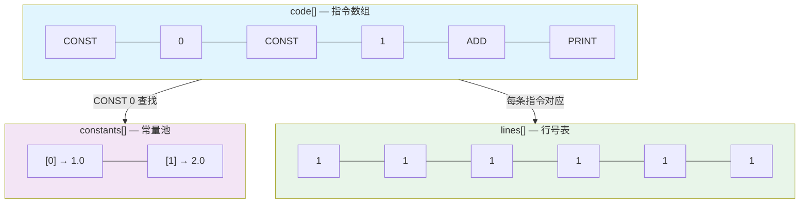

# Ch20: 指令集设计 — OpCode 与 Chunk

## 学习目标
- 理解字节码相对于 AST 解释的性能与可移植性优势
- 设计 OpCode 枚举：覆盖常量、算术、打印、跳转、返回等指令
- 实现 Chunk：指令数组 + 常量池 + 行号表
- 实现反汇编器：将 Chunk 内容以可读形式打印出来

## 核心概念

### 为什么需要字节码

```
执行模型演进：

1. AST 解释器（之前的方式）：
   源码 → AST → 递归遍历每个节点执行
   问题：节点分散在堆内存，缓存命中率低
         每次执行需要大量虚方法调用
         性能瓶颈明显

2. 字节码解释器（本章开始）：
   源码 → AST → 字节码（编译）→ VM 执行
   优势：字节码是紧凑的整数数组，CPU 友好
         顺序读取，缓存命中率高
         执行速度提升 5-10 倍

3. 类比：
   AST 解释器 = 看着菜谱一步步做（频繁翻页）
   字节码 VM  = 按照做好的工序表顺序执行（一气呵成）
```

### 性能对比

```
AST 解释器执行 1+2*3：

  BinaryExpr(+)
    ├── LiteralExpr(1)
    └── BinaryExpr(*)
          ├── LiteralExpr(2)
          └── LiteralExpr(3)

  执行：5 次虚方法调用（每个节点一次）
  内存：5 个对象分散在堆上
  缓存：可能 5 次 cache miss

字节码 VM 执行 1+2*3：

  CONST 0  (1)    → 压栈 [1]
  CONST 1  (2)    → 压栈 [1, 2]
  CONST 2  (3)    → 压栈 [1, 2, 3]
  MUL            → 弹出 2,3，压入 6 → [1, 6]
  ADD            → 弹出 1,6，压入 7 → [7]
  PRINT          → 打印 7

  执行：6 条指令，顺序读取
  内存：连续的整数数组
  缓存：1 次 cache line 加载
```

### Chunk 的三张表

```
Chunk：字节码的容器

┌─────────────────────────────────────┐
│ code[]: 指令数组                     │
│   [CONST, 0, CONST, 1, MUL, PRINT]  │
│   每条指令 = 1字节OpCode + 操作数     │
├─────────────────────────────────────┤
│ constants[]: 常量池                  │
│   [0] = 1                           │
│   [1] = 2                           │
│   存储字面量和编译期已知的值            │
├─────────────────────────────────────┤
│ lines[]: 行号表                      │
│   [1, 1, 1, 1, 1, 1]               │
│   每条指令对应的源码行号               │
│   用于运行时错误报告                  │

#### Chunk 内存布局可视化



> 三个数组通过索引关联：`code[]` 中的 `CONST 0` 表示从 `constants[0]` 取值，`lines[]` 与 `code[]` 一一对应用于错误定位。
└─────────────────────────────────────┘
```

### 为什么 Chunk 要拆成三张表，而不是一个“大对象数组”

第一次做字节码 VM 时，很多人会自然想到把一条指令设计成一个对象：

```java
new Instruction(OpCode.CONST, operand, line)
```

这么做在概念上很直观，但会立刻失去字节码 VM 最重要的优势：紧凑和顺序访问。

Chunk 分成 `code[]`、`constants[]`、`lines[]` 三张表，核心收益有三点：

1. `code[]` 足够紧凑，VM 主循环只需要顺序读整数
2. 常量和指令分离，避免把大对象塞进执行热路径
3. 调试信息独立保存，不污染运行时执行结构

所以 Chunk 的本质不是“方便存数据”，而是在为后面的 VM 执行模型铺路。

### 从 AST 到 Chunk，中间到底发生了什么变化

这一章一个很重要的认知切换，是要从“树形结构思维”切到“线性指令流思维”。

| 表示形式 | 更像什么 | 优点 | 代价 |
|------|------|------|------|
| AST | 结构化语义图 | 易理解、易分析 | 执行时跳转多、对象分散 |
| Chunk | 线性工序表 | 执行紧凑、缓存友好 | 语义信息更隐式 |

编译器做的事，就是把 AST 中显式的父子关系，翻译成“依靠指令顺序和栈约定表达的关系”。学生如果能在这一章完成这个认知切换，后面的 VM 才不会觉得像在看另一门课。

## 关键代码

### OpCode 枚举

```java
public enum OpCode {
    // ── 常量与字面量 ──
    CONST,          // CONST <idx>：将常量池[idx]压栈
    NIL,            // 压入 nil
    TRUE,           // 压入 true
    FALSE,          // 压入 false

    // ── 算术运算 ──
    ADD, SUB, MUL, DIV, MOD,  // 二元：弹出两个，压入结果
    NEGATE,         // 一元取负

    // ── 比较运算 ──
    EQ, NEQ, LT, LTE, GT, GTE,  // 结果为 bool

    // ── 逻辑 ──
    NOT,            // 逻辑非

    // ── 变量 ──
    GET_LOCAL,      // GET_LOCAL <slot>：读取局部变量
    SET_LOCAL,      // SET_LOCAL <slot>：设置局部变量
    GET_GLOBAL,     // GET_GLOBAL <nameIdx>：读取全局变量
    SET_GLOBAL,     // SET_GLOBAL <nameIdx>：设置全局变量
    DEFINE_GLOBAL,  // DEFINE_GLOBAL <nameIdx>：定义全局变量

    // ── 控制流 ──
    JUMP,           // JUMP <offset>：无条件跳转
    JUMP_IF_FALSE,  // JUMP_IF_FALSE <offset>：条件跳转
    LOOP,           // LOOP <offset>：向后跳转（for/while）

    // ── 函数 ──
    CALL,           // CALL <argCount>：调用函数
    CLOSURE,        // CLOSURE <funcIdx>：创建闭包
    GET_UPVALUE,    // GET_UPVALUE <slot>
    SET_UPVALUE,    // SET_UPVALUE <slot>
    CLOSE_UPVALUE,  // 关闭上值
    RETURN,         // 返回栈顶值

    // ── 输出与清理 ──
    PRINT,          // 弹出栈顶并打印
    POP,            // 弹出栈顶（丢弃）
}
```

### Chunk 实现

```java
public class Chunk {
    public final List<Integer> code      = new ArrayList<>();
    public final List<Value>   constants = new ArrayList<>();
    public final List<Integer> lines     = new ArrayList<>();

    // 写入 OpCode
    public void write(OpCode op, int line) {
        code.add(op.ordinal());
        lines.add(line);
    }

    // 写入操作数（如常量索引、跳转偏移）
    public void write(int operand, int line) {
        code.add(operand);
        lines.add(line);
    }

    // 添加常量，返回索引
    public int addConstant(Value value) {
        // 去重：已存在相同常量则复用
        for (int i = 0; i < constants.size(); i++) {
            if (constants.get(i).equals(value)) return i;
        }
        constants.add(value);
        return constants.size() - 1;
    }

    // 回填跳转地址（编译器需要先预留位置，编译完跳转目标后再填入）
    public void patch(int offset, int value) {
        code.set(offset, value);
    }

    public int count() {
        return code.size();
    }

    public int getLine(int offset) {
        return lines.get(offset);
    }
}
```

### 反汇编器

```java
public class Disassembler {
    public static void disassemble(Chunk chunk, String name) {
        System.out.printf("== %s ==%n", name);
        int offset = 0;
        while (offset < chunk.code.size()) {
            offset = disassembleInstruction(chunk, offset);
        }
    }

    private static int disassembleInstruction(Chunk chunk, int offset) {
        // 打印偏移量和源码行号
        int line = chunk.lines.get(offset);
        String lineStr = (offset > 0 && line == chunk.lines.get(offset - 1))
            ? "  | " : String.format("%4d ", line);
        System.out.printf("%04d %s ", offset, lineStr);

        int opCode = chunk.code.get(offset);
        OpCode op = OpCode.values()[opCode];

        return switch (op) {
            case CONST -> {
                int idx = chunk.code.get(offset + 1);
                System.out.printf("CONST       %d '%s'%n",
                    idx, chunk.constants.get(idx));
                yield offset + 2;  // CONST + 1字节操作数
            }
            case JUMP, JUMP_IF_FALSE, LOOP -> {
                int jump = chunk.code.get(offset + 1);
                String target = (op == OpCode.LOOP)
                    ? String.format("→ %d", offset - jump)
                    : String.format("→ %d", offset + 2 + jump);
                System.out.printf("%-12s%s%n", op, target);
                yield offset + 2;
            }
            case GET_LOCAL, SET_LOCAL, CALL -> {
                int arg = chunk.code.get(offset + 1);
                System.out.printf("%-12s%d%n", op, arg);
                yield offset + 2;
            }
            default -> {
                System.out.println(op);
                yield offset + 1;  // 无操作数的指令
            }
        };
    }
}
```

### 反汇编输出示例

```
== main ==

0000    1 CONST       0 '1'
0002    1 CONST       1 '2'
0004    1 CONST       2 '3'
0006    1 MUL
0007    1 ADD
0008    1 PRINT
0009    1 RETURN
```

## 课堂练习

### ⭐ 基础：构造 Chunk

1. 手动构造一个 Chunk，计算 `3 * 4 + 5`，写入指令并运行反汇编器
2. 验证常量池中存储了 `[3, 4, 5]`
3. 思考：为什么常量池用索引而非直接存储值？

### ⭐⭐ 进阶：实现 patch

1. 为 Chunk 添加 `patch(int offset, int value)` 方法
2. 模拟编译 if-else 的跳转回填过程：
   - 编译条件 → JUMP_IF_FALSE ???? → 编译 then 块 → JUMP ???? → 编译 else 块
   - 回填两个跳转的目标地址

### ⭐⭐⭐ 挑战：设计新指令

1. 设计 `CONST_0` 到 `CONST_3` 四条短指令（无操作数，直接压入常量 0-3）
2. 分析这样做对字节码大小和执行速度的影响
3. 这就是"指令集优化"中的"常见操作用短编码"

## 常见问题 Q&A

**Q1: 为什么行号表和指令分开存储？**

A: 行号只在运行时错误时需要。分开存储意味着正常运行时不需要处理行号数据，减少内存访问。生产级 VM 还会把行号表放在单独的 section 中，需要时才加载。

**Q2: 常量池有没有大小限制？**

A: 因为操作数是 1 字节，所以最多 256 个常量。如果需要更多，可以用 2 字节操作数（CONST_2B 指令），支持 65536 个常量。Lua 使用这种变长编码。

**Q3: 为什么不直接用字符串表示指令？**

A: 字符串解析太慢。字节码的核心优势就是紧凑的整数表示，一条指令只需 1-3 字节。如果用字符串 `"PUSH 1"` 需要 6+ 字节，还有字符串解析开销。

## 小结

| 要点 | 说明 |
|------|------|
| 字节码优势 | 紧凑、缓存友好、执行速度快 5-10 倍 |
| OpCode | 枚举定义所有指令，1 字节编码 |
| Chunk | code[] + constants[] + lines[] |
| 反汇编器 | 调试工具，将字节码还原为可读文本 |
| 常量池 | 存储字面量，用索引引用 |

## 下一章预告

有了指令集和容器，下一章实现**编译器的第一部分**：将表达式 AST 编译为字节码序列。
