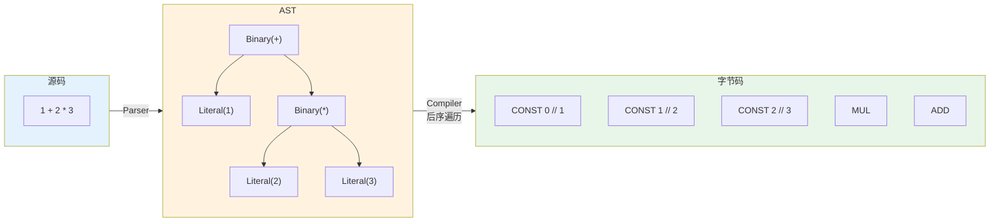

# Ch21: 编译器 — 表达式编译

## 学习目标
- 实现 Compiler 类：遍历 AST，emit 指令到 Chunk
- 掌握字面量编译：`emit(CONST, addConstant(value))`
- 掌握二元运算编译：左操作数 → 右操作数 → 运算符指令
- 理解后序遍历：子表达式先编译，父节点后编译

## 核心概念

### 编译器的角色

```
编译器 = AST 到字节码的翻译器

源码 → Lexer → Token → Parser → AST → Compiler → Chunk(字节码)

Compiler 的输入：AST（树结构）
Compiler 的输出：Chunk（字节码序列 + 常量池 + 行号表）

编译器不执行任何计算，只生成指令。
真正执行计算的是 VM（下一章）。
```

#### 编译过程：源码 → AST → 字节码



> 编译器以后序遍历（post-order）的方式访问 AST 节点：先处理叶子节点（Literal），再处理内部节点（Binary）。这保证了操作数先入栈，运算符后执行。

### 后序遍历原理

**核心原则：后序遍历**。对于 `1 + 2 * 3`，AST 结构是 `Add(1, Mul(2, 3))`：

```
AST:       Binary(+)
           /         \
     Num(1)        Binary(*)
                  /       \
            Num(2)     Num(3)

后序遍历顺序：左子树 → 右子树 → 根节点

编译过程：
  1. 编译左子树 Num(1)  → emit CONST 0   (常量池[0] = 1)
  2. 编译右子树 Mul(2,3)：
     2a. 编译 Num(2)     → emit CONST 1   (常量池[1] = 2)
     2b. 编译 Num(3)     → emit CONST 2   (常量池[2] = 3)
     2c. emit MUL
  3. emit ADD

最终字节码：CONST 0, CONST 1, CONST 2, MUL, ADD

VM 执行栈过程：
  CONST 0 → [1]
  CONST 1 → [1, 2]
  CONST 2 → [1, 2, 3]
  MUL     → [1, 6]      (弹出 2,3 → 压入 6)
  ADD     → [7]         (弹出 1,6 → 压入 7)

为什么后序遍历有效？
  操作数必须先于运算符出现在字节码中
  后序遍历 = 先处理子节点（操作数），后处理父节点（运算符）
  这正好匹配栈式 VM 的执行顺序！
```

### 为什么表达式编译最核心的是“顺序正确”

这一章看起来在做“节点类型到指令类型的映射”，但真正决定编译正确性的，不是能不能发出 `ADD`、`MUL`，而是**这些指令出现的先后顺序是否和 VM 的栈约定一致**。

以 `a - b` 为例，哪怕你指令都对，只要顺序错一点，语义就会变：

1. 正确顺序：先压 `a`，再压 `b`，最后发 `SUB`
2. 错误顺序：先压 `b`，再压 `a`，最后发 `SUB`

栈式 VM 并不知道你“本来想表达什么”，它只会机械地弹出栈顶两个值执行运算。所以编译器的职责，本质上是在替未来的 VM 排工序。

### 一次完整的表达式编译追踪

还是用 `1 + 2 * 3`：

| AST 访问步骤 | 发出的字节码 | 栈语义 |
|------|------|------|
| 访问 `Literal(1)` | `CONST 0` | 把 1 压栈 |
| 访问 `Literal(2)` | `CONST 1` | 把 2 压栈 |
| 访问 `Literal(3)` | `CONST 2` | 把 3 压栈 |
| 回到 `Binary(*)` | `MUL` | 消费 2 和 3，压回 6 |
| 回到 `Binary(+)` | `ADD` | 消费 1 和 6，压回 7 |

这个表非常重要，因为它把三件事打通了：

1. AST 的后序遍历
2. 编译器的 emit 顺序
3. VM 的栈变化

学生一旦能把这三层对齐，后面理解控制流、函数调用、闭包编译就会顺很多。

### emit 方法

```
emit 是编译器的核心工具：

emit(OpCode op)
  → 向 Chunk.code 写入 1 字节指令

emit(OpCode op, int operand)
  → 写入 1 字节指令 + 1 字节操作数

emitConstant(Value v)
  → 将值加入常量池
  → 写入 CONST + 常量池索引

每个 emit 调用对应一条 VM 指令
编译器的工作就是为每个 AST 节点选择正确的 emit 序列
```

## 关键代码

### Compiler 类

```java
public class Compiler {
    private final Chunk chunk = new Chunk();
    private int currentLine = 0;

    public Chunk compile(Expr expr) {
        compileExpr(expr);
        emit(OpCode.RETURN);  // 隐式返回栈顶
        return chunk;
    }

    private void compileExpr(Expr expr) {
        switch (expr) {
            // ── 字面量 ──
            case Expr.Literal e -> {
                Value v = e.value;
                if (v == Value.NIL)        emit(OpCode.NIL);
                else if (v == Value.TRUE)  emit(OpCode.TRUE);
                else if (v == Value.FALSE) emit(OpCode.FALSE);
                else emitConstant(v);
            }

            // ── 二元运算 ──
            case Expr.Binary e -> {
                compileExpr(e.left);   // 左操作数先压栈
                compileExpr(e.right);  // 右操作数后压栈
                emitBinaryOp(e.operator.type);
            }

            // ── 一元运算 ──
            case Expr.Unary e -> {
                compileExpr(e.right);
                if (e.operator.type == TokenType.MINUS) emit(OpCode.NEGATE);
                else if (e.operator.type == TokenType.BANG) emit(OpCode.NOT);
            }

            // ── 括号 ──
            case Expr.Grouping e -> compileExpr(e.expression);
            // 括号不生成指令，只递归编译内部表达式

            // ── 变量 ──
            case Expr.Variable e -> {
                int slot = resolveLocal(e.name);
                if (slot >= 0) {
                    emit(OpCode.GET_LOCAL);
                    chunk.write(slot, currentLine);
                } else {
                    int nameIdx = chunk.addConstant(
                        new Value.Str(e.name.lexeme));
                    emit(OpCode.GET_GLOBAL);
                    chunk.write(nameIdx, currentLine);
                }
            }

            // ── 赋值 ──
            case Expr.Assign e -> {
                compileExpr(e.value);  // 右值先压栈
                int slot = resolveLocal(e.name);
                if (slot >= 0) {
                    emit(OpCode.SET_LOCAL);
                    chunk.write(slot, currentLine);
                } else {
                    int nameIdx = chunk.addConstant(
                        new Value.Str(e.name.lexeme));
                    emit(OpCode.SET_GLOBAL);
                    chunk.write(nameIdx, currentLine);
                }
            }

            default -> throw new CompileError(
                "Unsupported expression: " + expr.getClass().getSimpleName());
        }
    }

    private void emitBinaryOp(TokenType type) {
        switch (type) {
            case PLUS       -> emit(OpCode.ADD);
            case MINUS      -> emit(OpCode.SUB);
            case STAR       -> emit(OpCode.MUL);
            case SLASH      -> emit(OpCode.DIV);
            case PERCENT    -> emit(OpCode.MOD);
            case EQ_EQ      -> emit(OpCode.EQ);
            case BANG_EQ    -> emit(OpCode.NEQ);
            case LESS       -> emit(OpCode.LT);
            case LESS_EQ    -> emit(OpCode.LTE);
            case GREATER    -> emit(OpCode.GT);
            case GREATER_EQ -> emit(OpCode.GTE);
            default -> throw new CompileError("Unknown operator: " + type);
        }
    }

    private void emit(OpCode op) {
        chunk.write(op, currentLine);
    }

    private void emitConstant(Value value) {
        int idx = chunk.addConstant(value);
        if (idx > 255) throw new CompileError("Too many constants");
        emit(OpCode.CONST);
        chunk.write(idx, currentLine);
    }
}
```

### 编译示例

```
表达式：(5 - 3) * 2 + 1

AST:
        Binary(+)
       /         \
  Binary(*)    Num(1)
  /      \
Binary(-) Num(2)
/    \
Num(5) Num(3)

编译过程（后序遍历）：
  visit Binary(-):     → [CONST 0(5), CONST 1(3), SUB]
  visit Num(2):        → [..., CONST 2(2)]
  visit Binary(*):     → [..., MUL]
  visit Num(1):        → [..., CONST 3(1)]
  visit Binary(+):     → [..., ADD]
  append RETURN:       → [..., RETURN]

字节码输出：
  0000 CONST 0 '5'
  0002 CONST 1 '3'
  0004 SUB
  0005 CONST 2 '2'
  0007 MUL
  0008 CONST 3 '1'
  0010 ADD
  0011 RETURN

常量池：
  [0] = 5, [1] = 3, [2] = 2, [3] = 1

VM 执行栈追踪：
  CONST 0 → [5]
  CONST 1 → [5, 3]
  SUB     → [2]           (5 - 3 = 2)
  CONST 2 → [2, 2]
  MUL     → [4]           (2 * 2 = 4)
  CONST 3 → [4, 1]
  ADD     → [5]           (4 + 1 = 5)
  RETURN  → 返回 5
```

## 课堂练习

### ⭐ 基础：编译简单表达式

1. 编译 `1 + 2`，用反汇编器查看字节码
2. 编译 `!true`，验证生成 `TRUE, NOT`
3. 编译 `3 * 4 + 5` 和 `3 * (4 + 5)`，对比字节码差异

### ⭐⭐ 进阶：复杂表达式

1. 编译 `(5 - 3) * 2 + 1`，手动追踪栈状态
2. 实现比较运算符编译：`a > b`、`a != b`
3. 尝试编译 256 个不同字面量，观察"常量池溢出"

### ⭐⭐⭐ 挑战：常量折叠优化

1. 实现 `1 + 2` 直接编译为 `CONST 0(3)` 而非 `CONST, CONST, ADD`
2. 分析优化后字节码减少了多少
3. 思考：哪些表达式可以在编译时计算？

## 常见问题 Q&A

**Q1: 编译器怎么处理运算优先级？**

A: 不需要！Parser 已经按照优先级构建了正确的 AST。编译器只需后序遍历，自然生成正确的指令顺序。

**Q2: 为什么括号不生成指令？**

A: 括号是语法糖，只影响 AST 的结构（Parser 层面）。编译器看到的已经是正确的树结构，不需要额外的指令。

**Q3: 常量池为什么有 256 的限制？**

A: CONST 指令的操作数只有 1 字节。解决方案：添加 CONST_2 指令用 2 字节操作数（Lua 就是这么做的）。

## 小结

| 要点 | 说明 |
|------|------|
| 后序遍历 | 先编译操作数，后编译运算符，匹配栈式执行 |
| emit | 向 Chunk 写入指令的核心方法 |
| 字面量 | NIL/TRUE/FALSE 有专用指令，其他走常量池 |
| 二元运算 | left → right → op，三条指令 |
| 编译器不执行 | 只生成指令，不计算结果 |

## 下一章预告

表达式编译完成，下一章扩展到**语句编译**：`print`、`var`、`if`、`while`。重点是跳转指令的生成与回填（backpatch）技术。
