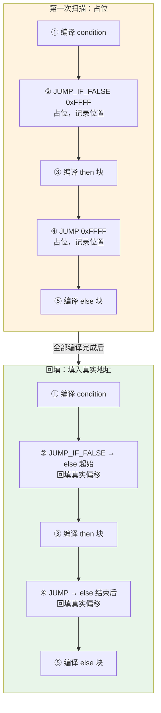

# Ch22: 编译器 — 语句与控制流

## 学习目标
- 实现 `print`、`var`、`if`、`while` 语句的编译
- 掌握跳转指令的生成：`JUMP`、`JUMP_IF_FALSE`、`LOOP`
- 理解回填（backpatch）技术：先占位，后填入真实跳转偏移
- 理解局部变量的栈偏移寻址（不再使用 Environment）

## 核心概念

### 控制流编译的挑战

**控制流编译**的核心挑战：生成跳转指令时，目标地址尚未确定。

```
if (cond) thenBlock else elseBlock

编译流程：
  1. 编译 cond                     → 条件表达式字节码
  2. emit JUMP_IF_FALSE <占位>     → 记录 thenJump = 当前位置
  3. 编译 thenBlock                → then 分支字节码
  4. emit JUMP <占位>              → 记录 elseJump = 当前位置
  5. 回填 thenJump → 指向当前位置   → 跳过 then 块到 else 块
  6. 编译 elseBlock                → else 分支字节码
  7. 回填 elseJump → 指向当前位置   → 跳过 else 块

字节码示意：
  0000  <cond 字节码>
  0004  JUMP_IF_FALSE → 0010   ← thenJump (回填后)
  0005  POP
  0006  <thenBlock 字节码>
  0008  JUMP → 0012            ← elseJump (回填后)
  0010  POP
  0011  <elseBlock 字节码>
  0012  ...                     ← 两条跳转的最终目标
```

### 回填技术详解

```
回填（Backpatching）：

第一次经过（占位）：
  位置 0004: JUMP_IF_FALSE 0xFF 0xFF   ← 先填 0xFFFF 占位
  记录：thenJump = 0005（操作数起始位置）

继续编译 then 块...

第二次经过（回填）：
  当前位置 = 0010
  跳转偏移 = 0010 - 0005 - 2 = 9
  位置 0004: JUMP_IF_FALSE 0x00 0x09   ← 回填真实偏移

为什么是 -2？
  跳转偏移 = 目标位置 - 操作数位置 - 操作数长度(2字节)
  = 从操作数之后开始计算偏移
```

#### if-else 编译与回填过程



> 回填的关键思想：编译是单遍的（one-pass），生成跳转指令时目标地址还不知道。先占位，等目标位置确定后再回填。

### 局部变量的栈寻址

```
AST 解释器（之前的方式）：
  Environment = HashMap<String, Object>
  变量查找：O(1) 哈希表查找，但有哈希计算开销

字节码 VM（现在的方式）：
  局部变量直接存储在栈的固定槽位
  变量查找：O(1) 数组索引，无哈希开销

栈布局：
  栈底 → [slot 0: a] [slot 1: b] [slot 2: c] [临时值] ← 栈顶

  var a = 1;   → SET_LOCAL 0  (值 1 存入 slot 0)
  var b = 2;   → SET_LOCAL 1  (值 2 存入 slot 1)
  print(a + b);
    → GET_LOCAL 0  (读取 slot 0 → 1)
    → GET_LOCAL 1  (读取 slot 1 → 2)
    → ADD           (1 + 2 = 3)
    → PRINT

性能对比：
  哈希表查找: ~20ns (计算hash + 查找)
  数组索引:  ~2ns (直接内存偏移)
  加速: 10 倍
```

### 控制流编译的本质：把“树上的分叉”变成“指令里的跳转”

解释器执行 `if`、`while` 时，可以直接顺着 AST 的结构递归进入不同分支；但字节码 VM 面对的是一条线性的指令流，它根本看不见“这是一棵树”。

所以编译控制流时，真正做的是一件事：

把 AST 里的结构关系，改写成 IP 应该跳到哪里。

这也是为什么这一章突然引入 `JUMP_IF_FALSE`、`JUMP`、`LOOP` 之后，很多同学会觉得抽象层级陡增。不是因为代码更难，而是因为你开始直接操纵执行位置本身。

### 为什么回填是单遍编译里的必然选择

只要编译器是边走 AST 边发字节码，就一定会遇到这个问题：

1. 你知道这里需要跳
2. 但你还不知道未来目标地址是多少

这不是某种技巧性难点，而是线性代码生成的自然结果。回填之所以重要，是因为它让我们不用先扫描整棵树算地址，也能保持编译过程简单直接。

从工程上看，回填相当于：

1. 先在代码里留一个洞
2. 等目标块真正发完
3. 再回来把洞补上

这也是后面函数调用、闭包、异常处理等更多控制流机制的共同基础。

## 关键代码

### 语句编译器

```java
public class Compiler {
    private final Chunk chunk = new Chunk();
    private final List<Local> locals = new ArrayList<>();
    private int scopeDepth = 0;

    private static class Local {
        String name;
        int depth;
        int slot;
    }

    // ── 编译 print 语句 ──
    private void compilePrintStmt(Stmt.Print stmt) {
        compileExpr(stmt.expression);
        emit(OpCode.PRINT);
    }

    // ── 编译 var 语句 ──
    private void compileVarStmt(Stmt.Var stmt) {
        compileExpr(stmt.initializer);  // 值在栈顶
        if (scopeDepth == 0) {
            // 全局变量：用名称索引
            int nameIdx = chunk.addConstant(new Value.Str(stmt.name.lexeme));
            emit(OpCode.DEFINE_GLOBAL);
            chunk.write(nameIdx, 0);
        } else {
            // 局部变量：值在栈顶，记录 slot
            locals.add(new Local(stmt.name.lexeme, scopeDepth, locals.size()));
        }
    }

    // ── 编译 block 语句 ──
    private void compileBlockStmt(Stmt.Block stmt) {
        beginScope();
        for (Stmt s : stmt.statements) compileStmt(s);
        endScope();
    }

    private void beginScope() { scopeDepth++; }
    private void endScope() {
        scopeDepth--;
        // 弹出超出作用域的局部变量
        while (!locals.isEmpty() && locals.get(locals.size()-1).depth > scopeDepth) {
            emit(OpCode.POP);
            locals.remove(locals.size() - 1);
        }
    }
}
```

### if 语句编译

```java
private void compileIfStmt(Stmt.If stmt) {
    // 1. 编译条件
    compileExpr(stmt.condition);

    // 2. 条件为假则跳到 else
    int thenJump = emitJump(OpCode.JUMP_IF_FALSE);
    emit(OpCode.POP);  // 弹出条件值

    // 3. 编译 then 块
    compileStmt(stmt.thenBranch);

    // 4. then 块结束后跳过 else
    int elseJump = emitJump(OpCode.JUMP);

    // 5. 回填 thenJump → 指向 else 块开始
    patchJump(thenJump);
    emit(OpCode.POP);

    // 6. 编译 else 块（如果有）
    if (stmt.elseBranch != null) compileStmt(stmt.elseBranch);

    // 7. 回填 elseJump → 指向 else 块之后
    patchJump(elseJump);
}
```

### while 语句编译

```java
private void compileWhileStmt(Stmt.While stmt) {
    int loopStart = chunk.code.size();

    // 编译条件
    compileExpr(stmt.condition);
    int exitJump = emitJump(OpCode.JUMP_IF_FALSE);
    emit(OpCode.POP);

    // 编译循环体
    compileStmt(stmt.body);

    // 跳回循环条件
    emitLoop(loopStart);

    // 回填退出跳转
    patchJump(exitJump);
    emit(OpCode.POP);
}

// for 循环 = init + while + increment
private void compileForStmt(Stmt.For stmt) {
    beginScope();
    if (stmt.initializer != null) compileStmt(stmt.initializer);

    int loopStart = chunk.code.size();
    if (stmt.condition != null) compileExpr(stmt.condition);
    int exitJump = emitJump(OpCode.JUMP_IF_FALSE);
    emit(OpCode.POP);

    compileStmt(stmt.body);

    if (stmt.increment != null) compileExpr(stmt.increment);
    emit(OpCode.POP);  // 丢弃增量表达式结果
    emitLoop(loopStart);

    patchJump(exitJump);
    emit(OpCode.POP);
    endScope();
}
```

### 跳转工具方法

```java
// 生成跳转指令（2字节操作数占位），返回操作数位置
private int emitJump(OpCode op) {
    emit(op);
    chunk.write(0xFF, 0);  // 占位高字节
    chunk.write(0xFF, 0);  // 占位低字节
    return chunk.code.size() - 2;
}

// 回填跳转偏移
private void patchJump(int offset) {
    int jump = chunk.code.size() - offset - 2;
    if (jump > 0xFFFF) throw new CompileError("Jump too large");
    chunk.code.set(offset, (jump >> 8) & 0xFF);
    chunk.code.set(offset + 1, jump & 0xFF);
}

// 生成向后跳转（LOOP）
private void emitLoop(int loopStart) {
    emit(OpCode.LOOP);
    int offset = chunk.code.size() - loopStart + 2;
    if (offset > 0xFFFF) throw new CompileError("Loop body too large");
    chunk.write((offset >> 8) & 0xFF, 0);
    chunk.write(offset & 0xFF, 0);
}
```

### 编译结果示例

```
源码：
  var a = 1;
  if (a > 0) print(a); else print(0);

字节码：
  0000    1 CONST       0 '1'
  0002    1 DEFINE_GLOBAL 1 'a'
  0004    1 GET_GLOBAL  1 'a'
  0006    1 CONST       2 '0'
  0008    1 GT
  0009    1 JUMP_IF_FALSE → 0018
  0011    1 POP
  0012    1 GET_GLOBAL  1 'a'
  0014    1 PRINT
  0015    1 JUMP → 0022
  0018    1 POP
  0019    1 CONST       2 '0'
  0021    1 PRINT
  0022    1 RETURN
```

## 课堂练习

### ⭐ 基础：编译 if-else

1. 编译 `if (true) print(1); else print(2);` 并反汇编
2. 验证 JUMP_IF_FALSE 的偏移指向 else 块
3. 验证 JUMP 的偏移跳过 else 块

### ⭐⭐ 进阶：编译 while 循环

1. 编译 `var i = 0; while (i < 5) { print(i); i = i + 1; }`
2. 验证 LOOP 指令正确跳回条件判断
3. 计算循环体占多少字节

### ⭐⭐⭐ 挑战：for 循环和嵌套

1. 实现 for 循环编译（init + cond + increment）
2. 编译嵌套循环 `for (i=0; i<3; i++) for (j=0; j<3; j++) print(i*3+j)`
3. 分析嵌套循环的字节码结构

## 常见问题 Q&A

**Q1: 为什么跳转操作数是 2 字节？**

A: 1 字节最多跳转 255 条指令，对于大函数不够。2 字节支持 65535 条指令的跳转范围，对教学语言足够。Lua 使用变长编码（1/2/4 字节），JVM 使用 4 字节。

**Q2: 为什么条件跳转后要 POP？**

A: 条件表达式的结果留在栈顶。不管走哪个分支，都需要先弹出条件值，保持栈平衡。忘记 POP 是 VM 实现中最常见的 bug。

**Q3: for 和 while 有性能差异吗？**

A: 编译后的字节码几乎一样。for 只是 while 的语法糖——init 在循环外，increment 在 LOOP 之前。性能完全相同。

## 小结

| 要点 | 说明 |
|------|------|
| 回填 | 先占位 emit 0xFFFF，编译完目标后 patchJump 填入真实偏移 |
| 局部变量 | 栈槽位寻址 GET_LOCAL/SET_LOCAL，无需哈希表 |
| if 编译 | cond → JUMP_IF_FALSE → then → JUMP → else |
| while 编译 | cond → JUMP_IF_FALSE → body → LOOP → cond |
| for 编译 | init + while + increment 的语法糖 |

## 下一章预告

编译器已能生成完整的字节码，下一章实现**虚拟机（VM）**：栈式计算引擎，逐条执行指令。
