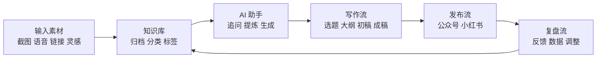

# Ch01：先别急着学工具，先看一套跑通的流程

## 学习目标

- 理解这门课为什么不是一门工具说明书
- 看清一套完整 AI 内容工作流的全貌
- 认清一套"好用"的系统由哪些核心部分组成
- 建立"先看结果，再拆系统"的学习预期

---

## 1. 为什么第一章不先讲工具？

大多数 AI 内容课的开场，往往是：

- 先介绍一堆工具
- 再讲一堆提示词
- 最后让你自己拼起来用

这样的问题是，学生很容易"知道很多"，但还是"不会干活"。

这门课的第一章选择反过来：**先看一套已经跑通的流程，再拆里面到底用了哪些工具和方法。**

原因很简单：

1. 零基础学习者最缺的不是工具名，而是全局图
2. 没有全局图，后面学任何工具都容易变成碎片
3. 先知道终点长什么样，学习时才知道每一步在服务什么

你可以把这门课理解成：先看成品，再拆系统，再装零件。

---

## 2. 一套跑通的 AI 内容工作流，长什么样？

我们先看最核心的链路：

```text
灵感 -> 收集 -> 清洗 -> 选题 -> 大纲 -> 初稿 -> 成稿 -> 发布 -> 复盘
```

这个流程看起来很简单，但它解决的是内容创作里最常见的五个断点：

| 断点 | 典型表现 | 这门课对应解决方式 |
|------|----------|--------------------|
| 接不住 | 灵感出现后很快丢掉 | 统一入口 |
| 收不拢 | 素材散落在多个地方 | 收集与入库 |
| 想不清 | 素材多，但不知道写什么 | 选题与追问 |
| 写不出 | 有题，但很难展开成内容 | 大纲与初稿共创 |
| 发不稳 | 偶尔能写，但不能连续输出 | 发布与复盘机制 |

把这门课的主线压缩成一句话：

```text
这门课的主线不是"学会几个 AI 功能"，而是"学会用 AI 重构你的内容工作流程"。
```

---

## 3. 什么叫"好用"？一套好系统长什么样？

很多工具课程会默认"功能多 = 好用"，但在内容场景里，好用有更实际的标准。

对创作者来说，一个系统是否好用，至少要满足四个要求：

1. **顺手**：日常愿意打开、愿意持续用
2. **连贯**：前一步和后一步能接上，不靠临时拼凑
3. **可复用**：以前的素材、思考、提纲能重新调用
4. **能升级**：随着你越写越多，系统会越来越懂你

所以，好的 AI 内容系统，不是聊天窗口里多了几个收藏提示词，而是一套有明确分工的工作流。

### 3.1 课程里的贯穿案例

整门课会跟着同一个学员案例往前走。先认识一下：

> **阿宁**，刚开始做个人内容。主题方向是"AI 帮普通上班族把工作做顺"，主平台公众号，副平台小红书。现在有零散笔记、截图和灵感，但没有稳定工作流。这门课的目标就是在 5 个阶段里，帮她搭出一套能长期运转的个人内容系统。

阿宁目前的状态是——有灵感，没收住；偶尔找 AI 聊聊；没有成稿；发布随机。学完后的理想状态是——有灵感 → 统一收口 → 整理成素材 → AI 共创选题和提纲 → 写成公众号长文 → 改成小红书版本 → 发布后复盘。

---

## 4. 一套完整系统的五个核心组成

通常至少会包含这五部分，它们串起来就是一条完整流水线：



### 4.1 内容助手

内容助手不是"万能聊天对象"，而是要知道：你想长期讲什么、你面对谁表达、你平时最常做哪些内容任务、你希望它在什么边界内帮你。

阿宁的内容助手至少要知道：她长期讲"AI 如何帮助上班族把工作做顺"，面对刚开始学 AI 的普通职场人，不想写成冰冷教程而是从真实工作动作切入。

### 4.2 知识库

知识库的职责不是"存更多"，而是：把素材收回来、把主题理清楚、让未来能重新找回。阿宁的知识库里至少会出现：工作里真实遇到的问题截图、自己试过的流程记录、跟 AI 对话后留下来的可复用结论、后续可能继续展开的选题苗子。

### 4.3 思考链路

这一层很关键——很多人以为 AI 的价值只在"写"，但真正更高价值的部分通常出现在"想"：找题、追问、对标、提炼角度、推出大纲。

### 4.4 写作链路

写作链路不是单次生成，而是：题目 → 角度 → 提纲 → 初稿 → 改稿 → 成稿。

### 4.5 发布与复盘链路

没有这一层，前面所有东西都很容易变成一次性努力。这一层负责让系统形成闭环。

---

## 5. 从使用者视角看：一套系统应该怎么分层？

为了后面课程更清楚，我们把系统按四层来看：

| 层次 | 作用 | 典型内容 |
|------|------|----------|
| 输入端 | 接住想法和素材 | 文字、截图、语音、链接、对话 |
| 中台 | 整理、清洗、沉淀 | 摘要、分类、标签、知识库 |
| 输出端 | 形成内容成品 | 选题、大纲、初稿、成稿、多平台版本 |
| 复盘端 | 回看和优化 | 数据、反馈、经验、流程调整 |

如果一个系统缺了其中任何一层，都会有明显后果：
- 没有输入端：灵感接不住
- 没有中台：素材收了也用不上
- 没有输出端：只会囤，不会写
- 没有复盘端：系统不会变好

**成熟系统和平庸系统，差别在哪里？**

| 维度 | 平庸系统 | 成熟系统 |
|------|----------|----------|
| 灵感处理 | 随手记，容易丢 | 有统一入口，能被回收 |
| 素材沉淀 | 零散堆积 | 可分类、可搜索、可复用 |
| 选题方式 | 靠当天心情 | 有选题池和研究流 |
| 写作方式 | 空白页硬写 | 从提纲和素材出发 |
| 发布后动作 | 发完结束 | 发完复盘，继续优化 |

系统感的本质，不是复杂，而是每一步都知道前后如何衔接。

---

## 6. 这门课会怎么带你学？

这门课按五个阶段推进，遵循的不是"知识点顺序"，而是"内容工作真实发生的顺序"：

```text
第一阶段（Ch01）：先看清全局 — 你已经在做了
第二阶段（Ch02-Ch04）：搭好工具 — 选主力 AI、配助手、搭工作台
第三阶段（Ch05-Ch08）：收好素材 — 统一入口、结构收集、知识库、AI 清洗
第四阶段（Ch09-Ch12）：想好选题 — 从素材里找题、追问、研究、共创提纲
第五阶段（Ch13-Ch16）：写好内容 — 初稿、改稿、多平台适配、发布复盘
```

你未来的系统，不需要一开始就很大。最小版本只需要能做到：一个主力 AI 助手、一个统一收集入口、一个基础知识库、一个初步选题池、能完成一轮从提纲到发布的流程。先能跑，再慢慢补细节。

---

## 7. 本章的最小行动

在继续往下学之前，先做三件事：

1. 写一句话：你希望这门课最终帮你解决什么问题
2. 画出你现在的内容生产链路，哪怕很粗糙
3. 找出你当前最大的一个断点：收、想、写，还是发

可以先用下面这个模板：

```text
我现在最卡的地方是：
我最希望 AI 帮我解决的是：
如果这门课学完，我最想先做到的是：
```

再定义一个"什么叫对我好用"的标准：

```text
我希望这套系统能帮我：
1. 稳定接住 ______
2. 更快整理 ______
3. 持续产出 ______
4. 逐步形成 ______
```

## 想深入？试试这些

- 参考阿宁的起点状态，判断你更像是卡在"收不住""想不清"还是"发不稳"
- 列出你理想中的内容系统至少要解决的 3 件事

## 本章交付物

- 阿宁本章产出：一份"当前状态 → 课程终局"的流程对照图 + 一张系统认知图
- 你本章最好完成：一句课程目标 + 一条自己的当前内容链路 + 一句系统定义

---

## 常见问题 Q&A

**Q1：我还没确定要做什么内容方向，能学这门课吗？**
A：可以。课程本身会帮你在 Ch03 定一个初步方向。你现在只需要先"看清终点长什么样"，方向不急着一步到位。

**Q2：学完这门课，我真的需要同时用 Claude、Obsidian 和飞书吗？**
A：不一定。课程给的是默认教学栈，目的是让你先跑通一套。如果你的主力工具是 ChatGPT 或 Notion，只要能完成同样的职责划分，完全可以替换。

**Q3：我现在的流程只有"偶尔让 AI 帮我写一段"这一环，是不是差太远了？**
A：恰恰相反，这才是最正常的起点。课程不是要你一步到位，而是带你从单点用 AI，逐步串成完整工作流。每一章都只是在上一步的基础上加一个小动作。

**Q4：这个流程图我完全没感觉，是不是要先学完后面才能理解？**
A：对，现在只需要有个印象就行。后面的每一章都是在给这张图添细节，等你学到 Module 4 再回头看，你会发现它已经是你每天在用的真实路径。

## 小结

- 第一章先不急着讲工具，而是先建立全局图
- 一套跑通的 AI 内容工作流，本质上是在解决收、想、写、发四类断点
- 好的 AI 内容系统不是一堆工具，而是有分层、有分工的工作流
- 你后面学的每一个工具和方法，都应该回到流程里看它的职责

下一章我们开始拆"为什么很多小白明明用了 AI，还是卡在半路上"，识别最常踩的流程坑。

---

## 附录：课程知识总览图

下面这张图展示了整门课 5 个阶段、18 章的知识点分布和三条能力线的对应关系。你现在不需要记住细节，学到后面再回头看，会发现每一步都在这张图里有位置。

```mermaid
flowchart TB
    subgraph M1["Module 1：看点好的"]
        direction LR
        C1["Ch01\n工作流全景\n系统五组成\n四层架构"]
        C2["Ch02\n四大误区\n会提问vs会干活\n流程意识"]
        C3["Ch03\n创作目标卡\n主题·受众·平台"]
    end

    subgraph M2["Module 2：搭点好的"]
        direction LR
        C4["Ch04\n工具分工\n默认教学栈\n选型标准"]
        C5["Ch05\n助手角色卡\n五要素骨架\n隐私边界"]
        C6["Ch06\n工作台四位置\n系统地图\n四层落地"]
    end

    subgraph M3["Module 3：收集好的"]
        direction LR
        C7["Ch07\n统一入口\n四类可收内容"]
        C8["Ch08\n素材三层\n最小字段模板"]
        C9["Ch09\n第二大脑\n收件箱+主题层+项目层"]
        C10["Ch10\n素材清洗\n摘要·分类·提炼"]
    end

    subgraph M4["Module 4：想点好的"]
        direction LR
        C11["Ch11\n选题提炼\n选题池"]
        C12["Ch12\n追问式对话\n观点澄清"]
        C13["Ch13\n研究流\n对标·话题·需求"]
        C14["Ch14\n共创链路\n题目→角度→结构→提纲"]
    end

    subgraph M5["Module 5：好的好的"]
        direction LR
        C15["Ch15\n逐段初稿\n保住表达主权"]
        C16["Ch16\n三轮改稿\n结构·论证·表达"]
        C17["Ch17\n一稿多用\n平台适配"]
        C18["Ch18\n发布节奏\n复盘闭环"]
    end

    M1 --> M2 --> M3 --> M4 --> M5

    style M1 fill:#e8f5e9,stroke:#4caf50
    style M2 fill:#e3f2fd,stroke:#2196f3
    style M3 fill:#fff3e0,stroke:#ff9800
    style M4 fill:#f3e5f5,stroke:#9c27b0
    style M5 fill:#fce4ec,stroke:#e91e63
```



### 三条能力线在课程中的分布

| 能力线 | Module 1-2 | Module 3 | Module 4 | Module 5 |
|--------|------------|----------|----------|----------|
| AI 使用线 | 认清系统 → 选工具 → 配助手 | AI 清洗素材 | AI 追问 → AI 共创提纲 | AI 辅助初稿 → AI 辅助改稿 → AI 平台适配 |
| 内容表达线 | 定目标方向 | 有结构地收集 | 找题 → 追问角度 → 研究判断 | 写初稿 → 改成稿 → 多平台发布 |
| 知识沉淀线 | 建全局图 | 统一入口 → 素材分层 → 知识库 → 清洗 | 选题池沉淀 → 研究结论归档 | 复盘经验回收 → 系统升级 |
