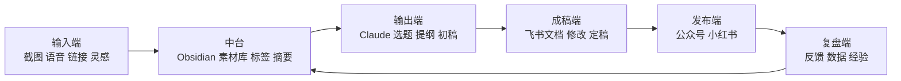
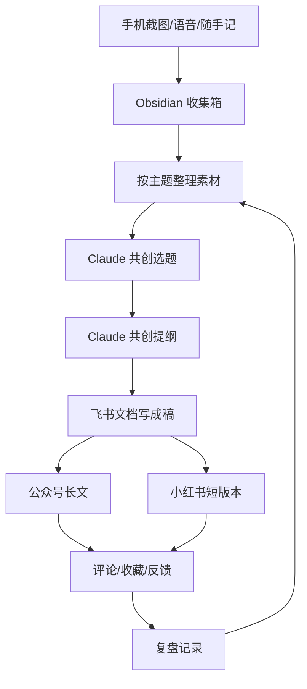

# Ch07：把工作台搭出来，画出你的内容操作系统地图

## 学习目标

- 知道一个最小可用内容工作台需要哪些位置
- 学会把笔记、收集、协作、输出串成一套结构，并画成完整系统地图
- 理解四层架构的关系，为后续学习建立总导航

---

## 1. 为什么要先搭工作台？

内容工作最怕的是每一步都在换地方。如果你现在的工作方式是：灵感记在手机便签、素材存在收藏夹、提纲写在不同文档里、对话散落在多个 AI 工具中，那么后面就算有再强的模型，也很难形成稳定产出。

工作台的意义，不是让你看起来更专业，而是让你每天开始干活时，知道该从哪里进入、在哪里推进、最后去哪里收口。

而地图的作用，是在你开始大规模积累之前，先把整套系统的结构想清楚。一张地图至少能帮你回答三个问题：这个工具在系统里负责什么？这一步做完下一步去哪里？哪个环节是当前最卡的瓶颈？

---

## 2. 一个最小可用工作台，至少要有四个位置

| 位置 | 作用 | 典型工具 |
|------|------|----------|
| 入口位 | 快速接住灵感 | 便签、语音、截图收集 |
| 沉淀位 | 归档和整理 | Obsidian、笔记库 |
| 共创位 | 和 AI 协作 | 主力 AI 工具 |
| 输出位 | 成稿与协作 | 飞书文档、发布后台 |

工作台不是一个软件，而是一组固定的日常入口。

### 2.1 工作台设计里最重要的原则

**记录入口要少，内容出口可以多。** 如果记录入口太多，你会不断重复决定"这条记在哪里"，这种额外判断会迅速消耗日常记录意愿。

**常用动作要尽量短。** 灵感出现时能不能 10 秒内记下？和 AI 共创时能不能快速调用旧素材？

**工作台的目标不是"功能全"，而是"日常顺手"。** 如果你搭了一套看起来很完整但日常根本懒得用的系统，那它就是坏工作台。

---

## 3. 工具分别放在哪？

### 3.1 Obsidian / 知识库工具 — 放在沉淀位

负责长期主题归档、素材整理、标签管理、结构化知识积累。

### 3.2 飞书 / 协作文档工具 — 放在输出位

负责阶段性整理、给团队看、对外分享、发布前成稿协作。

### 3.3 主力 AI 工具 — 放在共创位

负责追问、找题、出提纲、推进初稿、改稿辅助。

你不一定要完全照搬这个结构，但最好有类似的职责划分。套到课程里的阿宁：

```text
入口位：手机截图、语音、随手记
沉淀位：Obsidian，按"AI 工作流 / 职场提效 / 选题池"整理
共创位：Claude，负责追问、选题、提纲、初稿
输出位：飞书文档，负责公众号成稿和对外版本整理
```

一旦按职责分开，阿宁每天开始干活时就不会再想：这条应该记哪儿？这段对话以后去哪找？这篇稿子最后在哪改？发布前版本到底哪个是最新版？

---

## 4. 一套内容操作系统，至少分四层

推荐的系统结构：

```text
输入端 -> 中台 -> 输出端 -> 复盘端
```

这四层不是理论结构，而是内容工作每天都会经过的真实路径。



### 4.1 每一层分别在解决什么问题？

| 层次 | 解决的问题 | 具体负责 |
|------|-----------|----------|
| 输入端 | 东西来了，能不能先接住 | 一句话灵感、截图、语音、链接、AI 对话片段 |
| 中台 | 接住以后，能不能理清楚 | 摘要、分类、打标签、整理主题、建立可复用知识结构 |
| 输出端 | 理清楚以后，能不能写出来 | 选题、角度、提纲、初稿、成稿、多平台版本 |
| 复盘端 | 写出来以后，系统会不会变好 | 反馈收集、经验回收、流程优化 |

### 4.2 没有地图时，最容易发生什么？

- **所有东西都堆在一个地方**：灵感和成稿混在一起，研究资料和对外版本混在一起
- **工具位置不断漂移**：今天用这个工具做笔记，明天又用另一个工具做提纲
- **不知道该优先优化哪一层**：只觉得"哪里都不太顺"，但不知道真正的问题是什么

地图的价值，就是帮你定位问题。

---

## 5. 一张最小系统地图模板

先从这种极简结构开始，把你上一章定下来的工具逐个放进去：

```text
输入端：
  灵感 / 截图 / 链接 / 对话 / 语音
  → 具体工具：手机便签、截图收集

中台：
  素材库 / 标签 / 摘要 / 主题整理
  → 具体工具：Obsidian

输出端：
  选题池 / 提纲 / 初稿 / 成稿 / 多平台版本
  → 具体工具：Claude + 飞书文档

复盘端：
  发布反馈 / 数据观察 / 经验记录 / 流程调整
  → 具体工具：复盘文档 / 数据记录表
```

用阿宁的系统来具体化这张地图：



地图不是一次画完的。后面随着课程推进，你还会继续往地图里补：更清晰的输入分类、更稳定的清洗流程、更具体的选题共创链路、更明确的发布和复盘机制。

---

## 6. 工作台最容易出问题的三个地方

### 6.1 入口太多
看到什么都想试，结果今天记在便签，明天记在飞书，后天发给自己。最后没有任何一个地方是真正可信的入口。

### 6.2 沉淀位和输出位混在一起
很多人会把知识库和成稿文档全堆在同一层。一段时间后就分不清哪些是原始素材、哪些是思考半成品、哪些已经是对外版本。

### 6.3 AI 对话没有连接到实际工作
如果 AI 只是"问完就关"，它就没有真正进入工作台。真正进入工作台的 AI，应该和你的素材、提纲、成稿过程发生连接。

---

## 7. 本章的最小行动

请先完成两件事：

```text
我的入口位：
我的沉淀位：
我的共创位：
我的输出位：
```

再回答三个问题：

```text
1. 我现在最强的一层是哪一层？
2. 我现在最弱的一层是哪一层？
3. 我最想优先优化的是哪一层？
```

## 动手试试 / 实战场景

- 画出你自己的工作台位置图（入口位 / 沉淀位 / 共创位 / 输出位）
- 参考阿宁的示例，把你自己选定的一套工具填进四层地图
- 给每一层标出当前已经有的工具和缺口
- 指定一个统一记录入口和一个统一知识库位置

## 本章交付物

- 阿宁本章产出：一张能描述整套系统流向的操作系统地图
- 你本章最好完成：入口位、沉淀位、共创位、输出位明确的工作台骨架 + 自己的第一版内容操作系统地图

---

## 常见问题 Q&A

**Q1：Obsidian 和飞书文档听起来功能很像，为什么不能只用一个？**
A：它们的职责不同。Obsidian 适合做"长期知识沉淀"，飞书文档适合做"阶段性成稿和分享"。知识库里可能有几十条未整理的半成品，而成稿文档里只有对外发布用的成品。把它们分开，你就不会把零散思考当成品发出去了。

**Q2：我平时只用手机，不太用电脑，这个工作台还能用吗？**
A：完全可以。核心不是工具本身，而是职责划分。你可以用手机便签做入口，用手机版 Obsidian 做沉淀，用 Claude App 做共创。只要这四层职责清楚，工具形态不是问题。

**Q3：我画完地图发现所有环节都有缺口，是不是应该先全部补上再往下学？**
A：千万不要。课程的设计就是让你一章接一章地补。先有了地图，知道缺什么；然后后面每一章帮你补一个缺口。不要试图一次性全搭好。

**Q4：我换过很多次工具了，怎么确定这次选的就是对的？**
A：先用课程默认栈跑通一轮。跑完第一轮闭环之后，你才有足够的信息判断"哪里真的不顺手"。先跑通，再优化；不要还没跑就开始换。

## 小结

- 工作台是你这套内容系统的日常入口，不是展示用架子
- 一个最小可用工作台至少要有入口位、沉淀位、共创位和输出位
- 系统地图不是装饰图，它是你判断流程是否顺畅、工具是否冗余的基础
- 地图一旦画出来，后面每补一个工具、每改一个流程，都会更容易放到正确位置上

下一模块我们就正式进入"收集好的"，把输入端和中台真正跑起来。
