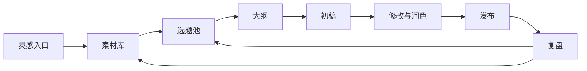

# Ch08（已合并至 Ch07）

> 本章内容已合并至 [Ch07：把工作台搭出来，画出你的内容操作系统地图](Ch07_把工作台搭出来笔记收集协作输出.md)。
> 
> 请直接阅读 Ch07，它现在包含了"工作台搭建 + 系统地图绘制"的完整内容。

---

## 独立学习版：画出你的内容操作系统地图

## 学习目标

学完本章，你应该能够：

1. 把自己的内容工作流画成一张从输入到复盘的系统地图。
2. 找出当前最容易断掉的环节，例如素材入口、选题判断、初稿修改或发布复盘。
3. 用地图决定下一步优先优化哪个环节，而不是继续盲目加工具。

## 1. 为什么要画系统地图？

只在脑子里想流程，很容易高估自己的系统成熟度。画出来之后，你会看到哪些环节有工具，哪些环节只有临时记忆，哪些环节完全没人负责。

一张内容操作系统地图至少要包含五个节点：

1. 灵感入口
2. 素材库
3. 选题池
4. 内容生产流程
5. 发布与复盘

案例：阿宁原本以为自己“有很多素材”，但画图后发现素材散在微信收藏、飞书文档、浏览器书签和手机备忘录里。问题不是素材不够，而是入口不统一，导致写作时找不到。

## 2. 最小地图模板

你可以先用下面这个结构画第一版：



这张图不追求漂亮，重点是让你看清楚：信息从哪里进来，经过哪些判断，最终如何回到系统里。

## 3. 三个常见断点

### 断点一：入口太多

素材入口太多会导致后续无法检索。解决方法不是立刻换工具，而是先定一个主入口，其他入口定期汇总。

### 断点二：选题没有判断标准

如果选题池只是一堆标题，AI 很难帮你判断优先级。建议给每个选题至少加三个字段：目标读者、核心问题、可用素材。

### 断点三：复盘没有回流

很多人发布后只看数据，不把经验放回系统。复盘应该产生下一轮可用的素材、标题经验、案例补充或表达禁区。

## 落地 Checklist

画完系统地图后，逐项检查：

- [ ] 我能指出所有素材入口，并确定一个主入口。
- [ ] 我的素材库里至少有“原始内容、来源、可写角度”三个字段。
- [ ] 我的选题池能说明每个选题为什么值得写。
- [ ] 从大纲到初稿再到修改稿，有明确的文件或页面承接。
- [ ] 发布后的数据和反馈会回到素材库或选题池。
- [ ] 我知道当前最应该优化的一个断点，而不是同时改所有环节。

## 本章小结

内容操作系统地图的作用，是把看不见的创作习惯变成可检查、可优化的流程。你不需要一开始画出复杂系统，只要能看清楚输入、判断、生产、发布和复盘五个节点，就能开始改进。

本章结束后，请保留你的第一版地图。后续课程会不断回到这张图：搭助手、整理素材、生成大纲、修改初稿和复盘发布，本质上都是在补强地图上的某个节点。

---

## 4. 工作坊：30 分钟画出第一版地图

### 0-5 分钟：列入口

写下你现在所有素材入口：微信收藏、浏览器书签、播客笔记、读书摘录、客户聊天、工作文档、灵感备忘录。不要先整理，先全部列出来。

### 5-10 分钟：圈出主入口

从这些入口里选一个作为主入口。主入口的标准不是功能最多，而是你最容易坚持使用、最容易搜索、最容易和 AI 协作。

### 10-15 分钟：补选题池

在地图中单独画一个“选题池”。不要让素材直接进入写作。选题池要负责判断：这个素材能服务哪个读者、解决什么问题、是否有足够证据。

### 15-20 分钟：画生产链路

把生产链路拆成大纲、初稿、修改、发布稿。每一步都写清楚 AI 能帮什么：追问、补案例、改结构、压缩表达、改标题或生成平台版本。

### 20-25 分钟：画复盘回流

从发布节点画一条线回到素材库和选题池。复盘不是终点，它要把读者反馈、数据表现、好标题和失败原因带回系统。

### 25-30 分钟：选一个优先修复点

最后不要同时改所有节点，只选一个最影响你创作的断点。常见选择是：统一素材入口、建立选题标准、固定大纲模板、补发布复盘。

## 5. 地图示例：一个知识型创作者的最小系统

```text
客户问题 -> 素材库 -> 选题池 -> 大纲模板 -> 初稿 -> 人工判断 -> 发布 -> 复盘
             ^                                             |
             |_____________________________________________|
```

这个系统最重要的不是工具，而是回流。客户问题进入素材库，发布反馈再回到素材库和选题池。这样每次创作都会让下一次更容易。

## 6. 本章练习

1. 画出你的第一版内容操作系统地图，不超过 8 个节点。
2. 给每个节点标注当前工具，如果没有工具就写“人工处理”。
3. 用红色标出最容易断掉的节点。
4. 为这个断点写一个最小改进动作，并限定在 3 天内完成。
5. 一周后回看地图，记录这个改动是否真的减少了创作阻力。

## 常见问题 Q&A

**Q1: 地图画得不完整可以吗？**
A: 可以。第一版地图的目标是暴露问题，不是一次画完美。只要能看出输入、生产和复盘之间的关系，就已经有价值。

**Q2: 我能不能直接使用别人的系统地图？**
A: 可以参考，但不要照搬。你的内容类型、素材来源、发布渠道和复盘指标都可能不同。系统地图必须服务你的实际创作节奏。

**Q3: 地图画完后下一步做什么？**
A: 只选一个断点修。比如入口太散，就先统一入口；选题太乱，就先建立选题字段。系统是一轮一轮长出来的，不是一次搭出来的。

---

## 7. 地图诊断表

画完地图后，用这张表给每个节点打分。1 分表示几乎没有，5 分表示稳定运行。

| 节点 | 评分 | 证据 | 下一步动作 |
|------|:---:|------|------------|
| 灵感入口 |  | 是否有统一收集位置 |  |
| 素材库 |  | 是否能按主题搜索 |  |
| 选题池 |  | 是否有判断字段 |  |
| 大纲流程 |  | 是否有固定模板 |  |
| 初稿流程 |  | 是否知道 AI 负责什么 |  |
| 修改流程 |  | 是否有人类判断标准 |  |
| 发布流程 |  | 是否有平台版本规则 |  |
| 复盘流程 |  | 是否能回流到素材/选题 |  |

总分不是越高越好，而是帮你找出优先级。最低分的节点通常就是你下一周最该修的地方。

## 8. 三种常见地图版本

### 版本一：写作者个人版

```text
灵感 -> 素材卡片 -> 选题池 -> 大纲 -> 初稿 -> 修改 -> 发布 -> 复盘
```

适合个人公众号、博客、LinkedIn、知识型短视频创作者。重点是让素材和复盘能持续回流。

### 版本二：团队协作版

```text
用户反馈 -> 选题会 -> 负责人 -> 作者 -> 编辑 -> 设计 -> 发布 -> 数据复盘
```

适合小团队。重点是明确每个节点的负责人，避免所有事情都堆到一个人身上。

### 版本三：产品内容版

```text
客户问题 -> 产品知识库 -> 教程选题 -> 文档/视频 -> 客服反馈 -> 知识库更新
```

适合 SaaS、课程、咨询服务。重点是内容和产品知识库互相更新，减少重复解释。

## 9. 本章交付物

完成本章后，你应该留下 3 个文件或页面：

1. 一张内容操作系统地图。
2. 一张地图诊断表。
3. 一个未来 7 天只修一个节点的行动计划。

行动计划建议写成这样：

```text
本周只优化：素材入口
原因：素材分散在 5 个地方，写作时找不到
动作：把微信收藏和浏览器书签统一进飞书表格
验收：下周能从表格里选出 5 个可写选题
```

地图不是展示用的图，而是帮助你做取舍的工具。只要它能让你知道下一步改哪里，就是一张有效地图。
