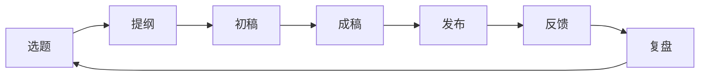

# Ch20：发出去，然后复盘，系统才会越来越好

## 学习目标

- 理解内容发布和复盘在工作流里的位置
- 学会设计基础发布节奏和复盘模板
- 把这套系统真正转入持续运行状态

---

## 1. 为什么很多人写到这里就结束了？

很多人终于把内容写出来，就会自然觉得这件事已经完成了。

但真正能让系统越来越好的，不只是“写出来”，而是“发出去并看回来”。

如果没有发布与复盘，前面搭好的所有流程很容易停在：

- 偶尔有产出
- 偶尔有灵感
- 偶尔跑通一轮

而不能真正变成稳定系统。

```text
发布不是终点，复盘才是系统升级的入口。
```

---

## 2. 为什么发布不是“有空再说”的动作？

发布有两个作用：

### 2.1 让内容真正进入现实场景

没发出去之前，你很难知道：

- 这个问题是不是真的有人在意
- 这个角度是不是足够清楚
- 这个表达是不是容易被理解

### 2.2 让系统开始产生反馈

没有反馈，你只能靠主观感觉判断内容好坏。  
而一旦开始发布，你会逐渐拥有真实信号。

所以，发布不是附加动作，而是内容系统闭环的一部分。



---

## 3. 为什么要设计发布节奏？

如果每次都靠临时决定什么时候发，你很难形成长期稳定输出。

发布节奏的价值是：

- 降低决策成本
- 帮你建立预期
- 倒逼前面的选题和写作节奏

发布节奏不需要一开始就很密，关键是：

- 够稳定
- 够现实
- 你真能做到

对初学者来说，一周 1-2 次稳定输出，通常比“某周连发 5 条、下周断更”更有价值。

如果你不想按周理解，也可以把它看成“每个创作周期要交什么作业”：

- 每个周期 1 篇主内容
- 每个周期 1-2 个适配版本
- 每个周期 1 份复盘记录

### 3.3 从周节奏到月/季度规划的扩展

当你跑通几轮周节奏之后，可以尝试拉长视野，做一个简单的月度和季度规划。这不光是"排日期"，而是把选题和服务串成有推进感的线。

**月度规划（4 周为一个周期）：**

```text
第 1 周：方法论类内容（讲"怎么做到"）
第 2 周：误区纠偏类内容（讲"哪里搞错了"）
第 3 周：经验复盘类内容（讲"我试过的经验"）
第 4 周：互动/问答/总结类内容（回收读者反馈）
```

这样一个月的 4 篇内容就不会都是同一种类型，读者也会感觉你在"带着他们系统往前走"而不是"每周随机发一篇"。

**季度重点规划：**

每个季度可以定 1 个重点主题线索，例如：
- Q1：搭系统（选题池、知识库、工具台）
- Q2：练表达（初稿、改稿、风格）
- Q3：扩影响（多平台、合作、读者增长）
- Q4：深复盘（年度总结、系统升级）

然后每个月的 4 篇内容都围绕这个季度重点展开。这样你就不需要每篇内容都从零想方向——方向已经提前定好了，你只需要从中找具体的题。

**一个简单的月内容日历模板：**

```text
月主题：

Week 1: 方法论 | 选题：
Week 2: 纠偏 | 选题：
Week 3: 复盘 | 选题：
Week 4: 互动 | 选题：

月末复盘：
- 最有反馈的一篇：
- 最需要改进的一篇：
- 下月最想尝试的变化：
```

---

## 4. 一份最小可用的发布规划

你可以先从三个维度规划：

### 4.1 频率

例如：

- 每周 1 篇长内容
- 每周 2 条短内容

### 4.2 主题线

不要什么都发。  
最好围绕你前面定下来的核心主题，建立几条固定线索。

例如：

- 方法论线
- 误区纠偏线
- 经验复盘线

### 4.3 平台优先级

先明确：

- 主平台
- 次平台

这样你后面的一稿多用就更容易安排。

---

## 5. 复盘到底在看什么？

很多人一说复盘，就只盯着数据。  
但内容复盘不应该只看数字，还要看流程和表达。

至少可以从三层看：

### 5.1 内容层

- 这个题是不是值得继续做
- 哪个观点最有反应
- 哪个部分最容易被记住

### 5.2 表达层

- 标题够不够抓人
- 开头够不够立问题
- 节奏是不是太慢

### 5.3 流程层

- 哪个环节最耗时间
- 哪个环节最容易卡住
- 哪个动作最值得模板化

```text
复盘要回答：什么内容有效，为什么有效，下一次怎么更顺。
```

---

## 6. 一份简单的复盘模板

你可以先用这版最小模板：

```text
这篇内容的题目是：

有效的地方：
1.
2.

不足的地方：
1.
2.

用户/读者最有反应的是：

我下次最想优化的是：
```

如果你有平台数据，也可以补：

- 阅读 / 播放
- 收藏 / 点赞
- 评论关键词

但不要让数据盖过内容判断本身。

---

## 7. 用阿宁的案例跑完一轮闭环

课程里的阿宁，完成一轮最小闭环后，大概会长这样：

### 7.1 这轮产出了什么

```text
主内容：
为什么很多人用了 AI，还是写不出稳定内容？

平台版本：
1. 公众号长文版
2. 小红书短内容版

复盘材料：
1. 评论里大家最有反应的句子
2. 哪一段最容易被收藏
3. 哪个环节最耗时间
```

### 7.2 她会从复盘里看到什么

- 读者对“不是工具问题，是流程问题”反应最大
- 开头如果先讲自己的卡点，代入感更强
- 从素材到提纲这一步最慢，说明选题共创模板还要继续优化

### 7.3 下一轮她会怎么调

- 保留“问题 -> 误区 -> 最小做法”这种结构
- 提前准备 3 个可复用开头
- 在知识库里增加一个“高反应观点”区，供下轮选题调用

这才是复盘真正有价值的地方：  
不是写一份感想，而是把下一轮动作改掉。

---

## 8. 新手最容易犯的三个发布与复盘错误

### 8.1 错误一：等到“完全满意”才发

这会让系统永远停留在准备阶段。

### 8.2 错误二：只看数据，不看内容判断

数据重要，但你也要看：

- 这个题是不是值得长期做
- 这个方向是否符合你的主题线

### 8.3 错误三：复盘后没有真正改流程

如果复盘只是“想了一下”，但下一轮还是原样继续，那系统就没有真正升级。

---

## 9. 本章的最小行动

请完成一轮最小闭环：

```text
选题 -> 提纲 -> 初稿 -> 成稿 -> 发布 -> 复盘
```

然后写下这三件事：

```text
这一轮最有效的一个动作是：
这一轮最卡的一个环节是：
下一轮我最先要优化的一件事是：
```

只要你认真跑完一轮，这套系统就已经从“设计”变成“开始工作”了。

## 动手试试 / 实战场景

- 制作你的第一版发布节奏表
- 用一篇真实内容完成一次复盘
- 参考阿宁的案例，写出“我这轮最想保留的一个动作”和“我下轮最先要改的一个动作”
- 写出下一轮最想优化的 3 个点

## 常见问题 Q&A

**Q1：我发了第一篇，数据很差，是不是说明我的方向选错了？**
A：一篇数据不够下任何结论。建议至少发 5-8 篇之后再回看趋势。而且初期复盘的重点不是"多少阅读量"，而是"哪些表达被注意到了"——一条评论、一次收藏、一次转发，都比阅读数更能帮你判断内容质量。

**Q2：复盘时我发现最卡的是"从素材到提纲"这一步，怎么优化？**
A：说明你的清洗流程可能需要强化。回到 Ch12 检查你的素材清洗模板，确保 AI 在清洗时就标出了"可能发展成什么内容"。同时 Ch13 的选题池也需要维护——如果选题池里没有够用的题目，每次写作都会从零开始。

**Q3：我担心复盘会变成自我批评，最后越来越不想写。怎么办？**
A：复盘不是找茬，而是收集改进信号。改成积极框架：这次我最满意的是 ______，下次我最想试的一个变化是 ______。先肯定再优化，而不是先挑刺再否定。系统会因为你"保留了好的部分"而变强，不会因为你"全部推倒重来"而变强。

**Q4：发布频率和内容质量冲突的时候，应该优先哪一个？**
A：初期优先"按时发"。先建立"固定产出"的习惯比追求单篇质量重要得多。你可以每周只发 1 篇，但一定要发。一周 1 篇稳定输出 3 个月，比一个月发 8 篇然后断更 2 个月效果好十倍。习惯养成了，质量自然会慢慢上来。

**Q5：课程学完了，接下来我应该做什么来持续运转这套系统？**
A：建议制定一个 4 周小目标：每周完成一轮"收素材 → 选题 → 提纲 → 初稿 → 发布 → 复盘"的完整闭环。连续跑 4 轮之后，你会发现哪些环节已经自动化了，哪些还需要调整。4 周后重新审视你的系统地图，做一次整体优化。

## 本章交付物

- 阿宁本章产出：一轮完整的“发布 -> 复盘 -> 优化”记录
- 你本章最好完成：发布节奏表 + 一份复盘模板 + 一次真实复盘

## 小结

- 系统一旦进入”发布 -> 复盘 -> 优化”的循环，它才开始真正长期为你工作
- 发布的意义是让内容进入现实场景，复盘的意义是让系统不断升级
- 最值得保留的不是某篇爆文，而是你逐渐长出来的迭代能力
- 真正有价值的不是偶尔写出一篇，而是慢慢建立一条可持续运行的内容生产线

> **想再深入一点？** 复盘的思想可以对照经典的 PDCA 循环（Plan → Do → Check → Act）：选题提纲是 Plan，写作发布是 Do，数据反馈是 Check，流程优化是 Act。如果你想建立更系统的复盘习惯，可以搜索”OODA 循环”（Observe → Orient → Decide → Act），它特别适合内容创作者快速迭代场景——观察反馈、调整判断、决定下一篇写什么、执行。

本课程到这里完成了从”看见系统”到”搭出系统”再到”跑通一轮系统”的完整闭环。

---

## 课程总结：回头看你的系统地图

在 Ch01，你第一次看到了一张完整的 AI 内容工作流地图。现在你已经跑完一轮，回头看看你的地图长到了什么样子。

### 你的系统现在每层长成什么样了？

```text
输入端：
  我现在的统一入口是：
  我最常用的 3 种输入来源是：
  这一层的自评（顺手/勉强/还没搭）：

中台：
  我的知识库工具是：
  我的一级主题有：
  我的标签有：
  这一层的自评：

输出端：
  我的主力 AI 助手是：
  我的选题池有多少个候选题：
  我已经完成的成稿数量：
  这一层的自评：

复盘端：
  我有没有做发布后的复盘：
  复盘后有没有真正改过流程：
  这一层的自评：
```

### 从 Ch01 到 Ch18，你拿到了什么？

把课程 18 章的交付物列出来，看看你完成了多少：

| 章 | 交付物 | 我做到了吗 |
|----|--------|------------|
| Ch01 | 一条自己的当前内容链路 |  |
| Ch02 | 一份个人流程误区清单 |  |
| Ch03 | 第一版个人创作目标卡 |  |
| Ch04 | 工具分工表 |  |
| Ch05 | 内容助手角色卡 |  |
| Ch06 | 工作台位置图 + 系统地图 |  |
| Ch07 | 统一待整理入口 |  |
| Ch08 | 素材字段模板 |  |
| Ch09 | 知识库骨架 |  |
| Ch10 | 素材清洗提示模板 |  |
| Ch11 | 第一版选题池 |  |
| Ch12 | 观点澄清追问模板 |  |
| Ch13 | 研究流清单 |  |
| Ch14 | 一篇内容提纲 |  |
| Ch15 | 第一版初稿 |  |
| Ch16 | 一篇可发布成稿 |  |
| Ch17 | 多平台版本内容包 |  |
| Ch18 | 发布节奏表 + 复盘记录 |  |

### 下一步建议

如果你已经跑完一轮闭环，接下来最有价值的三件事：

1. **连续跑 4 周**：每周完成一轮”收素材 → 选题 → 提纲 → 初稿 → 发布 → 复盘”，让系统从”学过”变成”在用”
2. **优化最卡的一层**：找到你当前最卡的那个环节（通常是中台或复盘端），单独花一周优化
3. **3 个月后重新审视系统地图**：回头改你的目标卡、工具栈和选题方向，系统会跟着你一起升级

**记住：你最终要得到的，不是 18 章的笔记，而是一套能持续为你工作的个人内容操作系统。**
