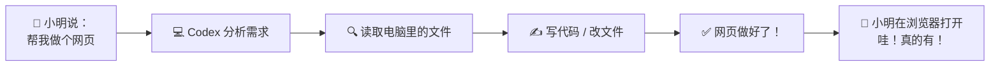
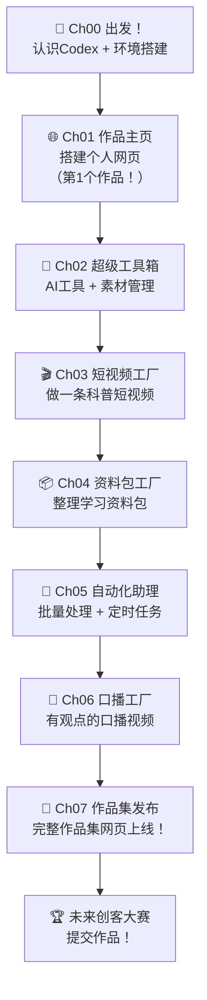

# Ch00：出发！认识你的 AI 伙伴 — Codex 介绍与环境搭建

## 学习目标

学完本章后，你将能够：

- 用小朋友能听懂的方式理解什么是 Codex 和 AI 编程助手
- 知道 Codex 和 ChatGPT、豆包、Kimi 等聊天 AI 有什么不同
- 了解一个完整的"用 AI 做作品"的流程长什么样
- 在自己的电脑上完成 Node.js 和 Codex CLI 的安装
- 成功启动 Codex 并完成第一次对话
- 理解终端（命令行）的基本操作

---

## 📖 故事时间：小明和未来创客大赛

> 小明今年 10 岁，上五年级。他喜欢在平板上画画，也爱看科技类短视频。
>
> 有一天，班主任在班会上宣布了一个消息："下个月学校要举办'未来创客大赛'，每个同学可以用任何工具创作一个作品——可以是小发明、短视频、电子海报、甚至一个小程序。"
>
> 小明眼睛一亮，但马上又泄气了。"我又不会写代码，怎么做小程序啊？"
>
> 放学后，小明的表哥大飞给他打了个电话："听说你们学校有创客大赛？我教你用一个超酷的工具——它叫 Codex，是一个 AI 编程助手。你只要用中文跟它说话，它就能帮你写网页、做视频、甚至让电脑自动帮你干活！"
>
> "真的假的？"小明半信半疑。
>
> "7 节课，我带你做 7 个作品。到时候你的作品集往大赛上一摆，保证全班惊讶！"
>
> 于是，小明和 Codex 的冒险之旅开始了……

---

## 1. 什么是 Codex？——用小朋友能懂的方式说清楚

### 1.1 先打个比方

想象你有一只**机器猫**（就像哆啦 A 梦）。你跟它说：

> "我想做一个网页，上面有我的名字、我的照片、还有我喜欢的动漫角色。"

这只机器猫不会直接变出一个网页给你——但它能**听懂你的话**，然后去电脑里找到合适的工具（写网页的"积木块"），按照你的要求**搭出一个网页**。

Codex 就是这只机器猫。它住在你的电脑**终端**（一个黑黑的窗口）里，你用中文跟它说话，它帮你操作电脑、写代码、做文件。

### 1.2 Codex 和其他 AI 有什么不同？

你可能用过 ChatGPT、豆包、Kimi、文心一言……它们都是在网页或 App 里聊天的 AI。

| | 聊天 AI（ChatGPT 等） | Codex |
|------|-------------------|-------|
| 你能干嘛 | 聊天、问问题、让它写文章 | **操作电脑**、写文件、改代码 |
| 能碰你的文件吗？ | ❌ 不能 | ✅ 能读、能写、能改 |
| 能帮你做网页吗？ | 能给你代码，但你要自己粘贴 | ✅ 直接帮你生成文件 |
| 能整理桌面吗？ | ❌ 不能 | ✅ 能写脚本自动整理 |
| 更像什么？ | 一个什么都知道的朋友 | 一个能帮你干活的朋友 |

> 🎯 **一句话总结**：聊天 AI 能告诉你"怎么做"，Codex 能帮你"做出来"。

### 1.3 Codex 怎么工作？



整个过程小明只做了一件事：**用中文说出他想要什么**。剩下的 Codex 全包了。

---

## 2. 环境搭建：让 Codex 住进你的电脑

### 2.1 认识「终端」——Codex 的家

在安装 Codex 之前，我们要先认识一个重要的地方：**终端（Terminal）**。

终端就是电脑上那个黑底白字的窗口。它看起来有点吓人（全是英文字母），但其实很简单——它就是你和电脑"打字聊天"的地方。

**如何打开终端？**

| 你的电脑 | 操作方法 |
|----------|----------|
| Windows | 按键盘上的 `Win` 键（就是那个田字格键），输入 `cmd`，回车 |
| Mac | 按 `Command + 空格`，输入 `终端`，回车 |

打开之后，你会看到类似这样的画面：

```
C:\Users\小明>
```

这个 `>` 叫**提示符**，表示电脑在等你输入命令。

> 🧪 **试一下**：在终端里输入 `whoami` 然后回车。电脑会显示你的用户名！这就是你第一次和电脑"终端对话"。

### 2.2 安装 Node.js — Codex 的运行环境

Codex 是用 Node.js 写的。Node.js 就像一个"翻译官"，帮 Codex 把代码翻译成电脑能听懂的语言。

**安装步骤（跟着做）：**

**第 1 步**：打开浏览器，访问 https://nodejs.org

**第 2 步**：你会看到两个大按钮。点击左边那个写着 **"LTS"** 的（长期支持版，最稳定）。

**第 3 步**：下载完成后，双击安装文件，一路点击 **"Next"（下一步）**，直到 **"Install"（安装）**。

**第 4 步**：验证是否安装成功。打开终端，输入：

```bash
node --version
```

如果看到类似 `v20.11.0` 这样的版本号，恭喜！✅ Node.js 安装成功！

再试一个：

```bash
npm --version
```

npm 是 Node.js 附带的"工具商店"，我们之后会用 npm 来安装 Codex。

> ⚠️ **常见问题**：如果提示"找不到命令"或"command not found"，可能是安装时漏选了某个选项。重新安装一遍，确保所有勾选框都打上勾。

### 2.3 安装 Codex CLI

现在来安装主角——Codex！

在终端中输入：

```bash
npm install -g @anthropic-ai/codex
```

> 💡 **这条命令在做什么？**
> - `npm install` = 用"工具商店"安装一个工具
> - `-g` = 全局安装（让它在电脑任何地方都能用）
> - `@anthropic-ai/codex` = 要安装的工具名字

安装过程中会出现很多文字滚过去——别慌，这是正常的。等它停下来，看到命令提示符 `>` 再次出现，就说明装好了。

验证安装：

```bash
codex --version
```

看到版本号就 OK！

### 2.4 准备工作文件夹

在开始用 Codex 之前，我们先创建一个专门放作品的地方：

```bash
# 在桌面上创建项目文件夹
# Windows:
cd %USERPROFILE%\Desktop
mkdir my-codex-workspace
cd my-codex-workspace

# Mac:
cd ~/Desktop
mkdir my-codex-workspace
cd my-codex-workspace
```

> 📂 **`my-codex-workspace`**（我的 Codex 工作空间）—— 之后 7 节课的所有作品都会放在这里。

---

## 3. 第一次和 Codex 对话

### 3.1 启动 Codex

在终端中，确保你已经在 `my-codex-workspace` 文件夹里（终端显示的路径末尾有这个文件夹名），然后输入：

```bash
codex
```

### 3.2 首次配置

第一次启动时，Codex 会问你几个问题：

1. **API Key**：这是你的"通行证"，让 Codex 知道你有权使用它。
   > 上课时老师会把 API Key 发给你。把它粘贴进去，回车。

2. **选择模型**：选默认的就行（通常是 Claude Sonnet），直接回车。

3. **权限设置**：Codex 会问你能不能在文件夹里读写文件——选 **Yes**（是）。

配置完成后，你会看到 Codex 的欢迎信息，然后出现一个输入提示符。🎉

### 3.3 打个招呼！

```bash
# 在 Codex 对话框中输入
你好 Codex！我叫小明，我想参加学校的创客大赛。你能帮我吗？
```

Codex 会友好地回复你。**这是你和新伙伴的第一次对话！**

### 3.4 第一个小任务：让 Codex 创建一个欢迎文件

试试让 Codex 帮你做第一个任务：

```bash
请帮我创建一个文本文件，名字叫 hello.txt
内容写："你好，世界！我是小明，准备用 Codex 参加未来创客大赛！"
```

Codex 会帮你创建这个文件。然后你可以这样验证：

```bash
# 在终端中（不是在 Codex 对话框里）
# 先按 Ctrl+C 退出 Codex 对话
type hello.txt    # Windows
# 或
cat hello.txt     # Mac
```

你会看到文件内容就是你刚才让 Codex 写的！✨

---

## 4. 终端常用命令速成

在 Codex 对话中，你也可以直接让 Codex 帮你执行终端命令。但了解一下这些基本命令会很有用：

| 命令 | 作用 | 例子 |
|------|------|------|
| `ls`（Mac）/ `dir`（Win） | 看看当前文件夹里有什么 | `ls` |
| `cd 文件夹名` | 进入某个文件夹 | `cd my-codex-workspace` |
| `cd ..` | 返回上一级文件夹 | `cd ..` |
| `mkdir 名字` | 创建一个新文件夹 | `mkdir 我的作品` |
| `type 文件名`（Win） | 查看文件内容 | `type hello.txt` |
| `cat 文件名`（Mac） | 查看文件内容 | `cat hello.txt` |

> 💡 **不用死记硬背**！你可以在 Codex 里直接说"帮我看看当前文件夹里有什么"，Codex 就会帮你执行 `ls` 或 `dir`。但了解这些命令会让你更有掌控感。

---

## 5. 从"想法"到"作品"：一张全景地图

在正式开始 7 节课的旅程之前，咱们先看一眼完整地图——接下来你要和 Codex 一起征服的 7 个关卡：



> 🎯 **小明此刻的状态**：✅ 环境搭好了 ✅ Codex 装好了 ✅ 第一次对话完成了。
>
> 和 Codex 一起，开始闯关吧！

---

## 👐 动手试试

### 基础挑战 ⭐

1. 打开终端，用 `whoami` 看看你的用户名是什么
2. 用 `mkdir` 创建三个文件夹：`网页作品`、`视频作品`、`文档作品`
3. 让 Codex 帮你创建一个 `自我介绍.txt`，写上你的名字、年级和一个爱好

### 进阶挑战 ⭐⭐

4. 在终端中导航到你创建的三个文件夹，用 `cd` 命令来回切换
5. 尝试让 Codex 帮你写一个简单的 Python 或 JavaScript 程序（哪怕只是打印一句话），保存并运行它

### 挑战任务 ⭐⭐⭐

6. 画一张你自己的"作品地图"——接下来 7 节课你想完成哪些作品？在纸上画出来，然后拍照保存
7. 让 Codex 帮你把这张"作品地图"转成一个简单的 HTML 网页，配上你的名字

---

## 小结

| 要点 | 说明 |
|------|------|
| 什么是 Codex | 一个住在终端里的 AI 编程助手，能用中文对话操作电脑 |
| Codex vs 聊天 AI | 聊天 AI 告诉你"怎么做"，Codex 帮你"做出来" |
| 终端 | 黑底白字的窗口，和电脑"打字聊天"的地方 |
| Node.js | Codex 的运行环境，从 nodejs.org 下载 LTS 版 |
| 安装 Codex | `npm install -g @anthropic-ai/codex` |
| 第一次对话 | 用中文打招呼，让 Codex 帮你创建文件 |
| 故事背景 | 小明参加"未来创客大赛"，Codex 是他的 AI 导师，7 节课完成 7 个作品 |

---

## 下一章预告

环境搭好了，Codex 也认识你了。下一章是真正的实战——用 Codex 搭建你的个人作品主页！小明会在 Codex 的帮助下，做出他人生的第一个网页。跟上来，别掉队！
