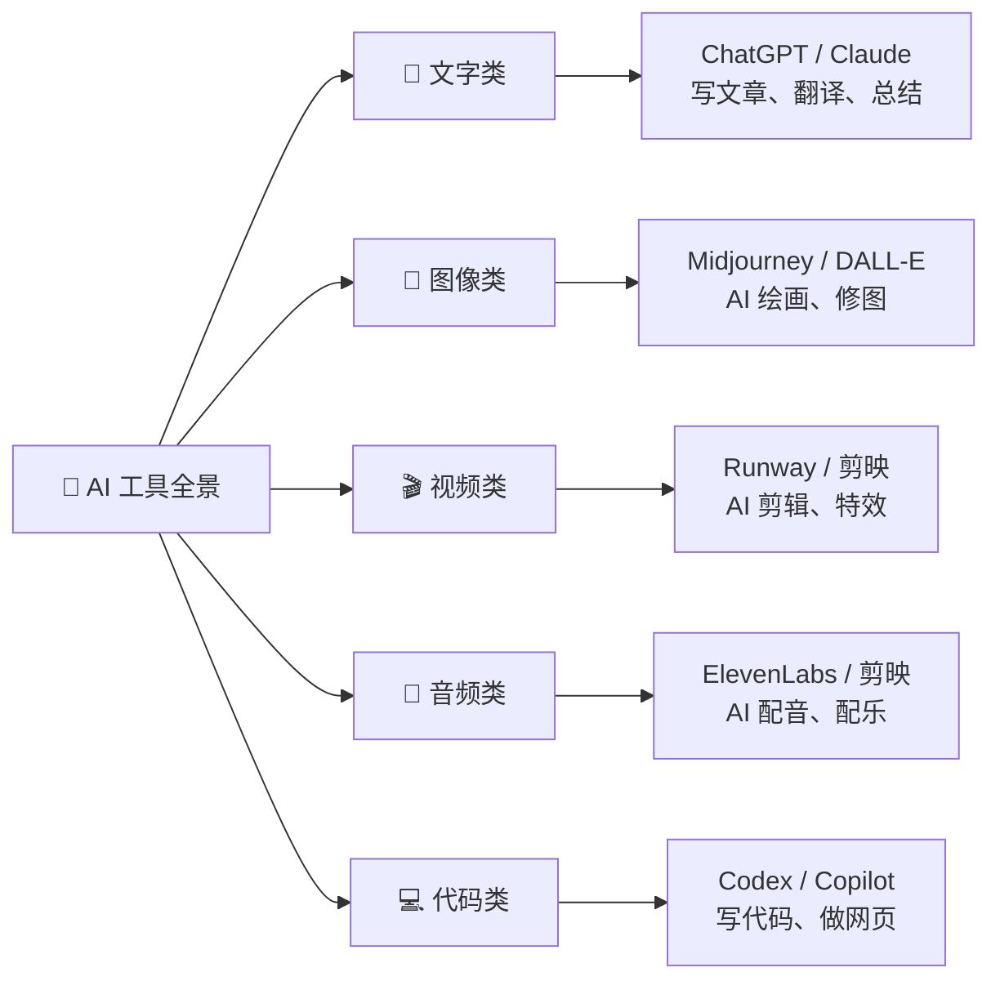
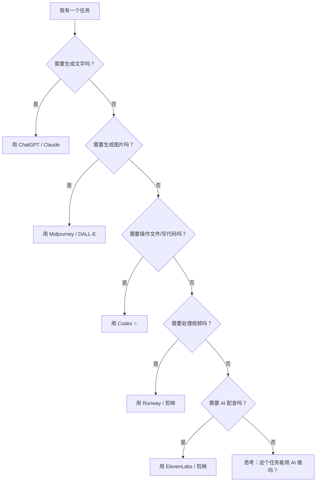

# Ch02：Codex 超级工具箱 — 学习 AI 工具实操

## 学习目标

学完本章后，你将能够：

- 了解 AI 工具的全景图，知道哪些 AI 工具可以帮你做什么
- 使用 Codex 搜索和整理网络素材（图片、文章、数据）
- 用 Codex 批量处理图片（转换格式、调整大小、去背景）
- 学会高效管理文件，用 AI 整理自己的数字资产
- 建立自己的「AI 工具箱」思维：遇到问题知道找什么工具

---

## 1. AI 工具全景图

### 1.1 你身边的 AI 世界

你知道吗？你每天都在接触 AI——短视频推荐、智能搜索、语音助手、拍照美颜……背后都有 AI 在帮忙。

在创作领域，我们可以把 AI 工具分成几个大类：



### 1.2 Codex 的独特定位

Codex 和其他 AI 工具有什么不同？

| 特点 | Codex | 其他 AI 工具 |
|------|-------|-------------|
| 交互方式 | 命令行对话 | 网页聊天 / App |
| 核心能力 | 写代码 + 操作文件 | 生成内容 |
| 能操作电脑吗 | ✅ 可以读写文件、执行命令 | ❌ 通常不行 |
| 适合人群 | 想创造东西的人 | 需要内容的人 |

Codex 的特别之处在于：**它不仅会生成内容，还会帮你把内容变成实际的文件、网页、程序**。它是你和电脑之间的"翻译官"——你负责创意，它负责实现。

---

## 2. 素材搜索与整理

### 2.1 用 Codex 搜索网络素材

做作品时，我们经常需要找素材。Codex 可以帮你高效搜索。

**场景 1**：你想找一些关于"太空探索"的高清图片

```bash
# 在 Codex 对话中
请帮我搜索 10 张关于太空探索的高清免费图片，要求：
1. 可用于个人项目（非商业用途可接受）
2. 分辨率至少 1920x1080
3. 把搜索结果整理成一个列表，包含图片链接和简短描述
```

Codex 会使用内置的搜索工具帮你找到合适的图片，并整理出清晰的列表。

**场景 2**：你想了解"人工智能的历史发展"

```bash
请帮我搜索"人工智能发展历史"，把关键事件整理成一个时间线：
- 包含年份、事件名称、一句话描述
- 输出为 Markdown 格式
- 至少 10 个关键事件
```

### 2.2 素材分类与命名

找来的素材多了，管理就成了问题。让 Codex 教你怎么整理：

```bash
# 创建一个规范的文件管理结构
请帮我在当前目录下创建以下文件夹结构：

📁 my-projects/
├── 📁 images/          ← 所有图片素材
│   ├── 📁 raw/         ← 原始下载的图片
│   └── 📁 edited/      ← 处理过的图片
├── 📁 texts/           ← 文字素材
├── 📁 videos/          ← 视频素材
├── 📁 audio/           ← 音频素材
└── 📁 exports/         ← 最终导出的作品
```

> 📂 **好习惯**：从一开始就建立清晰的文件夹结构，比以后花时间整理要省力得多。Codex 可以帮你一键创建整个结构。

### 2.3 批量重命名

当你下载了很多图片，文件名往往是乱码（如 `img_3827.jpg`）。让 Codex 帮你批量重命名：

```bash
# 批量重命名图片
请帮我把 images/raw/ 文件夹里的所有图片，按照以下规则重命名：
- 格式：{序号}_{内容描述}.jpg
- 自动识别图片内容来命名
- 例如：01_星空.jpg、02_火箭发射.jpg、03_宇航员.jpg
```

Codex 会读取图片内容（通过 AI 视觉能力），自动识别并生成有意义的中文文件名。**这就是 AI 的超能力——理解内容并自动整理！**

---

## 3. 图片处理实操

### 3.1 图片格式转换

不同场景需要不同的图片格式：

| 格式 | 特点 | 适用场景 |
|------|------|----------|
| JPG | 体积小，有压缩 | 网页、日常分享 |
| PNG | 支持透明背景 | Logo、图标、抠图 |
| WebP | 体积更小，质量好 | 现代网页 |
| SVG | 矢量图，无限放大 | Logo、插画、图标 |

用 Codex 转换格式：

```bash
# 把一张 PNG 图片转换为 JPG
请帮我把 images/raw/logo.png 转换为 JPG 格式，保存到 images/edited/logo.jpg
要求：白色背景，质量 90%
```

### 3.2 图片批量调整

```bash
# 批量调整图片大小
请帮我把 images/raw/ 文件夹中所有图片调整为：
- 宽度 800 像素（高度按比例缩放）
- 保存到 images/edited/ 文件夹
- 保持原始文件名
```

### 3.3 图片去背景（抠图）

这是 Codex 的超实用技能！

```bash
# 给照片去背景
请帮我把 images/raw/我的照片.jpg 的背景去掉，只保留人物，
保存为 images/edited/我的照片_抠图.png

# 如果要批量去背景
请帮我把 images/raw/ 文件夹中所有人物照片去背景，保存到 images/edited/
```

> 🎨 **创意运用**：去背景后，你可以把人物放在任何背景上——火星表面、海底世界、古代宫殿……想象力是唯一的限制！

---

## 4. 文件管理自动化

### Step 4：整理自己的"数字房间"

> 🎬 **场景**：小明的桌面乱成一团，文件东一个西一个。"Codex，帮我把桌面收拾干净吧！"

### 4.1 桌面整理大师

桌面越来越乱？让 Codex 帮你一键整理：

```bash
# 自动整理桌面
请帮我整理桌面上的文件：
1. 所有图片（.jpg、.png、.gif）移动到 桌面/图片/
2. 所有文档（.docx、.pdf、.txt）移动到 桌面/文档/
3. 所有表格（.xlsx、.csv）移动到 桌面/表格/
4. 上周之前的旧文件移动到 桌面/归档/
5. 创建一个"待处理"文件夹，放入今天创建的文件
```

### 4.2 重复文件查找

```bash
# 查找重复文件
请帮我在当前项目文件夹中查找重复的文件（内容相同但可能名字不同）
列出所有重复项，让我决定删除哪些
```

### 4.3 文件搜索

```bash
# 智能搜索文件内容
请帮我在所有 .md 文件中搜索包含"AI工具"的段落，
把找到的内容汇总到一个新文件 search-results.md 中
```

---

## 5. 构建你的 AI 工具箱

### Step 5：小明建立个人工具清单

> 🎬 **场景**：学完这么多，小明决定给自己整理一份工具速查表——以后遇到问题一眼就知道找谁。

遇到一个任务，如何决定用什么 AI 工具？



### 5.2 建立个人工具清单

创建一份属于你自己的 AI 工具清单：

```bash
请帮我生成一个表格，总结以下 AI 工具的用途和使用场景：

表格包含这些列：
- 工具名称
- 一句话作用
- 免费吗
- 适用场景
- 我已经会用了吗（留空给我填）

工具列表：
1. Codex CLI
2. ChatGPT
3. Claude
4. Midjourney
5. DALL-E
6. 剪映（AI 功能）
7. GitHub Copilot
8. Notion AI
```

---

## 📖 故事收尾

> 小明看着自己整理好的 AI 工具清单和分门别类的素材文件夹，满意地点点头。
>
> 他在笔记本上写道："武器库已就绪！下一步：用 Codex 做我的第一条短视频！"
>
> 窗外天色渐暗，小明的创客大赛之旅才刚刚开始……

## 👐 动手试试

### 基础挑战 ⭐

1. 用 Codex 在你的项目文件夹中创建一个规范的文件夹结构
2. 搜索你感兴趣的一个主题（比如"恐龙"或"足球"），整理 5 张图片到素材库

### 进阶挑战 ⭐⭐

3. 用 Codex 把一张照片去背景，然后把人物放到一个新场景中（用 HTML 合成）
4. 整理你电脑桌面上的文件，把整理前后的效果截图对比

### 挑战任务 ⭐⭐⭐

5. 尝试用 Codex 写一个脚本，自动把指定文件夹中的所有 PNG 转换为 JPG
6. 搜索 3 个你从来没听说过的 AI 工具，探索它们的用途，写 100 字介绍

---

## 小结

| 要点 | 说明 |
|------|------|
| AI 工具全景 | 文字、图像、视频、音频、代码五大类，Codex 在"操作文件+写代码"上有独特优势 |
| 素材搜索 | 用清晰的搜索指令，让 Codex 帮你找到并整理网络资源 |
| 图片处理 | Codex 可以转换格式、调整大小、批量处理、甚至去背景 |
| 文件管理 | 自动整理桌面、查找重复文件、智能搜索内容 |
| 工具箱思维 | 遇到任务先思考"什么工具最适合"，Codex 是执行层的核心枢纽 |

---

## 下一章预告

素材准备好了，工具熟悉了。下一章我们要开始搞创作——用 Codex 制作你的第一条学习类短视频！从脚本到画面到配音，一条龙搞定！
