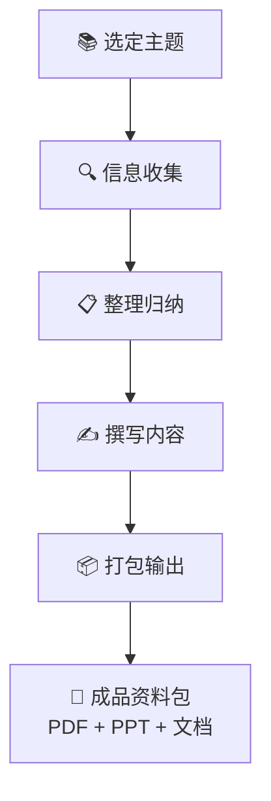
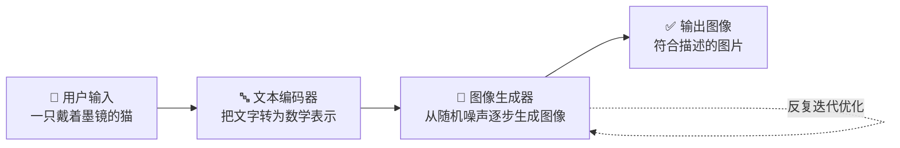

# Ch04：资料包工厂 — 做一个完整学习资料包

## 学习目标

学完本章后，你将能够：

- 用 Codex 高效收集和整理某个主题的信息
- 生成结构化的学习大纲和知识框架
- 将整理好的内容输出为 PDF、PPT、Markdown 等多种格式
- 学会用 AI 做信息甄别——分辨哪些信息靠谱、哪些不靠谱
- 形成一个可以复用的「资料包制作流程」

---

## 📖 故事时间：大赛评审说"要有深度"

> 小明收到了创客大赛组委会的邮件："请提交一份项目说明文档，介绍你的创作思路和技术方案。"
>
> 小明慌了："文档？要多长？怎么写？"
>
> 大明笑道："别怕，这就是一个'资料包'。你把关于 AI 绘画的所有信息收集起来，整理成一份有图有真相的文档。这不正是你的强项吗——你已经有 Codex 帮你搜集和整理信息了！"
>
> 小明恍然大悟："对哦！Codex 帮我找资料，我负责组织思路。开工！"

---

## 🔧 Step-by-Step 实操

## 1. 什么是学习资料包？

### 1.1 资料包的价值

你有没有这样的经历：要准备一个课堂展示、写一篇科普文章、或者组织一次社团分享，结果花了大量时间在网上找资料、整理复制粘贴……

**一个学习资料包**就是把你对一个主题的所有整理成果打包在一起——大纲、知识点、案例、图片、参考链接，全部井井有条。



### 1.2 为什么用 AI 做这件事？

| 传统方式 | AI 辅助方式 |
|----------|------------|
| 手动搜索，逐页翻阅 | 一句话让 AI 收集信息 |
| 靠自己判断信息是否靠谱 | AI 帮你做信息交叉验证 |
| 一个字一个字写大纲 | AI 生成框架，你补充调整 |
| 排版花大量时间 | AI 自动排版输出 |

> 💡 **核心思维转变**：你的角色从"信息搜集者"变成了"信息导演"——你负责判断方向、做最终决策，AI 负责执行搜集和整理。

---

## 2. Step 1：选定主题并收集信息

### Step 1：选定主题 —— 小明选"AI 绘画"

> 🎬 **场景**：小明决定资料包主题就围绕自己的创客大赛项目——"AI 绘画"。这样资料包既是参赛文档，又是学习成果！

什么样的主题适合做资料包？三个标准：

1. **有明确边界**——不是"人工智能"这么宽泛，而是"人工智能在医疗领域的应用"这样具体
2. **有足够的信息量**——能找到丰富的资料来源
3. **你个人感兴趣**——兴趣是最好的驱动力

让我们来实操一个主题：**「AI 是如何学会画画的」**（正好衔接我们课程的主题）。

### Step 2：信息收集 —— 两轮搜集法

> 🎬 **场景**：小明让 Codex 搜索关于 AI 绘画的资料。第一轮广撒网，第二轮深挖掘。

```bash
# 在 Codex 中启动信息收集
请帮我收集关于"AI 是如何学会画画的"的全面信息，要求：

1. 搜索以下子话题：
   - AI 绘画的基本原理（文本到图像生成）
   - 主流 AI 绘画工具（Stable Diffusion、DALL-E、Midjourney）的区别
   - AI 绘画的发展历史（关键节点和里程碑）
   - AI 绘画的争议和应用场景

2. 每个子话题收集 3-5 条关键信息

3. 标注每条信息的来源（网址）

4. 输出格式：Markdown，按子话题分章节
```

### 2.3 第二轮：深度挖掘

第一轮是"广撒网"，第二轮要"精耕"：

```bash
收集做得不错！现在请深入挖掘以下方面：

1. Stable Diffusion 的"去噪扩散"原理——用通俗易懂的方式解释
2. 找 3 个 AI 绘画的实际应用案例（比如广告设计、游戏开发、教育）
3. 收集 3 张有代表性的 AI 绘画作品（附图片链接）
4. 找出 AI 绘画领域最值得关注的 3 位人物或团队

把新收集的信息和之前的整合在一起
```

### 2.4 信息真伪鉴别

AI 收集的信息不一定全都准确。这是你需要锻炼的关键能力：

```bash
请帮我做信息交叉验证：
1. 检查上面收集的信息中，是否有不同来源互相矛盾的地方
2. 标注每一条关键信息的「可信度」：✅高 / ⚠️需确认 / ❌存疑
3. 对于 ⚠️ 和 ❌ 的信息，尝试找其他来源验证或纠正
```

> 🧠 **批判性思维训练**：不要盲目相信 AI 给你的任何信息。学会问"这个信息靠谱吗？来源是什么？有没有其他说法？"——这才是真正的信息素养。

---

### Step 3：整理归纳 —— 信息变知识

### 3.1 生成知识大纲

有了信息后，需要把它们组织成结构化的知识体系：

```bash
基于我们收集的所有信息，请帮我生成一个「AI 绘画」学习资料包的大纲：

结构要求：
1. 分为 3-5 个章节，每个章节 2-3 小节
2. 层级清晰：第1章 → 1.1 → 1.1.1
3. 逻辑递进：从基础概念 → 技术原理 → 工具应用 → 社会影响
4. 每个小节标注：核心知识点 + 预计需要的学习时间
5. 在合适的位置插入「思考题」标注
```

### 3.2 内容归类与去重

```bash
请帮我做以下整理工作：
1. 把收集到的所有信息按照大纲归类（哪条信息属于哪个章节）
2. 检查是否有重复或高度相似的内容，合并或删除
3. 标记出「必须掌握」「了解即可」「扩展阅读」三个级别
4. 找出目前还缺少信息的部分，给出补充收集建议
```

### 3.3 补充关键图解

好的资料包不只是文字，还需要图表帮助理解：

```bash
请帮我在以下位置补充图解说明：
1. AI 绘画工作流程——用 Mermaid 流程图展示从"输入文字"到"生成图片"的完整过程
2. 三大 AI 绘画工具对比表——Midjourney vs DALL-E vs Stable Diffusion
3. AI 绘画发展时间线——标注 2015-2024 年的关键里程碑
```



---

### Step 4：多格式输出 —— 文档、PDF、PPT 三件套

> 🎬 **场景**：小明要把资料包做成三种格式——Markdown 自己留着改，PDF 发给评委，PPT 用来现场展示。

### 4.1 输出为 Markdown 文档

Markdown 是轻量级的排版格式，适合在线阅读和版本管理：

```bash
请把整理好的资料包内容，以 Markdown 格式输出，
保存为 ai-painting-guide.md

格式要求：
- 使用标准的 Markdown 语法（标题、列表、表格、代码块、图片）
- 包含目录（TOC）
- 图片使用在线 URL（确保可访问）
- 在文档末尾添加"参考来源"附录
```

### 4.2 输出为 PDF

```bash
请帮我把 Markdown 文档转换为 PDF 格式：
1. 使用合适的字体（支持中文）
2. 添加页码
3. 在封面页显示标题、作者（你的名字）、日期
4. 自动生成目录页
5. 保存为 ai-painting-guide.pdf
```

### 4.3 输出为 PPT 演示文稿

```bash
请基于资料包内容，帮我生成一个 PPT 演示文稿（Markdown 格式，可导入 PowerPoint/Keynote）：

要求：
- 共 10-15 页
- 每页不超过 5 个要点
- 首页：标题 + 你的名字
- 内容页：要点 + 配图提示
- 在合适位置标注"此处插入图片/动画"
- 最后一页：总结 + 互动问题
```

---

## 5. 资料包制作 Checklist

把以上流程总结成一份可复用的清单：

```markdown
## 📋 资料包制作 Checklist

### 收集阶段
- [ ] 确定主题（有边界、有信息量、有兴趣）
- [ ] 用 Codex 做第一轮广泛收集
- [ ] 用 Codex 做第二轮深度挖掘
- [ ] 做信息真伪鉴别（交叉验证）

### 整理阶段
- [ ] 生成结构化知识大纲
- [ ] 内容归类到对应章节
- [ ] 去除重复内容
- [ ] 标记重要性级别
- [ ] 补充图解和表格

### 输出阶段
- [ ] 输出 Markdown 文档
- [ ] 导出 PDF（含封面和目录）
- [ ] 生成 PPT 演示文稿
- [ ] 压缩打包所有文件
```

---

## 📖 故事收尾

> 小明把生成的 PDF 发给大明检查。
>
> 大明看了 10 分钟，回复："这份资料包结构清晰、图文并茂、来源可查——比很多大学生做的都好！创客大赛的文档分稳了。"
>
> 小明兴奋地握拳——这是他和 Codex 合作的第四个作品了。从网页到视频再到资料包，他的作品集越来越丰富了。
>
> "下一关是什么？" 小明迫不及待地问。
>
> 大明："明天教你让 Codex 帮你自动化处理日常任务。以后重复的事都不用自己做了！"

---

## 👐 动手试试

### 基础挑战 ⭐

1. 选择一个你正在学习的学科知识点（比如数学中的"勾股定理"、物理中的"牛顿三定律"），用 Codex 收集相关信息
2. 让 Codex 帮你生成这个知识点的学习大纲

### 进阶挑战 ⭐⭐

3. 将收集的信息整理成一个结构化文档，包含文字 + 图解 + 表格
4. 用 Codex 把文档导出为 PDF

### 挑战任务 ⭐⭐⭐

5. 完成一个完整的学习资料包（你选择的主题），包含 Markdown 文档 + PDF + PPT，打包分享给同学
6. 对照 Checklist，写出你在过程中遇到的一个困难以及你是怎么解决的

---

## 小结

| 要点 | 说明 |
|------|------|
| 资料包 = 信息整理 | 选定主题 → 收集 → 归纳 → 输出，形成结构化成果 |
| 两轮收集法 | 第一轮广撒网（覆盖面），第二轮精耕（深度和案例） |
| 信息鉴别 | AI 收集的信息不一定全对，交叉验证是必备能力 |
| 多格式输出 | Markdown（编辑版）、PDF（分享版）、PPT（演示版）三件套 |
| 可复用 Checklist | 把流程固化，下次做资料包直接套用，效率翻倍 |

---

## 下一章预告

你已经会做短视频、会做资料包了。但每次都要手动操作还是有点麻烦？下一章我们让 Codex 化身「自动化小助理」——定时任务、批量处理、自动整理，把你的电脑变成一个智能工作站！
