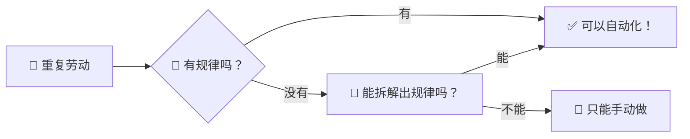
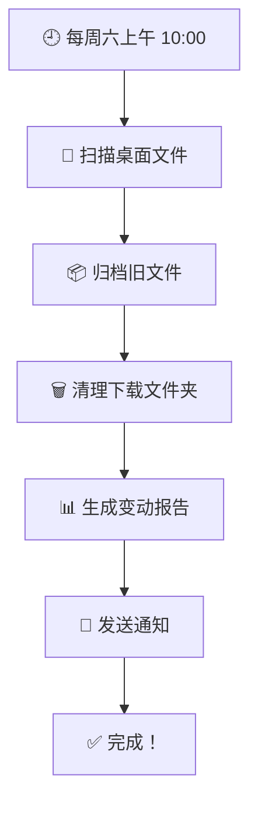

# Ch05：自动化小助理 — 做一个自动化任务流程

## 学习目标

学完本章后，你将能够：

- 理解"自动化"是什么，以及它为什么重要
- 用 Codex 编写脚本完成批量操作（文件处理、数据整理等）
- 设置定时任务，让电脑在指定时间自动执行工作
- 创建一个个性化的「自动化工作流」——一组自动运行的日常任务
- 培养「遇到重复劳动就想自动化」的思维习惯

---

## 📖 故事时间：重复的事情好麻烦

> 小明发现自己每天在做一些重复的事：整理桌面的截图、给文件重命名、统计每天学了多久……
>
> "要是电脑能自动帮我做这些就好了！" 小明抱怨道。
>
> 大明笑了："恭喜你发现了自动化的本质——重复的事情交给机器做。今天 Codex 教你变身'自动化大师'！"
>
> 小明："对啊！Codex 能写脚本，写好之后我让它定时运行就行了！"

---

## 🔧 Step-by-Step 实操

### 1.1 生活中的自动化

自动化已经遍布你生活的每个角落：

| 生活中的自动化 | 背后的原理 |
|----------------|-----------|
| ⏰ 手机闹钟每天 7 点响 | 定时任务 |
| 📧 垃圾邮件自动归类 | 规则匹配 |
| 📱 手机自动备份照片 | 条件触发 |
| 🏠 智能灯天黑自动亮 | 传感器 + 条件判断 |
| 🎮 游戏自动保存进度 | 事件触发 |

### 1.2 编程中的自动化

在电脑上，自动化的核心思想：



> 🎯 **黄金法则**：如果你发现自己在电脑上反复做同一类操作超过 3 次，就值得思考——能不能用 Codex 把它自动化？

---

### Step 1：批量文件操作 —— 小明整理照片

> 🎬 **场景**：小明的手机里有几百张照片，文件名全是 IMG_xxx。他让 Codex 写脚本批量改名并生成网页相册。

### 2.1 批量重命名

这是最常见的自动化需求。假设你从手机导出了 100 张照片，文件名全是 `IMG_3827.jpg` 这样的：

```bash
# 场景：整理周末出游的照片
请编写一个 Node.js 脚本，完成以下任务：

1. 读取 photos/ 文件夹下所有 .jpg 文件
2. 按拍摄时间排序
3. 重命名为：{日期}_{序号}_{原始名称}.jpg
   例如：20260128_01_IMG_3827.jpg
4. 生成一个 index.html 文件，把所有照片做成一个网页相册

请保存为 scripts/rename-photos.js
```

Codex 会生成类似这样的脚本：

```javascript
// scripts/rename-photos.js
const fs = require('fs');
const path = require('path');

const photosDir = path.join(__dirname, '..', 'photos');

async function renamePhotos() {
  // 1. 读取所有 jpg 文件
  const files = fs.readdirSync(photosDir)
    .filter(f => f.toLowerCase().endsWith('.jpg'));

  // 2. 按文件修改时间排序
  const filesWithTime = files.map(f => ({
    name: f,
    mtime: fs.statSync(path.join(photosDir, f)).mtime
  }));
  filesWithTime.sort((a, b) => a.mtime - b.mtime);

  console.log(`📸 找到 ${files.length} 张照片，准备重命名...\n`);

  // 3. 批量重命名
  const newNames = [];
  filesWithTime.forEach((file, index) => {
    const date = file.mtime.toISOString().slice(0, 10).replace(/-/g, '');
    const number = String(index + 1).padStart(2, '0');
    const newName = `${date}_${number}_${file.name}`;

    const oldPath = path.join(photosDir, file.name);
    const newPath = path.join(photosDir, newName);
    fs.renameSync(oldPath, newPath);

    newNames.push({ old: file.name, new: newName });
    console.log(`  ✅ ${file.name} → ${newName}`);
  });

  // 4. 生成照片相册网页
  generateGallery(newNames.map(n => n.new));
}

function generateGallery(photos) {
  const html = `<!DOCTYPE html>
<html lang="zh-CN">
<head>
  <meta charset="UTF-8">
  <title>我的照片相册</title>
  <style>
    body { font-family: sans-serif; background: #111; color: #fff; }
    .gallery { display: grid; grid-template-columns: repeat(auto-fill, minmax(300px, 1fr)); gap: 10px; padding: 20px; }
    .gallery img { width: 100%; border-radius: 8px; transition: transform 0.3s; }
    .gallery img:hover { transform: scale(1.05); }
  </style>
</head>
<body>
  <h1 style="text-align:center; padding:20px;">📸 我的照片相册</h1>
  <div class="gallery">
    ${photos.map(p => `    `).join('\n')}
  </div>
</body>
</html>`;

  fs.writeFileSync(path.join(__dirname, '..', 'gallery.html'), html);
  console.log('\n📄 相册网页已生成：gallery.html');
}

renamePhotos();
```

### 2.2 运行脚本

```bash
# 在终端中运行
node scripts/rename-photos.js
```

### 2.3 批量转换文件格式

```bash
# 把一个文件夹里的所有 PNG 转为 JPG
请编写一个脚本，批量将 images/ 中所有 PNG 文件转换为 JPG，
并压缩到原来的 80% 质量，保存到 images/compressed/
```

---

### Step 2：数据整理 —— 学习记录变报告

> 🎬 **场景**：小明想追踪自己的学习效率。Codex 帮他建了一个 CSV 记录表，然后自动生成周报。

### 3.1 整理 CSV 数据

假设你有一个表格记录了每周的学习时间：

```bash
# 让 Codex 帮你创建一个示例数据文件，然后分析它
首先，请帮我创建一个 CSV 文件 study-log.csv，包含以下列：
日期,科目,学习时长(分钟),掌握程度(1-5)

填入 20 条示例数据（覆盖 4 周，每天 1-3 个科目）
```

然后分析这些数据：

```bash
请编写一个脚本，读取 study-log.csv 并输出分析报告：
1. 每周总学习时长
2. 每个科目的总时长和平均掌握程度
3. 学习时间最多的那天是周几
4. 生成一个简单的柱状图（用 ASCII 字符画）
5. 输出为 study-report.md
```

### 3.2 自动生成学习日报

```bash
请帮我创建一个脚本，每天自动生成学习日报：

功能：
1. 读取当天的 study-log.csv 记录
2. 按模板填充日报内容
3. 保存为 日报_YYYY-MM-DD.md
4. 如果今天没有记录，生成一个"今日未记录"的提醒

日报模板：
# 📅 学习日报 — {日期}

## 今日学习总结
{按科目列出学习内容和时长}

## 今日收获
{用一段话总结}

## 明日计划
{预留空白让我填写}
```

---

### Step 3：定时任务 —— 让电脑按时干活

> 🎬 **场景**：小明让 Codex 创建一个"周末大扫除"定时任务——每周六自动整理桌面、清理下载文件夹、生成变动报告。

### 4.1 什么是定时任务？

定时任务就是让电脑在指定时间自动执行脚本。就像闹钟一样——"每周五下午 5 点，自动整理本周的文件"。

### 4.2 用 Codex 创建定时任务

```bash
请帮我设置一个定时任务：

【任务名称】周末大扫除
【执行时间】每周六上午 10:00
【任务内容】
1. 把桌面上超过 7 天未修改的文件移动到 归档/ 文件夹
2. 把下载文件夹中的 .zip 和 .dmg 文件删除（安装包已用过）
3. 生成一份"本周文件变动报告"保存在桌面
4. 完成后弹出一条通知："周末大扫除完成！✅"

请分别给出：
- Windows 版本（使用 Task Scheduler + PowerShell 脚本）
- Mac 版本（使用 launchd + Shell 脚本）
```

### 4.3 常用的定时任务场景

| 场景 | 频率 | 做什么 |
|------|------|--------|
| 🧹 桌面整理 | 每周 | 归类散落的文件 |
| 💾 自动备份 | 每天 | 把重要文件备份到指定位置 |
| 📊 数据统计 | 每周 | 汇总本周的学习/运动数据 |
| 🔔 习惯提醒 | 每天 | 提醒喝水、锻炼、阅读 |
| 📧 周报生成 | 每周五 | 汇总一周成果发给自己 |

```bash
# 尝试创建你自己的定时任务
请帮我创建一个「每日提醒」定时任务：
- 每天早上 8:30 弹出一条鼓励语（从预设的 20 条中随机选一条）
- 每两个小时提醒我休息眼睛（9:00, 11:00, 14:00, 16:00）
```

---

### Step 4：构建工作流 —— 多个任务串成流水线

> 🎬 **场景**：小明把整理桌面 → 备份文件 → 生成报告 → 发送通知串成一个完整工作流。

### 5.1 什么是工作流？

工作流就是把多个自动化任务串联起来，像一个流水线一样自动运行。



### 5.2 创建你的专属工作流

现在轮到你了！思考一下你日常生活中哪些事情可以自动化：

```bash
请帮我设计并实现一个「我的自动化工作流」：

我能想到的日常任务有：
1. 每天整理学习的笔记和截图
2. 每周汇总学习时长
3. 每天检查有没有待办事项过期

请帮我：
1. 把这些需求拆解成可执行的自动化任务
2. 编写对应的脚本
3. 设置合适的定时触发时间
4. 输出一个「工作流配置文档」，方便以后调整
```

### 5.3 自动化的核心原则

在构建自动化时，记住以下原则：

| 原则 | 说明 |
|------|------|
| 🔍 **先手动验证** | 先在单个文件上测试，确保脚本正确，再批量运行 |
| 📝 **加日志** | 脚本运行过程中输出日志，出了问题能知道哪里错了 |
| 🧪 **留后路** | 批量操作前先备份，自动化 ≠ 不可逆 |
| 📈 **逐步扩展** | 从最简单的任务开始，慢慢叠加复杂度 |
| 🔄 **定期检查** | 自动化脚本不是一劳永逸的，环境变了要维护 |

---

## 📖 故事收尾

> 周六早上，小明打开电脑，发现桌面上已经多了一份"本周文件变动报告"——自动化工作流准时运行了！
>
> 他兴奋地截图发给大明："表哥！我睡觉的时候电脑自己把活干了！"
>
> 大明："这就是自动化的魅力。你今天可以多睡 10 分钟了。下一关：教你做一个有观点的口播视频——创客大赛还需要你亲自出镜介绍一下自己的项目呢。"

---

## 👐 动手试试

### 基础挑战 ⭐

1. 找一个你电脑里文件比较乱的文件夹，让 Codex 写脚本整理它
2. 创建一个简单脚本，统计你某个文件夹里各类型文件的数量

### 进阶挑战 ⭐⭐

3. 设置一个定时任务（Windows 用 Task Scheduler，Mac 用 launchd），每天早上打开电脑时自动运行一个欢迎脚本
4. 创建一个「学习数据追踪」脚本，记录你每天的学习科目和时间，周末生成周报

### 挑战任务 ⭐⭐⭐

5. 设计和实现一个包含至少 3 个步骤的个人自动化工作流（比如：整理桌面 → 备份文件 → 生成报告 → 发送通知）
6. 把工作流程画成流程图，和脚本一起保存。下次给朋友展示你用 Codex 打造的自动化系统！

---

## 小结

| 要点 | 说明 |
|------|------|
| 自动化思维 | 重复劳动超过 3 次，就值得思考如何自动化 |
| 批量操作 | Codex 帮你写脚本，一次性处理成百上千个文件 |
| 数据整理 | CSV 读取 → 分析 → 生成报告，全流程自动完成 |
| 定时任务 | Windows Task Scheduler / Mac launchd，让脚本准时执行 |
| 工作流 | 多个自动化任务串联成流水线，一键触发 |
| 安全原则 | 先测试、加日志、做备份，自动化 ≠ 不管不顾 |

---

## 下一章预告

你已经掌握了 AI 工具、内容创作、自动化。下一章是进阶挑战——用 Codex 制作一条有观点的口播视频！从选题立意到逐字稿，再到录制辅助，让你的声音被更多人听到。
