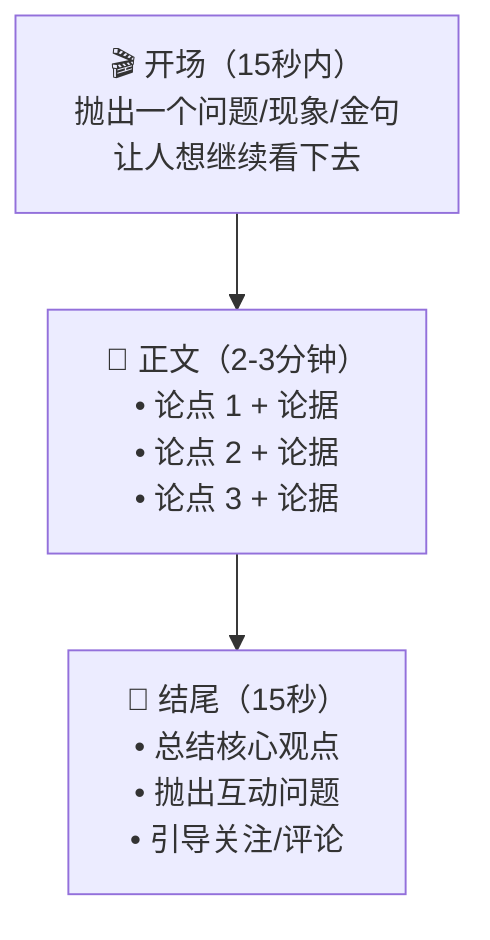

# Ch06：进阶口播工厂 — 做一条有观点的口播视频

## 学习目标

学完本章后，你将能够：

- 理解口播视频和一般短视频的区别——口播的核心是"观点"
- 用 Codex 帮助你提炼和打磨自己的观点
- 撰写结构清晰、有说服力的口播逐字稿
- 用 AI 生成提词器脚本，辅助流畅录制
- 掌握录制、剪辑、发布的完整流程
- 培养「独立思考 + 清晰表达」的复合能力

---

## 📖 故事时间：小明要为自己代言

> 创客大赛的现场展示环节，每个选手有 3 分钟时间上台介绍自己的项目。
>
> "我可以放 PPT，也可以放视频……但最打动评委的，还是我自己站出来说话。"小明喃喃自语。
>
> 大明点头："说得对。一条口播视频和一篇演讲稿不一样——你要对着镜头表达自己的观点，让观众感受到你的热情。"
>
> 小明有点紧张："可是我不敢对着镜头说话……"
>
> "没关系！Codex 帮你准备稿子、生成提词器，你只需要自然地念出来。多录几次就好了。"
>
> 小明深吸一口气："好！我选的话题是——AI 工具让学习变懒了吗？"

---

## 🔧 Step-by-Step 实操

## 1. 口播视频是什么？

### 1.1 口播 ≠ 对着镜头念稿

你可能在 B站、抖音上看到过这样的视频：一个人对着镜头，条理清晰地表达自己对某个话题的看法。这就是**口播视频**。

口播视频的核心不在于画面有多炫，而在于：

| 元素 | 重要性 | 说明 |
|------|--------|------|
| 🎯 **观点** | ⭐⭐⭐⭐⭐ | 你对这个话题的独特看法是什么？ |
| 📐 **结构** | ⭐⭐⭐⭐ | 怎么组织语言，让观众一步步跟上？ |
| 💬 **表达** | ⭐⭐⭐⭐ | 语气、节奏、停顿是否吸引人？ |
| 🎨 **画面** | ⭐⭐⭐ | 是否有辅助画面、字幕、特效？ |

> 🎯 **口播的终极问题**：你看完一个口播视频后，能不能用一句话说出它想传达的核心观点？如果可以，这个视频就成功了。

### 1.2 口播视频的结构

经典的三段式结构：



---

### Step 1：选题与立论 —— 小明选了什么话题？

> 🎬 **场景**：小明选了一个同龄人都会关心的话题："AI 工具让学习变懒了吗？"。Codex 帮他展开正反论据。

### 2.1 什么是好选题？

口播视频的好选题有三个特征：

1. **有争议空间**——不是非黑即白的问题，可以从不同角度讨论
2. **与你相关**——你作为中学生，对这个话题有真实的感受和体验
3. **观众在乎**——同龄人也关心这个议题

一些适合中学生的口播选题：

| 选题 | 可讨论的角度 |
|------|------------|
| AI 工具让学习变懒了吗？ | 正：帮助理解 / 反：过度依赖 |
| 短视频是娱乐还是学习工具？ | 正：很多知识内容 / 反：容易沉迷 |
| 中学生应该学编程吗？ | 正：未来必备技能 / 反：不是每个人都适合 |
| 线上学习好还是线下学习好？ | 正：灵活自由 / 反：缺少互动 |
| 玩游戏到底好不好？ | 正：锻炼思维、社交 / 反：占用时间 |
| AI 未来会让很多人失业吗？ | 正：确实会替代 / 反：也会创造新工作 |

### 2.2 用 Codex 帮你打磨观点

```bash
# 在 Codex 对话框中
我选了选题「AI 工具让学习变懒了吗？」，请帮我做观点打磨：

1. 分析这个话题的两个对立面，各列出 5 个论据
2. 给我 3 个不同的切入角度：
   - 角度 A：支持"AI 让学习更高效"
   - 角度 B：担心"AI 让人变懒、思考变少"
   - 角度 C：辩证地看"关键看怎么用"
3. 帮我想一个有冲击力的开头金句（15 字以内）
4. 推荐 3 个可以引用的真实案例或数据
```

### 2.3 确定你的观点

别人的观点只是参考。**你要有自己的态度**：

```bash
基于以上的分析，我的核心观点是：
"AI 不是让我们变懒，而是让我们可以把精力集中在更有价值的事情上——前提是我们不放弃独立思考。"

请帮我把这个核心观点展开成一个 3 分钟的逐字稿大纲。
```

---

### Step 2：撰写逐字稿 —— 把观点变成口语

> 🎬 **场景**：小明确定了自己的核心观点后，让 Codex 生成一份适合朗读的逐字稿——带语气标记和停顿提示。

### 3.1 逐字稿和一般文章的区别

逐字稿是你**一个一个字读出来**的稿子。它和写文章有本质区别：

| 维度 | 书面文章 | 口播逐字稿 |
|------|----------|-----------|
| 句子长度 | 可以很长 | 尽量短（15-20 字） |
| 用词 | 书面语、成语 | 口语化、"就是说""你想啊" |
| 节奏 | 标点控制 | 加入停顿标记 |
| 互动感 | 不需要 | "你觉得呢？""对吗？" |

### 3.2 让 Codex 生成逐字稿

```bash
请根据我的核心观点，写一份口播视频逐字稿，要求：

1. 总时长：3 分钟左右
2. 结构：开场 → 论点 1 → 论点 2 → 论点 3 → 结尾
3. 语言风格：
   - 口语化，像在和朋友聊天
   - 适合 12-16 岁观众收听
   - 适当使用"咱们""你知道吗""对吧"
4. 加入停顿标记：
   - // 表示短暂停顿（约 1 秒）
   - /// 表示需要强调后的停顿
5. 标注需要配合的画面提示（用括号括起来）
6. 在关键句子后标注语气提示：【强调】【轻松】【好奇】【反问】
```

Codex 会输出类似这样的逐字稿：

```
（画面：AI 工具界面的快速切换）
大家有没有发现—— // 最近用 AI 写作业的同学越来越多了？
（画面：学生用电脑的日常场景）
【好奇】有的同学说，AI 太方便了，输入一句话，作业就出来了。
也有的老师担心，这样下去，学生都不会自己思考了。 ///

今天咱们就来聊聊这个话题：AI 工具到底让学习变懒了吗？

（画面：计算器 vs 纸笔计算）
【轻松】首先我想说一个比喻—— 
还记得计算器刚出现的时候吗？
那时候也有人担心："学生都不会心算了怎么办？" //
但事实证明，计算器没有毁掉数学教育。
它只是让我们把算数的时间，// 省下来学更难的数学。 ///

（画面：AI 辅助写作的演示）
【反问】AI 工具也是一样的道理，对吧？
它帮你写了初稿，不等于你不用思考。//
恰恰相反，你要学会提出好问题、//
学会判断 AI 给的答案对不对、//
学会在 AI 的基础上做出更好的版本。 ///

（画面：学生修改 AI 生成的内容）
【强调】这本身就是一种更高级的思考能力！ ///

所以我的结论是—— //
AI 不会让你变懒。//
真正让你变懒的，// 是你自己放弃了思考的权利。 ///

最后留一个问题给大家：
（画面：评论区互动引导）
你觉得，在 AI 时代，// 什么能力是最重要的？
把你的想法打在评论区，我很想看看大家的答案！ //

（画面：关注引导 + 下期预告）
如果这期视频让你有点启发，别忘了点赞收藏。
下期我们聊聊「AI 会不会让很多人失业」，记得关注我～
```

### 3.3 朗读测试

在正式录制前，对着稿子朗读一遍：

```bash
请帮我做朗读测试分析：
1. 统计总字数，估算朗读时长（按每分钟 220 字计算）
2. 标注出可能读不顺的长句（超过 25 字的句子）
3. 检查有没有"拗口"的词组（同音字连在一起等）
4. 给修改建议
```

---

### Step 3：录制准备 —— 提词器 + 环境布置

> 🎬 **场景**：小明用 Codex 生成了提词器脚本，然后用手机架好机位，开始录制。录了 5 遍，终于有一条满意的了！

### 4.1 生成提词器脚本

提词器能让你在录制时不用背稿子，自然地读出内容：

```bash
请把上面的逐字稿改为提词器格式：
1. 每行不超过 15 个字
2. 去掉所有标注和括号内容
3. 用 // 标记停顿位置
4. 保存为 teleprompter.txt
```

### 4.2 录制环境准备

好的口播视频需要基本的录制条件：

| 注意事项 | 具体要求 |
|----------|----------|
| 📷 镜头位置 | 与眼睛平齐，不要太低（显双下巴） |
| 💡 光线 | 面向窗户或台灯的光源，脸要亮 |
| 🎙️ 声音 | 安静环境，离麦克风 20-30cm |
| 👕 着装 | 纯色或简单图案，避免条纹（会产生摩尔纹） |
| 👀 眼神 | 看镜头，不是看屏幕上的自己 |
| 📱 手机支架 | 手机横着拍（16:9），用支架固定 |

### 4.3 用 Codex 生成录制辅助清单

```bash
请帮我生成一份口播视频录制 Checklist，包含：
1. 录制前准备（设备、环境、稿子）
2. 录制中的注意事项
3. 录制后的文件管理
```

---

### Step 4：后期制作 —— 加字幕、配乐、辅助画面

> 🎬 **场景**：小明把录好的视频交给 Codex 做后期处理——自动生成字幕、配背景音乐、在关键处加画面。

### 5.1 字幕生成

口播视频必须有字幕！Codex 可以用 AI 帮你自动生成：

```bash
请帮我的口播视频音频生成字幕：
1. 使用语音识别转文字
2. 输出 SRT 字幕格式
3. 精确到 0.1 秒的时间轴
4. 保存为 subtitles.srt
```

### 5.2 视频编辑

```bash
请帮我生成视频编辑指引：

素材：
- 口播主画面（手机录制）
- 辅助画面素材（按逐字稿中的画面提示）
- 字幕文件 subtitles.srt
- 背景音乐（轻快、不喧闹）

要求：
1. 辅助画面在对应时间点切入（覆盖主画面或画中画）
2. 字幕和语音同步
3. 片头 2 秒淡入，片尾 2 秒淡出
4. 关键论点处加文字强化（弹幕效果或高亮）
5. 输出最终的 FFmpeg 合成命令
```

---

## 📖 故事收尾

> 大明看完小明的口播视频，沉默了几秒。
>
> 小明紧张地问："怎么样？"
>
> 大明竖起大拇指："说真的，我不敢相信这是一个小学生做的。你的观点很清晰，语气也很自然。尤其是那句'AI 不会让你变懒，真正让你变懒的是你放弃了思考的权利'——这就是创客大赛评委会想听的态度！"
>
> 小明笑了。从第一节课的不敢开口，到今天站在镜头前自信地表达观点——不到一个月，他像是变了一个人。
>
> "最后一关了！"大明说，"明天把你所有的作品整合成一个作品集网页，准备提交创客大赛。"

---

## 👐 动手试试

### 基础挑战 ⭐

1. 从本章提供的 6 个选题中选一个，用 Codex 列出正方和反方各 3 个论据
2. 为你的选题写 100 字的开场白（要有吸引力！）

### 进阶挑战 ⭐⭐

3. 完成一份完整的 3 分钟逐字稿（含画面提示和语气标记）
4. 对着稿子朗读 3 遍，记录每次的耗时，看看是否在 3 分钟以内

### 挑战任务 ⭐⭐⭐

5. 用手机录制一条完整的口播视频，让 Codex 帮你做后期（加字幕、加背景音乐、加辅助画面）
6. 把视频发到班级群或朋友圈，收集至少 5 个人的反馈，总结可以做哪些改进

---

## 小结

| 要点 | 说明 |
|------|------|
| 口播核心 = 观点 | 好口播不是念得好，而是有独特的想法要分享 |
| 结构为王 | 开场抓人 → 论点展开 → 结尾互动，三段式结构最稳妥 |
| 逐字稿 ≠ 文章 | 口语化、短句子、停顿标记——写出来就想着要读出来 |
| AI 辅助立意 | Codex 帮你拓展思路、打磨观点，但最终态度是你自己的 |
| 录制有技巧 | 光线、眼神、语速、停顿——细节决定观感 |
| 后期完善 | 字幕、配乐、辅助画面——AI 帮你省下大量剪辑时间 |

---

## 下一章预告

7 节课的旅程即将到达终点站。你做了网页、短视频、资料包、自动化脚本、口播视频——现在是时候把这些成果整合起来，发布你的个人作品集了！下一章，我们将完成这门课的终极作品。
