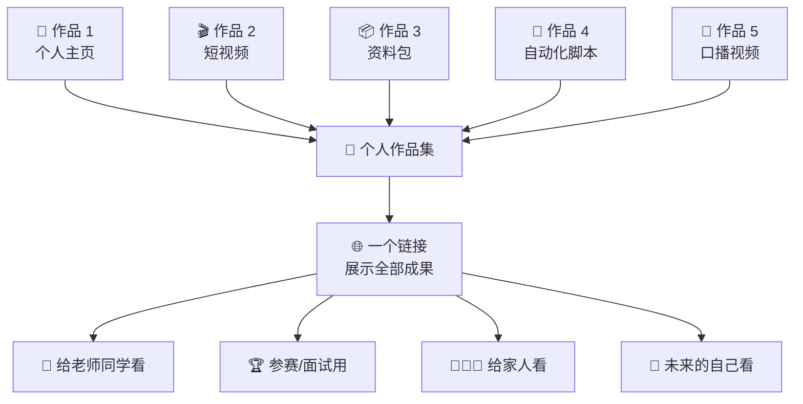
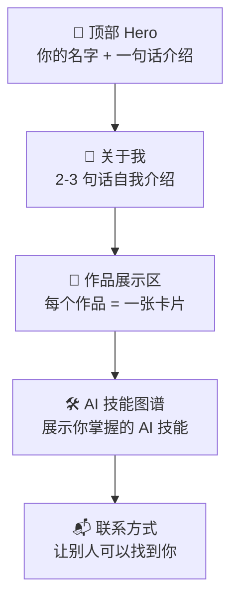
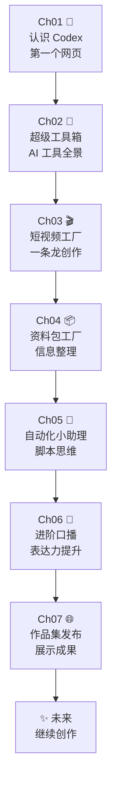

# Ch07：作品集发布 — 整理个人作品集主页

## 学习目标

学完本章后，你将能够：

- 把课程中完成的所有作品整合到一个统一的展示平台
- 用 Codex 设计和制作一个完整的个人作品集网页
- 为每个作品撰写展示文案（项目介绍、技术亮点、心得感悟）
- 将作品集部署上线，获得一个永久的在线展示链接
- 回顾全部课程的成长历程，形成「持续创作 × 持续展示」的习惯

---

## 📖 故事时间：最后一块拼图

> 离创客大赛提交截止还有 3 天。
>
> 小明的桌面上已经躺着一堆作品：一个个人网页、一条科普短视频、一份 AI 绘画资料包、一组自动化脚本、一条口播视频。
>
> "每个作品单独看都挺好的……但评委一个个找太麻烦了。"小明说。
>
> 大明打开 Codex："今天的任务就是把它们全部装进一个作品集网页。一个链接，展示你的全部成果——就像你参加比赛的'名片'。"
>
> 小明搓搓手："最后一关，拼了！"

---

## 🔧 Step-by-Step 实操

## 1. 为什么要做作品集？

### 1.1 作品集的意义



作品集的价值在于：**让你的努力可以被看见**。

- 你花了 7 节课做出来的东西，如果散落在各个文件夹里，只有你自己知道
- 把它们聚合成一个网页，一个链接就能展示你的全部成长
- 参加比赛、申请学校、甚至未来求职，作品集都是最有说服力的证明

---

### Step 1：盘点作品 —— 小明有哪些成果？

> 🎬 **场景**：小明打开他的 my-codex-workspace 文件夹，里面整整齐齐躺着 6 个作品。Codex 帮他统计和分类。

### 2.1 整理作品清单

回顾这门课的每一个作品，把它们整理成清单：

```bash
# 在 Codex 中
请帮我整理一份课程作品清单。我有以下作品：

1. 个人作品主页（Ch01）- index.html
2. AI 工具清单与素材库（Ch02）- tools-list.md
3. 科普短视频（Ch03）- final_video.mp4
4. AI 绘画学习资料包（Ch04）- ai-painting-guide.pdf
5. 自动化脚本集（Ch05）- scripts/ 文件夹
6. 口播视频（Ch06）- talk_video.mp4

请帮我：
1. 为每个作品写一个 50 字的项目简介
2. 标注每个作品的类型（网页/视频/文档/脚本）
3. 估计每个作品展示的最佳方式（嵌入/链接/截图/下载）
```

### 2.2 补全缺失的素材

在整合之前，检查是否有缺失：

```bash
# 检查清单
请帮我检查以下内容是否齐备：
- [ ] 每个作品是否有截图/缩略图？（用于作品集展示）
- [ ] 视频是否已上传到在线平台（B站/YouTube/网盘）？
- [ ] PDF 是否有在线预览链接？
- [ ] 脚本是否有 GitHub 链接？
- [ ] 是否有 README 文件说明项目？
```

对于缺失的项，让 Codex 帮你补全：

```bash
# 生成作品截图
请帮我的短视频截取 3 张代表性画面作为缩略图，保存为 thumbnails/

# 生成 README
请为每个作品生成一个简短的 README.md，说明：
- 作品是什么
- 用了什么 AI 工具
- 学到了什么
- 如果再做一个，你会怎么改进
```

---

### Step 2：设计作品集网页 —— 一个链接展示全部

> 🎬 **场景**：小明让 Codex 生成一个作品集网页——现代简约风格，紫色渐变，每个作品一张卡片。

### 3.1 作品集的结构

一个好的作品集网页应该有以下板块：



### 3.2 生成作品集网页

```bash
请帮我生成一个完整的个人作品集网页，要求：

1. 页面结构：
   - Hero 区域：你的名字、一句话介绍、背景动画
   - 关于我：你的简介和这张照片
   - 作品展示：6 个作品卡片（网格布局）
   - 技能图谱：列出你掌握的 AI 技能
   - 页脚：联系方式 + "用 Codex 创作"的标识

2. 每个作品卡片包含：
   - 作品缩略图/截图
   - 作品名称
   - 一句话简介
   - 使用的 AI 工具标签
   - 查看按钮（链接到实际作品或下载）

3. 设计风格：
   - 现代简约风格
   - 主色调：紫色渐变（#667eea → #764ba2）
   - 卡片有悬浮效果（hover 上浮 + 阴影）
   - 响应式设计（手机和电脑都能看）
   - 滚动时有渐显动画

4. 技术要求：
   - 纯 HTML + CSS + JavaScript（不依赖框架）
   - 所有样式内嵌在 HTML 中
   - 支持深色模式（可选切换）

请输出完整的 portfolio.html 代码。
```

Codex 会生成类似这样的结构（核心部分）：

```html
<!-- 作品卡片示例结构 -->
<div class="work-card">
  <div class="work-thumbnail">
    
  </div>
  <div class="work-info">
    <h3>🌌 天空为什么是蓝色的</h3>
    <p>一条 3 分钟的科普短视频，从脚本到配音到剪辑全程 AI 辅助</p>
    <div class="work-tags">
      <span class="tag">🎬 视频</span>
      <span class="tag">🤖 Codex</span>
      <span class="tag">🎤 AI 配音</span>
      <span class="tag">✂️ FFmpeg</span>
    </div>
    <a href="#" class="btn-view">查看作品 →</a>
  </div>
</div>
```

---

### Step 3：撰写展示文案 —— 每个作品的故事

> 🎬 **场景**：光有链接不够，小明还要给每个作品配上一段简介——让评委一眼看懂他做了什么。

### 4.1 每个作品的展示文案

好的展示文案能让观众快速理解你的作品价值：

```bash
请帮我为每个作品撰写展示文案：

对于视频类作品，包含：
- 视频主题（一句话）
- 制作过程中最有意思的部分
- 一个有趣的数据（比如：AI 生成了 10 版脚本、用了 3 种配音声音）

对于文档类作品，包含：
- 资料包主题
- 信息量（多少页面、多少章节）
- 一个你学到的最重要的知识点

对于网页类作品，包含：
- 页面功能
- 设计亮点
- 用的技术
```

### 4.2 个人介绍文案

```bash
请帮我写一个 100 字的个人介绍，用于作品集网站：

关于我的信息：
- 我叫【你的名字】
- 是一名【年级】学生
- 经过 7 节 Codex 专题训练营的学习
- 学会了用 AI 做网页、短视频、资料包、自动化脚本
- 未来想继续探索 AI + 创意的无限可能

风格要求：真诚、有活力、适合中学生
```

---

### Step 4：部署与发布 —— 让全世界看到！

> 🎬 **场景**：小明用 GitHub Pages 把作品集部署上线。拿到链接的那一刻，他的手有点抖。

### 5.1 整理所有文件

```bash
# 在 Codex 中
请帮我整理作品集的所有文件：

1. 创建一个 portfolio/ 文件夹
2. 把 portfolio.html 放进去
3. 把所有作品的文件/截图复制到对应子文件夹
4. 生成一个 README.md，说明这个作品集的内容
5. 确保所有链接和图片路径正确

最后帮我压缩整个文件夹为 portfolio.zip
```

### 5.2 部署到 GitHub Pages

```bash
请帮我把 portfolio/ 文件夹部署到 GitHub Pages：

步骤：
1. 在 GitHub 上创建仓库（名字用 my-codex-portfolio）
2. 把 portfolio/ 的内容推送到仓库
3. 在仓库设置中启用 GitHub Pages（使用 main 分支）
4. 等 2-3 分钟后，告诉我在线地址

最终，我的作品集上线地址是：
https://【你的用户名】.github.io/my-codex-portfolio/
```

### 5.3 测试与检查

```bash
# 上线后检查清单
请帮我逐项检查：
- [ ] 电脑上打开链接，所有页面正常显示
- [ ] 手机上打开链接，布局适应小屏幕
- [ ] 所有图片都能正常加载
- [ ] 所有链接都能正常跳转
- [ ] 视频链接可以正常播放
- [ ] PDF 链接可以正常下载/预览
- [ ] 加载速度是否合理（图片太大就压缩）
```

---

## 📖 故事收尾：创客大赛当天

> 三天后，学校礼堂。
>
> 小明站在台上，背后的大屏幕显示着他的作品集网页。
>
> "各位评委老师好，我叫小明。这是我的 AI 作品集——一个链接，包含了我用 Codex 完成的 6 个作品：个人网页、科普短视频、AI 绘画资料包、自动化脚本、口播视频……"
>
> 台下的评委们交头接耳，有人拿出手机扫描屏幕上的二维码。
>
> "……我想说的是，AI 不是一个让人变懒的工具。它是让我们可以把重复的事情交给它，把精力留给我们真正想创造的东西。谢谢大家！"
>
> 鞠躬。掌声。
>
> 虽然最后小明没有拿到第一名（拿了个"最佳创意奖"），但他说这是他最开心的一个学期。
>
> 因为他不仅学会了用 AI 工具，更学会了如何把自己的想法变成现实。
>
> 从那天起，小明的 my-codex-workspace 文件夹再也没有停止更新。他又做了好多新作品——一个帮助同学背单词的小工具、一个记录家里猫咪日常的照片墙、一个分享自己读书笔记的博客……
>
> 而 Codex，这个住在终端里的 AI 伙伴，一直陪着他。

> 🎓 **致每一位少年**：AI 时代最重要的能力不是会写代码，而是清楚地知道你想要创造什么。你已经拥有了这个能力。继续创造，继续奔向明天！

---

## 6. 课程回顾与展望

### 6.1 7 节课的成长地图



### 6.2 你获得了哪些能力？

| 能力维度 | 具体表现 |
|----------|----------|
| 🤖 AI 协作能力 | 能用结构化提示词与 AI 高效对话 |
| 💻 基础编程 | 理解 HTML/CSS、命令行操作、脚本编写 |
| 🎨 内容创作 | 能做短视频、口播视频、文字内容 |
| 📊 信息素养 | 能搜索、整理、鉴别信息，制作资料包 |
| 🔧 自动化思维 | 能识别重复劳动并编写脚本替代 |
| 🗣️ 表达力 | 能用口播视频清晰表达自己的观点 |
| 📂 作品展示 | 能将全部成果整合为在线作品集 |

### 6.3 未来的学习路径

这门课只是一个起点。你可以继续探索的方向：

```bash
# 让 Codex 帮你规划下一步
请根据我在这门课中学到的能力，给我推荐 4 个后续学习方向：
1. 选择一个你特别感兴趣的深入方向
2. 为每个方向推荐 2-3 个学习资源或实践项目
3. 评估每个方向需要的投入时间（每周几小时 × 几个月）
```

---

## 👐 动手试试

### 基础挑战 ⭐

1. 整理你在这门课中的所有作品，列出清单（名称 + 类型 + 链接）
2. 为你的作品集网站写一个 100 字的个人介绍

### 进阶挑战 ⭐⭐

3. 设计并生成完整的作品集网页（包含所有作品）
4. 将作品集部署到 GitHub Pages，获得永久在线地址

### 挑战任务 ⭐⭐⭐

5. 把作品集链接分享到朋友圈或班级群，收集反馈。根据反馈改进网页至少 2 处
6. 写一篇 300 字的学习总结：你在这门课中最大的收获是什么？哪个作品你最满意？为什么？

---

## 小结

| 要点 | 说明 |
|------|------|
| 作品集 = 努力被看见 | 一个链接展示全部成果，参赛、分享、面试都能用 |
| 结构清晰 | Hero → 关于我 → 作品展示 → 技能 → 联系方式 |
| 文案用心 | 每个作品配简介、技术标签、心得感悟 |
| 部署上线 | GitHub Pages 免费、稳定，永久在线 |
| 持续更新 | 作品集不是一次性工程，后续新作品要持续添加 |
| 回顾成长 | 7 节课 = 7 个作品 + 6 项核心能力 + 1 个作品集 |

---

## 🎓 结语

恭喜你完成了「奔向明天 — 少年 Codex 专题训练营」的全部 7 节课！

你可能没有意识到，你已经完成了一件非常了不起的事情：

- 你从一个对 AI 只有模糊概念的中学生，变成了一个能用 AI 创造真实作品的小创客
- 你不仅学会了用工具，更学会了**如何思考、如何表达、如何把想法变成现实**
- 你拥有了一个可以在互联网上展示的个人作品集——这在你这个年龄段是非常少见的成就

**记住这句话**：

> AI 时代最重要的能力不是会写代码，而是清楚地知道你想要创造什么。

你已经拥有了这个能力。继续创造，继续奔向明天！🚀

---

*本课程由 Codex AI 辅助教学，所有作品均由学生独立完成。*
