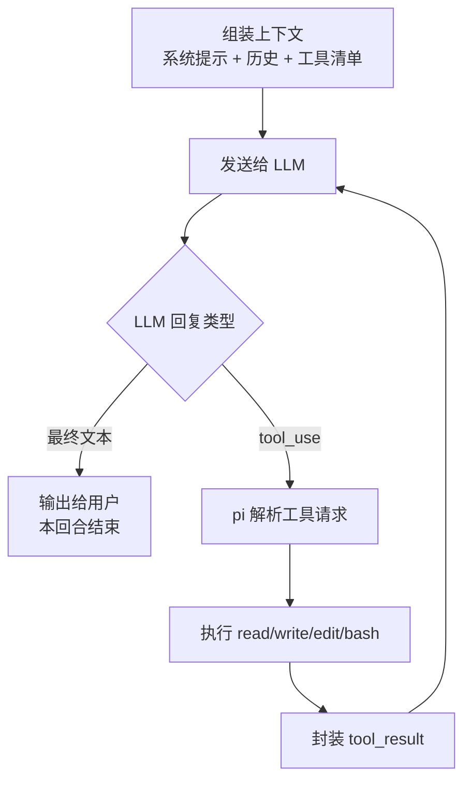

# Ch02：智能体工作原理 — Agent Loop

> 进入 pi 的内核：一个"LLM 回复 → 调用工具 → 结果回传 → 再回复"的循环。这一章逐帧拆开 Agent Loop，理解为什么区区四个工具就能构成一个编码智能体。


---

## 学习目标

学完本章后，你将能够：

1. 画出编码智能体的核心循环：Agent Loop
2. 解释 LLM 如何决定调用工具、工具结果如何回流
3. 说清 pi 四个内置工具的职责边界
4. 理解系统提示（system prompt）在循环中的作用
5. 理解"为什么内核可以这么小"

---

## 1. Agent Loop：智能体的心脏

### 1.1 一次完整循环

```
┌──────────────────────────────────────────────────────────┐
│                    Agent Loop（一次回合）                  │
│                                                          │
│  ① 组装上下文                                              │
│     (系统提示 + AGENTS.md + 历史消息 + 工具清单)             │
│        │                                                  │
│        ▼                                                  │
│  ② 发送给 LLM                                              │
│        │                                                  │
│        ▼                                                  │
│  ③ LLM 回复：两种可能                                        │
│     A. 输出最终文本 → 给用户，回合结束                       │
│     B. 输出 tool_use（我要调用 read）                       │
│        │                                                  │
│        ▼                                                  │
│  ④ 执行工具：pi 读文件 → 得到 tool_result                   │
│        │                                                  │
│        ▼                                                  │
│  ⑤ 把 tool_result 回传给 LLM（作为新的上下文）               │
│        │                                                  │
│        └──► 回到 ②，LLM 继续决策（可能再调工具，或终于收尾）    │
└──────────────────────────────────────────────────────────┘
```

同一流程也可以用 Mermaid 表达，后续你写技术文档或给团队讲解时可以直接复用：



**关键认知**：LLM 本质是"预测下一个 token"的模型，它不会自己读文件。**工具调用是 LLM 用文本"提出请求"，由 pi 真正执行，再把结果以文本形式还给它**。

### 1.2 工具调用的文本本质

在模型层面，工具调用就是一段特殊格式的文本：

```
用户: 帮我看下 src/main.ts 的第一行
────────────────────────────────
助手(thinking): 需要读取文件才能回答
助手(tool_use):
  name: read
  input: { "path": "src/main.ts", "limit": 1 }
────────────────────────────────
工具结果(tool_result):
  content: "import { serve } from './server';"
────────────────────────────────
助手: 文件第一行是 import { serve } from './server';
```

pi 的工作就是：
1. 把工具清单写进上下文（告诉模型"你有这些工具可用"）
2. 解析模型输出中的 `tool_use` 结构
3. 执行对应工具
4. 把结果包成 `tool_result` 放回上下文

**这就是 harness（框架）的全部核心职责**——其余都是锦上添花。

---

## 2. 四个内置工具

pi 默认给模型的工具只有四个（另有 grep/find/ls 可选）：

| 工具 | 作用 | 类比 |
|------|------|------|
| `read` | 读取文件内容 | 眼睛 |
| `write` | 创建/覆盖文件 | 手 |
| `edit` | 精确修改文件片段 | 手术刀 |
| `bash` | 执行任意命令 | 万能工具 |

```
只读能力: read bash(只读命令)
写能力:   write edit bash(编译/测试/跑脚本)
```

### 2.1 为什么是这四个？

| 需求 | 工具 |
|------|------|
| 了解代码 → 读 | `read` |
| 修改代码 → 改 | `edit` / `write` |
| 运行/验证 → 执行 | `bash` |

**一个完整的开发闭环**：读 → 想 → 改 → 跑 → 看结果 → 再改。四个工具覆盖闭环的每一步，多一个冗余、少一个残缺。

> 💡 对比：复杂框架内置几十个专用工具（Git 工具、浏览器工具、数据库工具…），pi 选择"最小集 + bash 万能通道"——需要什么能力，用扩展（ch16-22）或技能（ch13-15）加。

### 2.2 工具清单如何告知模型

系统提示里包含类似这样的工具描述（简化）：

```
工具：read
  参数：path(string), offset(number?), limit(number?)
  说明：读取文件的指定范围。用于了解代码。

工具：bash
  参数：command(string), timeout(number?)
  说明：执行 shell 命令。所有无法用其他工具完成的操作都可以用它。
```

模型根据描述**决定何时调用哪个工具**——这就是"LLM 负责想，harness 负责做"的落点。

---

## 3. 系统提示：循环的"宪法"

每次请求都带着系统提示，它定义：

1. **角色**：你是 pi，一个终端编码智能体
2. **工具契约**：工具清单 + 使用规范（如"修改前先 read"）
3. **上下文文件**：AGENTS.md / CLAUDE.md 的项目约定（ch09）
4. **技能索引**：可用技能的描述（ch13）
5. **输出规范**：回复格式、思考方式

```
系统提示（简化结构）:
┌────────────────────────────────────┐
│ 你是 pi，一个编码智能体。             │
│ 你可以使用以下工具：read/edit/write/  │
│ bash。                              │
│ 约定：                              │
│  - 修改代码前先 read 相关文件         │
│  - 大任务先规划，小任务直接做          │
│  - 完成后运行测试验证                 │
│ AGENTS.md 内容：……                  │
│ 可用技能：web-search(描述…)          │
└────────────────────────────────────┘
```

> 💡 提示工程的杠杆点：改系统提示 = 改行为（SYSTEM.md，ch09）；加技能描述 = 加能力（ch13）；写 AGENTS.md = 加约束（ch09）。这三处是"驯服"模型的核心旋钮。

---

## 4. 为什么内核可以这么小

回顾 ch01 的哲学，结合本章机制，答案清晰了：

| pi 不做的 | 为什么不需要 |
|----------|-------------|
| 内置子代理 | 子代理本质也是"又一个 Agent Loop"，用扩展/tmux 可组合（ch28） |
| 内置 MCP | MCP 是"工具的动态来源"，技能/扩展已达同样目的 |
| 内置几十个专用工具 | bash 是万能通道 + 扩展按需注册（ch17） |
| 内置计划模式 | 计划只是"先写一段文本再执行"，模型本来就会 |

**极简内核成立的前提**：Agent Loop 是一个**通用**机制——工具的具体内容可以无限扩展，循环本身不需要变。pi 把不变的部分做小，把变化的部分全部开放给你。

---

## 5. 常见问题 Q&A

**Q1：模型怎么知道有哪些工具可用？**
A：工具清单（名称/参数/说明）写进系统提示，模型每次请求都能看到并据此决策（§3）。这就是为什么工具 description 质量如此重要。

**Q2：为什么模型有时会“重复”调用同一个工具？**
A：三种可能：① 前次结果不满足它，换个参数再试；② 自动重试机制（网络/限流失败后重跑）；③ 模型自身失误。观察 tool_call 的 input 可以区分。

**Q3：thinking 和工具调用是什么关系？**
A：thinking 是模型“想”的过程（私有推理），工具调用是它“做”的决策。通常是：先想 → 决定调工具 → 拿到结果再想。交互界面按 Ctrl+T 可以折叠/展开 thinking 块。

**Q4：四个工具真的够用吗？**
A：对“编码”任务够用。需要特殊能力时：脚本化能力用 bash 跑（万能通道），重复性能力用技能/扩展注册专用工具（ch17）。

---

## 6. 动手试试：观察真实的 Agent Loop

1. 启动 pi，输入"读取 package.json 并告诉我依赖数"
2. 观察消息区：模型先输出 thinking，然后调用 `read`，再输出最终答案
3. 输入"运行测试"——观察它调用 `bash`
4. 按 `Ctrl+O` 折叠/展开工具输出，看工具调用的输入输出结构
5. 对照本章 1.2 的"文本本质"示例，在真实输出里找到对应的 tool_use / tool_result 形态

---

## 7. 小结

| 要点 | 说明 |
|------|------|
| Agent Loop | LLM ↔ 工具 ↔ 上下文的循环：回复→调用→执行→回传→再回复 |
| 工具调用本质 | 模型输出结构化文本请求，harness 执行并回传结果 |
| 四工具 | read 看 / write 写 / edit 改 / bash 跑，覆盖开发闭环 |
| 系统提示 | 角色 + 工具契约 + 项目约定 + 技能索引，循环的"宪法" |
| 内核小的原因 | Loop 是通用机制，变化的部分全部外置扩展 |

---

## 下一章预告

**Ch03：安装与第一次对话** —— 理论落地：装好 pi、登录提供商、完成第一次对话，亲眼看到 Agent Loop 跑起来。之后 ch04 会讲 pi 的四种运行模式，理解"同一颗心脏，四种驾驶方式"。
