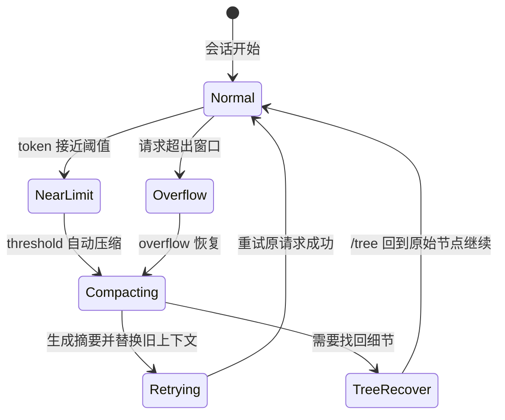

# Ch08：上下文压缩 Compaction

> 长会话会耗尽上下文窗口。这一章讲透 pi 的压缩机制：为什么上下文会满、手动与自动压缩的区别、阈值与溢出两种触发方式，以及"压缩是有损的"意味着什么、如何用 `/tree` 找回历史。


---

## 学习目标

学完本章后，你将能够：

1. 解释为什么上下文会满，以及超限的后果
2. 使用 `/compact` 手动压缩，并能写自定义压缩指令
3. 理解自动压缩的两种触发（threshold / overflow）与恢复重试机制
4. 理解"压缩有损"，知道用 `/tree` 找回完整历史
5. 知道如何通过扩展定制压缩行为

---

## 1. 为什么上下文会满

每次对话，模型看到的是**全部历史**（你的消息 + 它的回复 + 工具调用与结果）。历史越长：

- **token 成本**：每次请求都要重发全部上下文（缓存可打折，但仍有上限）
- **质量下降**：超出窗口会被截断，模型"忘记"开头
- **稳定性**：超长上下文更容易出错

```
会话早期:  [用户] [助手] [工具结果]           ← 很轻
会话中期:  [用户×20] [助手×20] [工具结果×80]   ← 开始变重
会话后期:  [……全部历史……] ← 逼近 200K 窗口
```

**pi 的应对**：当上下文逼近或超过窗口时，把**旧消息总结成一段摘要**，用摘要替代旧历史，腾出空间放新内容。

---

## 2. 手动压缩：`/compact`

```bash
/compact                       # 用默认指令压缩
/compact 重点总结架构决策与未完成事项    # 自定义压缩指令
```

**自定义指令的价值**：告诉模型"压缩时什么值得保留"。

```bash
# 例：让压缩聚焦于 API 契约
/compact 请保留所有函数签名和接口定义，压缩实现细节
```

压缩后你会看到一条"compaction"条目替代了旧消息。

---

## 3. 自动压缩

默认开启。两种触发方式：

| 触发 | 时机 | 行为 |
|------|------|------|
| **overflow（溢出）** | 上下文**已超限**，请求失败 | 先压缩，然后**重试**刚才失败的回合 |
| **threshold（阈值）** | 逼近上限（主动预防） | 提前压缩，避免失败 |

```
溢出流程:
请求 → 超窗口失败 → 压缩(摘要替代旧历史) → 重试原请求 → 成功
```

用状态图看会更直观：



**配置**：`/settings` 或 settings.json 里 `compaction` 相关选项（阈值比例、开关等，详见 ch09）。

---

## 4. 压缩是有损的

**摘要会丢失细节**——这是压缩的本质代价：

```
压缩前: 10 轮详细的调试过程（含 30 次工具调用、具体报错文本）
压缩后: "用户尝试修复登录报错，尝试了 3 种方案，最后采用 token 过期检查"
```

**完整历史仍然存在**：压缩只影响"发送给模型的上下文"，**JSONL 文件里的原始记录原封不动**。

找回方式：

```
/tree  →  回到压缩点之前的任意节点  →  查看原始细节 / 重新分支
```

> 💡 实战建议：
> - 长任务中，重要结论在对话里说一句"记住这个决定"，压缩时更容易被保留
> - 涉及大量具体细节（报错原文、数据样本）时，优先写进文件让模型 `read`，而不是留在对话里——文件不受压缩影响

---

## 5. 通过扩展定制压缩

压缩是 pi 刻意留的"可插拔"点之一（ch18 事件系统的应用）：

| 事件 | 能力 |
|------|------|
| `session_before_compact` | **取消**压缩，或**提供自定义摘要** |
| `session_compact` | 压缩完成后通知（记录、统计） |

```typescript
pi.on("session_before_compact", async (event) => {
  // event.reason: "manual" | "threshold" | "overflow"
  // event.willRetry: 溢出恢复时是否重试

  // 取消压缩
  return { cancel: true };

  // 或提供自己的摘要
  return {
    compaction: {
      summary: "你的领域专属摘要……",
      firstKeptEntryId: event.preparation.firstKeptEntryId,
      tokensBefore: event.preparation.tokensBefore,
    },
  };
});
```

> 这就是 pi 哲学的体现：压缩这样"别的工具写死"的行为，在 pi 里是一个你能替换的事件。

---

## 6. 压缩链路完整示例

把本章知识串成一个真实链路（手动压缩 + 溢出恢复）：

```
时刻 T0: 会话 200K token，逼近窗口
  │
  ├─ 触发 threshold 自动压缩
  │   → 旧消息折叠成摘要，腾出空间
  │
  ├─ 你继续干活，又堆了 50K
  │
  ├─ 请求超限失败（overflow）
  │   → pi 再次压缩 + 自动重试刚才的请求
  │   → 恢复执行，无感
  │
  └─ 你手动 /compact "保留 API 契约与未决问题"
      → 摘要按你的重点生成

全程可用 /tree 回看任意压缩点之前的原始消息
```

**典型症状与对策**：

| 症状 | 原因 | 对策 |
|------|------|------|
| 模型开始“忘记”开头 | 上下文被截断/压缩 | `/compact` 手动压，或开新会话 `--fork` |
| 请求报 context overflow | 超出窗口 | 自动压缩已触发；频繁发生则减少单会话时长 |
| 压缩后细节丢失 | 摘要天然有损 | `/tree` 找回原文，关键细节写进文件 |

---

## 7. 常见问题 Q&A

**Q1：压缩后费用会下降吗？**
A：会。后续请求的上下文变小（缓存命中率通常也上升），token 成本明显下降——这是压缩的主要收益之一。

**Q2：`/compact 自定义指令` 和默认压缩有什么不同？**
A：默认指令让模型按通用规则总结；自定义指令引导它“什么值得保留”（如接口签名、未决事项），摘要质量更高。

**Q3：自动压缩会不会压掉我正在进行的任务？**
A：overflow 场景会“先压缩再重试”，任务不丢；threshold 场景在空闲/回合间隙触发，不打断执行。

**Q4：可以完全关掉压缩吗？**
A：可以（settings 里 `compaction.enabled: false`），但长会话会因溢出反复失败。建议保留自动压缩，用 `/tree` 兜底找历史。

---

## 8. 动手试试

1. 跑一个超过 10 轮的任务（或直接 `/compact`）
2. 压缩后执行 `/tree`，对比"压缩条目"与原始消息
3. 在原始节点继续（重新分支），确认细节都在
4. 用自定义指令压缩：`/compact 只保留与数据库 schema 相关的决策`
5. 查看压缩后 token 用量变化（页脚 `↑/↓` 与费用）

---

## 9. 小结

| 要点 | 说明 |
|------|------|
| 为什么压缩 | 上下文有限，旧历史太重，超限会失败 |
| 手动 | `/compact` + 自定义指令控制保留重点 |
| 自动 | overflow 溢出先压后重试；threshold 阈值提前预防 |
| 有损性 | 摘要丢细节；但 JSONL 原历史完整保留 |
| 找回 | `/tree` 回到压缩前节点看原始内容 |
| 可定制 | `session_before_compact` / `session_compact` 事件扩展 |

---

## 下一章预告

**Ch09：设置、上下文文件与项目信任** —— 会话是"过程"，配置才是"环境"。我们将学习 settings.json 的全局/项目分层、AGENTS.md / CLAUDE.md 上下文文件如何塑造模型的行为、SYSTEM.md 如何替换系统提示，以及"项目信任"这个安全机制是怎么工作的。
