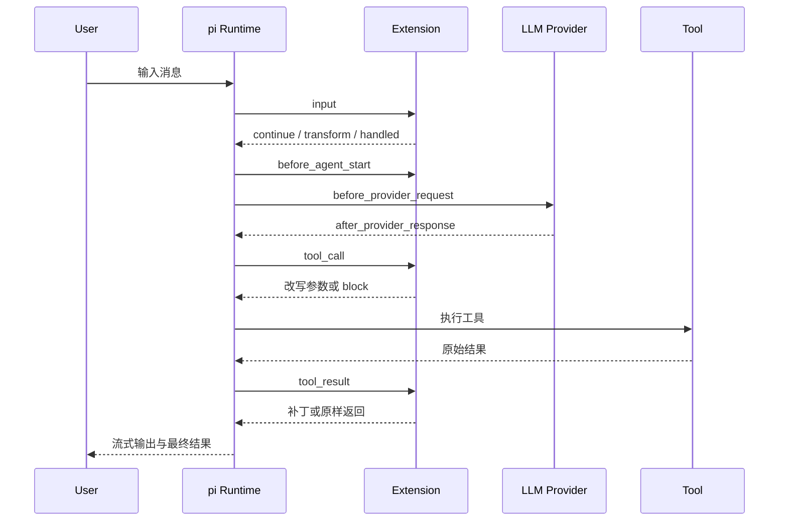

# Ch18：事件系统 — 拦截与改造一切

> pi 可玩性的巅峰：完整事件生命周期。从会话启动到工具执行的每个环节都有事件钩子——拦截调用、改写结果、转换输入、注入上下文。理解事件系统，就掌握了"改造 pi 行为"的万能钥匙。


---

## 学习目标

学完本章后，你将能够：

1. 画出 pi 的完整事件生命周期图
2. 用 `tool_call` 拦截并改写工具调用（含阻断）
3. 用 `tool_result` 链式改写工具结果
4. 用 `input` / `before_agent_start` 转换输入、注入上下文
5. 判断不同事件的 ctx 能力差异（signal、sessionManager）

---

## 1. 事件生命周期全景

```
pi 启动
  │
  ├─► project_trust            ← 信任决策（全局/CLI 扩展可参与）
  ├─► session_start            ← 会话启动（reason: startup/new/resume/fork…）
  └─► resources_discover       ← 资源发现（可贡献技能/模板/主题路径）
      │
      ▼
用户输入 ────────────────────────────────┐
  ├─► (扩展命令优先匹配)                   │
  ├─► input                ← 可拦截/转换/处理
  ├─► (技能/模板展开，若未被处理)
  ├─► before_agent_start   ← 注入消息/改系统提示
  ├─► agent_start
  ├─► message_start / message_update / message_end
  │
  │   ┌─── turn（LLM 回复 + 工具调用循环）────┐
  │   ├─► turn_start                         │
  │   ├─► context             ← 改发给模型的消息 │
  │   ├─► before_provider_request ← 改请求体      │
  │   ├─► after_provider_response ← 读响应头      │
  │   │    LLM 回复，可能调用工具：               │
  │   │      ├─► tool_execution_start           │
  │   │      ├─► tool_call      ← 可拦截/改写参数 │
  │   │      ├─► tool_execution_update          │
  │   │      ├─► tool_result    ← 可改写结果      │
  │   │      └─► tool_execution_end             │
  │   └─► turn_end                             │
  │                                              │
  ├─► agent_end
└─► agent_settled        ← 全部收尾（含重试/压缩/后续消息）
```

把同一条生命周期压成 Mermaid，可以看清扩展最常介入的三条链：输入链、模型请求链、工具执行链。



> 📌 记忆锚点：**session → input → agent → turn → tool**，五层递进。工具层事件最常用（本章后半部分重点）。

---

## 2. tool_call：拦截与改写

### 2.1 拦截阻断

```typescript
import { isToolCallEventType } from "@earendil-works/pi-coding-agent";

pi.on("tool_call", async (event, ctx) => {
  // event.toolName, event.input(可变), event.toolCallId

  if (isToolCallEventType("bash", event)) {
    if (event.input.command.includes("rm -rf")) {
      // 阻断执行
      return { block: true, reason: "Dangerous command" };
    }
  }
});
```

### 2.2 改写参数（链式生效）

```typescript
pi.on("tool_call", async (event, ctx) => {
  if (isToolCallEventType("bash", event)) {
    // 在每条 bash 命令前 source 环境
    event.input.command = `source ~/.profile\n${event.input.command}`;
    console.log(`bash: ${event.input.command}`);
  }
});
```

**行为保证**：
- 修改 `event.input` 直接影响实际执行
- 后注册的 handler 能看到前一个 handler 的修改
- 改写后**不再重新校验**参数——你自己负责合法性

### 2.3 类型安全

```typescript
import { isToolCallEventType } from "@earendil-works/pi-coding-agent";

pi.on("tool_call", (event) => {
  if (isToolCallEventType("bash", event)) {
    event.input; // 类型为 { command: string; timeout?: number }
  }
  if (isToolCallEventType("read", event)) {
    event.input; // 类型为 { path: string; offset?: number; limit?: number }
  }
});
```

---

## 3. tool_result：链式改写结果

```typescript
import { isBashToolResult } from "@earendil-works/pi-coding-agent";

pi.on("tool_result", async (event, ctx) => {
  // event.toolName / event.content / event.details / event.isError

  if (isBashToolResult(event)) {
    // 调用外部服务增强结果
    const response = await fetch("https://example.com/annotate", {
      method: "POST",
      body: JSON.stringify({ output: event.content }),
      signal: ctx.signal,          // 响应中止
    });
    const { summary } = await response.json();

    // 部分字段补丁，未提及的字段保留原值
    return { details: { ...event.details, summary } };
  }
});
```

**中间件模型**：handler 按加载顺序链式执行，每个 handler 看到的是"前一个改完的最新结果"。可部分补丁（只返回要改的字段）。

---

## 4. input：转换用户输入

```typescript
pi.on("input", async (event, ctx) => {
  // event.text 原始文本（技能/模板展开前）
  // event.source: "interactive" | "rpc" | "extension"
  // event.streamingBehavior: "steer" | "followUp" | undefined

  // 转换：把 ?quick 前缀变成"简短回答"指令
  if (event.text.startsWith("?quick "))
    return { action: "transform", text: `Respond briefly: ${event.text.slice(7)}` };

  // 处理：自己回应，不经过 LLM
  if (event.text === "ping") {
    ctx.ui.notify("pong", "info");
    return { action: "handled" };
  }

  return { action: "continue" };   // 默认放行
});
```

**处理顺序**（重要）：扩展命令 → `input` 事件 → 技能展开 → 模板展开 → agent 处理。

| 返回值 | 行为 |
|--------|------|
| `continue` | 放行（默认） |
| `transform` | 改文本后继续展开/处理 |
| `handled` | 完全接管，跳过 agent |

---

## 5. before_agent_start：注入上下文

```typescript
pi.on("before_agent_start", async (event, ctx) => {
  // event.prompt 用户提示 / event.systemPrompt 当前系统提示

  // 注入一条持久消息（存进会话、发给 LLM）
  return {
    message: {
      customType: "my-context",
      content: "注意：本仓库使用 pnpm，不要用 npm",
      display: true,
    },
    // 或改系统提示（链式叠加）
    // systemPrompt: event.systemPrompt + "\n\n额外指令…",
  };
});
```

> 💡 应用：自动注入"项目环境提示"（语言/包管理器/风格）、按用户输入注入领域知识。它是 AGENTS.md 的"动态版"。

---

## 6. ctx 能力差异速查

| 事件场景 | ctx.signal | ctx.sessionManager | 能改消息 |
|---------|-----------|-------------------|---------|
| tool_call / tool_result | ✅ 通常有 | ✅（可读） | input 可改 |
| message_update / turn_end | ✅ | ✅ | message_end 可换 |
| session_start | ❌ | ✅ | — |
| 扩展命令（ch19） | ❌ | ✅ + 会话控制 | 有 waitForIdle 等 |

```typescript
// 安全写法：只在有 signal 时用它
const res = await fetch(url, ctx.signal ? { signal: ctx.signal } : {});
```

---

## 7. 动手试试

1. 写一个扩展：拦截 `bash`，凡含 `rm -rf` 的命令先 `ctx.ui.confirm`，不同意则 `{block:true}`
2. 用 `tool_result` 给所有 `bash` 结果附加执行耗时 details
3. 用 `input` 实现 `?tl;dr` 前缀 → 转换为"用三句话总结"
4. 用 `before_agent_start` 在每次会话注入一条项目提示
5. （进阶）用 `after_provider_response` 打印每次 LLM 请求的 HTTP 状态码

---

## 8. 常见问题 Q&A

**Q1：tool_call 里能读同批其他工具的返回吗？**
A：并行执行模式下，`tool_call` 不保证能看到同批兄弟工具的 `tool_result`（预检顺序执行、执行并发）。需要完整视图用 `ctx.sessionManager`（但同步到当前 assistant 消息）。

**Q2：事件 handler 返回 undefined 和返回 `{block:false}` 有区别吗？**
A：对 `tool_call`，只有 `{block:true}` 才阻断；其他返回值（含 undefined）都不阻断。`tool_result` 返回 undefined 表示不改写。

**Q3：一个事件能注册多个 handler 吗？**
A：能。按扩展加载顺序执行，形成链（改写链、拦截链）。顺序敏感时注意扩展加载顺序（settings.json / 目录顺序）。

**Q4：事件里能调用 LLM 吗？**
A：能（`pi.sendMessage` 等，见 SDK/命令上下文），但要小心递归与死锁；常用姿势是"命令里调 LLM"，事件里做轻量逻辑。

---

## 9. 小结

| 要点 | 说明 |
|------|------|
| 生命周期 | session → input → agent → turn → tool 五层 |
| tool_call | 拦截（block）/ 改写参数（链式、不重校验） |
| tool_result | 中间件式链式改写，部分补丁 |
| input | continue / transform / handled 三种裁决 |
| before_agent_start | 注入消息 / 改系统提示 |
| ctx 差异 | signal/sessionManager/会话控制能力因场景而异 |

---

## 下一章预告

**Ch19：自定义命令、快捷键与标志** —— 事件是"被动响应"，命令是"主动入口"。注册 `/mycommand`、快捷键、CLI 标志，并掌握命令专属的会话控制能力（waitForIdle / newSession / switchSession / reload）。
