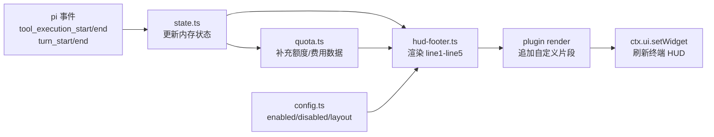

# Ch22：实战案例 — 拆解 pi-agent-hud（使用 + 开发）

> 以一个真实发布的生产级开源扩展 pi-agent-hud 为教材：先用熟它（状态栏、浮层、气泡编辑器、配额监控），再解剖它（插件系统 + 八模块源码 + 事件驱动 UI 数据流），最后动手写自己的 HUD 插件。这是 Module 5 扩展开发六章知识的一次总验收。


---

## 学习目标

学完本章后，你将能够：

**使用者视角**
1. 安装并配置 pi-agent-hud，读懂三行状态栏的每个元素
2. 使用 Ctrl+H 历史/计划浮层、气泡编辑器、配额余额显示、网格布局
3. 编写自定义 HUD 插件，往状态栏添加自己的内容

**定制者视角**
4. 读懂一个生产级多文件扩展的源码组织方式（八模块职责）
5. 说清「事件 → 状态 → UI 渲染」的完整数据流
6. 复刻它的生产模式：响应头解析、定时轮询、配置加载、快捷键注册

---

## 1. 认识 pi-agent-hud

### 1.1 项目档案

| 项 | 内容 |
|----|------|
| 项目 | [pi-agent-hud](https://github.com/dafei1288/pi-agent-hud)（作者 dafei1288） |
| 定位 | pi 的状态栏（HUD）扩展：在终端底部实时显示会话信息 |
| 灵感 | [claude-hud](https://github.com/jarrodwatts/claude-hud) |
| 包 | `pi-agent-hud`（npm，v0.2.0） |
| 许可证 | MIT · 0 运行时依赖（只用 pi 的 Extension API） |
| 类型 | extension（多文件目录扩展） |

**它解决什么问题**：默认 pi 只在底栏显示很精简的状态（工作目录、token 用量、模型）。长时间干活时你根本不知道：**上下文快满了吗？模型在想什么档位？这个工具调用卡了多久？这个月订阅额度还剩多少？** pi-agent-hud 把这一切实时可视化。

### 1.2 安装与验证

```bash
# 方式一：npm 包安装（推荐）
pi install npm:pi-agent-hud

# 方式二：命令行临时加载（试用）
pi -e npm:pi-agent-hud

# 验证
pi list          # 应能看到 pi-agent-hud
```

安装后重启 pi 或输入 `/reload` 激活。效果预览：

```
[claude-sonnet-4-6] pi-mono git:(main) · medium    [████████░░░░░░░░░░░░] 39%    ⏱ 21m
AGENTS.md · skills x5 · ext.tools x2 · ✓ Grep ×10 · ✓ Bash ×3 · ◐ Edit (12s) · ◐ agent (2m 15s)
▸ how to build a REST API with authentication?
```

---

## 2. 使用篇：三行状态栏

HUD 在终端底部渲染三行，每行的元素都可以在配置里开关。

### 2.1 Line 1 — 会话概览

```
[模型名] 项目名 git:(分支) · thinking级别    [████░░] 39%    ⏱ 21m
```

| 元素 | 说明 |
|------|------|
| `[模型名]` | 当前 LLM 模型 ID |
| 项目名 | 当前工作目录名 |
| `git:(分支)` | Git 分支，非 git 仓库不显示 |
| `· medium` | Thinking 级别，关闭时不显示 |
| `[████░░] 39%` | Context 窗口使用率进度条（绿 ≤70% / 黄 70-90% / 红 90%+） |
| `⏱ 21m` | 会话已运行时长 |

### 2.2 Line 2 — 活动详情

```
AGENTS.md · skills x5 · ext.tools x2 · ✓ Grep ×10 · ◐ Edit (12s) · ◐ agent (2m 15s)
```

| 元素 | 说明 |
|------|------|
| `AGENTS.md` | 检测到的上下文配置文件（绿色） |
| `skills x5` | 已加载的 skill 数量 |
| `ext.tools x2` | 扩展注册的工具数量 |
| `cmds x3` | 扩展注册的 slash 命令数量 |
| `↑12.5k ↓3.2k` | Token 明细（可配置为仅高占用时显示） |
| `$0.042` | 会话累计费用 |
| `✓ Grep ×10` | 已完成工具调用统计，按次数降序 |
| `◐ Edit (12s)` | 正在执行的工具（黄色，含耗时） |
| `◐ agent (2m 15s)` | 正在运行的 Agent 循环（黄色） |

### 2.3 Line 3 — 最近输入 + 历史提示

```
▸ how to build a REST API with authentication?  Ctrl+H:5
```

`Ctrl+H:5` 表示历史记录里有 5 条可回填，按 `Ctrl+H` 打开浮层。

> 💡 使用心得：Line 2 的 `◐ Edit (12s)` 这类"正在执行的工具"提示最有价值——agent 长时间不动时，你一眼能看出它是卡在工具上、还是在思考。

---

## 3. 使用篇：高级功能

### 3.1 Ctrl+H — 历史记录 + 执行计划浮层

按 `Ctrl+H` 弹出统一浮层，`Tab` 在**历史记录**和**执行计划**两页间切换；`Ctrl+Shift+J` 直接打开执行计划页。

**历史记录页（默认）**：

```
┌ [ History ]  Plan (Tab) ───────────────────────────────┐
│ ▸ how to build a REST API with authentication?        │
│   请帮我检查文档                                        │
│   帮我提交一下                                          │
├ ↑↓ scroll · Enter select · Tab plan · Esc close ──────┤
└────────────────────────────────────────────────────────┘
```

| 按键 | 功能 |
|------|------|
| `↑` / `k`、`↓` / `j` | 上下选择历史输入 |
| `Enter` | 选中并回填到输入框 |
| `Tab` | 切换到执行计划页 |
| `Esc` / `Ctrl+C` | 关闭浮层 |

**执行计划页**：

```
┌ History (Tab)  [ Plan ] ───────────────────────────────┐
│ 🎯 how to build a REST API                              │
│ 📋 12 turns                                             │
├─────────────────────────────────────────────────────────┤
│ 📊 📖×5  ✎×3  🔍×2  ⚙×2                                │
├─────────────────────────────────────────────────────────┤
│ 🕐 Tool call timeline                                   │
│   ✓ 🔍 grep · extension                                 │
│   ✓ ✎ edit · extensions/agent-hud/index.ts             │
│   ◐ ⚙ bash · npm build (12s)                           │
├─────────────────────────────────────────────────────────┤
│ 💬 Turn log                                             │
│ T01 I'll start by reading the project structure         │
│ T02 Let me search for the relevant files...             │
│ T03 I'll make the changes to the extension...           │
└ Esc close ─────────────────────────────────────────────┘
```

计划页的四块信息：
- **📊 分类统计**：读/搜/写/执行/网络各类工具使用次数
- **🕐 工具时间线**：最近工具调用序列（✓完成 / ◐运行中 + 耗时）
- **💬 Turn log**：最近 10 轮 agent 回复摘要
- **Agent 计划**：如有结构化步骤，显示步骤进度 + Subagent 委派状态

### 3.2 气泡编辑器（Bubble Editor）

配置 `"editor": "bubble"` 后，默认输入框替换为带边框的气泡编辑器：

- 顶栏左侧：模型（provider 配色 + 图标）· thinking 档位 · 5h/每周额度 · 余额
- 顶栏右侧：git 分支 · worktree 标记 · 项目路径
- 运行时用 `/bubble` 命令开关

### 3.3 配额与余额监控

HUD 自动识别你的付费模式，显示对应信息：

```
⏳5h 42% ↻2h15m · 📅wk 18% ↻3d4h     ← 订阅配额（Claude/Codex OAuth）
💰 ¥12.50                            ← 按量付费余额（如 DeepSeek）
⚡ rateLimit                          ← API 额度剩余（自动检测）
```

不同提供商的解析方式：

| 提供商 | 方式 |
|--------|------|
| Claude 订阅（OAuth） | 解析 `anthropic-ratelimit-unified-5h-*` / `-7d-*` 响应头 |
| Codex（ChatGPT OAuth） | 解析 `x-codex-primary-*` / `x-codex-secondary-*` 响应头 |
| GLM / MiniMax / Kimi Coding Plan | 响应头不含配额 → HUD 每 5 分钟轮询对应 usage 接口 |
| 纯 API Key（如 DeepSeek） | 每 5 分钟轮询余额接口 |

> 🔧 调试技巧：配置 `"debugDumpHeaders": true`（或环境变量 `PI_HUD_DEBUG_HEADERS=1`），HUD 会把所有限额相关响应头落盘到 `~/.pi/agent/pi-agent-hud-headers.jsonl`，方便你排查自己的提供商支持哪种解析。

### 3.4 网格布局

默认单栏。设置 `layout` 后启用网格分栏，最多 5 行、每行 1/2/4 列（4×5=20 格）：

```jsonc
{
  "layout": [1, 2, 2],
  "placement": {
    "tokens":    { "line": 1, "col": 0 },
    "cost":      { "line": 1, "col": 0 },
    "toolStats": { "line": 1, "col": 1 },
    "lastInput": { "line": 2, "col": 0 },
    "plugin:random-quote": { "line": 2, "col": 1 }
  }
}
```

未列入 `placement` 的元素自动从左到右、从上到下填充。参考示例：`examples/layout-2col-demo.json`、`examples/layout-dashboard-demo.json`。

### 3.5 配置与元素开关

配置文件：`.pi/pi-agent-hud.json`（项目级）或 `~/.pi/agent/pi-agent-hud.json`（全局）。

```jsonc
{
  // Token 显示模式："always" 始终 | "highContext" 仅高占用时
  "tokenMode": "always",
  "tokenThreshold": 85,

  // 显示/隐藏元素（黑名单）
  "disabled": ["extCmds", "cost"],

  // 或白名单，只显示指定元素（二选一）
  // "enabled": ["model", "project", "git", "contextBar", "elapsed", "tokens"]
}
```

可配置元素共 19 个：`model` / `project` / `git` / `thinking` / `contextBar` / `elapsed` / `contextFiles` / `skills` / `extTools` / `extCmds` / `tokens` / `cost` / `balance` / `rateLimit` / `plan5h` / `planWeek` / `toolStats` / `runningTools` / `runningAgents` / `lastInput` / `historyHint`。完整字段见 `examples/pi-agent-hud.json`。

---

## 4. 开发篇：HUD 插件系统

pi-agent-hud 自带一个**插件系统**：不用改它源码，写一个 `.js` 文件就能往状态栏加内容。

### 4.1 插件接口

```js
// 放在 .pi/pi-agent-hud-plugins/*.js（项目级）
// 或 ~/.pi/agent/pi-agent-hud-plugins/*.js（全局）
module.exports = {
  name: "my-plugin",        // 唯一名称
  target: "line2",         // "line1" | "line2" | "line3" | "line4" | "line5"
  order: 100,              // 排序，越小越靠前
  col: 0,                  // 可选：网格模式下指定列号

  render(ctx, theme, width) {
    // ctx:   所有 HUD 数据（模型/会话/token/工具统计/输入历史…）
    // theme: theme.fg("color", text) 上色，color = text|dim|accent|success|warning|error
    // width: 终端宽度
    // 返回 string 显示；返回 undefined 则跳过本次渲染
    return theme.fg("dim", `🔁 ${ctx.inputHistory.length} turns`);
  },
};
```

### 4.2 四个官方示例

| 文件 | 功能 |
|------|------|
| `examples/turn-counter-plugin.js` | 显示对话轮次计数 |
| `examples/clock-plugin.js` | 在 Line 1 显示当前时间 |
| `examples/context-emoji-plugin.js` | 用 emoji 替代 context 进度条 |
| `examples/quote-plugin.js` | 每 10 秒随机显示一条谏言 |

### 4.3 动手写一个插件

以「显示最近一次 git 提交」为例：

```js
// .pi/pi-agent-hud-plugins/git-last-commit.js
const { execSync } = require("node:child_process");

module.exports = {
  name: "git-last-commit",
  target: "line2",
  order: 10,

  render(_ctx, theme) {
    try {
      const msg = execSync("git log -1 --oneline", { encoding: "utf8" })
        .trim()
        .slice(0, 40);
      return theme.fg("accent", `🔖 ${msg}`);
    } catch {
      return undefined; // 非 git 仓库跳过
    }
  },
};
```

> ⚠️ 注意：插件 render 是高频调用（每次状态刷新），不要在 render 里做重 IO；上面的 `execSync` 仅用于演示，生产环境建议缓存结果。

---

## 5. 开发篇：源码解剖

现在进入定制者视角。pi-agent-hud 是一个**多文件目录扩展**——这正是 ch16 讲的目录结构在生产项目里的样子。

### 5.1 八模块架构

```
extensions/agent-hud/
├── index.ts          # 入口：事件/快捷键/命令装配（ch18/ch19 知识）
├── quota.ts          # LLM 计费/额度共享服务（响应头解析 + 定时轮询）
├── state.ts          # 会话状态 + 事件追踪（订阅 tool/turn 事件 → 聚合数据）
├── hud-footer.ts     # 状态栏渲染 + 插件系统（ch20 自定义 UI）
├── bubble-editor.ts  # 气泡编辑器（替换默认输入框，ch20 editor 替换）
├── overlay.ts        # 历史/计划浮层（自定义 TUI 组件）
├── layout.ts         # 渲染辅助 + 网格布局
└── config.ts         # 配置加载 + 元素开关（.pi/pi-agent-hud.json）
```

```
┌───────────────┐   订阅工具/轮次事件     ┌──────────────────┐
│  index.ts     │ ─────────────────────► │  state.ts         │
│  (装配中心)    │                        │  (状态聚合)        │
│  on(tool_call) │ ◄───────────────────── │  工具统计/时间线/  │
│  registerShortcut│                       │  turn log/费用    │
│  registerCommand │                       └────────┬─────────┘
└───────────────┘                                  │ 读取
                                                   ▼
┌───────────────┐   读取配置    ┌─────────────────────────────┐
│  config.ts    │ ───────────► │  hud-footer.ts               │
│  元素开关/布局  │              │  状态栏渲染 + 插件系统        │
│               │              │  ctx.ui.setWidget(...) 上屏  │
└───────────────┘              └─────────────────────────────┘
```

### 5.2 事件驱动 UI 数据流（核心模式）

这是本章最重要的心智模型——**pi 扩展驱动 UI 的标准姿势**：

```
LLM 调用工具
   │
   ▼
pi 触发 tool_call / tool_result 事件
   │
   ▼
state.ts 的 pi.on("tool_execution_start"|"tool_result", ...) 监听
   │  更新内存态：工具统计 +1、记录耗时、追加时间线
   ▼
hud-footer.ts 读取 state → 渲染字符串
   │
   ▼
ctx.ui.setWidget("agent-hud", [line1, line2, line3])  → 上屏
```

这条链路对应的 Mermaid 图如下：



对应到 ch18 学过的知识：`tool_call` 事件可以**拦截改写**，而 HUD 只用它做**只读监听**来积累状态——这就是"事件系统的两种用法"。

### 5.3 quota.ts：响应头解析 + 定时轮询模式

配额显示是 HUD 最有含金量的部分，两种数据获取模式：

**模式 A：响应头解析（订阅类）**
```typescript
pi.on("after_provider_response", (event, ctx) => {
  // event.headers 里找 anthropic-ratelimit-unified-5h-* / x-codex-primary-*
  // 解析剩余额度 + 重置倒计时
});
```

**模式 B：定时轮询（无响应头的提供商）**
```typescript
// session_start 后启动 5 分钟定时器
// 轮询 open.bigmodel.cn / api.minimaxi.com / api.kimi.com 的 usage 接口
// 用 auth.json 或环境变量里的 key 认证
```

> 💡 生产模式要点：订阅类用**事件驱动**（零额外请求），无头提供商用**低频轮询**（5 分钟一次）；切换 provider 时自动清理旧数据——避免显示上一家的余额。

### 5.4 从中学到的生产模式清单

| 模式 | 对应章节知识 |
|------|-------------|
| 多文件目录扩展组织（index 装配 + 模块分工） | ch16 扩展结构 |
| `pi.on("tool_execution_start"/"tool_result")` 只读监听 | ch18 事件系统 |
| `pi.registerShortcut`（Ctrl+H / Ctrl+Shift+J） | ch19 快捷键 |
| `pi.registerCommand`（/bubble） | ch19 自定义命令 |
| `ctx.ui.setWidget` / `custom()` 渲染 TUI | ch20 自定义 UI |
| 配置加载 + 白/黑名单开关 | ch21 通用工程 |
| `after_provider_response` 响应头 + 定时轮询 | ch18 扩展事件 |
| 发布为 npm Pi 包 | ch23（下一章） |

---

## 6. 课堂练习

### ⭐ 基础：安装并定制
安装 pi-agent-hud，完成：隐藏 `cost` 元素、把 token 显示改为"仅高占用时显示"、确认三行状态栏正常渲染。

### ⭐⭐ 进阶：写一个插件 + 网格布局
1. 写一个 `quote-plugin` 类插件（随机格言/冷笑话）显示在 Line 2
2. 配置 `layout: [1, 2, 2]`，把你的插件钉到 `{ line: 2, col: 1 }`

### ⭐⭐⭐ 挑战：追源码链路
阅读 `state.ts` 与 `hud-footer.ts`，写出完整链路：
`用户提问 → LLM 调用 bash → 状态栏 "✓ Bash ×N" 数字更新的全过程涉及哪些事件、哪些函数？`
要求画出数据流图（文字版即可），并指出如果要在"工具失败"时让状态栏变红，应该在哪里加逻辑。

---

## 常见问题 Q&A

**Q1：学 Ch22 前一定要先装 pi-agent-hud 吗？**
A：建议先装并使用 10 分钟，再读开发篇。先看到三行状态栏、Ctrl+H 浮层和气泡编辑器，后面读 `state.ts`、`hud-footer.ts`、`overlay.ts` 时才知道每个模块在服务什么体验。

**Q2：HUD 插件应该写成 `.js`，还是直接改 pi-agent-hud 源码？**
A：只增加展示片段时优先写 `.js` 插件，升级不容易冲突；需要新增状态来源、响应头解析、快捷键或复杂 UI 时，才进入源码级扩展开发。

**Q3：为什么插件 render 里不建议做重 IO？**
A：render 会在状态刷新时频繁执行，重 IO 会让 TUI 卡顿。正确做法是事件或定时器里更新缓存，render 只读取内存状态并拼出字符串。

**Q4：配额显示不准时先排查什么？**
A：先确认当前 provider 是否真的返回限额响应头；再开启 `debugDumpHeaders` 看落盘头信息；如果 provider 不给响应头，就只能用低频 usage/余额接口轮询或直接隐藏对应元素。

---

## 7. 小结

| 要点 | 说明 |
|------|------|
| pi-agent-hud 是什么 | 生产级 HUD 扩展：状态栏 + 历史/计划浮层 + 气泡编辑器 + 配额监控 |
| 使用要点 | 三行状态栏可配置；Ctrl+H 双页浮层；网格布局钉元素；写 .js 插件加内容 |
| 开发要点 | 八模块分工：index 装配 / state 聚合 / quota 服务 / footer 渲染 |
| 核心模式 | 事件（tool_call/tool_result）→ 状态聚合 → setWidget 上屏 |
| 生产技巧 | 响应头解析 vs 定时轮询；白/黑名单配置；插件系统隔离用户定制 |
| 下一步 | ch23 学习如何把这个项目打包成 npm 分发的 Pi 包 |

---

## 下一章预告

**Ch23：Pi 包：分发你的扩展** —— pi-agent-hud 是如何从 GitHub 仓库变成 `pi install npm:pi-agent-hud` 一行命令的？我们将学习 package.json 的 `pi` 清单、git 包与 npm 包的区别、发布与更新的完整流程，然后把自己的第一个扩展发布出去。
