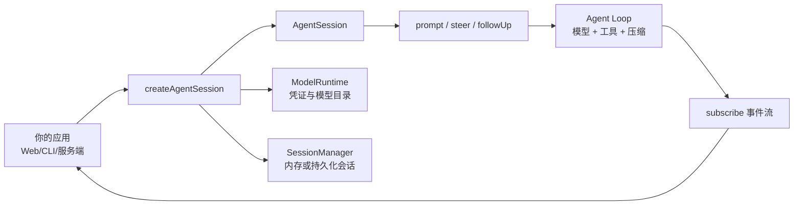

# Ch25：SDK 入门 — 嵌入你的应用

> 把 agent 装进你的程序：createAgentSession、ModelRuntime、subscribe 事件流、prompt/steer/followUp——10 行代码跑起你自己的 agent 应用。


---

## 学习目标

学完本章后，你将能够：

1. 用 createAgentSession + ModelRuntime 创建 agent 会话
2. 订阅事件流并处理流式输出
3. 用 prompt / steer / followUp 控制对话
4. 理解 SDK 与 RPC 的选型边界

---

## 1. SDK 能做什么

SDK（`@earendil-works/pi-coding-agent`）提供**程序化访问 agent 能力**的接口，与交互式 pi 共用同一内核（Agent Loop、工具、扩展、会话树）。

```
你的应用 ──createAgentSession()──► AgentSession
                                      ├─ prompt() 提问
                                      ├─ steer() 插话
                                      ├─ followUp() 追加
                                      ├─ subscribe() 事件流
                                      └─ agent 内部: 工具/模型/压缩
```

SDK 嵌入时的数据流可以拆成四段：



**典型场景**：
- 自定义 UI（Web / 桌面 / 移动端）
- 把 agent 能力嵌入业务应用（文档生成、代码审查）
- 自动化流水线（CI 里跑 agent）
- 测试 agent 行为

---

## 2. 最小示例

```typescript
// demo.ts
import { createAgentSession, ModelRuntime, SessionManager } from "@earendil-works/pi-coding-agent";

// ① 模型运行时（凭证/模型目录）
const modelRuntime = await ModelRuntime.create();

// ② 创建会话（内存模式，不落盘）
const { session } = await createAgentSession({
  sessionManager: SessionManager.inMemory(),
  modelRuntime,
});

// ③ 订阅事件流：流式打印文本
session.subscribe((event) => {
  if (event.type === "message_update" && event.assistantMessageEvent.type === "text_delta") {
    process.stdout.write(event.assistantMessageEvent.delta);
  }
});

// ④ 提问
await session.prompt("当前目录有哪些文件？");
```

```bash
# 运行
npx tsx demo.ts
```

**10 行代码，一个完整的编码 agent**——这就是"把 pi 装进你的应用"。

---

## 3. 核心 API

### 3.1 createAgentSession 选项

```typescript
const { session } = await createAgentSession({
  cwd: process.cwd(),            // 工作目录（工具/资源发现基准）
  agentDir: "~/.pi/agent",       // 全局配置目录

  model: opus,                   // 指定模型（不指定则按会话/默认/可用回退）
  thinkingLevel: "medium",       // thinking 等级
  modelRuntime,                  // 模型运行时（认证）

  tools: ["read", "bash", "grep"],        // 工具白名单
  excludeTools: ["ask_question"],         // 排除工具
  noTools: "builtin",                     // 关内置工具（保留扩展）
  customTools: [myTool],                  // 自定义工具（ch17 的 defineTool）

  resourceLoader,                // 资源加载器（扩展/技能/模板）
  sessionManager: SessionManager.inMemory(),   // 会话存储
  settingsManager,               // 设置
});
```

### 3.2 prompt / steer / followUp

```typescript
// 空闲时提问
await session.prompt("解释这段代码");

// 流式处理中：必须说明投递方式
await session.prompt("改掉那个变量名", { streamingBehavior: "steer" });
await session.prompt("完事后跑测试", { streamingBehavior: "followUp" });

// 或直接使用队列方法
await session.steer("换一种实现");
await session.followUp("完成后写总结到 summary.md");

// 带图片
await session.prompt("这是什么？", {
  images: [{ type: "image", source: { type: "base64", mediaType: "image/png", data: "..." } }],
});
```

> ⚠️ 流式期间不带 `streamingBehavior` 调用 prompt 会抛错——必须显式说明排队方式（和交互模式的 Enter/Alt+Enter 对应，ch06）。

---

## 4. 事件流

### 4.1 订阅与退订

```typescript
const unsubscribe = session.subscribe((event) => { ... });
unsubscribe();   // 停止订阅
```

### 4.2 常用事件

| 事件 | 用途 |
|------|------|
| `message_update` | 流式文本（text_delta / thinking_delta） |
| `tool_execution_start/end` | 工具调用生命周期 |
| `turn_start/end` | 回合（一次 LLM 回复 + 工具调用） |
| `agent_start/end` | 一次 agent 运行 |
| `queue_update` | 排队消息变化 |
| `compaction_start/end` | 压缩 |
| `auto_retry_*` | 自动重试 |

```typescript
session.subscribe((event) => {
  switch (event.type) {
    case "message_update":
      if (event.assistantMessageEvent.type === "text_delta")
        process.stdout.write(event.assistantMessageEvent.delta);
      if (event.assistantMessageEvent.type === "thinking_delta")
        process.stdout.write(`\x1b[90m${event.assistantMessageEvent.delta}\x1b[0m`); // 灰色显示思考
      break;
    case "tool_execution_start":
      console.log(`\n🛠 ${event.toolName}: ${JSON.stringify(event.args).slice(0, 80)}`);
      break;
    case "tool_execution_end":
      console.log(`\n✅ ${event.toolName} (${event.isError ? "error" : "ok"})`);
      break;
  }
});
```

---

## 5. 动手试试

1. 安装 SDK：`npm install @earendil-works/pi-coding-agent`
2. 跑通最小示例（ch25 §2），确认流式输出
3. 扩展示例：订阅 tool_execution 事件，打印工具调用轨迹
4. 用 `tools: ["read", "bash"]` 限制工具，观察模型行为变化
5. 用 `SessionManager.create(cwd)` 持久化会话，`pi -r` 能恢复它

---

## 6. 常见问题 Q&A

**Q1：SDK 和直接调 LLM API 有什么区别？**
A：SDK 自带整个 harness：工具循环、上下文管理、压缩、扩展、会话树。直接调 API 这些都要自己写——这正是"极简内核"的复用价值。

**Q2：SDK 里的扩展和终端里的扩展一样吗？**
A：一样。通过 ResourceLoader 加载同一套扩展（DefaultResourceLoader 自动发现 ~/.pi/agent/extensions 等）。可用 `extensionFactories` 注入内联扩展。

**Q3：没有配置凭证会怎样？**
A：createAgentSession 不校验凭证（模型解析可能成功），真正请求时才失败。用 `modelRuntime.getAvailable()` 先查可用模型更稳妥。

**Q4：SDK 能跑在服务器上做 API 服务吗？**
A：能。这是典型用法：HTTP 服务 + createAgentSession + 会话管理，就得到一个"agent as a service"（ch26 讲会话运行时，ch27 讲 RPC 替代方案）。

---

## 7. 小结

| 要点 | 说明 |
|------|------|
| 创建 | createAgentSession + ModelRuntime + SessionManager |
| 提问 | prompt（流式中需 streamingBehavior）/ steer / followUp |
| 事件 | subscribe 流式文本、工具轨迹、回合/代理生命周期 |
| 控制 | tools 白名单 / customTools / thinkingLevel / model |
| 会话 | inMemory 或持久化（SessionManager.create） |

---

## 下一章预告

**Ch26：SDK 进阶：会话、设置与运行时** —— 生产级集成：SessionManager 树 API、SettingsManager 配置管理、AgentSessionRuntime 的会话替换（new/switch/fork）、ResourceLoader 定制、三种 run mode——把 SDK 从"demo"用到"产品"。
