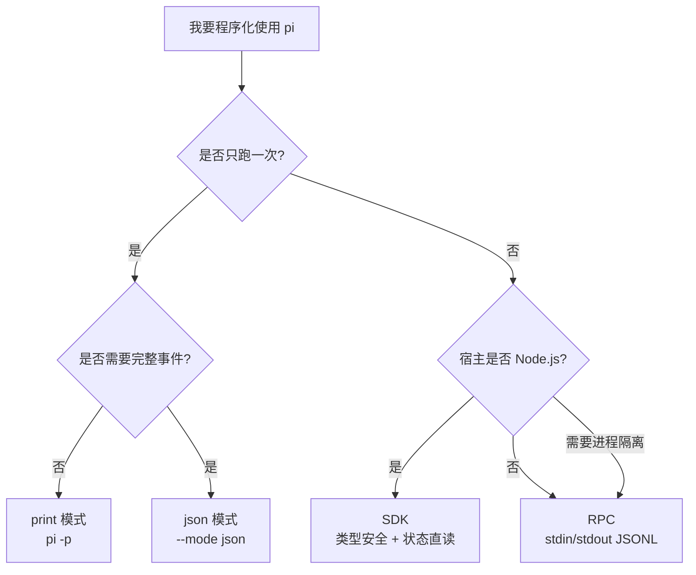

# Ch27：RPC 模式与 JSON 事件流

> 不走 SDK 的另一种集成：`pi --mode rpc` 的 JSONL 命令/响应协议、`--mode json` 的结构化事件流、print 模式的管道用法。跨语言集成、进程隔离、自动化流水线——以及"什么时候用 SDK、什么时候用 RPC"的选型决策。


---

## 学习目标

学完本章后，你将能够：

1. 用 RPC 模式从任意语言驱动 pi（命令/响应 JSONL）
2. 理解 RPC 协议的核心：严格 LF 分隔、命令类型
3. 用 JSON 模式输出结构化事件流（配合 jq 等工具）
4. 把 pi 接入 CI 流水线等自动化场景
5. 做出 SDK vs RPC 的选型决策

---

## 1. 三种非交互输出模式

| 模式 | 命令 | 输出 | 交互性 |
|------|------|------|--------|
| print | `pi -p` | 最终文本 | 无 |
| json | `pi --mode json` | 全部事件 JSONL | 无（一次性） |
| rpc | `pi --mode rpc` | 命令/响应 JSONL | 有（长驻进程） |

```
场景决策:
脚本/管道一次问答        → print
观察/记录完整运行         → json
自己写客户端持续对话       → rpc（跨语言） / SDK（Node.js）
```

三种模式的选择也可以看成一棵决策树：



---

## 2. print 模式：管道即接口

```bash
# 最常用：把任意输出交给 agent 处理
git diff | pi -p "review 这些改动"
cat README.md | pi -p "总结"
ls src/ | pi -p "按依赖关系排序"

# 带文件/图片
pi @code.ts @test.ts -p "检查这些文件的测试覆盖"

# 指定模型与思维等级
pi -p --model sonnet:high "设计这个模块的接口"
```

> 💡 在 CI 里，print 模式就是"一个可调用的命令"：`git diff | pi -p "生成提交信息" > msg.txt`。

---

## 3. JSON 模式：完整事件流

```bash
pi --mode json "运行测试"
```

每行一个事件对象：

```jsonl
{"type":"session_start","reason":"startup",...}
{"type":"agent_start",...}
{"type":"message_update","assistantMessageEvent":{"type":"text_delta","delta":"运行"}}
{"type":"message_update","assistantMessageEvent":{"type":"text_delta","delta":"测试"}}
{"type":"tool_execution_start","toolName":"bash","args":{"command":"npm test"}}
{"type":"tool_execution_end","toolName":"bash","isError":false}
{"type":"message_end",...}
{"type":"agent_end",...}
```

### 3.1 用 jq 过滤

```bash
# 只看工具调用
pi --mode json "跑测试" | jq -c 'select(.type == "tool_execution_start")'

# 只看文本增量并拼接
pi --mode json "讲个笑话" | jq -r 'select(.type=="message_update") | .assistantMessageEvent.delta' | tr -d '\n'
```

### 3.2 用 Python 消费

```python
import subprocess, json

proc = subprocess.run(
    ["pi", "--mode", "json", "列出文件"],
    capture_output=True, text=True,
)
events = [json.loads(line) for line in proc.stdout.splitlines() if line.strip()]
tools = [e for e in events if e["type"] == "tool_execution_start"]
print("工具调用:", [t["toolName"] for t in tools])
```

> 💡 JSON 模式与 ch18 的扩展事件类型一致——你可以用同样的心智模型消费它。

---

## 4. RPC 模式：长驻进程协议

### 4.1 协议核心

- 启动：`pi --mode rpc`
- 传输：**stdin/stdout，严格 LF 分隔的 JSONL**
- 交互：客户端发命令（prompt 等）→ pi 回事件与结果

> ⚠️ 关键陷阱：必须按 `\n` 切分，**不要用 Node `readline`**（它会按 Unicode 分隔符切，破坏 JSON payload）。

### 4.2 最小 Python 客户端

```python
import subprocess, json, sys

p = subprocess.Popen(
    ["pi", "--mode", "rpc", "--no-session"],
    stdin=subprocess.PIPE, stdout=subprocess.PIPE, text=True,
    bufsize=1,
)

def ask(text: str):
    p.stdin.write(json.dumps({"type": "prompt", "text": text}) + "\n")
    p.stdin.flush()
    for line in p.stdout:
        if not line.strip():
            continue
        evt = json.loads(line)
        # 按需处理事件
        if evt.get("type") == "message_update":
            d = evt.get("assistantMessageEvent", {}).get("delta")
            if d: print(d, end="")
        # 响应完成信号因版本而异，配合 --no-session 简化

ask("你好，用一句话介绍 pi")
p.terminate()
```

### 4.3 适用场景

| 场景 | RPC | SDK |
|------|-----|-----|
| 跨语言（Python/Go/Rust…） | ✅ | ❌ |
| 进程隔离（崩溃不影响宿主） | ✅ | ❌ |
| Node.js + 类型安全 + 状态直读 | ❌ | ✅ |
| 高频交互（每轮都要状态） | ⚠️ 可行但繁琐 | ✅ |

> 💡 决策标准：**Node.js 用 SDK，其他语言用 RPC**；需要强隔离/沙箱时也选 RPC。

---

## 5. 自动化流水线实战

### 5.1 CI 集成（print）

```yaml
# .github/workflows/ai-review.yml（示意）
- name: AI Code Review
  run: |
    git diff origin/main...HEAD > /tmp/diff.txt
    cat /tmp/diff.txt | pi -p "review 这些改动，输出问题清单" > review.md
    cat review.md
  env:
    ANTHROPIC_API_KEY: ${{ secrets.ANTHROPIC_API_KEY }}
```

### 5.2 定时任务（print + --name 命名会话）

```bash
# 每天定时生成日报
0 9 * * * cd ~/project && pi --name "daily-report" -p "总结昨天的 commits 和测试状态" >> daily.log
```

### 5.3 事件驱动（RPC 长驻）

```bash
# 语言无关：任何服务 spawn pi RPC，按事件驱动工作
node my-orchestrator.js    # 内部管理 pi --mode rpc 子进程
```

---

## 6. 动手试试

1. 用 `pi --mode json "列出文件"` 观察完整事件流，用 jq 过滤工具调用
2. 用 Python 写一个最小 RPC 客户端（§4.2），发一条 prompt 并打印文本流
3. 用 print 模式跑一次 `git diff | pi -p "review"` 管道
4. 对比同一任务在 print / json / rpc 三种模式下的输出差异
5. （进阶）把 RPC 客户端封装成函数，支持连续多轮对话

---

## 7. 常见问题 Q&A

**Q1：RPC 协议文档在哪看？**
A：docs/rpc.md（命令类型、事件、UI 协议）。ch26 的 runRpcMode 与 `pi --mode rpc` 是同一协议的两个入口。

**Q2：`--no-session` 在 RPC 里有什么用？**
A：不落盘、无 session 恢复逻辑，简化长驻进程的状态管理。需要会话树时去掉它。

**Q3：JSON 模式和 RPC 模式哪个事件更全？**
A：事件集一致（都来自同一 AgentSession 事件流）。区别在交互模型：JSON 一次性输出全部，RPC 命令/响应往返。

**Q4：RPC 里能做 select/confirm 交互吗？**
A：能。RPC 有扩展 UI 协议（confirm/select 通过 JSONL 往返），客户端需要实现响应逻辑——这也是 ch20 讲的 `ctx.hasUI` 在 rpc 模式为 true 的原因。

---

## 8. 小结

| 要点 | 说明 |
|------|------|
| print | 管道/CI 万能问答 |
| json | 完整事件流，jq/Python 可消费 |
| rpc | 长驻进程 JSONL 协议，跨语言客户端 |
| 协议细节 | 严格 LF 分隔；别用 readline 切分 |
| 选型 | Node→SDK；其他语言/隔离需求→RPC |

---

## 下一章预告

**Ch28：实战：构建 Sub-Agent 编排扩展** —— 把 ch24 的 tmux 子代理升级成自动化编排：一个用扩展实现的子代理委派系统，包括任务拆分、进度汇总、结果合并——你将成为"多智能体架构"的初级设计师。
