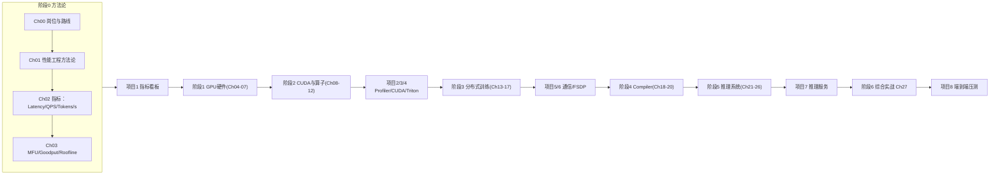

# Ch00：AI Infra 岗位要求与学习路线

> 本课是整个课程的地图：先讲清楚「AI Infra 工程师」到底做什么、能力模型长什么样，
> 再把本课程 28 章 + 8 个综合项目串成一条可执行的成长路线。

## 学习目标

- 理解 AI Infra（AI 基础设施）的岗位全景：训练优化、推理优化、AI 系统工程的分工
- 掌握 AI Infra 工程师的核心能力模型（性能指标、系统原理、工程能力三层）
- 熟悉本课程 7 个阶段、28 章、8 个综合项目的组织逻辑与学习节奏
- 能根据自身背景（Python 开发者 / 算法工程师 / 后端工程师）制定个人学习路线

## 核心概念

### 1. 什么是 AI Infra？

AI Infra 是支撑大模型「训练—部署—推理—服务」的软硬件基础设施总和。它不是单一岗位，
而是一组围绕「让模型跑得更快、更省、更稳」的系统工程能力。

```
┌───────────────────────────────────────────────────────────────┐
│                        AI Infra 全景                          │
│                                                               │
│  训练侧                          推理侧                        │
│  ┌──────────────┐               ┌──────────────┐             │
│  │ 分布式训练    │               │ 推理服务     │             │
│  │ DP/TP/PP/EP  │               │ KV Cache     │             │
│  │ FSDP/ZeRO    │               │ Batching     │             │
│  │ NCCL 调优    │               │ PD 分离      │             │
│  └──────────────┘               └──────────────┘             │
│                                                               │
│  公共底座：GPU 架构 / CUDA / Triton / Compiler / Runtime      │
│  方法论底座：指标（MFU/Goodput） / Roofline / Profiling      │
└───────────────────────────────────────────────────────────────┘
```

### 2. 岗位能力模型：三层结构

AI Infra 工程师的能力可拆成三层，本课程按此结构组织内容：

| 层级 | 能力 | 本课程对应 |
|------|------|-----------|
| ① 指标与方法论 | 能度量、能建模、能定位瓶颈 | 阶段 0（Ch00-Ch03） |
| ② 系统原理 | GPU 架构、显存、互联、通信、调度 | 阶段 1/3/5（Ch04-Ch07、Ch13-Ch17、Ch21-Ch26） |
| ③ 工程手段 | Profiler、Nsight、Triton、torch.compile、CUDA Graph | 阶段 2/4（Ch08-Ch12、Ch18-Ch20） |

> 关键认知：**先有指标，后有优化**。没有 MFU/Goodput 量化，任何"优化"都无法验证，
> 也就无法形成工程闭环。这也是本课程把「性能工程方法论」放在阶段 0 的原因。

### 3. 学习路线图（7 阶段 × 28 章 × 8 项目）



### 4. 工具链全景

| 用途 | 工具 | 何时用 |
|------|------|--------|
| 指标度量 | nvidia-smi、dcgm-exporter、自定义脚本 | 常驻监控 |
| 性能分析 | PyTorch Profiler、Nsight Systems、Nsight Compute | 定位瓶颈 |
| 算子优化 | Triton、CUDA C、cuBLAS/cuDNN | 手写/替换算子 |
| 编译优化 | torch.compile、CUDA Graph | 图级/运行时优化 |
| 分布式 | torch.distributed、NCCL | 多卡训练 |
| 推理服务 | vLLM/SGLang（读懂原理后对比） | 生产部署 |

## 关键代码

### 代码 1：能力模型自查脚本

用本课程提供的 `metrics.py` 快速建立一个「我能干什么」的能力自检，见 `demos/ch00/main.py`。

```python
"""
demos/ch00/main.py（节选）：AI Infra 岗位画像与学习路线打印
"""
import sys
import os
sys.path.insert(0, os.path.abspath(os.path.join(os.path.dirname(__file__), "..", "shared")))
from utils import banner

def main():
    banner("Ch00 · AI Infra 岗位要求与学习路线")
    print("""
AI Infra 核心岗位画像：
① 系统性能工程师   Latency/Throughput/MFU/Roofline
② GPU 算子工程师   CUDA/Triton/Kernel Fusion/TensorCore
③ 分布式训练工程师 NCCL/DP/TP/PP/FSDP/通信调优
④ 推理系统工程师   KV Cache/Batching/PD分离/推测解码
⑤ AI 平台工程师    K8s/调度/监控/成本优化
""")

if __name__ == "__main__":
    main()
```

### 代码 2：用指标库建立第一印象（Ch02 的预告）

```python
# 运行方式：python demos/ch02/main.py
# 本节先感受一下：同样的 GPU，为什么不同口径的"吞吐"差 10 倍？
from metrics import qps, tokens_per_second, goodput

reqs, elapsed = 120, 60.0
total_tok = 120 * (32 + 256)  # 每请求输入 32、输出 256 token
print(f"QPS = {qps(reqs, elapsed):.1f}")
print(f"Tokens/s = {tokens_per_second(total_tok, elapsed):.1f}")
print(f"Goodput(扣5%重试) = {goodput(total_tok, elapsed, 0.05):.1f}")
```

## 课堂练习

### ⭐ 基础：岗位调研清单

对照课程中的 5 类 AI Infra 岗位，从招聘网站找 3 个真实 JD，回答：
1. 每个 JD 要求的技术栈关键词是什么？
2. 关键词分别对应本课程哪些章节？
3. 你自己的背景距离这些 JD 差哪些能力？

### ⭐⭐ 进阶：绘制个人学习路线

基于你的背景，在 README 的 7 阶段路线图上标注：
- 哪些章节可以直接加速（已具备的能力）
- 哪些章节需要重点投入（薄弱环节）
- 8 个项目中你计划先完成哪 3 个，为什么

### ⭐⭐⭐ 挑战：建立"指标思维"清单

阅读 Ch02-Ch03 的指标定义后，列出你手头或身边的 AI 系统：
- 至少 5 个可度量的指标（含单位和采集方式）
- 至少 2 个"容易被错误口径误导"的指标陷阱
- 每个指标对应的优化手段猜想

## 常见问题 Q&A

**Q1：我只会 Python，不写 C/C++，能做 AI Infra 吗？**
A：可以。AI Infra 岗位中很大一部分是「系统性能工程师 / 推理服务工程师」，主要用 Python +
PyTorch + Profiler + Triton（Triton 本身就是 Python DSL）。CUDA C 用于深度算子优化，
本课程从零讲起，C 语法会在需要时边用边学。

**Q2：没有多卡 GPU 机器，分布式训练章节怎么学？**
A：本课程分布式章节（Ch13-Ch17）提供两个路径：① 有 2+ 卡时跑真实 NCCL 实验；
② 无多卡时用 `dist_sim.py` 做通信时间建模与复杂度分析，理解 Ring/Tree 算法与
DP/TP/PP 的通信特征——原理层面不依赖硬件。

**Q3：这门课和「手写 LLM」课程（07_ai_llm）有什么区别？**
A：07_ai_llm 讲「模型怎么实现」（架构、训练、对齐），本课程讲「系统怎么跑得快」
（GPU 原理、算子优化、分布式、推理系统）。两者互补：先懂模型，再懂系统；
有系统视角后，训练/推理代码才真正可控可优化。

**Q4：8 个综合项目会不会很难完成？**
A：项目按阶段递进，每个项目都有配套 Demo 和分步指引。项目 1-4 是单机可完成的分析
与算子实验；项目 5-6 提供无多卡模拟路径；项目 7-8 是推理服务与压测，单卡可完成。
每个项目预计 1-3 天。

## 小结

| 要点 | 说明 |
|------|------|
| AI Infra 岗位 | 训练优化 / 推理优化 / AI 系统工程三条主线 |
| 能力模型 | 指标方法论 → 系统原理 → 工程手段，三层递进 |
| 课程结构 | 7 阶段 / 28 章 / 8 项目，阶段 0 奠定方法论底座 |
| 工具链 | nvidia-smi → Profiler/Nsight → Triton → torch.compile → NCCL |
| 闭环思维 | 建立指标 → 发现瓶颈 → 实施优化 → 验证收益 |

## 下一章预告

Ch01「AI 系统性能工程方法论」将正式进入第一课：为什么大多数"性能优化"最后都失败？
如何用科学的实验设计让优化可验证、可复现、可沉淀？
