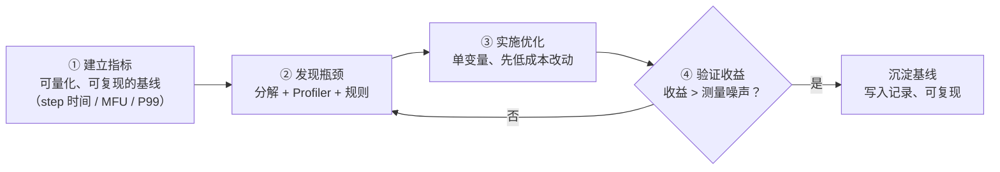
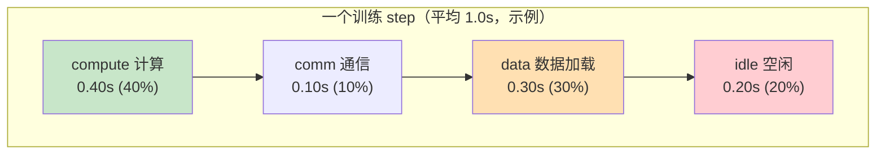
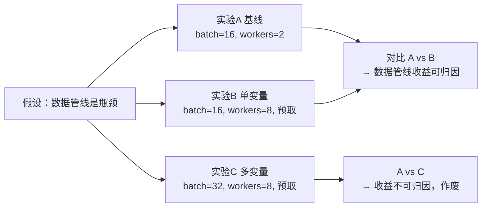

# Ch01：AI 系统性能工程方法论

> 这是整个课程的方法论底座。你可能会说"优化谁不会"，但真正的问题是：
> 大多数"性能优化"最后都失败了——要么改了不验证，要么指标口径对不上，
> 要么一股脑改了很多变量最后不知道收益来自哪里。
> 本课把「建立指标 → 发现瓶颈 → 实施优化 → 验证收益」这个闭环拆开讲清楚。

## 学习目标

- 掌握性能优化闭环四步（建立指标→发现瓶颈→实施优化→验证收益），理解每一步的产出物
- 学会用训练 step 分解（compute / comm / data / idle）定位训练瓶颈
- 理解实验设计的两条铁律：对照实验、单变量原则，以及违反它们的后果
- 识别三类常见陷阱：优化不验证、口径不一、过早优化
- 能运行 `demos/ch01/main.py` 复现一个完整的优化闭环案例

## 核心概念

### 1. 性能优化闭环：为什么"优化"必须闭环

性能优化不是"改一行代码"的灵光一现，而是一个循环往复的工程过程。
没有闭环的优化，等于没有优化——因为你无法回答"优化了多少""靠什么优化的"
"换个环境还能复现吗"。

```
┌─────────────────────────────────────────────────────────────┐
│                   性能优化闭环（四步循环）                    │
│                                                             │
│  ① 建立指标 → ② 发现瓶颈 → ③ 实施优化 → ④ 验证收益         │
│      │              │            │            │             │
│      ▼              ▼            ▼            ▼             │
│  可量化基线     定位根因     单变量改动     统计对比         │
│  (step时间/     (分解/Profile) (先低成本)   (收益>噪声)      │
│   MFU/时延)                                        │        │
│      ▲                                              │        │
│      └────────────── 未达标则回到 ② 重新定位 ───────┘        │
└─────────────────────────────────────────────────────────────┘
```



| 闭环步骤 | 关键动作 | 产出物 | 常见失败方式 |
|---------|---------|--------|-------------|
| ① 建立指标 | 明确口径、采 200+ step、记录基线 | 基线报告（数字 + 口径说明） | 没有基线直接开改 |
| ② 发现瓶颈 | step 分解 / Profiler / 假设验证 | 瓶颈定位（有数据支撑） | 凭感觉"应该是通信慢" |
| ③ 实施优化 | 一次只改一个变量 | 变更清单（可回滚） | 同时改 5 个东西 |
| ④ 验证收益 | 多次测量、统计对比 | 验证报告（提速比 + 显著性） | 跑一次就宣布胜利 |

> **关键认知**：闭环的每一步都必须"有数据"。没有指标，优化无法验证；
> 没有验证，优化无法沉淀；无法沉淀，下一次又从零开始。

### 2. 瓶颈定位：训练 step 的四种时间

单机/多机训练里，一个 step 的时间可以粗略拆成四段。这个分解是 Profiler
（Ch10/Ch18）的输出格式基础，也是面试中"你如何定位训练慢的原因"的标准答法。



| 时间项 | 含义 | 常见原因 | 优化方向（对应章节） |
|--------|------|----------|---------------------|
| compute | 真正跑算子（GEMM/Attention）的时间 | 算子低效、精度选择、图碎片化 | 算子优化（Ch08-12）、Compiler（Ch18-20） |
| comm | 多卡通信（AllReduce 等）等待时间 | 通信算法、拓扑、同步点 | 分布式优化（Ch13-17） |
| data | 数据加载/预处理时间 | num_workers 不足、磁盘 IO、无预取 | 数据管线优化 |
| idle | GPU 空闲等待（launch 间隙、同步等待） | kernel 碎片化、CPU 下发慢 | CUDA Graph、算子融合 |

**规则引擎判断法**（`metrics.critical_path_check`）：

- `comm ≥ 50%` → 通信是瓶颈：梯度压缩 / 增加 Overlap / 换更高带宽互联
- `data ≥ 30%` → 数据加载是瓶颈：加 num_workers / 预取 / 检查磁盘 IO
- `idle ≥ 30%` → 空闲过多：kernel 碎片化，考虑 CUDA Graph / 算子融合
- 否则 → 计算主导，从算子本身优化（下一章 Roofline 模型登场）

> **注意**：这些阈值是经验值，不是物理定律。真实的做法是结合 Profiler
> 火焰图与时间线逐段确认，而不是只看一个汇总数字。

### 3. 实验设计：对照实验与单变量原则

瓶颈找到了，优化方向也定了，接下来"怎么证明改对了"是一门手艺。
两条铁律：

**铁律一：对照组**。永远有"改之前"和"改之后"两组数据做对比，
且两组除目标变量外条件一致（同样的硬件、同样的数据、同样的 warmup 规则）。

**铁律二：单变量**。一次实验只改变一个变量。同时改 batch 和 num_workers，
测出来的收益无法归因——分不清是谁的功劳。



| 实验要素 | 要求 | 反例 |
|---------|------|------|
| 对照组 | 与实验组只差一个变量 | 换了机器 + 换了 batch + 换了代码 |
| 采样量 | 多次测量取均值/分布（≥30 次） | 跑一次就下结论 |
| 噪声控制 | warmup 后再计时，固定负载 | 把冷启动的 3 倍慢也算进去 |
| 复现性 | 记录 seed / 版本 / 环境，可复跑 | "我这边明明快了" |

### 4. 常见陷阱：三类"优化失败"模式

| 陷阱 | 表现 | 后果 | 正确做法 |
|------|------|------|----------|
| 优化不验证 | 改完代码就提交，不测量 | 收益未知甚至变慢 | 闭环第④步：统计对比 |
| 口径不一 | 前后用不同指标/单位对比 | "提速 2 倍"其实是口径差异 | 固定口径（QPS vs Tokens/s） |
| 过早优化 | 瓶颈没定位就优化"看起来慢"的部分 | 优化了 10% 无关代码 | 先分解定位，再动手 |

> **一句话**：没有验证的优化是玄学；没有口径的数字是幻觉；没有定位的优化是赌博。

## 关键代码

### 代码 1：训练 step 分解与瓶颈提示

```python
# 运行方式：python demos/ch01/main.py（纯 CPU 模拟，无需 GPU）
# 本节先看最小闭环：分解 → 提示 → 对比。
from metrics import TrainingStepBreakdown, critical_path_check

# 采样 200 个 step 的平均耗时分解
before = TrainingStepBreakdown(compute_s=0.40, comm_s=0.10, data_s=0.30, idle_s=0.20)
print(before.report())          # step 总耗时 1.00s
print(critical_path_check(before))
# → ⚠️ 数据加载占比高：开启 num_workers / prefetch / 检查磁盘 IO
```

### 代码 2：完整闭环 Demo（`demos/ch01/main.py`）

```python
"""
ch01: AI 系统性能工程方法论
===========================
核心演示：性能优化闭环四步 + 单变量对照实验。
运行方式：python demos/ch01/main.py（纯 CPU 模拟，无需 GPU）
"""
import os
import sys
# Windows 控制台默认 GBK，改为 UTF-8 保证 emoji/中文正常输出
if hasattr(sys.stdout, "reconfigure"):
    sys.stdout.reconfigure(encoding="utf-8")
sys.path.insert(0, os.path.abspath(os.path.join(os.path.dirname(__file__), "..", "shared")))

import numpy as np

from metrics import TrainingStepBreakdown, critical_path_check, mfu
from utils import banner

H100_PEAK_FLOPS = 989e12                       # H100 FP16 峰值（TFLOPS→FLOPs/s）
STEP_FLOPS = 6 * 1.3e9 * 8192                  # 1.3B 模型，前向+反向≈6·P·tokens

before = TrainingStepBreakdown(compute_s=0.40, comm_s=0.10, data_s=0.30, idle_s=0.20)
print(critical_path_check(before))             # Step 2 发现瓶颈
after = TrainingStepBreakdown(compute_s=0.40, comm_s=0.10, data_s=0.12, idle_s=0.08)

for name, bd in [("优化前", before), ("优化后", after)]:
    u = mfu(STEP_FLOPS, H100_PEAK_FLOPS, bd.total)      # Step 4 验证收益
    print(f"{name}: step={bd.total:.2f}s, MFU={u*100:.1f}%")

# 多次测量，模拟真实波动（σ=30ms），避免"跑一次就下结论"
rng = np.random.default_rng(42)
t_before = rng.normal(before.total, 0.03, 30)
t_after = rng.normal(after.total, 0.03, 30)
print(f"优化前: {t_before.mean()*1000:.0f} ± {t_before.std()*1000:.0f} ms/step")
print(f"优化后: {t_after.mean()*1000:.0f} ± {t_after.std()*1000:.0f} ms/step")

# 单变量对照实验：B 只改数据管线（可归因），C 同时改 batch（不可归因）
a = rng.normal(1.00, 0.04, 30); b = rng.normal(0.72, 0.04, 30); c = rng.normal(0.60, 0.04, 30)
print(f"A基线: {a.mean()*1000:.0f}ms | B单变量: {b.mean()*1000:.0f}ms | C多变量: {c.mean()*1000:.0f}ms")
```

**Demo 结构**（与闭环四步一一对应）：

| 章节函数 | 闭环步骤 | 演示内容 |
|---------|---------|---------|
| `part1_establish_metrics` | ① 建立指标 | step 分解输出 + MFU 基线 |
| `part2_find_bottleneck` | ② 发现瓶颈 | 规则引擎给出"数据加载占比高"提示 |
| `part3_optimize` | ③ 实施优化 | 只改数据管线 + CUDA Graph 两项 |
| `part4_verify` | ④ 验证收益 | 30 次测量统计，MFU 6.5%→9.2% |
| `part5_experiment_design` | 方法论 | 单变量对照实验，解释 C 为何不可归因 |

## 课堂练习

### ⭐ 基础：手工做一次 step 分解

用 `TrainingStepBreakdown` 构造下面两种工况并调用 `critical_path_check`：

1. `compute=0.3, comm=0.55, data=0.1, idle=0.05`——提示结果是什么？
2. `compute=0.5, comm=0.1, data=0.1, idle=0.3`——提示结果是什么？

并解释：为什么情况 2 的优化方向是 CUDA Graph / 算子融合而不是加 num_workers？

### ⭐⭐ 进阶：把一次真实训练变成闭环

找一个你跑过的训练脚本（或 Ch07 之后的课程 Demo），完成：

1. 用 `time` 或 `kernel_bench.timed` 采集 20 个 step 的耗时，给出均值与波动
2. 用 `TrainingStepBreakdown` 把平均耗时拆成四段（不会拆分就写估计值并注明"估计"）
3. 按 `critical_path_check` 的规则给出优化建议，并设计一个**单变量**验证方案

### ⭐⭐⭐ 挑战：识别并修复"错误实验"

下面是一次"优化"报告，请找出至少 3 处方法论错误并给出修正：

> "我把 batch 从 16 加到 32，又开了 num_workers=8 和 AMP，
> 训练从 1000ms/step 降到 600ms/step，提速 40%。"
> —— 只跑了一次，用的是优化前没做 warmup 的日志。

提示：对照「对照组 / 单变量 / 采样量 / 噪声控制」四条实验要素逐条检查。

## 常见问题 Q&A

**Q1：step 分解里的四种时间怎么实测拿到？**
A：本课用估计值演示。真实的拿到方式：`torch.profiler` 的 `table()` 给出各
kernel 耗时汇总 → compute；多卡时 `torch.distributed` 的通信 profiler / NCCL 日志
给出 comm；`DataLoader` 采样线程打点给出 data；剩下的墙钟时间与三者的差值就是
idle。Ch10（PyTorch Profiler）与 Ch18（全链路性能定位）会完整演示。

**Q2：阈值（comm≥50%、data≥30%、idle≥30%）是硬性规定吗？**
A：不是。它们是帮助初学者的经验阈值，含义是"超过这个比例，优化对应部分
性价比最高"。真实工程中要结合业务目标判断：比如超算上大模型训练 comm 常年
30-40%，但通过 Overlap 已经压到理论极限，此时阈值本身不再有意义，要回到
Roofline 看 compute 段内部是否还有空间（下一章）。

**Q3：优化后 MFU 从 6.5% 到 9.2%，这个数字是不是太低了？**
A：是的，这是因为示例中 1.3B 模型每 step 只有 8192 token，本身 compute 段的
算力利用率就低（约 16%），这是小 batch 训练的真实写照。真实大规模训练
（7B-70B、大 batch）MFU 通常 40-55%。重要的是**相对变化**和**归因**——
本课强调的是闭环方法，数字的量级在 Ch03 讲清 MFU 口径后你会更敏感。

## 小结

| 要点 | 说明 |
|------|------|
| 优化闭环 | 建立指标 → 发现瓶颈 → 实施优化 → 验证收益，四步循环 |
| step 分解 | compute / comm / data / idle 四段时间，各对应不同优化手段 |
| 规则引擎 | comm≥50%→通信；data≥30%→数据；idle≥30%→碎片化；否则→算子 |
| 实验设计 | 对照组 + 单变量 + 多次采样 + 可复现，四条缺一不可 |
| 三大陷阱 | 优化不验证、口径不一、过早优化 |
| 闭环产出 | 基线报告、瓶颈定位、变更清单、验证报告，全部有数据支撑 |

## 下一章预告

Ch01 解决了"怎么科学地优化"，Ch02 解决"拿什么数字衡量"——Latency、Throughput、
QPS 与 Tokens/s，这些词人人会说，但**同一台 GPU、同一份负载，不同口径的数字可以
差 288 倍**。下一课我们把每个指标的定义、公式、测量方法、单位换算和陷阱一次讲清。
