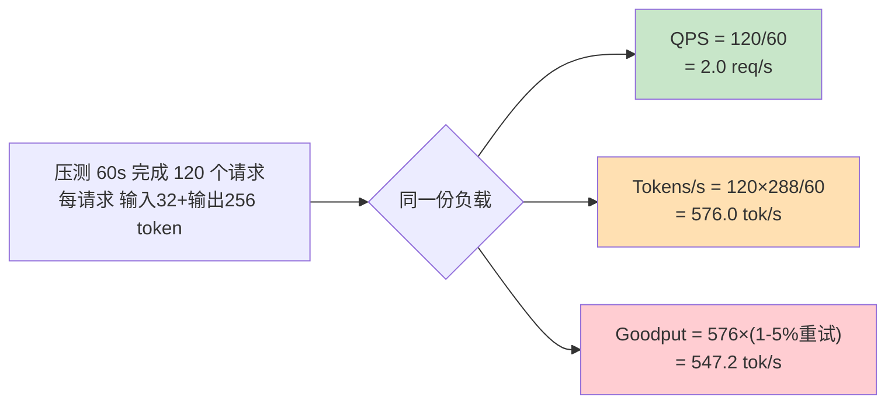
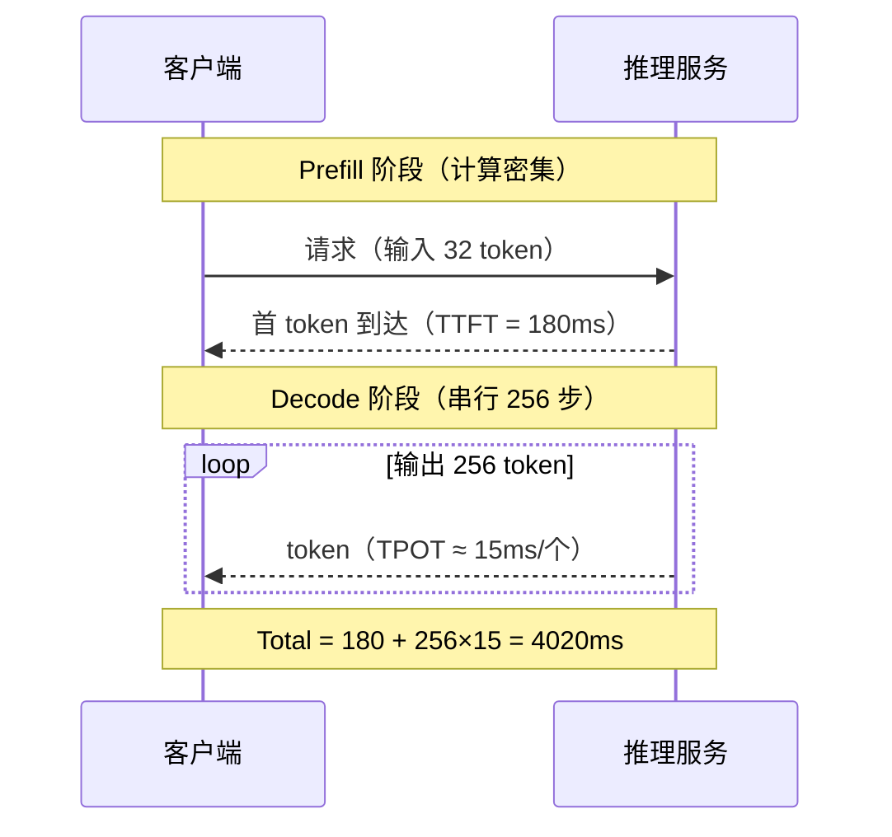

# Ch02：Latency、Throughput、QPS 与 Tokens/s

> 性能工程的第一个陷阱就是"指标"：Latency、Throughput、QPS、Tokens/s……每个词
> 都耳熟能详，但**同一份负载**，用不同的口径汇报，数字可以差出几百倍。
> 本课逐个定义这些指标：公式、测量方法、单位换算，以及最容易踩的四个坑。

## 学习目标

- 掌握 Latency（TTFT / TPOT / ITL / Total）、Throughput、QPS、Tokens/s 的定义与公式
- 学会两类测量方法：串行计时与并发压测，理解它们测出的指标差异
- 掌握单位换算（ms/s、req/s→req/day、tok/s→tok/day）并识别"口径游戏"
- 识别四大指标陷阱：平均 vs P99、并发影响、预热、重试
- 能运行 `demos/ch02/main.py` 复现"同一负载不同口径差 288 倍"的实验

## 核心概念

### 1. 指标家族：它们各自回答什么问题

先分清四类指标在回答不同问题：

```
指标家族（LLM 服务视角）
├── Latency（时延，单位 ms/s）    → 单个请求快不快？
│     ├── TTFT 首 token 时延        → 用户要等多久才看到第一个字？
│     ├── TPOT/ITL 每 token 时延    → 后面每个字生成多快？
│     └── Total 端到端时延          → 整个请求何时完成？
├── Throughput / QPS（req/s）     → 单位时间能接多少请求？
├── Tokens/s（tok/s）             → 单位时间能产出多少 token？
└── Goodput（tok/s，扣开销后）    → 其中多少是有效产出？
```



| 指标 | 公式 | 单位 | 回答的问题 | 陷阱 |
|------|------|------|-----------|------|
| Latency | 墙钟时间（请求起止） | ms / s | 单个请求快不快 | 平均掩盖长尾 |
| TTFT | 首 token 到达时刻 − 请求发出时刻 | ms | 首字多快 | 只反映 Prefill 段 |
| TPOT/ITL | 相邻两 token 到达间隔 | ms | 逐字生成速度 | 受批大小影响大 |
| Throughput | 完成请求数 / 时间 | req/s | 单位时间吞吐 | 与并发强相关 |
| QPS | 同 Throughput | req/s | 服务端请求速率 | 与 Throughput 同义 |
| Tokens/s | 总 token 数 / 时间 | tok/s | 文本产出速率 | 必须说明含不含输入 |
| Goodput | 有效 token 数 / 时间 | tok/s | 有效产出 | 与 Tokens/s 的差=浪费 |

### 2. 时延分解：TTFT 与 TPOT 为什么分开看

LLM 推理是"自回归生成"：先做一次 Prefill 处理整段输入（计算密集、时延大），
然后逐 token 做 Decode（每步只算一个 token，但串行 N 步）。所以：

- **TTFT（Time To First Token）**：从请求发出到第一个输出 token 返回。
  决定"用户觉得系统响不响应"。
- **TPOT（Time Per Output Token）**：Decode 阶段平均每个 token 的生成时间。
  决定"用户等一个字要多久"。线性 Decode 下 TPOT ≈ ITL（Token 间时延）。
- **Total = TTFT + 输出长度 × TPOT**：端到端。



### 3. 测量方法：串行计时 vs 并发压测

| 方法 | 怎么做 | 测到什么 | 适用 |
|------|--------|---------|------|
| 串行计时 | 客户端发一个请求，等完成再发下一个 | 单请求 Latency（干净无干扰） | 单请求延迟分析、Profiler |
| 并发压测 | 同时维持 C 路请求（如 C=8）持续 T 秒 | 服务端真实吞吐（QPS/Tokens/s） | 容量评估、SLO 验收 |

两者关系：**并发 × 时长 = 完成请求数 × 平均时延**（Little's Law），
即 `平均时延 ≈ 并发 × 时长 / 完成请求数`。压测时用这个公式反推平均时延，
与 Profiler 测到的单请求时延交叉验证。

### 4. 单位换算

| 换算 | 公式 | 示例 |
|------|------|------|
| 秒↔毫秒 | 1 s = 1000 ms | 4.02 s = 4020 ms |
| QPS→请求/天 | QPS × 86400 | 2 req/s = 172,800 req/天 |
| Tokens/s→token/天 | × 86400 | 576 tok/s ≈ 49.8M token/天 |
| 时延→串行吞吐 | 吞吐 = 1 / 时延（单路串行时） | 400ms → 2.5 req/s |

> **核心提醒**：任何"提速 X 倍"的说法都必须先回答——X 是相对哪个口径？
> 是 QPS 还是 Tokens/s？是平均还是 P99？口径不写，数字就是噪音。

### 5. 四大指标陷阱

| # | 陷阱 | 现象 | 对策 |
|---|------|------|------|
| 1 | 平均 vs P99 | 平均 120ms 很漂亮，但最慢 1% 是 400ms+ | SLO 用 P95/P99，不用平均 |
| 2 | 并发影响 | QPS 随并发爬坡但时延暴涨 4 倍 | 并发扫描，同时盯时延 |
| 3 | 预热 | 前几个请求触发 JIT/显存分配，慢 3-10 倍 | 先 warmup，稳定后再计时 |
| 4 | 重试 | 5% 超时重试，算力与 token 双倍浪费 | 用 Goodput 扣除，别用毛吞吐 |

## 关键代码

### 代码 1：核心指标一行一个

```python
# 运行方式：python -c "import sys; sys.path.insert(0,'demos/shared'); from metrics import qps, tokens_per_second, goodput; print(qps(120,60.0), tokens_per_second(120*288,60.0), goodput(120*288,60.0,0.05))"
from metrics import qps, tokens_per_second, goodput, LatencyMetrics

reqs, elapsed = 120, 60.0
print(f"QPS={qps(reqs, elapsed):.1f}")                      # 2.0 req/s
print(f"Tokens/s={tokens_per_second(reqs*288, elapsed):.1f}")  # 576.0
print(f"Goodput(5%重试)={goodput(reqs*288, elapsed, 0.05):.1f}")  # 547.2

lm = LatencyMetrics(ttft_ms=180.0, tpot_ms=15.0, total_ms=180.0 + 15.0 * 256)
print(lm.summary())   # TTFT=180 / TPOT=ITL=15 / Total=4020 ms
```

### 代码 2：完整 Demo（`demos/ch02/main.py`）

```python
"""
ch02: Latency、Throughput、QPS 与 Tokens/s
==========================================
同一份负载、不同口径的数字对比 + 四大陷阱演示。
运行方式：python demos/ch02/main.py（纯 CPU 模拟 + numpy，无需 GPU）
"""
import os
import sys
import time
if hasattr(sys.stdout, "reconfigure"):     # Windows GBK 控制台 → UTF-8
    sys.stdout.reconfigure(encoding="utf-8")
sys.path.insert(0, os.path.abspath(os.path.join(os.path.dirname(__file__), "..", "shared")))

import numpy as np
from metrics import LatencyMetrics, qps, tokens_per_second, goodput

# ① 同一负载不同口径：QPS vs Tokens/s vs Goodput
reqs, elapsed = 120, 60.0
total_tok = reqs * (32 + 256)
print(f"QPS={qps(reqs, elapsed):.1f}")            # 2.0
print(f"Tokens/s={tokens_per_second(total_tok, elapsed):.1f}")   # 576.0
print(f"Goodput={goodput(total_tok, elapsed, 0.05):.1f}")        # 547.2

# ② 平均 vs P99：对数正态长尾分布
rng = np.random.default_rng(1)
lat = np.minimum(rng.lognormal(mean=np.log(100.0), sigma=0.6, size=10000), 3000.0)
mean, p99 = lat.mean(), np.percentile(lat, 99)
print(f"平均={mean:.0f}ms, P99={p99:.0f}ms, P99/平均={p99/mean:.1f}倍")

# ③ 并发扫描（Little's Law）：并发↑ → QPS↑ 但时延↑
base_lat = 0.40
for c in [1, 4, 16, 32]:
    l = base_lat * (1 + 0.10 * c)
    print(f"并发{c}: 时延{l*1000:.0f}ms, QPS={c/l:.1f}")

# ④ 预热与重试
print(f"毛吞吐={tokens_per_second(total_tok, elapsed):.1f}, "
      f"Goodput={goodput(total_tok, elapsed, 0.05):.1f}")
t0 = time.perf_counter()
_ = [x*x for x in range(10000)]      # 模拟一次推理
print(f"单次调用计时: {(time.perf_counter()-t0)*1e6:.0f} µs")
```

**运行输出要点**（`python demos/ch02/main.py`）：

- ① 同一负载：QPS=2.0、Tokens/s=576.0、Goodput=547.2，差 288 倍/5%
- ② P99/平均 ≈ 3.4 倍 → 用平均做 SLO 会掩盖长尾
- ③ 并发 1→32：QPS 2.3→19.0（饱和），时延 440→1680ms（4 倍）
- ④ 5% 重试让有效产出直接扣 5%

## 课堂练习

### ⭐ 基础：口径换算练习

一个服务压测结果：并发 16、时长 300s、完成 3000 个请求、每请求输入 64 输出 512 token。

1. 计算 QPS、Tokens/s、平均时延（用 Little's Law）
2. 若 4% 请求超时重试，Goodput 是多少？
3. 用 Tokens/s 换算成"每天能产出多少 token"（单位换算）

### ⭐⭐ 进阶：做一个并发扫描实验

用 `demos/ch02/main.py` 中的模型（`latency = 0.40×(1+0.10×C)`），把并发从 1 扫到 64：

1. 画出（或列表输出）QPS 与平均时延随并发的变化，找出"吞吐不再明显增长"的拐点
2. 假设 SLO 是 P99 时延 ≤ 2s（平均时延的 3 倍），允许的最大并发是多少？
3. 讨论：为什么"盲目加并发"到不了 2 倍吞吐？

### ⭐⭐⭐ 挑战：设计一套不被质疑的压测方案

为一个真实/模拟的推理服务设计压测实验，要求：

1. 写明测量口径（QPS 还是 Tokens/s、含不含输入、平均还是 P99）
2. 设计 warmup 规则与重试处理（Goodput 怎么算）
3. 给出并发扫描的取值与"达标判定"（什么算通过）
4. 指出本方案相比"跑一次看 QPS"规避了哪些陷阱

## 常见问题 Q&A

**Q1：QPS 和 Throughput 到底是不是一个东西？**
A：数值上都是 `请求数/时间`，同义。区别在语境：QPS 通常指**服务端**在单位时间
能接收/处理的请求速率（含排队），Throughput 更强调**完成**的吞吐。面试与报告里
可以直接当同义词，但要统一口径——"服务端 QPS 2.0"与"客户端成功 Throughput 1.8"
是两个数字，前者含排队不算完成。

**Q2：为什么 Tokens/s 比 QPS 更适合 LLM 业务？**
A：LLM 的成本和用户体感都按 token 计：显卡算的是 token 矩阵乘，计费按 token，
输出长度决定体验。QPS 相同但输出长短不同，成本和体验差异巨大，所以业界汇报
LLM 服务几乎都用 Tokens/s（以及它的派生指标 TTFT/TPOT）。ChatGPT 类接口按 token
计费，也印证了这个口径的业务意义。

**Q3：压测时要不要做 warmup？不是多测几次就行吗？**
A：必须 warmup，且不是"多测几次"能替代的。冷启动时 JIT 编译、CUDA 上下文初始化、
显存预分配会让前几个请求慢 3-10 倍，它们会污染均值（尤其拉高 P99）。正确顺序：
预热请求 → 观察吞吐进入稳态 → 清零计时 → 正式压测 → 统计；正式压测中再多次采样
以应对随机波动。

## 小结

| 要点 | 说明 |
|------|------|
| Latency | TTFT（首字）+ TPOT/ITL（逐字）+ Total，反映单请求体验 |
| Throughput/QPS | 请求数/时间，与并发强相关，服务端口径 |
| Tokens/s | token 数/时间，LLM 业务主口径，需说明含不含输入 |
| Goodput | 扣预热/重试/无效输出后的有效产出 |
| 测量方法 | 串行计时测 Latency；并发压测测吞吐；Little's Law 交叉验证 |
| 陷阱 | 平均 vs P99、并发影响、预热、重试，四坑必查 |
| 单位换算 | 1s=1000ms；×86400 得每天量；汇报必须带口径 |

## 下一章预告

Ch02 讲了"吞吐/时延"这些**宏观**指标，Ch03 进入**微观**指标——GPU 到底跑得有多满？
MFU / HFU 把"模型理论运算量"和"硬件峰值算力"放在一起做除法，而 Roofline 模型
用一条折线画出每个算子的性能上界。这是判断"计算密集还是访存密集"的终极工具，
也是后续所有算子优化的理论起点。
