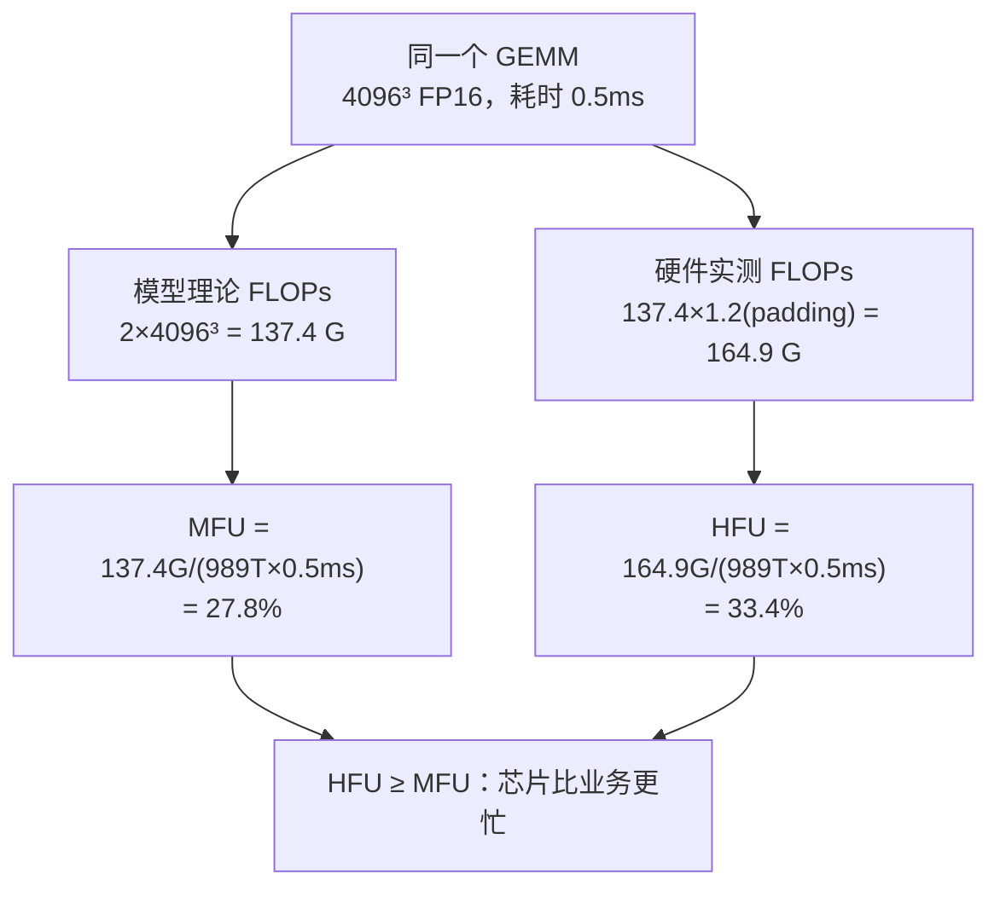
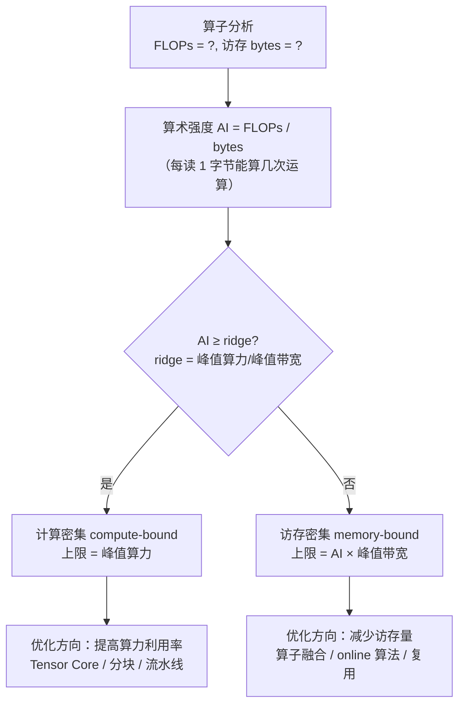

# Ch03：MFU、HFU、Goodput 与 Roofline 性能建模

> 上一课讲的是"宏观吞吐"，本课进入"微观利用率"：一块 H100 标称 989 TFLOPS，
> 你的训练代码实际只跑出 6.5%——这个比例怎么算？能不能在动手优化之前就
> 判断"这块算子的理论天花板在哪"？答案就是 MFU/HFU 与 Roofline 模型。

## 学习目标

- 掌握 MFU（Model FLOPs Utilization）与 HFU 的定义与公式，区分两者口径
- 掌握 Goodput 的定义，理解"MFU 高 ≠ 有效产出高"
- 掌握 Roofline 模型三要素：算术强度 AI、转折点（ridge point）、计算/访存密集判断
- 会查 `gpu_specs.py` 的 GPU 参数并手工计算任意算子的性能上界
- 能运行 `demos/ch03/main.py` 对 elementwise/softmax/GEMM 建模并给出优化方向

## 核心概念

### 1. MFU：模型算力利用率

**MFU（Model FLOPs Utilization）** 是 OpenAI/Megatron 训练社区最常用的利用率指标。
它回答：跑这块模型，GPU 的理论算力用上了百分之几？

```
MFU = achieved_flops / (peak_flops × time)
```

| 符号 | 含义 | 怎么来 |
|------|------|--------|
| `achieved_flops` | 时间窗口内**模型理论需要**的 FLOPs 总数 | 统计公式估算：如 6×P×tokens |
| `peak_flops` | 硬件理论峰值（查 gpu_specs） | A100 FP16=312T、H100 FP16=989T |
| `time` | 完成这些运算的实际墙钟时间 | 计时（秒） |

例子：1.3B 模型每 step 处理 8192 token，`achieved = 6×1.3e9×8192 ≈ 6.39e13 FLOPs`，
耗时 1.0s，H100 上 `MFU = 6.39e13 / (989e12 × 1.0) = 6.5%`。

**常见量级**（业界参考，非标准答案）：大模型大规模训练 MFU 通常 40-55%，
已属优秀；低于 20% 一定存在明显瓶颈（数据、通信、碎片化）。

### 2. HFU：硬件算力利用率

**HFU（Hardware FLOPs Utilization）** 与 MFU 的唯一区别在分子：

```
HFU = 硬件实测 FLOPs / (peak_flops × time)
```

- MFU 的分子是**模型理论 FLOPs**（业务口径，忽略冗余运算）
- HFU 的分子是**硬件实际执行的 FLOPs**（用 profiler/counter 测得，含 padding、
  补零、lowbit 冗余等额外计算）

因为硬件实际算的 ≥ 模型理论需要的，所以**恒有 HFU ≥ MFU**。
两者差得越多，说明"芯片越忙但产出越少"——这是一个值得深挖的信号
（冗余计算 / 精度浪费 / 图质量差）。



### 3. Goodput：有效吞吐

**Goodput** 不是一个新的"利用率"，而是把无效产出扣掉之后的有效吞吐：

```
Goodput = 总产出 × (1 − 开销比例) / 时间
```

| 场景 | MFU/Tokens-s 会掩盖什么 | Goodput 怎么算 |
|------|------------------------|----------------|
| 训练 | step 因 OOM 回退/重试而浪费 | 等效利用率 = MFU × (1−浪费率) |
| 推理 | 超时重试、无效输出 token | Tokens/s × (1−重试率) |

**一句话**：MFU/HFU 回答"机器跑得满不满"（系统视角），Goodput 回答
"产出有没有效"（业务视角）。为了 MFU 好看而引入的无效计算/重试，
在 Goodput 面前原形毕露。

### 4. Roofline 模型：画出性能上界

Roofline（屋顶线）把"算力"和"带宽"统一画在一张图里，回答一个核心问题：
**这个算子在当前硬件上，理论上最快能多快？**



三个关键量：

```
算术强度   AI = FLOPs / 访存字节数        （FLOPs/byte，衡量"运算密度"）
转折点     ridge = 峰值算力 / 峰值带宽    （FLOPs/byte，两种瓶颈的分界）
性能上界   achievable = min(峰值算力, AI × 峰值带宽)
```

**转折点物理意义**：当 AI 恰好等于 ridge 时，"带宽能吃满算力"——
再高就变成算力不够用（计算密集），再低就是数据喂不满算力（访存密集）。

### 5. 用 gpu_specs.py 手工建模

| GPU | FP16 峰值 (TFLOPS) | 带宽 (TB/s) | ridge (FLOPs/byte) |
|-----|-------------------|-------------|---------------------|
| A100 SXM 80G | 312 | 2.04 | 152.9 |
| H100 SXM 80G | 989 | 3.35 | 295.2 |
| L40S | 362 | 0.864 | 419.0 |
| RTX 4090 | 330 | 1.01 | 326.7 |

> H100 的 ridge ≈ 295 FLOPs/byte：一个算子每读 1 字节如果能算超过 295 次浮点，
> 就是计算密集，否则是访存密集。

**四个典型算子的算术强度**（FP16，2 字节/元素）：

| 算子 | AI 计算 | AI (FLOPs/byte) | H100 上判定 |
|------|---------|-----------------|-------------|
| Elementwise（ReLU） | 每元素 1 次运算，读+写 2 次 | ≈0.25 | 访存密集 |
| Softmax(512×4096) | 5 ops/elem，读 2 遍写 1 遍 | ≈0.83 | 访存密集 |
| GEMM 512³ | 2·512³ FLOPs，访存 3·512²·2B | ≈170.7 | 访存密集（意外！） |
| GEMM 4096³ | 2·4096³ FLOPs，访存 3·4096²·2B | ≈1365 | 计算密集 |

> **教学亮点**：512³ 的小 GEMM 在 H100 上居然是**访存密集**——因为矩阵太小，
> 数据搬运时间盖过了计算时间。这解释了为什么"把多个小 GEMM 合并成一个大的"
> 是经典优化手段。

**优化方向对照**：

- 访存密集（AI < ridge）→ 目标是**减少访存量**：算子融合（读一次代替读 N 次）、
  online softmax（一趟流式）、加大分块复用、小算子合并
- 计算密集（AI ≥ ridge）→ 目标是**提高算力利用率**：Tensor Core 分块、流水线
  overlap、把 MFU 从 30% 推向 70%+

## 关键代码

### 代码 1：三步完成 Roofline 建模

```python
# 运行方式：python demos/ch03/main.py
from gpu_specs import get_spec
from roofline import RooflineModel, gemm_ai, elementwise_ai, softmax_ai

g = get_spec("H100_SXM")                       # 989 TFLOPS, 3.35 TB/s
rl = RooflineModel(g.fp16_tflops * 1e12, g.hbm_bw_tbs * 1e12, g.name)

print(f"ridge = {rl.ridge_point:.1f} FLOPs/byte")        # 295.2
for name, ai in [("elementwise", elementwise_ai(1_000_000)),
                 ("GEMM 4096³", gemm_ai(4096, 4096, 4096))]:
    print(f"{name}: AI={ai:.1f} → {rl.bound_type(ai)}，"
          f"上限 {rl.achievable_perf(ai)/1e12:.0f} TFLOPS")
```

### 代码 2：完整 Demo（`demos/ch03/main.py`）

```python
"""
ch03: MFU、HFU、Goodput 与 Roofline 性能建模
============================================
运行方式：python demos/ch03/main.py
（有 torch 时跑一段真实 CPU matmul 计时；无 torch 也能演示建模部分）
"""
import os
import sys
import time
if hasattr(sys.stdout, "reconfigure"):
    sys.stdout.reconfigure(encoding="utf-8")
sys.path.insert(0, os.path.abspath(os.path.join(os.path.dirname(__file__), "..", "shared")))

from gpu_specs import get_spec, compare
from roofline import RooflineModel, gemm_ai, elementwise_ai, softmax_ai
from metrics import mfu, goodput, tokens_per_second

# ① MFU vs HFU：同一个 GEMM（H100，0.5ms）
peak = get_spec("H100_SXM").fp16_tflops * 1e12
model_flops = 2 * 4096 ** 3                    # 137.4 GFLOPs
hw_flops = model_flops * 1.2                   # padding 多算 20%
print(f"MFU={mfu(model_flops, peak, 0.0005)*100:.1f}%")     # 27.8%
print(f"HFU={hw_flops/(peak*0.0005)*100:.1f}%")             # 33.4%

# ② 真实测量：CPU 上跑 matmul
try:
    import torch
    a = torch.randn(1024, 1024); b = torch.randn(1024, 1024)
    for _ in range(3): c = a @ b               # warmup
    t0 = time.perf_counter()
    for _ in range(5): c = a @ b
    dt = (time.perf_counter() - t0) / 5
    print(f"CPU matmul 1024³: {dt*1000:.1f}ms, "
          f"achieved={2*1024**3/dt/1e9:.0f} GFLOPs/s")
except ImportError:
    print("未安装 torch，跳过真实测量")

# ③ Roofline 建模：H100/A100/L40S 转折点 + 算子分类
print(compare("H100_SXM", "A100_SXM", "L40S"))
rl = RooflineModel(get_spec("H100_SXM").fp16_tflops * 1e12,
                   get_spec("H100_SXM").hbm_bw_tbs * 1e12, "H100")
print(f"ridge = {rl.ridge_point:.0f} FLOPs/byte")
for name, ai in [("elementwise", elementwise_ai(1_000_000)),
                 ("softmax 512×4096", softmax_ai(512, 4096)),
                 ("GEMM 512³", gemm_ai(512, 512, 512)),
                 ("GEMM 4096³", gemm_ai(4096, 4096, 4096))]:
    print(f"{name}: AI={ai:.1f} → {rl.bound_type(ai)}, "
          f"上限 {rl.achievable_perf(ai)/1e12:.0f} TFLOPS")

# ④ Goodput：MFU 高 ≠ 产出有效
print(f"训练: 等效利用率 = MFU×0.92 = {0.60*0.92*100:.0f}%")
print(f"推理: Goodput = {goodput(120*288, 60.0, 0.05):.1f} tok/s")
```

**运行输出要点**：

- ① 同一 GEMM：MFU 27.8% < HFU 33.4%，padding 让芯片"更忙但没多产出"
- ② CPU 实测 matmul 1024³ 约 936 GFLOPs/s，相对 H100 峰值仅 0.095%——硬件决定天花板
- ③ ridge：A100 152.9 / H100 295.2 / L40S 419.0；512³ GEMM 在 H100 上是访存密集
- ④ MFU 60% 但 8% 浪费 → 等效 55%；Goodput 永远低于毛吞吐

## 课堂练习

### ⭐ 基础：手工算 MFU 与 ridge

1. 7B 模型（P=7e9）每 step 处理 65536 token，耗时 2.1s，在 A100（FP16 312T）上
   MFU 是多少？（公式：6×P×tokens）
2. 计算 L40S 的 ridge 点并解释其物理含义（数据见 gpu_specs）
3. 一个算子 FLOPs=1e11、访存=1e9 字节，在 H100 上是计算密集还是访存密集？

### ⭐⭐ 进阶：为算子画"优化方向卡"

用 `demos/ch03/main.py` 的建模结果，为下面 4 个算子各写一张"优化方向卡"：

| 算子 | AI | 瓶颈类型 | 你的优化建议 |
|------|-----|---------|-------------|
| elementwise | 0.25 | 访存密集 | ? |
| softmax 512×4096 | 0.83 | 访存密集 | ? |
| GEMM 512³ | 170.7 | 访存密集（H100） | ? |
| GEMM 4096³ | 1365 | 计算密集 | ? |

要求：每条建议写"为什么这样能加快"（减少访存 or 提高算力利用）。

### ⭐⭐⭐ 挑战：Roofline 指导下的取舍论证

场景：A100 上训练 7B 模型，MFU 只有 25%，你怀疑是"数据喂不饱 GPU"。
用 Roofline 思想设计验证与优化：

1. 如何用算术强度判断瓶颈在"数据管线"还是"算子本身"？（提示：对比大 GEMM 与小 GEMM 的实测/理论上限差）
2. 如果确认是小 GEMM 碎片化导致访存受限，给出 2 种解法并各写一行原理
3. 优化后 MFU 到 45%，但 Goodput 只提升 8%，请解释可能原因（挑战点）

## 常见问题 Q&A

**Q1：MFU 里 FLOPs 到底怎么算？为什么是 6×P×tokens？**
A：前向+反向一个 batch 的 FLOPs ≈ 前向 2×P×tokens（每 token 每参数约 2 次运算）+
反向约 4×P×tokens（梯度回传约为前向 2 倍），合计 6×P×tokens。这是 Megatron/业界
通用估算公式，不含激活重算等细节。精确值用 profiler 统计或按具体层算，但 6×P×tokens
足够做量级判断。

**Q2：为什么说 512³ 的小 GEMM 在 H100 上是"访存密集"？这反直觉。**
A：判断标准不是"GEMM 这种名字"，而是算数强度 AI。512³ 的总访存量
（3×512²×2B ≈ 1.57MB）相对其运算量（2×512³ ≈ 268 MFLOPs）偏大，AI=170.7 低于
H100 的 ridge=295.2，所以数据搬运成为瓶颈。把多个 512³ 合并成 4096×512×4096 的
大 GEMM 后 AI 大幅上升就转入计算密集——这正是 Batch GEMM / 融合注意力的动机。

**Q3：MFU 高就代表系统好吗？为什么还要看 Goodput？**
A：MFU 是"系统视角"——芯片跑得多满；但它计的是"模型理论 FLOPs"，不区分这些
运算是否有效。若为了刷 MFU 引入无效计算（例如低精度下重算、不必要的重试、重复
梯度累积），Goodput 会立刻打脸。正确姿势：MFU 定位系统瓶颈，Goodput 验收业务
收益，两者一起看。

## 小结

| 要点 | 说明 |
|------|------|
| MFU | 模型理论 FLOPs /（峰值×时间），训练社区主指标，典型 40-55% |
| HFU | 硬件实测 FLOPs /（峰值×时间），恒有 HFU ≥ MFU，差值=冗余运算 |
| Goodput | 有效吞吐=毛吞吐×(1−开销)，验收业务收益 |
| 算术强度 AI | FLOPs / 访存字节数，衡量运算密度 |
| 转折点 ridge | 峰值算力 / 峰值带宽，AI<ridge→访存密集，AI≥ridge→计算密集 |
| 优化方向 | 访存密集→减少访存（融合/复用）；计算密集→提高算力利用（Tensor Core） |
| 建模工具 | gpu_specs.py 参数表 + roofline.py 建模器，先算天花板再动手 |

## 下一章预告

方法论的"指标"部分到此结束：Ch01 学会闭环、Ch02 学会宏观指标、Ch03 学会微观
利用率与 Roofline。从 Ch04 开始进入**系统原理**——MFU 里的"峰值算力 989 TFLOPS"
和 Roofline 里的"带宽 3.35 TB/s"到底从哪来？GPU 的 SM、显存层次、Tensor Core
如何工作？理解硬件，才能理解指标的边界。
