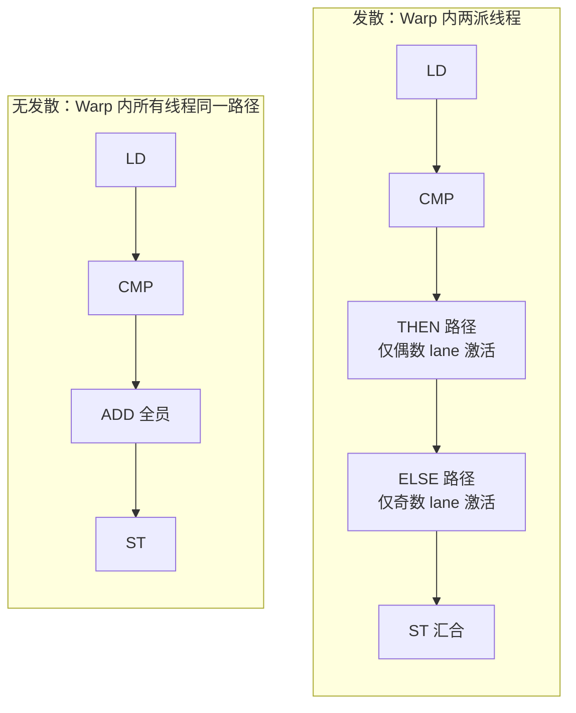
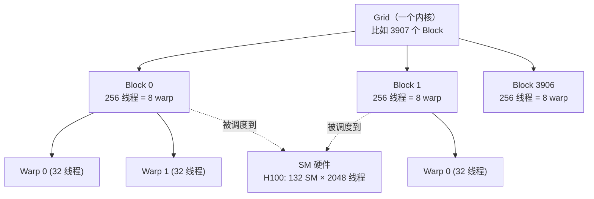

# Ch04：GPU 架构与并行计算基础

> 阶段 1 的第一课。我们要回答一个看似简单、实则是整个 AI Infra 知识地基的问题：
> **GPU 凭什么比 CPU 快 1000 倍？** 答案藏在三个词里：**SIMT、Warp、大规模并行**。
> 这一章把 GPU 的硬件骨架（SM/SP）、执行模型（SIMT）、调度单位（Warp）和
> 编程层级（Grid/Block/Thread）讲透，为后续 CUDA 算子优化（Ch08-Ch12）打地基。

## 学习目标

- 能用「延迟优先 vs 吞吐优先」解释 CPU 与 GPU 的根本设计差异
- 掌握 GPU 的硬件单元层次：SM → SMSP → SP，以及 H100/A100 的 SM 数量与算力规模
- 理解 SIMT（单指令多线程）执行模型：一个 Warp 的 32 个线程如何共享指令流
- 理解 Warp 是 GPU 调度的最小单位，以及分支发散（Divergence）的代价
- 掌握 Grid/Block/Thread 三级并行层级，能手工换算 Launch 配置与驻留波次（wave）

## 核心概念

### 1. GPU vs CPU：延迟优先 vs 吞吐优先

CPU 与 GPU 是两种设计哲学的极端：

| 设计维度 | CPU（延迟优先） | GPU（吞吐优先） |
|----------|----------------|----------------|
| 设计目标 | 让单条指令尽快执行完 | 让海量线程整体吞吐最大 |
| 核心数 | 8~64 个大而强的核心 | 数千~上万个小而多的核心 |
| 核心频率 | 3~5 GHz（超深流水线） | 1.5~2.5 GHz（浅流水线） |
| 缓存策略 | 大 L1/L2 + 分支预测 | 小缓存，靠线程切换隐藏延迟 |
| 适合负载 | 串行、分支密集、控制流 | 大规模同构数据并行 |
| 峰值算力 | ~1 TFLOPS | ~989 TFLOPS（H100 FP16） |

> **为什么需要理解这个对比？** AI Infra 工程师每天都在做「CPU/GPU 任务切分」：
> 数据加载、调度、控制流交给 CPU；GEMM/卷积/Attention 这些「规整的重计算」
> 交给 GPU。不明白两者的差异，就无法解释「为什么 GPU 利用率上不去」。

### 2. SM / SP：GPU 的「工厂车间」

GPU 是一个由大量 **SM（Streaming Multiprocessor，流式多处理器）** 组成的工厂，
每个 SM 内部又有若干 **SP（Streaming Processor，流处理器）** 作为执行单元。

```
H100 SXM（官方参数，来自 gpu_specs.py）
┌─────────────────────────────────────────────┐
│ 132 个 SM                                    │
│ ┌─────────────┐  ┌─────────────┐            │
│ │ 128 FP32核  │  │ 128 FP32核  │   ... ×132  │
│ │ 4 个 SMSP   │  │ 4 个 SMSP   │            │
│ │ 64K 寄存器  │  │ 64K 寄存器  │            │
│ └─────────────┘  └─────────────┘            │
│ 每 SM：2048 线程 = 64 warp，228KB Shared Mem │
└─────────────────────────────────────────────┘
```

| GPU | SM 数 | 每 SM FP32 核 | FP32 总核数 | FP16 峰值 | 显存带宽 |
|-----|-------|--------------|------------|----------|---------|
| H100 SXM | 132 | 128 | 16,896 | 989 TFLOPS | 3.35 TB/s |
| A100 SXM | 108 | 64 | 6,912 | 312 TFLOPS | 2.04 TB/s |
| RTX 4090 | 128 | 128 | 16,384 | 330 TFLOPS | 1.01 TB/s |

> **为什么需要知道 SM 数？** 所有「并行度够不够」的判断都依赖它：内核开出的
> block 数、每 SM 能驻留多少线程、要跑几个 wave——都从 SM 数出发推算。

### 3. SIMT 执行模型与 Warp：GPU 的灵魂

SIMT（Single Instruction, Multiple Thread，单指令多线程）是 GPU 执行模型的核心：

- GPU 把线程分成一组一组的 **Warp**，每组固定 **32 个线程**（在 NVIDIA 上）
- 一个 Warp 内的 32 个线程**共享同一条指令流**，锁步执行（同一时刻执行同一条指令）
- 硬件只需一个指令控制器 + 32 个执行单元，就能驱动 32 份数据并行工作

```
一个 Warp 的锁步执行（模拟：向量加 y = a + b + 1）
指令流:   LD   →   LD   →   ADD   →   ST
         │         │         │         │
Lane 0:  a[0]     b[0]     +1        y[0]
Lane 1:  a[1]     b[1]     +1        y[1]
 ...     ...      ...      ...       ...
Lane 31: a[31]    b[31]    +1        y[31]
时钟:     t=1      t=2      t=3       t=4
```

四个时钟周期完成 32 份标量工作 —— 这就是 SIMT 的威力。

> **为什么是 32 而不是 1？** 因为 GPU 的哲学是「用并行隐藏一切开销」：
> 指令取指/解码只有一份，执行单元却有很多份。Warp 越大，单条指令摊到的
> 并行度越高。32 是 NVIDIA 经过延迟隐藏权衡后定下的经典值。

### 4. 分支发散（Divergence）：SIMT 的代价

锁步执行遇到 `if/else` 就麻烦了：同一时刻所有线程必须执行同一条指令，所以
硬件把 Warp 拆成多个「谓词掩码」，**先执行 then 路径，再串行执行 else 路径**。



| 场景 | 时钟周期 | Warp 利用率 |
|------|---------|------------|
| 无发散（全员走 then） | 4 | 100% |
| 2 路发散（then/else 各半） | 5 | 80% |
| 4 路发散（switch i%4） | 7 | 57% |

> **为什么需要知道发散？** 这是编写高性能 kernel 的铁律：**让 Warp 内的 32 个
> 线程尽量走同一条分支**。用取模/查表/位运算/谓词执行替代分支，是 CUDA 优化
> 的日常操作。

### 5. Grid / Block / Thread：编程与硬件的桥梁

CUDA 编程把并行任务组织成三级结构，硬件把 Block 调度到 SM 上执行：



以「处理 100 万个元素」为例（Launch 配置换算）：

| 参数 | 值 | 计算 |
|------|-----|------|
| 总任务 | 1,000,000 元素 | - |
| Block（线程块） | 256 线程 | 128~1024，取 256 的倍数 |
| Grid（网格） | 3,907 个 Block | ceil(1,000,000 / 256) |
| H100 并发线程 | 270,336 | 132 SM × 2048 |
| 同时驻留 Block | 1,056 个 | 270,336 / 256 |
| 执行波次（wave） | ~3.7 | 3,907 / 1,056 |

> **为什么需要理解三级层级？** GPU 上「数据够大 + 分块够细」才能喂饱所有 SM。
> 块太大资源驻留不下，块太小调度开销上升。Block 数与 SM 数的匹配直接决定
> 利用率——这是后面 Occupancy（Ch08）的内容。

## 关键代码

运行方式：`python demos/ch04/main.py`（无 GPU 也可运行，纯 Python 模拟）。

本 Demo 用 `WarpSim` 类模拟 SIMT 的锁步执行与分支发散，并输出 GPU 参数表：

```python
"""
ch04 Demo 节选：SIMT Warp 模拟器
"""
import sys
import os
sys.path.insert(0, os.path.abspath(os.path.join(os.path.dirname(__file__), "..", "shared")))
from gpu_specs import get_spec, compare
from utils import banner

class WarpSim:
    """极简 SIMT 模拟器：32 个 lane 共享一条指令流（锁步执行）。"""

    def __init__(self, size: int = 32):
        self.size = size
        self.reg = [0.0] * size          # 每个 lane 的"寄存器"
        self.steps = [0] * size          # 每个 lane 累计执行的指令数
        self.cycles = 0                  # warp 消耗的时钟周期

    def ld(self, base, stride, mask):
        for i in range(self.size):
            if mask[i]:
                self.reg[i] = base + i * stride
        self._commit(mask)

    def add(self, c, mask):
        for i in range(self.size):
            if mask[i]:
                self.reg[i] += c
        self._commit(mask)

    def st(self, mask):
        self._commit(mask)

    def _commit(self, mask):             # 锁步：一条指令 = 一个时钟周期
        for i in range(self.size):
            if mask[i]:
                self.steps[i] += 1
        self.cycles += 1

    def utilization(self) -> float:      # 有效 lane-指令 / (lane × 周期)
        useful = sum(self.steps)
        return useful / (self.size * self.cycles) if self.cycles else 0.0

def main():
    banner("Ch04 · GPU 架构与并行计算基础")

    # 实验 1：锁步执行 —— 4 条指令，4 个周期，利用率 100%
    w = WarpSim(32)
    mask_all = [True] * 32
    w.ld(0, 1, mask_all); w.ld(1000, 1, mask_all)
    w.add(1.0, mask_all); w.st(mask_all)
    print(f"无分支：周期 = {w.cycles}, 利用率 = {w.utilization()*100:.0f}%")

    # 实验 2：分支发散 —— 先执行 then 再执行 else，5 个周期
    mask_even = [i % 2 == 0 for i in range(32)]
    mask_odd = [not m for m in mask_even]
    w = WarpSim(32)
    w.ld(0, 1, mask_all); w.add(0, mask_all)
    w.add(100, mask_even)                # then 路径：仅偶数 lane
    w.add(-100, mask_odd)                # else 路径：串行补执行
    w.st(mask_all)
    print(f"2 路发散：周期 = {w.cycles}, 利用率 = {w.utilization()*100:.0f}%")

    # 实验 3：Grid/Block/Thread 换算
    N, block = 1_000_000, 256
    grid = -(-N // block)
    print(f"grid = {grid} 个 block, H100 并发 = {132*2048:,} 线程")

    # 实验 4：GPU 参数表
    print(compare("H100_SXM", "A100_SXM", "RTX4090"))

if __name__ == "__main__":
    main()
```

运行后你会看到：无分支的 Warp 以 4 个周期、100% 利用率完成向量加；
一旦出现 2 路分支，周期变成 5、利用率掉到 80%；4 路分支进一步恶化到 57%。
这就是为什么 kernel 优化永远把「消除分支发散」挂在嘴边。

## 课堂练习

### ⭐ 基础：参数换算手算

1. 用 `gpu_specs.py` 查 A100 的 SM 数（108），计算：A100 单卡最大并发线程数
   （提示：每 SM 2048 线程）是多少？
2. 把 4096×4096 的矩阵按行做逐元素加法，用 block=512 线程，grid 应该是多少？
   A100 上需要多少个 wave 才能跑完？
3. 在自己的笔记本上运行 `python demos/ch04/main.py`，核对「实验 3」输出中
   H100 与 A100 的 wave 数差异，并解释为什么 A100 需要更多 wave。

### ⭐⭐ 进阶：发散成本实验

修改 `WarpSim` 模拟器，增加一个「8 路发散」场景（如 `switch(i % 8)`），回答：
1. 周期数是多少？（预测后验证：LD/CMP/8 路/ST）
2. 利用率是多少？与 2 路、4 路发散对比，画一张「发散路数 → 利用率」的趋势图
3. 思考：如果一个 Warp 内只有 1 个线程走 else，其余 31 个走 then，
   代价还是 +1 周期吗？（提示：是的，SIMT 只认路径，不认人数）

### ⭐⭐⭐ 挑战：真实世界中的发散

1. 写一个二分查找：对一个已排序数组，32 个线程各查一个 key，统计每个线程的
   查找路径长度。发散程度有多严重？如果改成「先按路径长度桶排序，再逐桶执行」，
   发散能减少多少？（思路：这就是 GPU 上的 sort-and-segmented-scan 技巧）
2. 阅读 PyTorch 的 `torch.topk` 或 `torch.where` 的 kernel 思路，思考它们
   如何规避发散（提示：`torch.where` 是逐元素选择，天然无发散）。
3. 用 `nvidia-smi topo -m`（有 NVIDIA 机器时）观察 GPU 拓扑，
   思考 P2P 链路是否会影响 warp 调度——把观察结果写进笔记。

## 常见问题 Q&A

**Q1：Warp 一定是 32 个线程吗？为什么是 32？**
A：NVIDIA GPU 上 Warp 固定为 32 线程，这是硬件设计决定的：32 个 lane 恰好能
隐藏 ~20 周期的访存延迟（32 个 warp 轮流跑），同时指令取指/解码/发射的硬件
成本被 32 份并行摊薄后最划算。AMD 的 wavefront 是 64，Intel 的是 8/16——
数字不同，原理一致：一组锁步线程 + 一个调度器。编程时你不需要关心 Warp 边界，
但关心「线程索引连续 = 同 Warp」能帮你写出合并访问（Ch05）的代码。

**Q2：SP、CUDA Core、SM 是什么关系？**
A：它们是不同时期的叫法。SP（Streaming Processor）就是 CUDA Core（FP32 执行
单元）；多个 SP 组成 SM（Streaming Multiprocessor）。H100 的 SM 里有 128 个
FP32 CUDA Core，加上 SFU（特殊函数单元）、Tensor Core、LD/ST 单元。SM 是
「可以独立调度 warp 的最小单元」，SP 只是 SM 里的一把螺丝刀。面试时把「SM 是
调度单位、SP 是执行单位」讲清楚即可。

**Q3：为什么 GPU 频率比 CPU 低，算力反而高 1000 倍？**
A：因为算力 = 频率 × 并行度 × 每周期操作数。CPU 频率 5GHz × 单核少量 FLOPs；
GPU 频率 2GHz × 16,896 个 FP32 核 × 向量化/Tensor Core 每周期多条 FLOPs。
用 H100 的 FP16 Tensor Core 算：989 TFLOPS ≈ 2GHz × 132 SM × 每 SM 每周期
数百次 FP16 乘加。并行度是 GPU 的命根子，这也是为什么「数据不够大」时 GPU
反而跑不过 CPU——没有足够的线程去填满流水线。

**Q4：SIMT 和 SIMD 有什么区别？**
A：SIMD（如 CPU 的 AVX）是「一条指令操作打包好的 N 个数据」，宽度固定（128/256
位），程序员显式写向量代码；SIMT 是「一条指令驱动 N 个标量线程」，线程各自有
寄存器与状态，可以走不同分支（代价是发散），程序员写的是普通标量逻辑、由
编译器/硬件自动并行。SIMT 更灵活：同样写 `a[i]+b[i]`，CPU 需要向量化才能快，
GPU 天然就是并行的。

## 小结

| 要点 | 说明 |
|------|------|
| CPU vs GPU | 延迟优先 vs 吞吐优先；GPU 靠大规模并行取胜 |
| SM/SP 结构 | H100 = 132 SM × 128 FP32 核；SM 是独立调度单元 |
| SIMT | 单指令多线程：一个控制器驱动多个执行单元 |
| Warp | 32 线程一组，锁步执行，是 GPU 调度的最小单位 |
| 分支发散 | if/else 路径串行化，利用率从 100% 掉到 57%（4 路） |
| Grid/Block/Thread | 三级层级；Block 驻留 SM，按 wave 分批执行 |
| 并行规模 | H100 并发线程 ≈ 132 × 2048 = 27 万 |

一句话：**GPU = 大规模 SIMT 机器，Warp 是它的心跳，发散是它的天敌。**

## 下一章预告

Ch05「GPU 显存层次与内存访问」将回答第二个关键问题：算力这么高，数据从哪里来？
从 HBM 到寄存器的每一层都有带宽和延迟的鸿沟，而「合并访问」和「共享内存」
是跨过鸿沟的两座桥。
