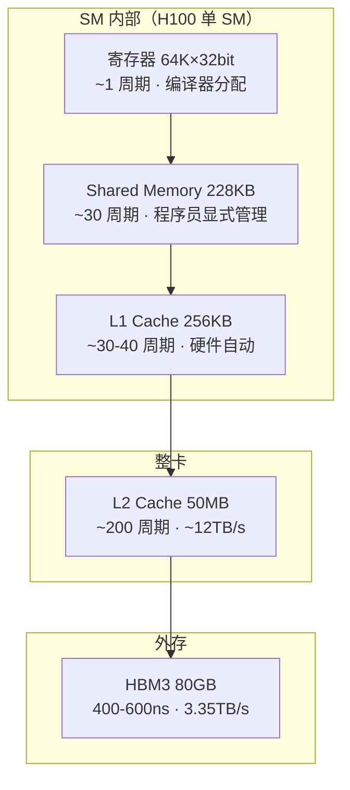
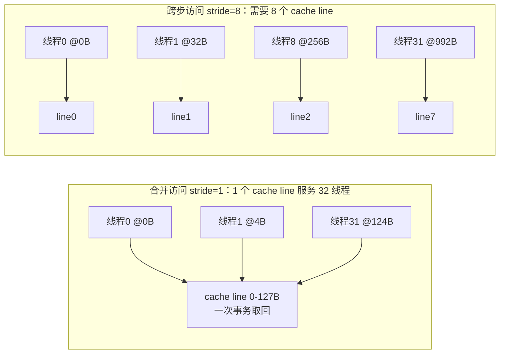
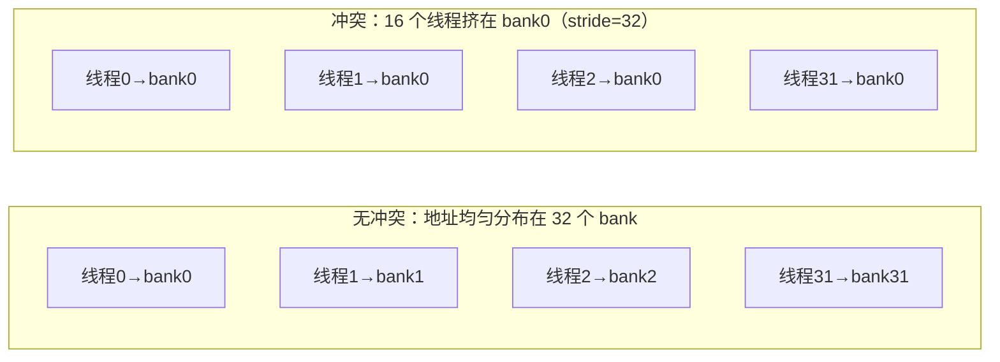

# Ch05：GPU 显存层次与内存访问

> 上一章我们知道了 GPU 有 27 万并发线程的算力，但算力要发挥出来，数据必须
> 以足够快的速度流进处理器。这一章讲 GPU 的「血管系统」——显存层次，以及
> 决定实际带宽的两把钥匙：**Memory Coalescing（合并访问）** 与
> **Shared Memory / Bank Conflict**。这是 CUDA 优化（Ch08-Ch09）最核心的
> 前置知识，也是面试必考。

## 学习目标

- 掌握 GPU 显存层次（寄存器 → Shared Memory → L1 → L2 → HBM）的容量、延迟、带宽差异
- 理解「为什么算力增长快于带宽增长」成为 AI 系统的根本矛盾
- 掌握 Memory Coalescing：为什么 Warp 内相邻线程访问相邻地址能最大化带宽
- 理解 Shared Memory 的 bank 结构与 Bank Conflict 的成因、检测与规避
- 能用 `mem_sim.py` 量化不同访存模式下的带宽浪费

## 核心概念

### 1. 显存层次：GPU 的「金三角」

和 CPU 一样，GPU 也有多级存储，且越靠近计算单元越「快而小」，越远离越「慢而大」：



| 层次 | 容量（H100） | 延迟 | 带宽 | 谁在管理 |
|------|-------------|------|------|---------|
| 寄存器 | 64K×32bit/SM | ~1 周期 | 极高（私有） | 编译器 |
| Shared Memory | 228KB/SM | ~30 周期 | ~19TB/s（聚合） | 程序员 |
| L1 Cache | 256KB/SM | ~30-40 周期 | 与 SMEM 共用 | 硬件 |
| L2 Cache | 50MB（整卡） | ~200 周期 | ~12TB/s | 硬件 |
| HBM3 | 80GB | 400-600ns | 3.35TB/s | 硬件 |

> **为什么需要理解层次结构？** 因为从 HBM 到寄存器，带宽差近 9 倍、延迟差约
> 500 倍。一个算子如果频繁回 HBM 取数，再高的算力也只能干等——这就是
> Roofline（Ch03）里「访存密集算子被带宽锁死」的硬件原因。GPU 隐藏延迟
> 靠两招：① 大量并发线程轮流跑（硬件自动）；② 把热点数据搬进 Shared Memory /
> 寄存器（程序员显式）。

### 2. Memory Coalescing：合并访问 = 带宽放大器

HBM 以 **cache line（128B）** 为原子单位取数：一次内存事务取一整行 128B，
无论你用不用得完。所以「怎么布局数据、怎么排线程」决定了事务里有多少字节是
有效的。

**合并访问**：一个 Warp 的 32 个线程访问**连续的**地址 → 32×4B = 128B 恰好
凑满一个 cache line → 1 次事务服务整个 Warp，带宽利用率 100%。

**跨步访问（Strided）**：线程 i 访问 `base + i*stride*4` → 地址散落在多个
cache line 里，每行只用到 4B → 事务数线性放大。



用 `mem_sim.py` 量化 32 线程 × 4B 元素的浪费（cache line = 128B）：

| 访问模式 | 需要取回的 cache line | 浪费倍数 | 读 1MiB 等效耗时 |
|----------|---------------------|---------|-----------------|
| stride=1（合并） | 1 | 1.0x | 0.31µs |
| stride=2 | 2 | 2.0x | 0.63µs |
| stride=8 | 8 | 8.0x | 2.50µs |
| stride=32 | 32 | 32.0x | 10.02µs |

> **为什么需要理解 Coalescing？** 跨步访问让「实际带宽」降为 1/stride。
> 深度学习里 transposed 张量、按列读取、索引张量（`x[idx]`）都是跨步访问的
> 重灾区。对策三板斧：转置重排成连续布局、用 Shared Memory 做转置缓冲、
> 让每个线程读连续多个元素（vectorized load）。

### 3. Shared Memory：程序员可控的「片上缓存」

Shared Memory（SMEM）是每个 SM 私有的片上存储，程序员可显式读写，延迟
~30 周期、聚合带宽 ~19TB/s，比 HBM 快约 5 倍。经典用途：

- **分块（Tiling）**：GEMM/Flash Attention 把数据块搬进 SMEM 复用，把
  算术强度拉高，突破 Roofline 访存瓶颈（Ch11、Ch12 重点）
- **转置缓冲**：解决矩阵按列访问的跨步问题
- **跨线程归约/通信**：同一 Block 内线程交换数据

### 4. Bank Conflict：SMEM 的「独木桥」

Shared Memory 物理上分成 **32 个 bank**，每个 bank 每周期只能服务一次访问。
一个 Warp 同时访问 32 个地址时，硬件期望它们落在 32 个不同 bank 上（理想情况
1 周期完成）。如果**多个不同地址落在同一 bank**，该 bank 就要排队串行服务，
称为 **Bank Conflict**。



`bank_conflict_detect` 检测一个 Warp 内最大冲突路数：

| 访问模式 | 最大冲突 | 解读 |
|---------|---------|------|
| stride=1 连续 | 1 | 无冲突，1 周期完成 |
| 同地址广播 | 1（硬件广播） | 所有线程读同一地址，硬件广播优化 |
| stride=2 全 Warp | 2 | 每个 bank 被 2 个线程命中，2 周期 |
| stride=8 | 8 | 8 周期 |
| stride=32 | 32 | 全挤一个 bank，32 周期（灾难） |

**经典案例：32×32 矩阵按列访问。** 行主序存储时，第 j 列的第 r 行地址 =
`r*32 + j`，所有线程的地址取模 32 后**全部落在 bank j** → 32 路冲突。只要把
每行宽度 +1（33 列 padding），地址变成 `r*33 + j`，取模后 bank = `(r + j) % 32`，
行号参与散列 → 冲突消除。cuBLAS、FlashAttention 里大量使用这种 padding 技巧。

> **为什么需要理解 Bank Conflict？** SMEM 看起来快，但如果访问模式不当，
> 32 路冲突会把 ~19TB/s 的带宽打成 ~0.6TB/s，比 HBM 还慢。检测方法很简单：
> 地址 `addr % 32` 看有没有重复。规避方法：padding、改变访问顺序、换数据类型。

## 关键代码

运行方式：`python demos/ch05/main.py`（无 GPU 也可运行，基于 `mem_sim.py`）。

```python
"""
ch05 Demo 节选：Coalescing 与 Bank Conflict 量化实验
"""
import sys
import os
sys.path.insert(0, os.path.abspath(os.path.join(os.path.dirname(__file__), "..", "shared")))
from mem_sim import coalesced_accesses, bank_conflict_detect, CACHE_LINE
from utils import banner

def demo_coalescing():
    banner("实验 2 · Memory Coalescing：合并访问 vs 跨步访问")
    N = 32            # 一个 warp
    elem_b = 4        # float32
    bw = 3.35e12      # H100 HBM3
    total_lines = 8192   # 1MiB 数据对应的 cache line 数（完全合并时）
    print(f"访问模式      cache lines   浪费   1MiB耗时")
    for stride in [1, 2, 4, 8, 16, 32]:
        lines, _ = coalesced_accesses(0, stride, N, elem_b)
        t_us = total_lines * lines * CACHE_LINE / bw * 1e6
        print(f"stride={stride:<4} {lines:>10} {lines:>6.1f}x {t_us:>8.2f}µs")

def demo_bank_conflict():
    banner("实验 3 · Shared Memory Bank Conflict")
    # 经典案例：32×32 矩阵按列访问
    col = 7
    packed = [r * 32 + col for r in range(32)]   # 无 padding
    padded = [r * 33 + col for r in range(32)]   # +1 列 padding
    print(f"无 padding: 冲突 {bank_conflict_detect(packed)} 路")
    print(f"+1 列 padding: 冲突 {bank_conflict_detect(padded)} 路")

if __name__ == "__main__":
    demo_coalescing()
    demo_bank_conflict()
```

运行后会看到三组结论：

1. **显存层次表**：寄存器 ~1 周期 ↔ HBM 400-600ns，带宽差 ~9 倍
2. **Coalescing**：stride 从 1 到 32，cache line 数 1→32 线性放大，
   读 1MiB 耗时从 0.31µs 涨到 10.02µs（32 倍）
3. **Bank Conflict**：无 padding 的按列访问 32 路冲突，+1 列 padding 后降为 1 路

## 课堂练习

### ⭐ 基础：量化实验

1. 运行 `python demos/ch05/main.py`，记录 stride=1、4、16 三行的 cache line
   数与耗时，验证「浪费 = stride」的规律。
2. 用 `coalesced_accesses` 试 `bytes_per_elem=8`（double 或 float64），对比
   与 4B 元素的差异：32 个 double 的合并访问需要几个 cache line？
3. 在 `bank_conflict_detect` 里构造「stride=16 全 Warp」的访问，预测冲突路数
   再验证。

### ⭐⭐ 进阶：padding 消冲突

1. 写一个 32×32 矩阵转置的模拟：一个 Block 用 Shared Memory 存 tile，
   Warp 线程按行读、按列写。用 `bank_conflict_detect` 分别统计「读入」和
   「写出」两阶段的冲突，验证写出阶段需要 padding。
2. 把列数从 33 改成 34、35，观察冲突是否仍为 1 路？解释为什么 padding 宽度
   的选择和「bank 数是否是列宽的因子」有关（提示：`(r*W+j) % 32` 何时退化）。
3. 思考 Softmax 跨行规约（每行 4096 元素、128 线程算一行）如何设计线程-数据
   映射才能同时满足合并访问与无 bank 冲突，把方案画出来。

### ⭐⭐⭐ 挑战：模拟向量化 Load

1. 在 `coalesced_accesses` 基础上模拟 **vectorized load**：每个线程一次读 4 个
   float32（16B，float4），Warp 一次取 512B。对比「32 线程 × float4」与
   「128 线程 × float1」的 cache line 数与事务次数，解释为什么 float4 更省
   （提示：事务更少、内存子系统利用率更高）。
2. 模拟「跨步 + vectorized」的组合：stride=4 的 float4 访问，浪费多少倍？
   与实际生产中「按通道不连续的数据布局」对照。
3. 结合 Roofline（Ch03）：对一个 elementwise 算子（算术强度 0.5 FLOPs/byte），
   在 H100 上用合并访问跑，理论带宽上限能到多少 GFLOPS？如果访问跨步 8，
   上限又掉到多少？写出计算过程。

## 常见问题 Q&A

**Q1：Coalescing 和 Bank Conflict 是一回事吗？**
A：不是。Coalescing 管的是**全局内存（HBM/L2）**：以 cache line 为事务单位，
关心「Warp 的地址是否连续」，连续 = 少事务 = 高带宽。Bank Conflict 管的是
**Shared Memory**：以 bank 为服务单位，关心「同一时刻的 32 个地址是否落在
不同 bank」。一个在「取数的路上」，一个在「片上缓存里」，但优化原则相通：
让 Warp 内 32 个线程的地址尽量「分散到不同 bank / 集中到连续 cache line」。

**Q2：为什么 GPU 不像 CPU 那样靠大缓存隐藏延迟？**
A：CPU 的哲学是「少数强线程 + 大缓存 + 分支预测」，把单个线程喂得飞起；
GPU 的哲学是「海量线程 + 小缓存」，靠线程切换隐藏延迟——一个 Warp 在等 HBM
数据时，调度器立刻换另一个 Warp 执行。这就是为什么 GPU 需要几千个并发线程
才能跑满：并发度不够时，GPU 也在干等。所以「数据块太小、线程太少」会直接
导致 GPU 利用率低下。

**Q3：Shared Memory 和 L1 Cache 是同一个东西吗？**
A：在当代 NVIDIA GPU 上，它们是同一块物理存储（如 H100 的 256KB/SM），按
配置在「显式 Shared Memory」和「隐式 L1 Cache」之间划分。L1 由硬件自动管理
（程序员不可控），SMEM 由程序员显式分配和读写（`__shared__` / Triton 的
`tl.load` 到块内缓冲）。程序员能用 SMEM 精确控制「什么数据留在片上」，这比
依赖硬件缓存策略更可预测，是高性能算子的关键。

**Q4：我的训练脚本是 PyTorch 写的，需要关心这些吗？**
A：需要。PyTorch 的自动微分不会替你优化访存模式：`x.t()` 转置后直接做
矩阵乘、`x[idx]` 用索引取子张量、按通道非连续的张量——底层都是跨步访问。
cuBLAS 会把连续布局的 GEMM 优化到极致，但对不连续布局只能退而求其次。
理解 Coalescing 后，你就知道为什么 PyTorch 文档反复强调 `contiguous()`，
以及为什么「先重排数据再计算」经常比「边算边索引」快数倍。

## 小结

| 要点 | 说明 |
|------|------|
| 显存层次 | 寄存器 → SMEM/L1 → L2 → HBM，带宽差 ~9 倍、延迟差 ~500 倍 |
| 根本矛盾 | 算力增长快于带宽增长 → 访存常成瓶颈（Roofline 视角） |
| Coalescing | Warp 内相邻线程访问相邻地址 = 1 次事务；跨步 = 线性放大浪费 |
| 隐藏延迟 | 海量并发线程（硬件）+ 搬数据进 SMEM/寄存器（程序员） |
| Shared Memory | 片上显式缓存，~19TB/s 聚合带宽，分块复用核心 |
| Bank Conflict | 同 bank 多地址访问串行化；检测 addr%32；padding 规避 |
| 实践铁律 | 让 Warp 的 32 个地址尽量连续 / 尽量分散到不同 bank |

一句话：**GPU 的算力是明牌，能拿到多少取决于你如何把数据喂给它。**

## 下一章预告

Ch06「Tensor Core 与混合精度计算」将揭晓 GPU 算力另一面：FP16/BF16/FP8 如何
把峰值算力翻 10 倍以上，以及混合精度训练为什么离不开 Loss Scaling。
