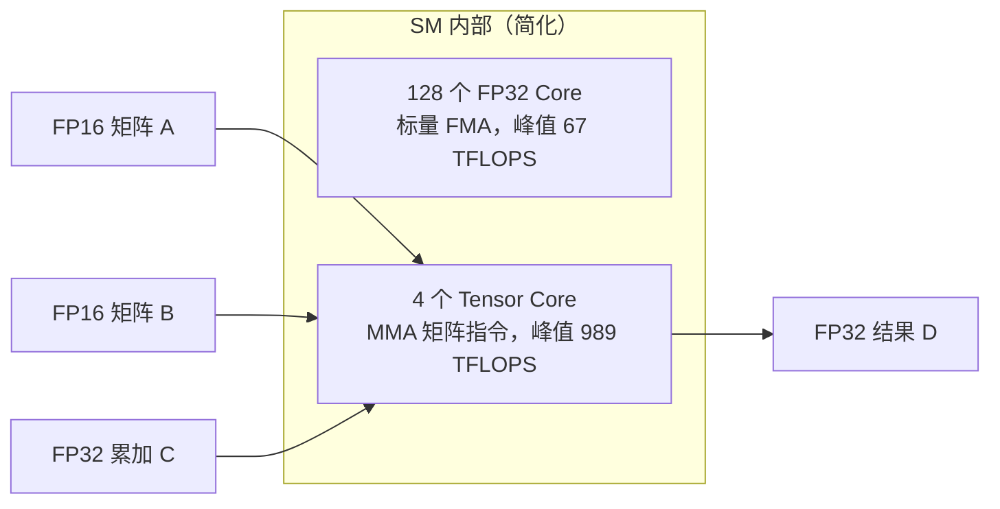
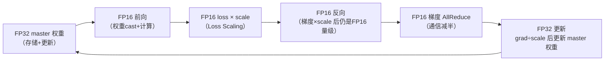

# Ch06：Tensor Core 与混合精度计算

> 前面我们看到的 H100 FP32 峰值只有 67 TFLOPS，但上一章提到的 FP16 峰值高达
> 989 TFLOPS——**14.8 倍**。多出来的算力从哪里来？答案就是 **Tensor Core**
> 与**混合精度计算**。这一章讲清：FP16/BF16/FP8 的数值世界、Tensor Core 的
> MMA 原理、混合精度训练的完整配方（master 权重 + Loss Scaling），以及
> 「精度换算力」的边界在哪里。

## 学习目标

- 掌握 FP32 / FP16 / BF16 / FP8 的位布局、数值范围与相对精度
- 理解 Tensor Core 的工作原理：一次 MMA 指令完成 4×4×4 的矩阵乘加
- 理解混合精度训练的完整流程与为什么需要 master FP32 权重
- 理解 Loss Scaling 的动机、原理与动态调整策略
- 能用 numpy 复现 FP16 舍入误差对梯度的破坏，并验证 Loss Scaling 的修复效果

## 核心概念

### 1. 浮点格式：一位符号 + 若干指数 + 若干尾数

浮点数的精度由尾数位决定，范围由指数位决定。位越多越贵（带宽翻倍），
但越精确：

| 格式 | 位布局 | 最大值 | 最小正规数 | 相对精度(eps) | 典型用途 |
|------|--------|--------|-----------|--------------|---------|
| FP32 | 1+8+23 | 3.4e38 | 1.2e-38 | 1.19e-7 | 训练默认 |
| FP16 | 1+5+10 | 65504 | 6.1e-5 | 9.77e-4 | 混合精度计算 |
| BF16 | 1+8+7 | 3.4e38 | 1.2e-38 | 7.81e-3 | 大模型训练 |
| FP8-E4M3 | 1+4+3 | 448 | 1.56e-2 | 1.25e-1 | 推理/渐进训练 |
| FP8-E5M2 | 1+5+2 | 57344 | 6.1e-5 | 2.5e-1 | 梯度传输 |

三个关键观察：

1. **FP16 vs BF16 同为 16 位但性格相反**：FP16 精度好（10 位尾数）但范围窄
   （±65504，且小值精度骤降）；BF16 保留 FP32 的指数范围（不会溢出），但只
   有 7 位尾数（相对精度 ~0.8%）。
2. **FP8 精度只有 ~6%~12%**：还不够单独支撑训练，主要用于推理量化与
   「渐进式训练（Progressive Training，如 DeepSeek-V3）」。
3. **尾数少一位，峰值算力可能翻倍**：因为硬件乘加器变简单了，同一面积能塞
   下更多。

> **为什么需要理解位布局？** 面试必问「FP16 和 BF16 有什么区别」，工程上
> 「为什么 DeepSeek 用 BF16 而早期 GPT 用 FP16」——答案都在这一张表里。

### 2. Tensor Core：为低精度矩阵乘而生的专用硬件

Tensor Core 是 SM 内部专门做矩阵乘加的单元（H100 的 SM 里有 4 个）。普通
CUDA Core 一次做一个标量乘加（FMA），Tensor Core 一次 **MMA（Matrix
Multiply-Accumulate）** 指令完成一个小矩阵的乘加，如 `D = A×B + C`，
其中 A/B/C/D 都是 4×4 的 FP16 矩阵——一条指令做 4×4×4 = 64 次乘加。

```
MMA 指令（H100，FP16 输入 → FP32 累加）
  D(4×4, FP32) = A(4×4, FP16) × B(4×4, FP16) + C(4×4, FP32)

一次 MMA = 4×4×4 = 64 次乘加 ≈ 128 FLOPs
一个 SM 有 4 个 Tensor Core，每周期可发多条 MMA
H100 全卡 FP16 峰值 = 989 TFLOPS
```



> **为什么需要 Tensor Core？** 深度学习的核心是 GEMM（全连接/卷积/Attention
> 都是矩阵乘）。矩阵乘有天然的规则结构，专门硬件可以大幅摊薄取指/解码成本，
> 一次指令算一片。没有 Tensor Core，FP16 只能做到 ~2 倍 FP32（普通 CUDA Core
> 对 FP16 也是标量执行）；有了它，FP16 能到 14.8 倍。

### 3. 各精度峰值算力对比（gpu_specs.py）

| 型号 | FP32 | TF32 | FP16 | BF16 | FP8/INT8 | SM |
|------|------|------|------|------|---------|-----|
| H100 SXM | 67 | 494 | 989 | 989 | 1979 | 132 |
| A100 SXM | 20 | 156 | 312 | 312 | 624 | 108 |

- **TF32**：Tensor Core 的 FP32 模式（19 位尾数，不需要改代码就能快 7 倍），
  峰值 ≈ 0.5 × FP16
- **FP16 → FP8**：算力再翻一倍（H100 上 1979 TFLOPS）
- 记住这条链条：**精度降一半，算力翻一倍，带宽省一半**——混合精度是
  AI 训练性价比之王

### 4. 混合精度训练的完整配方

「混合精度」不是简单地全用 FP16，而是**各环节用各自合适的精度**：



配方四要素：

1. **master 权重 = FP32**：权重更新在 FP32 上做，避免小更新被 FP16 吃掉
2. **计算 = FP16/BF16**：GEMM 走 Tensor Core，吃满 989 TFLOPS
3. **Loss Scaling**：把 loss 乘上一个大因子（如 2^16），反向传播的梯度也随之
   放大，避开 FP16 的「小值精度盲区」；更新权重前再除回来
4. **动态 scale**：监测梯度是否溢出（inf/NaN），溢出就减半 scale 并跳过该
   step；长期不溢出就翻倍 scale（NVIDIA AMP 的默认策略）

### 5. FP16 的陷阱：梯度消失的「盲区」

FP16 的最小正规数是 6.1e-5，低于它只能靠次正规数（最小 ~6e-8）硬撑，
再小就直接变 0。深度学习的梯度恰恰动辄在 1e-4 ~ 1e-8 之间：

| 梯度大小 | FP16 存回 | 相对误差 | 判定 |
|---------|----------|---------|------|
| 1e-1 | 9.998e-2 | ~0.0% | 可接受 |
| 1e-3 | 1.000e-3 | ~0.1% | 可接受 |
| 1e-5 | 1.001e-5 | 0.1% | 进入次正规区 |
| 1e-6 | 1.013e-6 | 1.3% | 精度受损 |
| 1e-7 | 1.192e-7 | 19.2% | 精度崩坏 |
| 1e-8 | 0 | 100% | **梯度直接消失** |

> **为什么需要理解这个盲区？** 大模型（深层、大规模、小学习率）的梯度经常
> 落在 1e-5 以下。FP16 无脑全用会导致训练卡死或发散——这正是 Loss Scaling
> 存在的理由：**放大 loss → 梯度搬回正常区 → 精度恢复**。

## 关键代码

运行方式：`python demos/ch06/main.py`（需要 numpy，无 GPU 也可运行）。

```python
"""
ch06 Demo 节选：FP16 舍入误差 + Loss Scaling + 训练对比
"""
import sys
import os
sys.path.insert(0, os.path.abspath(os.path.join(os.path.dirname(__file__), "..", "shared")))
from gpu_specs import get_spec
import numpy as np

def demo_quantization():
    """梯度从 1e-1 到 1e-8，FP16 的相对误差变化"""
    mags = np.array([1e-1, 1e-2, 1e-3, 1e-4, 1e-5, 1e-6, 1e-7, 1e-8], dtype=np.float32)
    fp16 = mags.astype(np.float16).astype(np.float32)
    rel = np.abs(fp16 - mags) / mags
    for m, f, r in zip(mags, fp16, rel):
        print(f"{m:>10.1e} -> {f:>12.3e}  相对误差 {r:>10.1%}")

def demo_loss_scaling():
    """Loss Scaling：把梯度搬回 FP16 正常区"""
    scale = 2 ** 16
    mags = np.array([1e-1, 1e-2, 1e-3, 1e-4, 1e-5, 1e-6, 1e-7, 1e-8], dtype=np.float32)
    fp16 = mags.astype(np.float16).astype(np.float32)
    scaled = np.float32(mags * scale).astype(np.float16).astype(np.float32) / scale
    rel_d = np.abs(fp16 - mags) / mags
    rel_s = np.abs(scaled - mags) / mags
    for m, rd, rs in zip(mags, rel_d, rel_s):
        print(f"{m:>10.1e}  直接FP16误差 {rd:>10.1%}  |  LS后误差 {rs:>10.1%}")

def train_one(loss_scale=1.0, use_fp16=False, steps=200):
    """小回归 y = w·x（w_true=1e-6，梯度长期微小）：只把梯度 cast 到 FP16"""
    rng = np.random.RandomState(0)
    x = rng.uniform(0.1, 1.0, 64)
    w_true, y = 1e-6, (1e-6 * x).astype(np.float32)
    w, lr, frozen = 0.0, 0.5, None
    zero = 0
    for step in range(steps):
        grad = np.mean((w * x - y) * x)          # FP32 精确梯度
        if use_fp16:
            g = np.float32(np.float16(grad * loss_scale)) / loss_scale
            if g == 0.0:
                zero += 1
                if frozen is None: frozen = step
            grad = g
        w -= lr * grad
    return w, w_true, frozen, zero

def demo_training():
    for name, ls, fp16 in [("FP32", 1.0, False),
                           ("FP16", 1.0, True),
                           ("FP16+LS(2^16)", 2 ** 16, True),
                           ("FP16+LS(2^24)", 2 ** 24, True)]:
        w, wt, frozen, zero = train_one(ls, fp16)
        print(f"{name:<16} w={w:.3e} 误差={abs(w-wt)/wt:>7.2%} "
              f"冻结@{frozen} 归零步数={zero}")

if __name__ == "__main__":
    demo_quantization()
    demo_loss_scaling()
    demo_training()
```

运行结果（本机实测）：

| 策略 | 最终 w | 相对误差 | 梯度冻结步 | 梯度归零步数 |
|------|--------|---------|-----------|-------------|
| FP32 | 1.000e-6 | 0.00% | - | 0 |
| FP16（无缩放） | 9.239e-7 | 7.61% | 第 12 步 | 188 |
| FP16 + LS(2^16) | 9.9999e-7 | 0.00% | 第 67 步 | 133 |
| FP16 + LS(2^24) | 9.9999e-7 | 0.00% | - | 0 |

> 注意 `demo_training` 里那个容易被忽视的坑：`np.float16(...) / 65536` 会让
> numpy 把整数除法因子 cast 成 float16 而溢出——必须先转回 float32 再除。
> 这种「精度转换顺序」正是混合精度工程里最常见的隐性 bug。

## 课堂练习

### ⭐ 基础：精度实验

1. 运行 `python demos/ch06/main.py`，复述三个实验各自的结论。
2. 用 numpy 验证：`np.float16(0.1)` 存回的十进制是多少？相对误差多大？
   和 FP32 对比说明为什么「FP16 只有 3~4 位十进制有效数字」。
3. 计算 H100 的 FP32→FP16→FP8 算力翻倍链条，写出每一步的倍数。

### ⭐⭐ 进阶：Loss Scaling 深挖

1. 把 `train_one` 的 `w_true` 改回 1.0（普通量级），重跑四组策略：
   此时 FP16 无缩放还能收敛吗？为什么？（提示：梯度量级 ~1e-2，还在正常区）
2. 试 scale = 2^8 和 2^32：scale 太小梯度还在盲区，scale 太大会溢出 FP16
   （>65504）。找出这个实验里 scale 的「安全区间」，理解动态 scale 的必要性。
3. 为 `train_one` 加一个简单的「动态 scale」逻辑：检测到梯度溢出就 scale/2，
   连续 N 步无溢出就 scale×2，对比固定 scale 的效果。

### ⭐⭐⭐ 挑战：模拟真实 AMP

1. 用 torch（有 GPU 时）或 numpy（无 GPU）实现一个带 AMP 语义的 MLP 训练：
   FP32 master 权重 + 每步 FP16 cast 梯度 + 动态 loss scale，比较 FP16 与
   FP32 的损失曲线。
2. 研究 DeepSeek-V3 的 FP8 训练：它如何在 FP8 下保住精度？（提示：分块
   量化 + 高精度累加 + master 权重）。用论文中的数字说明「FP8 训练精度损失
   vs 算力收益」的权衡。
3. 面试题：为什么推理侧常用 FP8/INT8 而训练侧主要用 FP16/BF16？结合本课
   「反向传播对精度更敏感」写一段 200 字的论述。

## 常见问题 Q&A

**Q1：混合精度训练到底哪里用了 FP16，哪里还是 FP32？**
A：典型配置（NVIDIA AMP）：**权重**维护一份 FP32 master 副本（用于更新）；
**前向与反向的 GEMM/卷积**用 FP16 计算（走 Tensor Core）；**梯度**以 FP16
做 AllReduce（通信量减半）；**loss 缩放**在前向末尾、反向开始处乘上 scale，
更新权重前除掉。注意**主流的 BF16 训练（如 DeepSeek）甚至不需要 Loss Scaling**
——因为 BF16 的指数范围与 FP32 相同，不会下溢，代价是尾数精度更低。

**Q2：Loss Scaling 的 scale 是怎么定的？**
A：两种策略。① 固定 scale（如 2^16）：简单，但对不同模型/学习率不一定最优；
② 动态 scale（AMP 默认）：从大值（如 2^24）开始，每步检查梯度是否出现 inf/NaN，
溢出则 scale 减半并跳过该 step，连续 2000 步无溢出则 scale 翻倍。动态策略
自动适应模型规模与学习率，是生产环境的标准做法。

**Q3：FP16 和 BF16 到底该选哪个？**
A：看场景。**训练大模型**：BF16 更稳（范围同 FP32、免 Loss Scaling、与
bfloat16 生态兼容），DeepSeek-V3/Qwen 均用 BF16，代价是 ~0.8% 相对精度；对
精度敏感的混合精度训练早期方案用 FP16 + Loss Scaling。**推理**：FP16 精度更
高、与 FP32 的校准误差更小，服务端常用 FP16；进一步压内存带宽时用 FP8/INT8。
一句话：**训练求稳用 BF16，精度敏感用 FP16，带宽敏感用 FP8**。

**Q4：Tensor Core 和 CUDA Core 写的代码有区别吗？**
A：有。用 cuBLAS/cuDNN/矩阵乘 API，底层自动走 Tensor Core；手写 CUDA kernel
时要用 `mma.sync.aligned.m16n8k16` 之类的 PTX 指令或 cuBLASLt / CUTLASS /
Triton 的 tl.dot。PyTorch 用户通常不需要直接碰——`torch.matmul` 在 FP16 下
自动用 Tensor Core，前提是矩阵尺寸够大（太小发挥不出优势）。Ch12 会用
Triton 手写一个 `tl.dot` 的 GEMM，那里能看到 Tensor Core 的编程面。

## 小结

| 要点 | 说明 |
|------|------|
| 精度谱系 | FP32 → TF32 → FP16/BF16 → FP8，尾数越少精度越粗、算力越高 |
| Tensor Core | MMA 指令一次算 4×4×4 矩阵乘加，FP16 峰值 ≈ 14.8× FP32 |
| FP16 盲区 | 范围窄（±65504）+ 小值精度骤降，梯度 ≤1e-7 时误差 >19% |
| Loss Scaling | 放大 loss → 梯度搬回正常区 → 更新前除回，数学等价 |
| 动态 scale | 溢出减半跳过 step，长期无溢出翻倍，AMP 默认策略 |
| 混合精度配方 | FP32 master 权重 + FP16 计算/通信 + Loss Scaling |
| 硬件对照 | H100: FP16 989 / BF16 989 / FP8 1979 / FP32 67 TFLOPS |

一句话：**精度是可以用「工程技巧」换算力的资产，而 Loss Scaling 是保住这笔
交易不蚀本的那道保险。**

## 下一章预告

Ch07「PCIe、NVLink、RDMA 与集群互联」把视野从单卡拉向多卡：单机 8 卡的
NVLink 和跨节点的 InfiniBand 到底差多少？梯度 AllReduce 又会如何拖慢训练？
