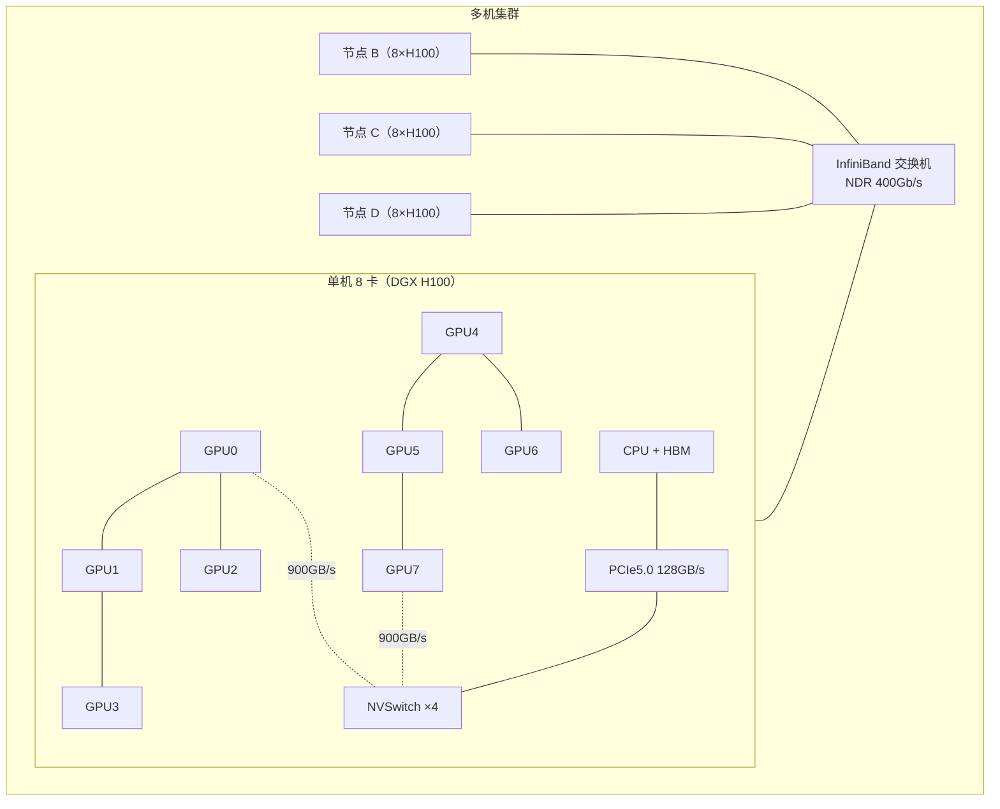
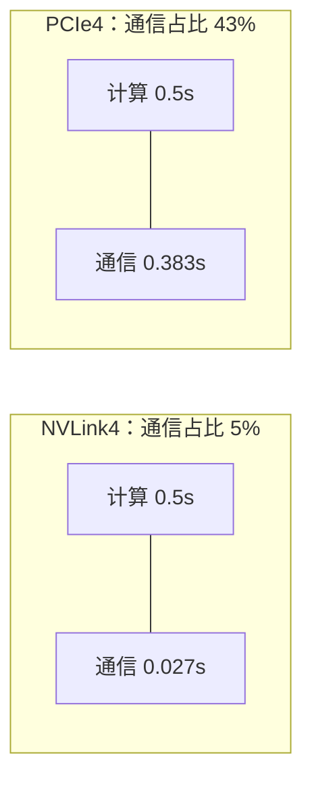

# Ch07：PCIe、NVLink、RDMA 与集群互联

> 单卡 989 TFLOPS 已经很强，但大模型要更快，必须把成百上千张卡连起来。
> 卡与卡之间靠什么通信？PCIe、NVLink、InfiniBand 各是什么定位？为什么
> 「加卡不加速」是分布式训练最常见的抱怨？这一章回答这些问题，并用量化模型
> （`dist_sim.py`）算出不同互联下 AllReduce 的时间差异。它是 Ch13-Ch17
> 分布式训练章节的地基。

## 学习目标

- 掌握 PCIe / NVLink / InfiniBand / RoCE 四种互联的定位与带宽量级
- 理解 NVLink 的「双向聚合」口径与 PCIe 的差异，能看懂厂商参数表
- 理解单机多卡（NVSwitch 全网状）与多机（IB 交换机）的拓扑差异
- 能用 Ring AllReduce 时间模型估算不同带宽下的通信耗时
- 理解「通信占比 → 扩展效率」的关系，能判断加卡是否划算

## 核心概念

### 1. 四大互联：从板卡到集群

按带宽从低到高，AI 集群里常见四种互联：

| 互联 | 单向带宽 | 双向聚合 | 典型场景 |
|------|---------|---------|---------|
| PCIe 3.0 x16 | 16 GB/s | 32 GB/s | CPU↔GPU、老平台 |
| PCIe 4.0 x16 | 32 GB/s | 64 GB/s | 云上单卡（A10 等） |
| PCIe 5.0 x16 | 64 GB/s | 128 GB/s | 最新 CPU 平台 |
| NVLink 3（A100） | 300 GB/s | 600 GB/s | 单机 8 卡（DGX A100） |
| NVLink 4（H100） | 450 GB/s | 900 GB/s | 单机 8 卡（DGX H100） |
| InfiniBand HDR | 25 GB/s | 50 GB/s | 多机（200Gb/s） |
| InfiniBand NDR | 50 GB/s | 100 GB/s | 多机（400Gb/s） |
| 400GbE RoCE | 50 GB/s | 100 GB/s | 多机（以太网 RDMA） |

> **注意口径**：NVLink 的 900GB/s 是**双向聚合**（单向 450GB/s）；而 PCIe
> 常说的 32GB/s 是**单向**（x16 Gen4）。面试/读论文时先把口径对齐，否则
> 数字对比全是错的。另外 InfiniBand 的 400Gb/s 是**双向链路速率**，单向有效
> 带宽约 50GB/s。

**RDMA（Remote Direct Memory Access）** 是跨节点通信的关键技术：网卡（RNIC/
网卡）直接读写远端内存，绕过 CPU 与操作系统内核，省掉大量拷贝与中断开销。
InfiniBand 原生支持 RDMA；RoCE（RDMA over Converged Ethernet）把 RDMA 跑在
以太网上，成本更低。NCCL 底层就走 RDMA。

### 2. 拓扑：单机多卡 vs 多机集群



通信三档速度（以 H100 集群为例）：

| 链路 | 带宽 | 用途 |
|------|------|------|
| GPU↔GPU（节点内） | NVLink4 ~900GB/s | 张量并行（TP）的每层 AllReduce |
| GPU↔CPU/HBM（节点内） | PCIe5.0 ~128GB/s | 数据搬运、checkpoint |
| GPU↔GPU（跨节点） | IB/RoCE ~100GB/s | 数据并行（DP）的梯度 AllReduce |

> **为什么需要理解拓扑？** 并行策略的本质是「给不同通信分配合适的链路」：
> 低延迟、高带宽的 NVLink 适合频繁小消息（TP 每层通信）；跨节点的 IB 带宽
> 只有 NVLink 的 1/9，大消息（全量梯度 AllReduce）放上去就很疼。Ch13-Ch17
> 的 DP/TP/PP/EP 组合，一半是在做「把通信放对地方」。

### 3. 通信对训练的影响：AllReduce 时间模型

数据并行每步要把所有卡上的梯度求和（AllReduce）。通信时间与消息大小和带宽
直接相关，`dist_sim.py` 用 Ring AllReduce 模型近似：

```
T_ring ≈ 2·(P-1)/P · m/β + 2·log2P·α
  其中：m = 消息字节数（如 7B 模型 BF16 梯度 = 14GB）
        β = 链路带宽（bytes/s）
        α = 点对点延迟（~10µs 量级）
        P = 参与卡数
```

用 `dist_sim.ring_allreduce_time` 计算 7B 模型、8 卡、单 step 计算 0.5s：

| 互联 | 带宽(GB/s) | Ring AllReduce | 通信占比 | 扩展效率 |
|------|-----------|---------------|---------|---------|
| PCIe 3.0 x16 | 32 | 766 ms | 60.5% | 39.5% |
| PCIe 4.0 x16 | 64 | 383 ms | 43.4% | 56.6% |
| PCIe 5.0 x16 | 128 | 192 ms | 27.7% | 72.3% |
| NVLink 3（A100） | 600 | 41 ms | 7.6% | 92.4% |
| NVLink 4（H100） | 900 | 27 ms | 5.2% | 94.8% |
| InfiniBand HDR | 50 | 490 ms | 49.5% | 50.5% |
| InfiniBand NDR | 100 | 245 ms | 32.9% | 67.1% |

> 通信占比 = 通信时间 / (计算+通信)。占比 50% 意味着 GPU 有一半时间在
> 干等通信，扩展效率（加卡后能获得的理想加速比例）只剩 50%。



### 4. 加卡不加速？多机扩展的代价

把训练从单机扩到多机，跨节点链路成为新瓶颈：

| GPU 数 | 互联假设 | AllReduce | 通信占比 | 扩展效率 |
|--------|---------|-----------|---------|---------|
| 8 | 单机 NVLink4 | 27 ms | 5.2% | 94.8% |
| 16 | 2 节点 IB NDR | 263 ms | 34.5% | 65.5% |
| 32 | 4 节点 IB NDR | 272 ms | 35.2% | 64.8% |
| 64 | 8 节点 IB NDR | 277 ms | 35.6% | 64.4% |

**关键规律**：节点内加卡（NVLink）几乎无痛；一旦跨节点，通信占比跳升到
30%+，扩展效率跌到 ~65%，继续加卡收益递减。解法三板斧：
① **更快互联**（NDR800 800Gb/s、NVLink 跨机、光互联）；
② **减少消息**（梯度压缩 1-bit Adam、Q-Gradient）；
③ **隐藏通信**（Overlap：通信与下一层计算并行，Ch17 详述）。

> **为什么需要理解扩展效率？** 面试题「给你 100 张卡，怎么让它不浪费？」
> 回答框架就是：先算通信占比，再看瓶颈在计算还是通信，再选
> 「加大 batch / 减少 AllReduce 次数 / 梯度压缩 / overlap」的手段。

## 关键代码

运行方式：`python demos/ch07/main.py`（无 GPU 也可运行，基于 `dist_sim.py`）。

```python
"""
ch07 Demo 节选：互联带宽对比 + 不同互联下的 AllReduce 时间
"""
import sys
import os
sys.path.insert(0, os.path.abspath(os.path.join(os.path.dirname(__file__), "..", "shared")))
from dist_sim import ring_allreduce_time, comm_ratio, scaling_efficiency

# (名称, 单向 GB/s, 双向聚合 GB/s)
LINKS = [
    ("PCIe 3.0 x16",    16,  32, "单机扩展"),
    ("PCIe 4.0 x16",    32,  64, "单机扩展"),
    ("PCIe 5.0 x16",    64, 128, "单机扩展"),
    ("NVLink 3 (A100)", 300, 600, "单机 8 卡"),
    ("NVLink 4 (H100)", 450, 900, "单机 8 卡"),
    ("InfiniBand HDR",  25,  50, "多机 200Gb/s"),
    ("InfiniBand NDR",  50, 100, "多机 400Gb/s"),
    ("400GbE RoCE",     50, 100, "多机以太网"),
]

def demo_allreduce():
    params = 7e9
    grad_bytes = params * 2        # 7B 模型 BF16/FP16 梯度 = 14GB
    P, compute_s = 8, 0.5          # 8 卡，单 step 计算 0.5s
    print(f"{'互联':<18}{'带宽':>8}{'Ring(ms)':>12}{'通信占比':>10}{'扩展效率':>10}")
    for name, _one, two, _desc in LINKS:
        t = ring_allreduce_time(P, grad_bytes, two * 1e9)   # 用双向聚合带宽
        ratio = comm_ratio(t, compute_s)
        eff = scaling_efficiency(P, compute_s, t)
        print(f"{name:<18}{two:>8}{t*1e3:>12.1f}{ratio:>9.1%}{eff:>9.1%}")

def demo_multinode():
    """多机扩展：加卡不加速？"""
    grad_bytes = 7e9 * 2
    compute_s = 0.5
    for P, desc, bw in [(8, "单机 NVLink4", 900e9),
                        (32, "4 节点 IB NDR", 100e9)]:
        t = ring_allreduce_time(P, grad_bytes, bw)
        print(f"{P:>4} 卡 {desc:<16} AllReduce={t*1e3:>6.1f}ms "
              f"占比={comm_ratio(t, compute_s):>6.1%} "
              f"效率={scaling_efficiency(P, compute_s, t):>6.1%}")

if __name__ == "__main__":
    demo_allreduce()
    demo_multinode()
```

运行后你会得到一张「互联金字塔」：NVLink4（900GB/s）比 PCIe4.0（64GB/s）
快 14 倍，比 IB NDR（100GB/s）快 9 倍。7B 模型的梯度 AllReduce 在 NVLink4
上只需 27ms（通信占比 5%），放到 PCIe4.0 要 383ms（占比 43%），跨节点
IB NDR 也要 245ms（占比 33%）——这就是「为什么多卡必须 NVLink、多机必须
好 IB」的量化证据。

## 课堂练习

### ⭐ 基础：数字对比

1. 运行 `python demos/ch07/main.py`，把实验 3 的表格抄下来，标出哪些互联
   「通信占比 < 20%」（可接受）、哪些「> 40%」（不可接受）。
2. 用公式手算：PCIe 5.0 x16 的双向聚合带宽是多少？与 NVLink 4 差多少倍？
3. 查看 `gpu_specs.py` 里 A10 的 interconnect 字段，说明为什么云上单卡
   （PCIe 4.0）跑多卡训练不现实。

### ⭐⭐ 进阶：改参数再算

1. 修改 demo 中的 `grad_bytes`：如果把梯度压成 INT8（1 字节/参数），7B 模型
   的 AllReduce 在 IB NDR 上能快多少？验证「梯度压缩」的收益。
2. 修改 `compute_s`：把单 step 计算时间改成 0.1s（更大模型或更快卡），
   通信占比如何变化？解释为什么「计算越快，通信越要命」。
3. 把 P 从 8 改成 32 再跑一遍实验 3，观察 Ring 公式里 (P-1)/P 项的变化，
   说明为什么 Ring AllReduce 的带宽效率在大规模下趋近于 1。

### ⭐⭐⭐ 挑战：拓扑感知设计

1. 假设你在做 64 卡（8 节点 × 8 卡）的 7B 模型训练，需要同时用 DP+TP。
   设计：TP 的 world size 应该等于 8（节点内）还是跨节点？
   用通信占比数据论证你的选择。
2. 模拟「分层 AllReduce」：节点内先做一次 NVLink Ring 归约，再把节点结果
   用 IB 归约。用 `dist_sim` 的函数分别算两级时间，对比「全 IB 一遍归约」
   快多少？（提示：先 8 卡归约 14GB，再 8 节点归约 14GB）
3. 阅读 NCCL 的拓扑感知（Ch15 会讲）：如果交换机是非阻塞全带宽（每个端口
   100GB/s），8 节点各 1 条链路 vs 4 节点各 2 条链路，峰值带宽差多少？

## 常见问题 Q&A

**Q1：NVLink 到底快在哪？为什么 PCIe 不行？**
A：三点。① **带宽**：NVLink4 单链路 900GB/s 双向，PCIe5.0 x16 只有 128GB/s；
② **拓扑**：NVSwitch 让 8 卡任意两卡全带宽互访，PCIe 需要经过 CPU 根复杂
（root complex），多卡时严重竞争；③ **协议**：NVLink 支持 GPU 间直接内存
访问（类似 RDMA），延迟更低。所以「多卡训练」的标配是 NVLink 全互联，PCIe
只负责 CPU↔GPU 的控制与数据搬运。

**Q2：InfiniBand 和 RoCE 怎么选？**
A：**InfiniBand**：专为 HPC 设计，RDMA 原生、延迟低、丢包几乎为 0（credit
流控），贵；**RoCE**：把 RDMA 跑在以太网上，成本低、与现有网络融合好，但
需要无损以太网配置（PFC/ECN），否则拥塞时性能崩塌。互联网大厂常用 RoCE
（成本可控），超算与顶级 GPU 集群常用 IB（性能至上）。NCCL 对两者都支持，
选型时看预算与运维能力。

**Q3：通信延迟（α）和带宽（β）哪个重要？**
A：取决于消息大小。大消息（全量梯度 AllReduce，GB 级）由带宽决定：
`T ≈ m/β`，所以 NVLink 900GB/s 的价值在这里；小消息（TP 每层通信、PP 激活
边界，KB 级）由延迟决定：`T ≈ 2·log2P·α`，所以要低延迟链路。这也是为什么
「TP 放节点内（NVLink 低延迟）、DP 梯度跨节点（大消息要带宽）」的经验法则
背后的数学。

**Q4：没有多卡机器，这门课分布式部分还能学吗？**
A：能。本课程的分布式章节（Ch13-Ch17）配套 `dist_sim.py` 这类**时间建模
工具**：不依赖真实硬件就能算出 AllReduce 时间、通信占比、扩展效率，理解
Ring/Tree 算法与 DP/TP/PP 的通信特征。原理层面完全可以在单机上吃透；
有 2+ 卡后再用 NCCL 验证模型预测。工程面试考的是「你能不能说出通信复杂度和
拓扑权衡」，这不需要真实集群。

## 小结

| 要点 | 说明 |
|------|------|
| 四大互联 | PCIe（CPU↔GPU）/ NVLink（卡间）/ IB / RoCE（跨节点） |
| 带宽金字塔 | NVLink4(900) >> PCIe5.0(128) > IB NDR(100) > PCIe4.0(64) |
| 口径陷阱 | NVLink 是双向聚合，PCIe 常指单向，对比前先对齐 |
| 拓扑 | 单机 NVSwitch 全网状；多机 IB 交换机；跨节点是瓶颈 |
| 时间模型 | T_ring ≈ 2(P-1)/P·m/β + 2log2P·α，大消息看带宽小消息看延迟 |
| 通信占比 | >30% 扩展效率跌破 70%，加卡不划算 |
| 三板斧 | 更快互联 / 梯度压缩 / 通信计算 Overlap |

一句话：**单卡看算力，多卡看互联；跨节点的带宽，是分布式训练的天花板。**

## 下一章预告

Ch08「CUDA 线程模型与 Kernel 执行过程」开始进入真正的编程层：一个 CUDA
kernel 从 Launch 到结束经历了什么？Occupancy 怎么算？Block 开多大最合适？
——把 Ch04 的硬件模型变成可执行的代码。
