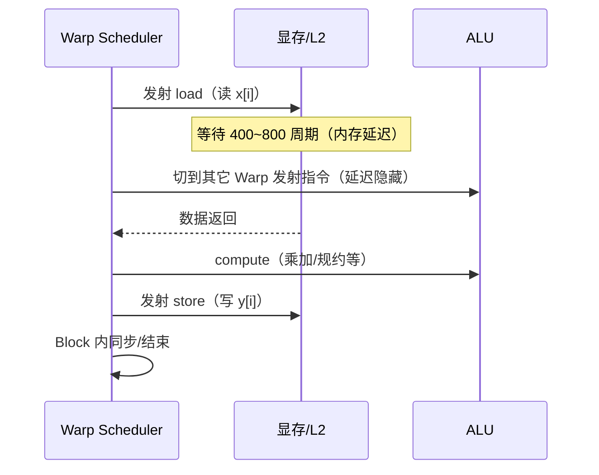

# Ch08：CUDA 线程模型与 Kernel 执行过程

> 本章是「CUDA 与算子优化」模块的第一课。我们用纯 Python 实现一个
> 简化 CUDA Kernel 调度模拟器（`demos/ch08/main.py`），在无 GPU 的机器上
> 直观感受 Grid/Block/Thread 三级线程、Warp 调度、Occupancy 计算与
> Kernel 执行过程。**原理先行、硬件无关**是本模块的教学策略。

## 学习目标

- 理解 Grid / Block / Thread 三级线程层级，及其与 SM（流式多处理器）、Warp 的映射关系
- 掌握 Kernel Launch 语法（`<<<grid, block>>>`）与线程索引计算公式
- 理解 Warp 是硬件调度的最小单位，掌握 Warp Scheduler 的指令发射机制
- 掌握 Occupancy 的概念与四类资源限制的计算方法，能估算驻留 Block 数与占用率
- 理解 Kernel 执行过程（load → compute → store）与延迟隐藏（Latency Hiding）原理

## 核心概念

### 1. 三级线程层级：Grid / Block / Thread

CUDA 的线程组织是「两级粗粒度 + 一级细粒度」的层级结构：

```
┌─────────────────────────────────────────────────────┐
│  Grid（网格）：一次 Kernel Launch 的全部线程         │
│  ┌───────────────┐  ┌───────────────┐  ┌──────────┐ │
│  │ Block 0       │  │ Block 1       │  │ Block N  │ │
│  │  ┌───┐┌───┐   │  │  Thread 0..T  │  │  ...     │ │
│  │  │ T0││ T1│...│  │               │  │          │ │
│  │  └───┘└───┘   │  │               │  │          │ │
│  └───────────────┘  └───────────────┘  └──────────┘ │
└─────────────────────────────────────────────────────┘
            ↓ 硬件映射到
  SM 0 ── Block 0, Block 3, ...（每个 SM 驻留多个 Block）
  SM 1 ── Block 1, Block 4, ...
  ...
```

| 层级 | 定位 | 由谁决定 | 典型规模 |
|------|------|----------|----------|
| Thread | 最小执行单元，执行一段指令 | 程序员设计 | 数万～数百万 |
| Block | 线程组，可同步（`__syncthreads()`）、共享 Shared Memory | 程序员设定 `blockDim` | 128～1024 |
| Grid | 全部 Block 的集合 | 程序员设定 `gridDim` | 按问题规模 |
| Warp | 32 个连续线程，硬件调度单位 | 硬件固定 | 恒为 32 |

**为什么需要三级？** 三级结构让同一个 Kernel 既能表达「任意规模」的问题
（Grid 覆盖全部数据），又能让 SM 以「粗粒度 + 可复用」的方式调度
（Block 内的线程共享数据与同步）。如果只有一层平面线程，共享内存与
块内同步就无从谈起，访存局部性也会大打折扣。

### 2. Kernel Launch 语法与索引计算

CUDA C 中一次启动写成（以两维为例）：

```cuda
// CUDA C 语法（NVIDIA 扩展）
vec_add<<<grid, block>>>(d_x, d_y, N);
// 其中 grid 是 dim3，例如 dim3 grid(8, 4) → gridDim = (8, 4)
//      block 是 dim3，例如 dim3 block(256) → blockDim = (256, 1, 1)
```

Kernel 内部通过内建变量拿到自己的坐标：

| 内建变量 | 含义 | 取值 |
|----------|------|------|
| `blockIdx.x/y/z` | 当前 Block 在 Grid 中的坐标 | 0 ~ gridDim-1 |
| `threadIdx.x/y/z` | 当前线程在 Block 中的坐标 | 0 ~ blockDim-1 |
| `blockDim.x/y/z` | Block 各维线程数 | 由 Launch 指定 |
| `gridDim.x/y/z` | Grid 各维 Block 数 | 由 Launch 指定 |

一维展开后的「全局线性索引」是所有 GPU 编程的基础：

```
global_id = blockIdx.x * blockDim.x + threadIdx.x
warpId    = threadIdx.x // 32
laneId    = threadIdx.x % 32
```


### 3. Warp：硬件调度的最小单位

- 一个 Warp 恒为 **32 个连续线程**（硬件固定，不可配置）
- SIMT（单指令多线程）模型下，一个 Warp 的 32 个线程**同时执行同一条指令**
- Warp 内线程若有分支分歧（`if/else` 走了不同路径），硬件**逐路径串行执行**
  再合并 —— 这就是「Warp Divergence」性能陷阱的根源
- 每个 SM 有若干 **Warp Scheduler**（如 A100/H100 为 4 个），每个周期
  从自己的 Warp 池里挑选一个**就绪**的 Warp 发射一条指令

**为什么以 32 为一组？** 32 是工程权衡的结果：既能一次掩盖数百周期
的访存延迟，又不会让寄存器文件过大；同时 32 线程 × 4 字节恰好对齐
128 字节 cache line，方便合并访存（见 Ch09）。

### 4. Occupancy：驻留 Warp 数与资源限制

Occupancy（占用率）定义：

```
Occupancy = SM 上实际驻留的 Warp 数 / SM 支持的最大 Warp 数
```

现代 GPU 每个 SM 的典型上限（以 H100/A100 为例）：

| 资源 | 上限 | 说明 |
|------|------|------|
| 线程数 | 2048 / SM | 64 Warp |
| Block 数 | 32 / SM | 硬件上限 |
| 寄存器 | 65536 个 32 位 / SM | 供所有驻留线程瓜分 |
| Shared Memory | ~228 KB / SM（H100） | 供驻留 Block 瓜分 |

四类限制共同决定驻留 Block 数，**取最小值**：

```
blocks_by_threads = max_threads // block_size
blocks_by_blocks  = max_blocks
blocks_by_regs    = regs_per_sm // (block_size * regs_per_thread)
blocks_by_smem    = smem_per_sm // smem_per_block
blocks_per_sm     = min(以上四个)
occupancy         = blocks_per_sm * warps_per_block / 64
```

> 直觉：Block 越大（线程越多），能驻留的 Block 数越少；每线程寄存器用得
> 越多，能驻留的线程数越少。Occupancy 反映「SM 的算力有没有被喂饱」。

### 5. 执行过程：load → compute → store

一个 Warp 执行 Kernel 的典型流程：



关键点：**访存延迟数百周期**，如果 SM 上只有一个 Warp，ALU 就会空等；
驻留 Warp 足够多时，一个 Warp 等内存时调度器立刻切换到别的 Warp，
ALU 始终有事可做 —— 这就是「延迟隐藏」，也是 Occupancy 之所以重要的原因。

## 关键代码

本章配套 Demo `demos/ch08/main.py` 用纯 Python 实现一个简化调度模拟器：
三级索引映射、Occupancy 计算、Warp 调度延迟隐藏模拟、Block→SM 的 Wave
调度。运行方式：

```bash
cd courses/15_ai_infra_perf
python demos/ch08/main.py
```

核心代码（节选）：

```python
"""
demos/ch08/main.py（节选）：Occupancy 计算与 Warp 延迟隐藏模拟
"""
WARP_SIZE = 32

def occupancy_calc(block_size, max_threads=2048, max_blocks=32,
                   max_warps=64, regs_per_sm=65536, regs_per_thread=32,
                   smem_per_sm=100*1024, smem_per_block=0):
    blocks_by_threads = max_threads // block_size
    blocks_by_regs    = regs_per_sm // max(1, block_size * regs_per_thread)
    blocks_by_smem    = (smem_per_sm // smem_per_block) if smem_per_block else max_blocks
    blocks_per_sm = min(blocks_by_threads, max_blocks, blocks_by_regs, blocks_by_smem)
    warps_per_block = -(-block_size // WARP_SIZE)
    active_warps = blocks_per_sm * warps_per_block
    return active_warps / max_warps  # Occupancy

def simulate_warps(num_warps, load_latency=200, compute_cycles=50, store_latency=100):
    """每个 warp：load(200cy) → compute(50cy) → store(100cy)。
    单调度器 round-robin 发射，统计总周期与 ALU 利用率。"""
    # （完整实现见 demos/ch08/main.py，包含离散事件调度循环）
    ...
```

运行后你会看到两组关键数据：

```
 Occupancy 扫描（regs/thread 对占用率的影响）：
 Block  regs/thr  块/SM  warp/块  驻留warp  Occupancy
   256       32       8       8        64       100%
   256       64       4       8        32        50%
   256      128       2       8        16        25%

 Warp 延迟隐藏模拟（load 200cy / compute 50cy / store 100cy）：
  warp 数   总周期   ALU忙  利用率
       1      351     52     15%     ← 单个 warp，内存等待无法隐藏
       8      708    416     59%
      16     1116    832     75%     ← warp 越多，等待被计算填满
```

## 课堂练习

### ⭐ 基础：索引换算练习

给定 `grid=(4, 2, 1)`、`block=(128, 1, 1)`：

1. 总共有多少个 Block？多少个线程？
2. `blockIdx=(2, 1, 0)`、`threadIdx=67` 对应的全局线性 ID 是多少？
   `warpId` 和 `laneId` 各是多少？
3. 如果一个线程要访问数组 `x[global_id]`，`global_id` 最大是多少？
4. 用 `demos/ch08/main.py` 的 `thread_index_math` 函数验证你的答案。

### ⭐⭐ 进阶：Occupancy 手工推导

对 H100（2048 线程/SM、32 块/SM、64 warp/SM、65536 寄存器/SM）：

1. Block=512、每线程 64 寄存器：计算四类限制下的驻留 Block 数与 Occupancy
2. 同样的 Block 大小，每线程 128 寄存器：Occupancy 变成多少？为什么？
3. 解释：为什么「高 Occupancy」不一定等于「高性能」？（提示：寄存器少了，
   单线程能缓存的复用数据也少了 —— 见 Ch09 的 Register Tiling）
4. 修改 `occupancy_calc` 参数，模拟加入 `smem_per_block=48KB` 后 128KB 共享
   内存/SM 的限制效果。

### ⭐⭐⭐ 挑战：扩展调度模拟器

在 `simulate_warps` 基础上做两个扩展：

1. **Warp Divergence 模拟**：给部分 Warp 的任务加上 `if` 分支 —— 分支内
   计算量翻倍，但两条路径串行执行，观察总周期如何变长
2. **多调度器模拟**：把单调度器改成 4 个调度器（每调度器负责 1/4 的 Warp），
   对比不同 Warp 数下的利用率曲线，验证「4 调度器 × 16 个 Warp」与
   「1 调度器 × 64 个 Warp」的隐藏效果差异

## 常见问题 Q&A

**Q1：Grid/Block/Thread 和 SM/SP 到底是什么关系？**
A：Grid/Block/Thread 是**程序员视角**的逻辑层级；SM/SP 是**硬件视角**的
物理单元。硬件在 Launch 时把 Block 分发到 SM（一个 SM 可驻留多个 Block），
Block 内的线程再被拆成 Warp 放到 SP（流处理器）上执行。逻辑层级与物理
单元不是一一对应，而是「逻辑线程被硬件动态调度到物理单元」。

**Q2：Block 越大越好吗？**
A：不是。Block 大小需要权衡：太大 → 每 SM 驻留 Block 少、粒度粗，尾波
（tail wave）效应明显，且共享内存/寄存器分配不灵活；太小 → 每 Block
只有几个 Warp，同步开销占比高。工程上 128~256 是常见起点，再按
Occupancy、访存模式调优。判断标准是「整体吞吐」，不是 Block 大小本身。

**Q3：Occupancy 一定要到 100% 吗？**
A：不必。Occupancy 的目标是**喂饱**算力，够用即可。对访存密集 Kernel，
50% 可能已足够隐藏延迟；对计算密集 Kernel，需要更高。真正的优化还要
考虑每个线程的寄存器用量（寄存器越多，单线程复用越强，见 Ch09 的
Register Tiling）。**Occupancy 是手段，不是目标** —— 最终指标是吞吐。

**Q4：`__syncthreads()` 会拖慢执行吗？**
A：会。它是 Block 内屏障，强制所有线程到齐才继续，会造成 Warp 相互等待。
使用原则：只在真正需要共享数据可见性时使用（如 Tiled GEMM 中写完
Shared Memory 后），并尽量减少同步次数。Warp 之间是天然独立的，不需要
同步；跨 Block 无法同步（只能靠全局内存 + Kernel 拆分）。

## 小结

| 要点 | 说明 |
|------|------|
| 三级线程层级 | Grid → Block → Thread，逻辑层级，自由设计 |
| Launch 语法 | `kernel<<<grid, block>>>(...)`，内建 `blockIdx/threadIdx` 取坐标 |
| Warp | 32 线程恒定为硬件调度单位，SIMT 同时执行一条指令 |
| Warp Scheduler | 每 SM 4 个（H100），每周期发射一条就绪 Warp 的指令 |
| Occupancy | 驻留 Warp 数 / 最大 Warp 数，受线程/块/寄存器/共享内存四类限制 |
| 延迟隐藏 | Warp 等内存时切换其它 Warp，ALU 不空转 —— Occupancy 的意义所在 |
| 执行过程 | load → compute → store；Block 分发到 SM、按 Wave 分批执行 |
| 本章工具 | 纯 Python 调度模拟器，无 GPU 可完整复现全部现象 |

## 下一章预告

Ch09「Memory Coalescing、Shared Memory 与 Warp 优化」进入访存优化：
为什么一个 Warp 的 32 个线程访问**连续**地址就能省下 32 倍的带宽？
Shared Memory 的 Bank Conflict 又是怎么悄悄把性能除以 32 的？
我们会用 `mem_sim.py` 与 `gemm_sim.py` 把这两个经典陷阱和对应的
Tiled GEMM 解法彻底讲透。
