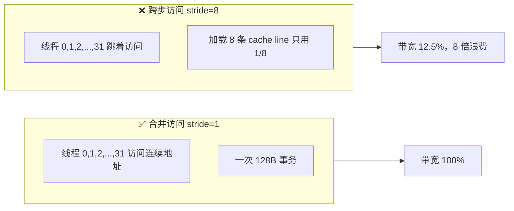
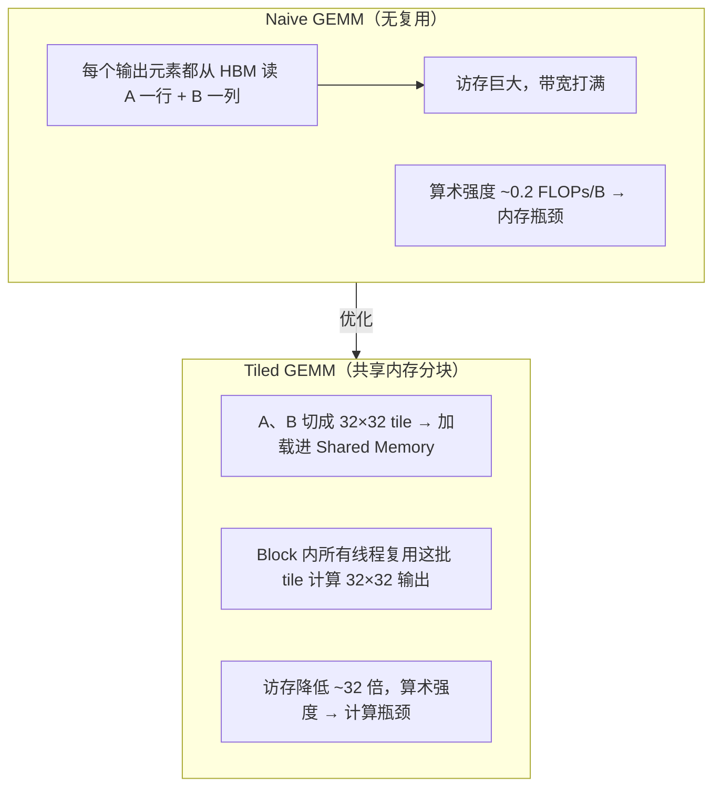
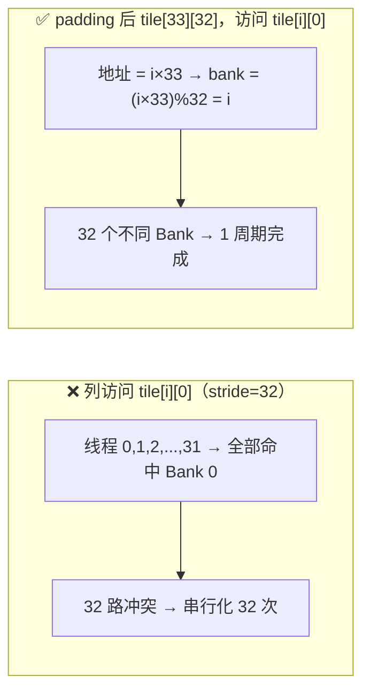

# Ch09：Memory Coalescing、Shared Memory 与 Warp 优化

> 上一章我们理解了 Warp 如何执行指令。本章回答 GPU 访存优化的两个
> 经典问题：**为什么一个 Warp 的 32 个线程访问连续地址能省 32 倍带宽？**
> **为什么 Shared Memory 的 Bank Conflict 会把性能悄悄除以 32？**
> 配套 Demo 复用公共库 `mem_sim.py` 与 `gemm_sim.py`，全部在 CPU 上建模。

## 学习目标

- 理解 Memory Coalescing（合并访问）原理：Warp 连续访存 → 一次事务加载整条 cache line
- 掌握跨步访问（Strided Access）的代价模型，能计算带宽浪费倍数
- 理解 Shared Memory 的分块（Tiling）思想：为什么能大幅降低 HBM 访存量
- 掌握 Bank Conflict 的产生条件与规避手法（padding、改变访问模式）
- 能对比 Naive / Tiled / Register-Tiled 三种 GEMM 的访存量与算术强度

## 核心概念

### 1. Memory Coalescing：连续访存为什么快

GPU 访问全局内存（HBM）时，硬件以 **cache line / sector** 为粒度传输数据
（128B 缓存行，部分架构再拆成 32B sector）。当一个 Warp 的 32 个线程访问
**连续**地址时，硬件可以把这些请求**合并成一次事务**：

```
Warp 的 32 个线程访问 32 个连续 float（4B）：
  线程 0 → 地址 0x000
  线程 1 → 地址 0x004
  ...
  线程 31 → 地址 0x07C
  ─────────────────────────────
  合计跨度 128B = 恰好 1 条 cache line → 1 次内存事务，带宽 100% 利用
```

如果线程访问**跨步**地址（如每个线程跳 2 个元素）：

```
  线程 0 → 0x000  线程 1 → 0x008  ...  跨度 252B
  ─────────────────────────────
  需要 2 条 cache line 才能覆盖 → 2 次事务，但只用了 128B/256B → 浪费 2 倍
```



**为什么需要关注？** 全局内存带宽是所有访存密集算子的第一瓶颈（见 Ch03
Roofline：`性能上限 = 算术强度 × 峰值带宽`）。合并访问让每次事务
「满载」，是让带宽不被浪费的最基本手段。

### 2. 跨步访问的代价模型

假设一个 Warp 32 线程、每元素 4B、cache line 128B：

| 步长（元素） | 访问跨度 | 需要的 cache line | 有效带宽 | 浪费倍数 |
|--------------|----------|-------------------|----------|----------|
| 1 | 128B | 1 | 100% | 1.0× |
| 2 | 252B | 2 | 50% | 2.0× |
| 4 | 500B | 4 | 25% | 4.0× |
| 8 | 996B | 8 | 12.5% | 8.0× |
| 16 | 1988B | 16 | 6% | 16.0× |

（表中「访问跨度」= 第一个线程到最后一个线程的地址差 + 元素大小；
「有效带宽」= 32 线程真正要用的 128B ÷ 实际加载的字节数）

**常见产生跨步访问的场景**：按列遍历行主序矩阵、`stride=2` 的特征抽取、
AoS（Array of Structures）布局按字段访问。对策是**换布局**（SoA）或
**转置/重排**，让 Warp 内线程访问连续内存。

### 3. Shared Memory 与 Tiling：从 HBM 到片上

Shared Memory（共享内存）是 SM 内部的高速存储（约 100~228KB/SM），
带宽远高于 HBM，但容量很小、且只对**同一个 Block** 的线程可见。

Tiling（分块）的核心思想：**把数据切成适合 Shared Memory 的块，块内复用**。

以 GEMM `C[M,N] = A[M,K] × B[K,N]` 为例：

| 实现 | 访存策略 | 访存量（元素） | 算术强度 |
|------|----------|----------------|----------|
| Naive | 算每个 `C[i][j]` 都重读 `A[i,:]` 和 `B[:,j]` | `2·M·N·K + M·N` | ≈0.2 |
| Tiled(32) | 每个 32×32 输出块只读 `A[32,K]`、`B[K,32]` 各一次 | `(M/32)(N/32)·(64K) + M·N` | ≈7.9 |
| Register-Tiled | 在 Tiled 基础上每个线程再负责 REG×REG 输出，寄存器复用 | 同上（片上命中更高） | 更高 |



**为什么需要 Shared Memory？** 因为 L1/Shared 的带宽是 HBM 的数倍到数十倍。
把「每元素都从 HBM 读」改成「tile 一次性进片上、片上复用」，
访存量降低一个量级以上 —— 这正是 Flash Attention、手写 GEMM 的共同骨架。

### 4. Bank Conflict：Shared Memory 内部的串行化

Shared Memory 被划分为 **32 个 Bank**（每个 Bank 一个周期可服务一次访问，
通常按 4B 为一个 bank 单元）。一个 Warp 访问 Shared Memory 时：

- 32 个线程访问 **32 个不同 Bank** → 1 个周期完成 ✅
- 多个线程访问**同一个 Bank 的不同地址** → 冲突，硬件**串行化**处理 ❌
- 所有线程访问**同一个地址** → 广播，不冲突 ✅

经典案例：`float tile[32][32]`，线程 i 访问第 i 行的第 0 列
`tile[i][0]`（地址 = i×32）。由于 `(i×32) % 32 = 0`，32 个线程全部命中
**Bank 0** → 32 路冲突 → 该访问被串行化成 32 次，性能除以 32。



**规避手法**：padding（每行多留一个元素）、改变线程到数据的映射、
用向量化访问、或换一个不冲突的访问顺序。`mem_sim.py` 的
`bank_conflict_detect` 可以直接量化冲突路数。

### 5. Warp 优化手法清单

| 手法 | 原理 | 适用场景 |
|------|------|----------|
| 合并访问 | Warp 连续访存，一次事务满载 | 所有全局内存读写 |
| 布局转换 AoS→SoA | 按字段连续存放，消除跨步 | 结构体数组、特征数据 |
| Tiling 分块 | 片上复用，HBM 访存降量级 | GEMM、卷积、Attention |
| padding 规避冲突 | 打破 Bank 周期性对齐 | Shared Memory 布局 |
| 向量化访存（float4） | 128 位宽加载，减少事务数 | 带宽密集型拷贝/规约 |
| 地址对齐 | 起始地址按 16/32/128B 对齐 | 自定义分配器、行主序矩阵 |

## 关键代码

本章配套 Demo `demos/ch09/main.py` 把三组实验串起来。运行方式：

```bash
cd courses/15_ai_infra_perf
python demos/ch09/main.py
```

核心代码（节选）：

```python
"""
demos/ch09/main.py（节选）：合并访问 + Bank Conflict + GEMM tile 对比
"""
import sys, os
sys.path.insert(0, os.path.abspath(os.path.join(os.path.dirname(__file__), "..", "shared")))
from mem_sim import coalesced_accesses, bank_conflict_detect, CACHE_LINE
from gemm_sim import naive_io, tiled_io, register_tiled_io
from gpu_specs import get_spec

ELEM_BYTES = 4  # FP32

# ① 合并访问实验：stride 扫描，统计 cache line 与有效带宽
for stride in [1, 2, 4, 8, 16, 32]:
    lines, _ = coalesced_accesses(0, stride, 32, ELEM_BYTES)
    used = 32 * ELEM_BYTES
    loaded = lines * CACHE_LINE
    print(f"stride={stride:<3} cache_lines={lines:<3} "
          f"有效带宽={used/loaded*100:5.0f}% 浪费={loaded/used:.1f}x")

# ② Bank Conflict：32×32 tile 按列访问 → 32 路冲突；padding 到 33 → 无冲突
addr_col = [i * 32 for i in range(32)]          # tile[i][0]
addr_pad = [i * 33 for i in range(32)]          # padded tile[i][0]
print("列访问最大冲突:", bank_conflict_detect(addr_col))    # → 32
print("padding后最大冲突:", bank_conflict_detect(addr_pad)) # → 1

# ③ GEMM 访存对比 + H100 带宽上界耗时
spec = get_spec("H100_SXM")
r = tiled_io(1024, 1024, 1024)
total_bytes = r["total_elem"] * ELEM_BYTES
print(f"Tiled 1024³ 访存 {total_bytes/1e9:.2f} GB，"
      f"带宽上界耗时 {total_bytes/(spec.hbm_bw_tbs*1e12)*1e6:.0f} µs")
```

运行后你会看到三组关键输出：

```
[1] Coalescing：stride=1 → 100% 带宽 / 1.0x 浪费
    stride=8 → 12% 带宽 / 8.0x 浪费
[2] Bank Conflict：列访问 32 路冲突 → padding 后 1 路（与理论一致）
[3] GEMM：Naive 8.6GB → Tiled 0.27GB，带宽上界耗时 2565µs → 81µs
```

## 课堂练习

### ⭐ 基础：手工计算合并访问

一个 Warp（32 线程）读取 `float x[1024]`，每线程负责一个连续元素：

1. 线程 i 读 `x[i]`（stride=1）：需要几条 128B cache line？浪费多少？
2. 线程 i 读 `x[i*2]`（stride=2）：跨度多少？需要几条 cache line？
   有效带宽是多少？
3. 改成 `x[i*16]` 呢？总结「步长翻倍 → 带宽减半」的规律。
4. 用 `demos/ch09/main.py` 的第一段实验验证。

### ⭐⭐ 进阶：Tiled GEMM 访存量推导

对 1024³ GEMM（FP32）：

1. 手动计算 Naive 的访存量 `2·M·N·K + M·N`（元素数），再乘 4B 得字节数
2. 手动计算 Tiled(32) 的访存量 `(M/32)(N/32)·(32·K + K·32) + M·N`
3. 两者相差多少倍？对照 H100 的 3.35 TB/s，算各自的带宽上界耗时
4. 结合 Ch03 的 Roofline：Naive 的算术强度在 H100 上属于哪一侧（计算/访存）？
   Tiled 之后呢？

### ⭐⭐⭐ 挑战：Bank Conflict 数学建模

已知 Shared Memory 32 个 Bank、4B/单元，`float tile[rows][cols]` 行主序：

1. 证明：按列访问（线程 i 读 `tile[i][col]`）的冲突路数为
   `rows / gcd(rows, 32)`（当每行元素数为 cols 时）
2. 推导：`cols` 取哪些值时按列访问无冲突？（提示：`cols % 32 == 1` 时
   `bank = (i·cols) % 32 = i`）
3. 写一个循环，枚举 `cols ∈ [1, 64]`，输出 `bank_conflict_detect` 的
   冲突路数，验证你的公式
4. 思考：为什么 `cols=33`（padding）比 `cols=32` 更优？Shared Memory 的
   padding 代价（容量浪费 3%）与冲突代价（32 倍串行化）如何权衡？

## 常见问题 Q&A

**Q1：合并访问是在硬件层面自动完成的吗？为什么程序员还要管它？**
A：硬件确实会自动把「一个 Warp 的请求」尽量合并成事务，但前提是这些
请求的地址在**同一个 cache line 内**。如果程序员把访问写成跨步的，硬件
无论如何合并都要加载多个 cache line —— 浪费无法避免。所以「能不能合并」
由访存模式决定，程序员负责提供连续的模式。

**Q2：Shared Memory 和 L1 Cache 是什么关系？**
A：在 NVIDIA 架构上它们共享同一块片上存储（可配置比例，如 A100 上
L1/Shared 共 256KB，可配成 0/100 ~ 100/0 拆分）。区别在于：Shared Memory
是**程序员显式管理**的（读进 Shared 数组再访问），L1 是硬件自动缓存。
Tiling 的本质就是把「硬件缓存靠不靠谱」变成「显式把复用数据放片上」，
获得确定的性能。

**Q3：Tiled GEMM 既然访存降低了 32 倍，为什么实际加速不到 32 倍？**
A：访存降 32 倍只把「带宽瓶颈」解除了，之后瓶颈转移到**计算和片上带宽**：
- 从 HBM 读数据只是开销的一部分，Shared Memory 的读写、寄存器搬移
  也有成本
- 真正的计算（乘加）需要算力跟上；计算密集化后还要看 Tensor Core 利用率
- 存在边界块、同步、Launch 等固定开销
所以 Tiled 是「把瓶颈从带宽换成算力」—— 从 Roofline 看，这是把算子从
访存密集区挪到计算密集区，之后要优化的是算力利用率（见 Ch12 Triton）。

**Q4：所有算子都该用 Tiling 吗？**
A：不是。Tiling 只对**有数据复用**的算子有意义。Elementwise（逐元素）
每个元素只用一次，没有任何复用，tile 反而多一次 Shared 写读。判断标准：
**算术强度**。复用不起来的算子该走「融合」（减少往返趟数，见 Ch11），
能复用起来的算子才该走「分块」（Tiling，本章）。

## 小结

| 要点 | 说明 |
|------|------|
| Memory Coalescing | Warp 连续访存 → 一次事务满载；跨步访存 → 带宽按倍数浪费 |
| 跨步代价 | stride=k 时有效带宽 ≈ 1/k，cache line 浪费 k 倍 |
| Tiling 分块 | 数据切块进 Shared Memory，块内复用，HBM 访存降量级 |
| Tiled GEMM | Naive→Tiled 访存降 32 倍（1024³ 例子），瓶颈从带宽转算力 |
| Bank Conflict | 同 Bank 不同地址 → 串行化；同地址 → 广播不冲突 |
| padding | 行长 +1 打破 Bank 周期性对齐，32 路冲突 → 1 路 |
| 判断标准 | 有复用走 Tiling，无复用走 Fusion（Ch11） |
| 本章工具 | mem_sim.py（coalescing/conflict 检测）、gemm_sim.py（三种实现对比） |

## 下一章预告

Ch10「PyTorch Profiler 与 Nsight 性能分析」进入性能分析环节：我们已经
知道「什么模式快、什么模式慢」，现在要学会**用工具测量真实程序**——
`torch.profiler` 如何统计每个 kernel 的耗时？时间线怎么读？Nsight
Systems 与 Nsight Compute 分别回答「哪里慢」和「为什么慢」？
配合一个可运行的 Profiler Demo，建立「测量 → 定位 → 优化」的闭环。
