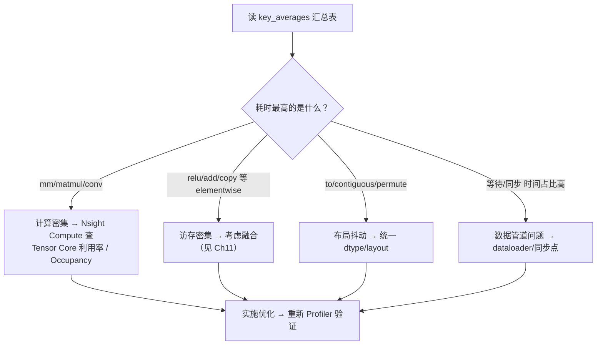

# Ch10：PyTorch Profiler 与 Nsight 性能分析

> 前两章我们建立了「什么模式快、什么模式慢」的原理直觉。本章进入
> **测量**环节：用 `torch.profiler` 量化真实训练脚本中每个 kernel 的耗时，
> 学会读时间线，并掌握 Nsight Systems / Nsight Compute 的定位方法。
> 配套 Demo `demos/ch10/main.py` 在无 GPU 时也能跑（torch.profiler 在
> CPU 模式下同样能输出算子级时间表），有 GPU 时自动切换到 CUDA 分析。

## 学习目标

- 掌握 `torch.profiler.profile` / `key_averages().table()` / `export_chrome_trace()` 的用法
- 能解读 Profiler 时间线与 kernel 耗时分布表，识别计算密集与访存密集算子
- 掌握 Profiler Schedule（wait/warmup/active）与长时采样的配置方法
- 理解 Nsight Systems（系统级时间线）与 Nsight Compute（单 kernel 级）的分工与用法
- 掌握「瓶颈 → 优化清单」的自动映射方法，形成测量到优化的闭环

## 核心概念

### 1. 为什么需要 Profiler？

优化不能靠猜。一个训练 step 里可能跑几十个 kernel，其中往往
**一两个 kernel 占了 80% 的时间**。没有量化，「优化」就是赌博。

```
┌──────────────────────────────────────────────────────────┐
│  训练 step 时间线（简化）                                  │
│  ┌────┐┌──┐┌─────────┐┌──┐┌──────┐┌─────┐               │
│  │mm  ││t ││addmm    ││t ││softmax││mm   │   ...          │
│  └────┘└──┘└─────────┘└──┘└──────┘└─────┘               │
│   ~~~~~~~~  ← 大量小 kernel + 频繁 launch = 碎片化         │
└──────────────────────────────────────────────────────────┘
         ↓ Profiler 量化后
  算子        耗时占比
  addmm        45%     ← 计算密集，先看 GEMM 效率
  softmax      18%     ← 访存密集，考虑融合
  (空转/等待)  15%     ← 同步/加载，查 dataloader
```

**Profiler 回答两类问题**：
- **哪里慢**（Where）：时间都花在哪个 kernel / 哪个阶段 → torch.profiler
- **为什么慢**（Why）：这个 kernel 是带宽受限还是算力受限、Occupancy 如何、
  stall 在哪 → Nsight Compute

### 2. torch.profiler 三件套

```python
from torch.profiler import profile, ProfilerActivity, record_function

with profile(activities=[ProfilerActivity.CPU, ProfilerActivity.CUDA],
             record_shapes=True, profile_memory=True) as prof:
    for step in range(10):
        loss = model(x)          # 你的训练/推理代码
        loss.backward()
        opt.step()

# ① 汇总表：按 self 耗时排序，看每个算子的开销
print(prof.key_averages().table(
    sort_by="self_cuda_time_total", row_limit=20))

# ② 时间线：导出后浏览器打开 chrome://tracing
prof.export_chrome_trace("trace.json")

# ③ 长时采样：只在特定步数采，避免 overhead
with profile(activities=..., schedule=torch.profiler.schedule(
        wait=2, warmup=2, active=3, repeat=1)) as prof:
    for step in range(10):
        train_step()
        prof.step()              # 必须手动推进采样窗口
```

| API | 作用 | 关键参数 |
|-----|------|----------|
| `profile(...)` | 进入采集上下文 | `activities`（CPU/CUDA）、`record_shapes`、`profile_memory` |
| `prof.key_averages()` | 聚合出每个算子的统计 | 配合 `.table(sort_by=..., row_limit=...)` |
| `prof.step()` | 推进 schedule 窗口 | 与 `schedule(wait, warmup, active)` 搭配 |
| `record_function("name")` | 给代码段命名，便于归类 | 字符串名会出现在时间线 |
| `export_chrome_trace` | 导出 Chrome Trace 格式 | 用 chrome://tracing / Perfetto 打开 |

> **重要**：`wait/warmup/active` 的意义 —— `warmup` 步不采数（跑热、
> 消除初始化噪音），`active` 步才真正采集，`wait` 步等待稳态。
> Profiler 本身有开销，长训练中只采少数几个 step 是标准做法。

### 3. 时间线解读

Chrome Trace 时间线（横向为时间，纵向为线程/流）：

| 观察点 | 含义 | 该怎么做 |
|--------|------|----------|
| 大色块 | 单个长耗时 kernel | 用 Nsight Compute 深入这个 kernel |
| 同色小色块反复出现 | kernel 碎片化（launch 开销占比高） | 算子融合 / CUDA Graph（Ch20） |
| GPU 行出现大段空白 | GPU 空闲，等数据/同步 | 查 dataloader、`.cpu()`/`.item()` 同步点 |
| CPU 发射超前 GPU 很多 | 任务队列积压 | 通常无害；若显存吃紧则需限流 |
| CPU 明显落后 GPU | CPU 是瓶颈（launch 跟不上） | CUDA Graph / 减少小算子 / 异步数据加载 |



### 4. Nsight Systems：系统级时间线

`nsys profile` 采集的是**整个进程**的时间线：CPU 端函数、GPU kernel、
CUDA API 调用、内存拷贝、网络（NCCL）活动全部按时间排开。它回答
**「时间去哪了」**：

```bash
# 采集（自动插桩 CUDA/NVTX/OS 活动）
nsys profile -o trace --trace=cuda,nvtx,osrt python train.py

# 统计报告：各 kernel 耗时、占比
nsys stats --report cuda_gpu_kern_sum trace.nsys-rep
```

典型用途：确认「GPU 利用率为什么低」—— 是 kernel 之间有空隙
（launch 太碎），还是 CPU 在跑数据加载 / 等待同步。

### 5. Nsight Compute：单 kernel 级

`ncu` 对**单个 kernel**做深度剖析：实测算力、带宽、Occupancy、
warp stall 原因、指令 mix。它回答**「这个 kernel 为什么慢」**：

```bash
# 只剖析匹配到的 kernel（跳过前 2 次，取 1 次）
ncu --kernel-name regex --launch-skip 2 --launch-count 1 python train.py
# 常用 set：full（全量）/ detailed / roofline（自动算瓶颈类型）
ncu --set roofline python train.py
```

| 指标 | 说明 | 含义 |
|------|------|------|
| Compute (SM) Throughput | SM 算力利用率 | 高 → 计算受限 |
| Memory Throughput | 显存带宽利用率 | 高 → 访存受限 |
| Achieved Occupancy | 实测占用率 | 低于预期 → 查资源限制 |
| Warp Stall Reasons | warp 停在等什么 | 等数据/等待依赖/等待执行资源 |

> 分工总结：**Systems 找大方向，Compute 找根因，Profiler 做日常统计**。
> 三者配合的路径是：Profiler 发现 top kernel → Systems 确认时间分布 →
> Compute 深挖根因 → 优化 → 再 Profiler 验证收益。

### 6. 瓶颈 → 优化清单（方法）

| 观察到的模式 | 判断 | 优化动作 |
|--------------|------|----------|
| `mm`/`addmm`/`conv` 占比高 | 计算主导 | 检查 Tensor Core、混合精度、Triton 重写（Ch12） |
| elementwise（relu/add/mul）占比高 | 访存主导 | 算子融合（Ch11）、减少中间张量 |
| softmax/layernorm 占比高 | 规约类 | 融合进相邻 kernel（Flash 风格 online 算法） |
| `to`/`contiguous`/`copy` 频繁 | 布局抖动 | 统一 dtype/layout，避免隐式转换 |
| 大量小 kernel | 碎片化 | 融合 / CUDA Graph（Ch20） |
| GPU 空闲等待 | 数据/同步瓶颈 | dataloader 多进程、prefetch、去同步点 |

## 关键代码

本章配套 Demo `demos/ch10/main.py` 在 CPU 与 GPU 上都能跑。运行方式：

```bash
cd courses/15_ai_infra_perf
python demos/ch10/main.py
```

核心代码（节选）：训练一个小 MLP 并 Profiler：

```python
"""
demos/ch10/main.py（节选）：torch.profiler 分析小训练脚本
"""
from torch.profiler import profile, ProfilerActivity, record_function

model = torch.nn.Sequential(
    torch.nn.Linear(128, 256), torch.nn.ReLU(),
    torch.nn.Linear(256, 64), torch.nn.ReLU(),
    torch.nn.Linear(64, 10))
opt = torch.optim.SGD(model.parameters(), lr=0.01)
x, y = torch.randn(64, 128), torch.randint(0, 10, (64,))

def train_step():
    with record_function("train_step"):
        out = model(x)
        loss = torch.nn.functional.cross_entropy(out, y)
        opt.zero_grad(); loss.backward(); opt.step()

with profile(activities=[ProfilerActivity.CPU],   # 有 GPU 时加 CUDA
             record_shapes=True, profile_memory=True) as prof:
    with record_function("epoch"):
        for _ in range(12):
            train_step()

prof.export_chrome_trace("ch10_trace.json")
print(prof.key_averages().table(sort_by="self_cpu_time_total", row_limit=15))
```

Demo 还会把每个 top 算子自动映射到「瓶颈类别 + 优化动作」（即
`bottleneck_to_action` 函数），例如：

```
aten::addmm        4.5ms  计算密集（GEMM/Conv）→ 检查算力利用率；考虑 Tensor Core / Triton
aten::mm           2.6ms  计算密集 → ...
aten::relu         0.1ms  访存密集（Elementwise）→ 考虑算子融合 / 减少中间张量
aten::_log_softmax 0.3ms  规约/归一化 → 考虑融合（Flash 风格 online 算法）
```

**在 GPU 机器上**，把 `activities` 加上 `ProfilerActivity.CUDA` 后，
表格会多出 `Self CUDA time` 列 —— 那是 kernel 在 GPU 上的真实耗时，
是优化前必须看清的「实际账单」。

## 课堂练习

### ⭐ 基础：Profiler 报告阅读

运行 `demos/ch10/main.py`，回答：

1. 汇总表里 Self CPU time 最高的 3 个算子是谁？分别占多少比例？
2. 表格中 `aten::addmm` 的 `CPU total` 比 `Self CPU` 大，说明什么？
   （提示：total 包含它调用的子算子）
3. 找出至少 2 个「访存密集（elementwise）」类算子和 2 个「计算密集」算子
4. 对照「瓶颈 → 优化清单」表，给这个小模型提 3 条优化建议

### ⭐⭐ 进阶：时间线解读实验

1. 运行 Demo 后打开 `ch10_trace.json`（chrome://tracing 或 Perfetto）
2. 找到 `train_step` 区间，数一数一个 step 里有多少个 kernel
3. 观察：forward 与 backward 的 kernel 数量比例约为多少？为什么 backward
   一般更多？
4. 修改 Demo：把 `loss.backward()` 去掉（只做 forward），重新 Profiler，
   对比 kernel 数与耗时变化 —— 量化 backward 的开销占比

### ⭐⭐⭐ 挑战：自制 Profiler 看板

1. 用 `prof.key_averages()` 把前 N 个算子提取成 Python 数据结构
2. 画一张柱状图：横轴为算子名，纵轴为 Self CPU time（matplotlib）
3. 给每个算子标上类别颜色（计算密集=红，访存密集=蓝，搬运=绿）
4. 再把训练改成大一点的模型（如 512→512→10），对比两次的类别分布
   —— 观察模型变大后瓶颈类别是否迁移
5. 思考：这套「提取 → 分类 → 可视化」流程如何沉淀成团队常规的
   性能回归看板？（这正是综合项目 P2「Profiler 定位训练瓶颈」的雏形）

## 常见问题 Q&A

**Q1：Profiler 本身有开销吗？会不会影响测量结果？**
A：会。`record_shapes`、`profile_memory` 和 CUDA 活动采集都有额外开销，
尤其小 kernel 密集的场景下 Profiler 可能让总时间膨胀 10%~30%。对策：
① 用 `schedule(wait, warmup, active)` 只在稳态采样少量 step；
② 对比优化前后时保持完全相同的 Profiler 配置，保证相对值可比；
③ 关键结论用 `torch.cuda.synchronize()` + 手动计时（`demos/shared/
kernel_bench.py` 的 `timed` 上下文）二次验证。

**Q2：没有 NVIDIA GPU，怎么学 Profiler 和 Nsight？**
A：三条路并行：① `torch.profiler` 在 CPU 模式下照常出表（本 Demo 即如此），
能完整掌握 API 用法与表格解读；② Nsight 系列是工具概念，命令与报告结构
可以在文档/教程里学，原理（时间线、stall 指标）与 GPU 无关；
③ 用云 GPU（如 AutoDL 小时计费）跑一遍真实 Nsight 命令，几块钱就能完成
「真实采样的全流程」。原理部分不依赖硬件，本课程全部覆盖。

**Q3：`key_averages()` 表格里 Self CPU time 和 CPU total 有什么区别？**
A：`Self CPU time` 是**这个算子自身**的执行时间（不含它调用的子算子）；
`CPU total` 是这个算子**及其递归调用**的全部时间。对 `aten::addmm`，
total ≈ self（它是最底层 kernel）；对 `Optimizer.step`，total 包含它触发
的全部底层 kernel。排序时默认按 self 排序更接近「真实耗时账单」。
GPU 模式对应 `self_cuda_time_total` 同理。

**Q4：Profiler 显示 addmm 最慢，就一定要重写 GEMM 吗？**
A：不一定。先分三步：① 看占比是否真的主导（若只有 20%，先优化别的）；
② 用 Nsight Compute 看这个 addmm 是不是已经接近峰值（若已达 80%+ 算力
利用率，重写空间不大）；③ 看形状 —— 小 GEMM（如 64×64）受 launch 与
碎片化影响更大，大 GEMM（4096³）才值得手工调。**测量先于优化，
优化后必须重新测量**。

## 小结

| 要点 | 说明 |
|------|------|
| Profiler 三件套 | `profile()` 采集 → `key_averages().table()` 汇总 → `export_chrome_trace()` 时间线 |
| Schedule | `wait/warmup/active` 长时采样，warmup 消除噪音、active 才采数 |
| 时间线解读 | 大块=长 kernel；碎片=launch 开销；GPU 空行=数据/同步瓶颈 |
| Nsight Systems | 系统级时间线，回答「时间去哪了」（`nsys profile`） |
| Nsight Compute | 单 kernel 级，回答「为什么慢」（`ncu`，看 stall/occupancy/带宽） |
| 瓶颈映射 | 计算密集→GEMM 效率；访存密集→融合；布局抖动→统一 dtype |
| 优化闭环 | 测量 → 定位 → 优化 → 重新测量验证 |
| 本章 Demo | CPU/GPU 双路径，含自动「瓶颈→优化清单」映射 |

## 下一章预告

Ch11「Kernel Fusion 与算子融合优化」把分析能力变成优化动作：
既然 Profiler 显示 elementwise 算子占了大量访存，那把它们**融合**成一个
kernel 能省多少带宽？Softmax 为什么要融合成「一趟」？Flash Attention
的 online softmax 在数值上为什么可行？我们用访存模型和一个可运行的
online softmax 数值实验把「融合的账」算清楚。
