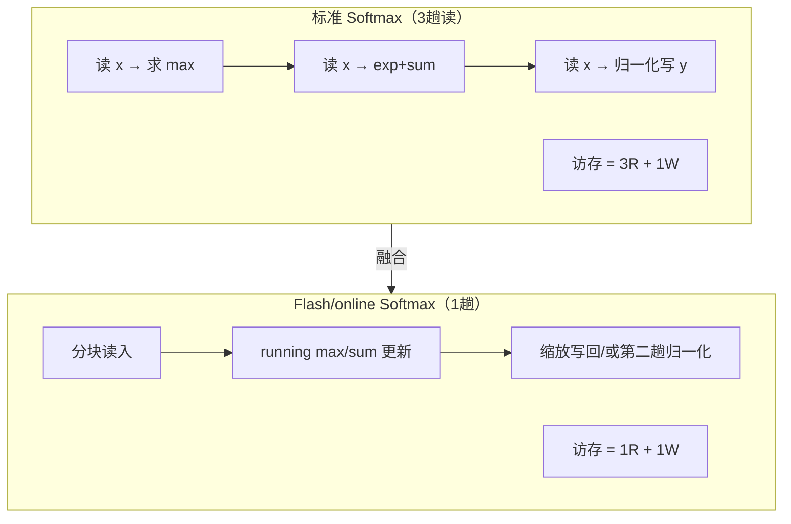

# Ch11：Kernel Fusion 与算子融合优化

> Profiler 告诉我们 elementwise 类算子占比很高。本章解决「怎么办」：
> **算子融合（Kernel Fusion）**。核心洞察是：elementwise/softmax 这类
> 访存密集算子受**带宽**限制，而分离执行的每个 kernel 都要把中间结果
> 写回 HBM 再读出来 —— 融合把「往返 HBM」变成「片上一次完成」。
> 配套 Demo `demos/ch11/main.py` 用访存模型量化融合收益，并附一个
> **online softmax 数值实验**（Flash Attention 的核心思想）。

## 学习目标

- 理解融合的动机：访存密集算子受带宽限制，减少 HBM 往返 ≈ 直接提速
- 掌握 Elementwise 融合的访存量计算：分离（多 kernel）vs 融合（单 kernel）
- 理解 Softmax 的融合收益：三趟读 vs 单趟读（online/Flash 风格）
- 掌握 online softmax 的数学原理：running max + running sum 的流式更新
- 能用数值实验证明 online softmax 与标准 softmax 的一致性，理解其数值安全性

## 核心概念

### 1. 融合动机：访存密集算子被带宽卡住

回顾 Ch03 的 Roofline：一个算子的性能上界 = `min(峰值算力, 算术强度 × 峰值带宽)`。
Elementwise 算子（relu、add、mul、exp...）每个元素只做 1 次运算，
算术强度 ≈ 0.5 FLOPs/B，远低于 H100 的转折点（~295 FLOPs/B）——
**它被带宽死死卡住**。这意味着：这种算子的耗时几乎等于
「读 + 写」的字节数 ÷ 带宽。

```
Elementwise 链：y = relu((x + b) * scale)
┌───────────────────────────────────────────────────────────┐
│ 分离执行（3 个 kernel）：                                    │
│   kernel1 add:  读 x,b → 写 t1    （2R + 1W）              │
│   kernel2 relu: 读 t1 → 写 t2     （1R + 1W）              │
│   kernel3 mul:  读 t2 → 写 y      （1R + 1W）              │
│   总访存 = 4R + 3W = 7 × N × 4B                            │
│ 融合执行（1 个 kernel）：                                    │
│   读 x,b → 片内算 → 写 y          （2R + 1W）              │
│   总访存 = 3 × N × 4B                                      │
└───────────────────────────────────────────────────────────┘
```

**为什么中间张量往返 HBM 是纯浪费？** `t1` 和 `t2` 只有下一个 kernel
才用到，它们的存在完全是因为「分离 kernel 无法把数据留在片上」。
融合把它们消灭，访存直接省掉约 `7/3 ≈ 2.3×`（本链路）。

### 2. 什么时候该融合：访存密集 vs 计算密集

| 算子类型 | 算术强度 | 瓶颈 | 融合收益 |
|----------|----------|------|----------|
| elementwise（relu/add/exp） | ~0.5 FLOPs/B | 带宽 | **巨大**：少一趟就是一趟带宽 |
| 规约/归一化（softmax/layernorm） | ~1-5 FLOPs/B | 带宽 | **大**：把多趟读压成一趟 |
| 大 GEMM | 百~千 FLOPs/B | 算力 | 小：重点是分块复用（Ch09） |
| Attention（QK^T/softmax/PV） | 中等 | 混合 | **大**：Flash Attention 即融合 |

判断工具就是 Roofline：**算术强度低于转折点 → 访存瓶颈 → 融合是首选手段**。

### 3. Softmax 的融合：从三趟读降到一趟读

标准数值稳定 Softmax 需要三趟内存访问：

```
① 找 max：  读 x → 得到行 max m        （1R）
② exp+sum： 读 x → 计算 Σ exp(x-m)     （1R）
③ 归一化：  读 x → 写 y = exp(x-m)/s   （1R + 1W）
合计：3R + 1W = 4 趟 × N × 4B
```

Flash Attention / online softmax 的核心：**用 running max + running sum
流式更新，一趟读完所有数据**：

```
对每个 tile（分块）：
  读取 x_tile
  m_new = max(m, max(x_tile))
  s = s × exp(m - m_new) + Σ exp(x_tile - m_new)
  m = m_new
结束时得到精确的行 max 与行 sum —— 无需第二趟
合计：1R + 1W（输出写回）
```



（Demo 中为兼顾简洁与正确，`online_softmax` 用「一趟统计 + 一趟归一化」的
两趟实现演示数值等价；真实 Flash Attention 用「写回时按比例缩放已输出
tile」的 rescale 技巧做到严格一趟，思想完全相同。）

### 4. online softmax 的数学：为什么数值上安全

关键更新公式（设当前行已有 `(m, s)`，新来一列 `x`）：

```
m_new = max(m, x)                    # 新的最大值
s_new = s × exp(m − m_new) + exp(x − m_new)   # 旧和缩放到新 max 下
```

为什么数值稳定？因为**指数始终作用在「减去当前行最大值」的数上**，
`exp(x - m_new) ∈ (0, 1]`，不会溢出；旧的 `s` 用 `exp(m - m_new)` 等比
缩放，恰好等价于「如果一开始就用 m_new 做减数，旧项的 exp 应该是什么」。
数学上分块与不分块得到完全相同的 `(m, s)`（在浮点精度内），
这就是 Flash Attention 能分块读入、一次出结果的底气。

| 特性 | 标准（3 趟） | online（1~2 趟） |
|------|--------------|------------------|
| HBM 读取次数 | 3 | 1 |
| 内存峰值 | 需要整行（或一次读整行） | 只需要当前 tile |
| 数值稳定性 | 依赖「先整体减 max」 | 流式减 running max，等价稳定 |
| 片上内存需求 | 大（要缓存整行 x 的中间值） | 小（只留 tile + 两个标量） |
| 与 Attention 的结合 | 无法做 | 可以（QK^T 分块 → online → PV） |

### 5. 融合的工程形态

| 形态 | 说明 | 代价 |
|------|------|------|
| 手写融合 CUDA/Triton kernel | 完全掌控访存 | 开发成本高 |
| `torch.compile`（Ch19） | 图级自动融合 elementwise 链 | 编译时间、调试黑盒 |
| Triton 算子（Ch12） | 半自动：用 Python 写融合 kernel | 需要学习 DSL |
| Flash Attention 库 | 直接调现成融合 Attention | 灵活性受限 |

## 关键代码

本章配套 Demo `demos/ch11/main.py` 包含访存模型与 online softmax 数值实验。
运行方式：

```bash
cd courses/15_ai_infra_perf
python demos/ch11/main.py
```

核心代码（节选）：online softmax 的流式实现与验证：

```python
"""
demos/ch11/main.py（节选）：online softmax 数值实验
"""
import numpy as np

def online_softmax_stats(x, tile=128):
    """单趟流式统计每行 (running_max, running_sum)。
    这是 Flash Attention 的数值核心：只遍历一次数据。"""
    x = x.astype(np.float64)
    rows, cols = x.shape
    m = np.full(rows, -np.inf)
    s = np.zeros(rows)
    for j0 in range(0, cols, tile):
        chunk = x[:, j0:j0 + tile]
        m_new = np.maximum(m, chunk.max(axis=-1))
        # 旧 sum 缩放到新 max 下 + 累加本 tile 的 exp
        s = s * np.exp(m - m_new) + np.exp(chunk - m_new[:, None]).sum(axis=-1)
        m = m_new
    return m, s

# 用大范围数值（-1000 ~ 1000）制造 softmax 的经典不稳定场景
x = np.random.default_rng(42).uniform(-1000, 1000, size=(64, 4096))
ref = np.exp(x - x.max(axis=-1, keepdims=True))
ref = ref / ref.sum(axis=-1, keepdims=True)      # 标准稳定 softmax

m, s = online_softmax_stats(x, tile=128)         # 一趟统计
out = np.exp(x - m[:, None]) / s[:, None]        # 用 online 统计归一化
err = np.abs(out - ref).max()
print(f"online softmax 最大误差 = {err:.2e}")    # ~1e-16，数值一致 ✅
```

Demo 还会打印融合收益表：

```
[1] Elementwise 融合（N=100 万，FP32）：
    分离(3 kernel)  28 MB 访存   → H100 带宽上界 8.4 µs
    融合(1 kernel)  12 MB 访存   → 3.6 µs      （降低 2.3x）
[2] Softmax 融合：
    标准(3R+1W)  33.6 MB → 10.0 µs
    Flash(1R+1W) 16.8 MB →  5.0 µs
[3] online softmax 数值实验：所有 tile 尺寸误差 < 1e-15 ✅
```

## 课堂练习

### ⭐ 基础：融合访存账本

对 `y = relu((x + b) * scale)`（N 个 FP32 元素，带宽 B）：

1. 分离执行 3 个 kernel 的总访存字节数是多少？（用 N 和 4B 表达）
2. 融合成 1 个 kernel 后是多少？比值是多少？
3. 如果再加一个 `tanh`（`y = tanh(relu(...))`）：分离变成几个 kernel？
   新访存是多少？融合后呢？比值变大还是变小？
4. 结论：链越长，融合收益越大 —— 用一句话解释为什么

### ⭐⭐ 进阶：Softmax 两趟与一趟的访存核算

1. 手动列出标准 softmax 的 3 趟访问各读了什么、写了什么
2. 为什么「缓存 max 和 sum」能把 3R+1W 降到 2R+1W？（哪一趟被省了？）
3. online 方案里 running sum 的缩放因子 `exp(m - m_new)` 为什么不会溢出？
   （提示：`m - m_new ≤ 0`）
4. 用 `demos/ch11/main.py` 验证：把 tile 从 32 改成 2048，误差如何变化？
   为什么 tile 越小误差反而可能略大？（浮点累加顺序不同）

### ⭐⭐⭐ 挑战：把 online 思想扩展成「融合 Attention」雏形

1. 实现一个简化版融合 Attention：对 Q、K、V（形状 B×H×S×D）按
   S 维分块计算 `S_tile = Q·K_tile^T`、`P_tile = softmax(S_tile)`、
   `O_tile += P_tile·V_tile`，其中 softmax 用本章的 online 版本
2. 用随机数据对比你的输出与「标准 Attention」`softmax(QK^T/√d)·V`，
   报告最大误差
3. 统计你的实现的「HBM 访存趟数」：Q、K、V、O 各读/写几次？
   对比标准 Attention（S = QK^T 要写回 HBM 再读回）
4. 思考：为什么 Flash Attention 能处理「比片上内存大得多的序列」？
   （提示：任意时刻只需要 3 个 tile + 2 个标量）
   —— 这为 Ch22 KV Cache 与推理系统埋下伏笔

## 常见问题 Q&A

**Q1：融合听起来万能，为什么不是所有算子都融合？**
A：融合的本质是「把多个 kernel 的访存合并成一趟」。但有几个代价：
① **片上内存有限**，一个 kernel 需要把参与运算的中间数据都放在
Shared/寄存器里，tile 太大放不下；② **复用性** —— 如果两个算子的中间
结果要被很多后续算子复用（如 Attention 的 Q、K、V 被多个 head 共享），
强制融合可能反而重复计算；③ **编译与调试成本**。工程上通常只融合
访存密集链（elementwise 链、softmax+后续 GEMM、layernorm 链）。

**Q2：`torch.compile` 不是自动融合吗？为什么还要手写？**
A：`torch.compile`（Inductor）对 elementwise 链的自动融合做得很好，
绝大多数场景直接用即可（见 Ch19）。手写融合 kernel 的意义在于：
① 融合策略超出编译器的模式匹配范围（如 Flash Attention 的跨块 online
更新）；② 需要精确控制 tile 大小/寄存器分配/访存顺序来榨干带宽；
③ 编译器生成的 kernel 有时带额外 guard/装箱开销。实践路线：
先用 `torch.compile` 拿到 80% 的收益，再用 Triton 手写剩余的 20%。

**Q3：online softmax 比标准 softmax 数值差吗？**
A：不差，反而更稳。标准实现「先整体减 max」与 online 的「流式减 running
max」在数学上等价；online 的每个中间量 `exp(x - m_new)` 都 ≤ 1，
不存在溢出路径。Demo 数值实验显示各 tile 尺寸下最大误差都在 1e-15 量级
（机器精度），与分块顺序无关。Flash Attention 论文里也验证了这一点。

**Q4：融合省的是「时间」还是「带宽」？**
A：严格说是省「访存字节数」→ 在带宽受限时等价于省时间。如果算子本来
就没跑满带宽（例如 kernel 太小、launch 开销主导），融合的收益会打折扣；
但它同时**减少了 kernel 数量**，launch/调度开销也随之下降，所以通常
双向受益。用 Profiler 验证（Ch10 的闭环）永远是最后一步。

## 小结

| 要点 | 说明 |
|------|------|
| 融合动机 | elementwise/softmax 受带宽限制，HBM 往返是纯浪费 |
| 访存账本 | 分离 7 趟（4R+3W）→ 融合 3 趟（2R+1W），省 ~2.3× |
| 融合判据 | Roofline 算术强度 < 转折点 → 访存瓶颈 → 优先融合 |
| Softmax 融合 | 标准 3R+1W → online 1R+1W，省 ~50% 访存 |
| online 公式 | `m_new=max(m,x)`；`s_new=s·exp(m-m_new)+exp(x-m_new)` |
| 数值安全 | 指数恒作用在「减当前 max」的数上，无溢出路径 |
| Flash Attention | 分块 QK^T → online softmax → 分块 PV，片上小、可处理长序列 |
| 工程形态 | 手写 kernel / torch.compile / Triton / Flash 库 |
| 本章 Demo | 访存模型 + online softmax 数值验证（全部 CPU 可跑） |

## 下一章预告

Ch12「Triton 算子开发与性能调优」把融合思想变成可运行的代码：
Triton 的 `@triton.jit`、`tl.load/tl.store/tl.dot` 如何用一个 Python DSL
写出融合 elementwise 和 GEMM 算子？`@triton.autotune` 怎么自动挑出最优
分块配置？Demo 会优先跑真实 Triton kernel 并和 torch 对比，无法安装
Triton 时则用纯 Python tile 模拟并附完整源码 —— 两条路都能学通。
