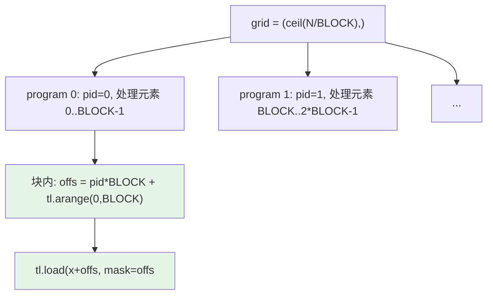
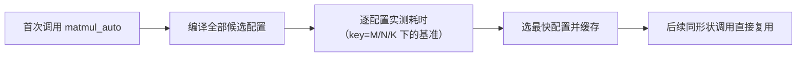

# Ch12：Triton 算子开发与性能调优

> 前两章讲了「为什么融合」（Ch11）与「怎么分析」（Ch10）。本章把优化
> **写成代码**：Triton 是 OpenAI 开源的 GPU 编程 DSL —— 用接近 Python 的
> 语法写高性能 kernel，由编译器负责分块、向量化、Tensor Core 映射。
> 配套 Demo `demos/ch12/main.py` 优先跑真实 Triton kernel 并对比 torch；
> 无 GPU/未安装 Triton 时自动降级为纯 Python tile 模拟 + 完整源码输出。

## 学习目标

- 理解 Triton 的编程模型：grid（program 网格）/ block（program）/ tile（tl.arange）
- 掌握 `@triton.jit` 编写 elementwise 融合算子：`tl.load` / `tl.store` / mask 边界处理
- 掌握 Triton GEMM 的写法：`tl.dot` 分块累加、L2 友好的 block swizzle
- 理解 `@triton.autotune` 自动调优机制：多组配置实测选优、按 key 缓存
- 能对比 Triton 与 torch/cuBLAS 的性能，形成「写 → 测 → 调」的闭环

## 核心概念

### 1. Triton 是什么：为什么需要它

手写 CUDA C 的痛点：每个算子都要手动管理线程、共享内存、向量化，
代码冗长且容易踩坑（Ch08/Ch09 的坑它都想帮你填）。PyTorch 的内置算子
库（cuBLAS/cuDNN）性能好但**不支持自定义融合**。Triton 站在中间：

```
┌────────────────────────────────────────────────────┐
│  表达层  Triton DSL（Python 风格，块级操作）          │
│     │                                               │
│     ▼  编译器（triton compiler）                     │
│  - 自动分块/向量化/共享内存规划                       │
│  - 自动映射到 Tensor Core（tl.dot）                  │
│  - 自动做合并访问、处理边界 mask                      │
│     │                                               │
│     ▼                                               │
│  执行层  CUDA PTX → GPU                              │
└────────────────────────────────────────────────────┘
```

| 方案 | 融合自定义算子 | 手写易用性 | 性能可达 |
|------|----------------|------------|----------|
| PyTorch 算子拼接 | ❌ 只能靠 torch.compile | ✅ | 受限于库算子 |
| CUDA C 手写 | ✅ | ❌ 门槛高、易出错 | 最高（需大量调优） |
| Triton | ✅ | ✅（Python DSL） | 接近手写最优（自动调优后） |
| cuBLAS/cuDNN | ❌ | ✅（直接调用） | 库级最优（但非自定义） |

**为什么需要它**：LLM 时代大量自定义融合算子（Flash Attention、融合
layernorm、MoE 路由）需要「库之外」的性能，Triton 把开发成本降低一
个数量级，已成为 vLLM、PyTorch 社区写自定义算子的标准方式。

### 2. 编程模型：grid / program / tile

Triton 的抽象与 CUDA 一一对应，但粒度更粗：

| Triton 概念 | 对应 CUDA | 说明 |
|-------------|-----------|------|
| grid | Grid 维度 | `(num_blocks,)` 或 `(M/BLOCK_M, N/BLOCK_N)` |
| program（block） | Block | 每个 program 由 `tl.program_id(axis=i)` 定位 |
| tile | 线程块内的数据块 | `tl.arange(0, BLOCK)` 生成连续索引向量 |
| tl.load / tl.store | 全局内存访问 | 编译器自动做合并访问与向量化 |
| tl.dot | Tensor Core 乘加 | 块级矩阵乘，编译器映射到 MMA 指令 |
| tl.constexpr | 编译期常量 | BLOCK 大小等在编译期确定，便于优化 |



**核心心智模型**：写 Triton 时你不是在指挥单个线程，而是在描述
**一整块数据**该怎么被加载、计算、写回 —— 编译器负责把块切成线程、
安排寄存器与共享内存。这就是「块级编程（Block-Level Programming）」。

### 3. Elementwise 融合算子：最小可运行 kernel

```python
import triton
import triton.language as tl

@triton.jit
def fused_relu_scale(x_ptr, b_ptr, y_ptr, n_elements, scale,
                     BLOCK_SIZE: tl.constexpr):
    pid = tl.program_id(axis=0)                 # 当前 program 的 ID
    offs = pid * BLOCK_SIZE + tl.arange(0, BLOCK_SIZE)  # 本块要处理的索引
    mask = offs < n_elements                    # 尾部不足一块时屏蔽越界
    x = tl.load(x_ptr + offs, mask=mask)
    b = tl.load(b_ptr + offs, mask=mask)
    y = tl.relu(x + b) * scale                  # 块级运算（无需显式循环）
    tl.store(y_ptr + offs, y, mask=mask)

# 启动：grid = 需要的 program 数
n = 1 << 20
grid = (triton.cdiv(n, 1024),)
fused_relu_scale[grid](x, b, y, n, 1.5, BLOCK_SIZE=1024)
```

要点：
- `mask` 处理尾部块：`offs` 可能超出数组长度，`mask` 让越界部分不读写
- `BLOCK_SIZE: tl.constexpr` 是编译期常量，编译器据此展开循环、向量化
- 一个 kernel 里同时完成 `add + relu + scale` —— 这就是 Ch11 的融合，
  Triton 里写出来只有几行

### 4. Triton GEMM：tl.dot 与分块累加

GEMM 的 Triton 写法 = 外层 grid 遍历输出 tile，内层 K 循环用 `tl.dot`
累加（编译器把 `tl.dot` 映射到 Tensor Core 的矩阵乘指令）：

```python
@triton.jit
def matmul_kernel(a_ptr, b_ptr, c_ptr, M, N, K,
                  stride_am, stride_ak, stride_bk, stride_bn,
                  stride_cm, stride_cn,
                  BLOCK_M: tl.constexpr, BLOCK_N: tl.constexpr,
                  BLOCK_K: tl.constexpr, GROUP_M: tl.constexpr):
    pid = tl.program_id(axis=0)
    num_pid_m = tl.cdiv(M, BLOCK_M)
    num_pid_n = tl.cdiv(N, BLOCK_N)
    # ① L2 友好的 swizzle：让相邻 program 尽量共享 B 的 cache 块
    num_pid_in_group = GROUP_M * num_pid_n
    group_id = pid // num_pid_in_group
    first_pid_m = group_id * GROUP_M
    group_size_m = min(num_pid_m - first_pid_m, GROUP_M)
    pid_m = first_pid_m + ((pid % num_pid_in_group) % group_size_m)
    pid_n = (pid % num_pid_in_group) // group_size_m

    offs_m = pid_m * BLOCK_M + tl.arange(0, BLOCK_M)
    offs_n = pid_n * BLOCK_N + tl.arange(0, BLOCK_N)
    offs_k = tl.arange(0, BLOCK_K)
    a_ptrs = a_ptr + offs_m[:, None] * stride_am + offs_k[None, :] * stride_ak
    b_ptrs = b_ptr + offs_k[:, None] * stride_bk + offs_n[None, :] * stride_bn
    acc = tl.zeros((BLOCK_M, BLOCK_N), dtype=tl.float32)
    for k in range(0, tl.cdiv(K, BLOCK_K)):   # ② K 维分块累加
        acc += tl.dot(tl.load(a_ptrs), tl.load(b_ptrs))   # ③ Tensor Core
        a_ptrs += BLOCK_K * stride_ak
        b_ptrs += BLOCK_K * stride_bk
    offs_cm = pid_m * BLOCK_M + tl.arange(0, BLOCK_M)
    offs_cn = pid_n * BLOCK_N + tl.arange(0, BLOCK_N)
    c_ptrs = c_ptr + offs_cm[:, None] * stride_cm + offs_cn[None, :] * stride_cn
    c_mask = (offs_cm[:, None] < M) & (offs_cn[None, :] < N)
    tl.store(c_ptrs, acc, mask=c_mask)
```

| 优化点 | 作用 |
|--------|------|
| `BLOCK_M×BLOCK_N` 输出 tile | 决定并行粒度与共享内存/寄存器用量 |
| `BLOCK_K` 内层分块 | 控制 K 维的复用与累计精度 |
| GROUP_M swizzle | 提高 L2 命中率（相邻 program 复用同一批 B 数据） |
| `acc` 寄存器累加 | 把结果留在寄存器，只写一次回 HBM |
| `num_warps` | 每个 program 的线程数（影响 tile 内线程分配） |

### 5. 自动调优：@triton.autotune

BLOCK 大小、num_warps 对性能影响巨大且与 GPU 型号相关。`@triton.autotune`
让 Triton 在**首次调用**时编译并实测全部候选配置，自动选择最快的：

```python
@triton.autotune(
    configs=[
        triton.Config({"BLOCK_M": 64,  "BLOCK_N": 64,  "BLOCK_K": 32, "GROUP_M": 8}, num_warps=4),
        triton.Config({"BLOCK_M": 128, "BLOCK_N": 128, "BLOCK_K": 32, "GROUP_M": 8}, num_warps=8),
        triton.Config({"BLOCK_M": 128, "BLOCK_N": 64,  "BLOCK_K": 64, "GROUP_M": 4}, num_warps=4),
        triton.Config({"BLOCK_M": 64,  "BLOCK_N": 128, "BLOCK_K": 64, "GROUP_M": 4}, num_warps=4),
    ],
    key=["M", "N", "K"],            # 以形状为 key 缓存最优配置
)
@triton.jit
def matmul_auto(...):
    ...  # kernel 体与上面相同，BLOCK_* 由 autotune 注入
```



**为什么需要自动调优？** 最优 BLOCK 与 GPU 的 SM 数量、寄存器文件、
L2 大小强相关 —— A100 上最优的配置到 L40S 上未必最优。autotune 把这
个「每台机器都要重做的手工实验」自动化，这也是 Triton 相比手写 CUDA
的一大工程优势。

## 关键代码

本章配套 Demo `demos/ch12/main.py` 自动选择运行路径。运行方式：

```bash
cd courses/15_ai_infra_perf
python demos/ch12/main.py
```

**路径 A（真实 Triton）**：检测到 triton + CUDA 时运行真实 kernel，
包含 elementwise 融合算子正确性验证、GEMM 正确性验证、与 torch 的耗时
对比（约 100 行完整可运行代码，见 Demo 源码 `run_real_triton`）。

**路径 B（模拟路径）**：无 triton 时，用 numpy 模拟 Triton 的
grid/block/tile 模型：

```python
"""
demos/ch12/main.py（节选）：纯 Python 模拟 Triton 编程模型
"""
import numpy as np

# ① elementwise：grid = ceil(n/block) 个 program，每个处理一块
def sim_elementwise(n=1 << 20, block=1024):
    x = np.random.default_rng(0).standard_normal(n).astype(np.float32)
    b = np.random.default_rng(0).standard_normal(n).astype(np.float32)
    y = np.empty(n, dtype=np.float32)
    grid = -(-n // block)                       # = tl.cdiv(n, block)
    for pid in range(grid):                     # pid = tl.program_id(0)
        lo, hi = pid * block, min(pid * block + block, n)   # mask = offs < n
        y[lo:hi] = np.maximum(x[lo:hi] + b[lo:hi], 0.0) * 1.5
    assert np.allclose(y, np.maximum(x + b, 0.0) * 1.5)
    return grid

# ② tiled GEMM：grid 遍历输出 tile，内层 K 循环用矩阵乘累加
def sim_gemm(M=512, N=512, K=512, BM=64, BN=64, BK=32):
    a = np.random.default_rng(1).standard_normal((M, K)).astype(np.float32)
    b = np.random.default_rng(1).standard_normal((K, N)).astype(np.float32)
    c = np.zeros((M, N), dtype=np.float32)
    for pid_m in range(-(-M // BM)):            # grid 第 0 维
        for pid_n in range(-(-N // BN)):        # grid 第 1 维
            m0, m1 = pid_m * BM, min(pid_m * BM + BM, M)
            n0, n1 = pid_n * BN, min(pid_n * BN + BN, N)
            acc = np.zeros((m1 - m0, n1 - n0), dtype=np.float32)
            for k0 in range(0, K, BK):          # tl.dot 循环
                acc += a[m0:m1, k0:k0+BK] @ b[k0:k0+BK, n0:n1]
            c[m0:m1, n0:n1] = acc               # tl.store
    assert np.allclose(c, a @ b, atol=1e-3)
    return grid, c
```

模拟路径会输出：elementwise 的 grid 数、tiled GEMM 与 `np.matmul` 的
一致性验证、naive vs tiled 访存对比（降 60 倍）、autotune 配置选择
模拟，以及**完整 Triton 源码**（在有 GPU 的环境可直接运行）。

## 课堂练习

### ⭐ 基础：读懂 Triton 语法

对照 Demo 中的完整 Triton 源码，回答：

1. `fused_relu_scale` 中 `offs` 和 `mask` 各是什么？为什么需要 mask？
2. `grid = (triton.cdiv(n, 1024),)` 中 `cdiv` 是什么意思？grid 有几个 program？
3. GEMM kernel 中 `acc` 为什么要初始化为 0？K 循环里 `a_ptrs` 每次
   `+= BLOCK_K * stride_ak` 在做什么？
4. `tl.constexpr` 与普通参数的区别是什么？（提示：编译期 vs 运行期）

### ⭐⭐ 进阶：模拟路径跑通 + 改 BLOCK 观察

1. 运行 `demos/ch12/main.py`，确认模拟路径的 elementwise 与 GEMM 一致性
2. 修改 `sim_gemm` 的 BM/BN/BK，分别试 (32,32,16)、(128,128,64)，
   观察访存量的变化（naive/tiled 比值）
3. 在模拟的 autotune 部分新增一组配置，观察它是否被选中
4. 有 GPU 的机器上：运行真实路径，对比 Triton 与 `torch.matmul` 的
   TFLOPS，再试不同 BLOCK 配置看性能如何变化

### ⭐⭐⭐ 挑战：写一个自己的融合算子

1. 参考 `fused_relu_scale`，用 Triton 写一个融合 kernel：
   `y = exp(x) * w + b`（softmax 的分子部分），并验证与 torch 一致
2. 为它加上 `@triton.autotune`（配置 3 组不同 BLOCK_SIZE）
3. 在 GPU 上对比「融合 kernel」vs「`torch.exp(x)*w+b` 三步」的耗时，
   量化融合收益（应接近 Ch11 预测的带宽节省）
4. 进阶版：用 Triton 写一个简化 Flash Attention 前向（Q、K、V 分块 +
   online softmax），验证正确性 —— 这就是综合项目 P4「Triton 融合算子」
   的核心

## 常见问题 Q&A

**Q1：Triton 和 CUDA C 到底差多少？是不是学了 Triton 就不用学 CUDA？**
A：Triton 把「线程/共享内存/向量化」交给编译器，写自定义融合算子效率高
很多；但它屏蔽的也正是你需要理解的东西 —— 本章之前的 Ch08/Ch09 学的
Warp、Coalescing、Tiling、Bank Conflict，正是 Triton 编译器在替你做的
决策。**先懂原理，再用 Triton 事半功倍**；面试和深层调优（看 PTX、
处理 Triton 表达不了的访存模式）时 CUDA C 仍然必要。两者是互补关系。

**Q2：Triton 写出来的 kernel 一定比 torch 快吗？**
A：不一定。对简单 elementwise，torch 的内置 kernel 已经接近带宽上限，
Triton 融合的收益来自「少跑几个 kernel」（Ch11 的账），不是单个 kernel
更快；对 GEMM，手写 Triton 通常接近 cuBLAS（能到 80%~95%），但未必超过
cuBLAS 的高度优化版本。Triton 的真正价值是**能做 torch 做不了的自定义
融合**，以及与编译器一起突破库算子的边界（如 Flash Attention 系列）。

**Q3：`tl.dot` 只能用 FP16 吗？能用 FP32 吗？**
A：`tl.dot` 支持 FP16/BF16/FP8/FP32（视架构）。FP32 输入在部分架构上会
被拆成 FP16 的 3 次乘法（3xTF32 技巧）以利用 Tensor Core。注意：FP16
输入时累加器 `acc` 通常保持 FP32（防止精度损失），这正是混合精度训练的
硬件基础。精度策略详见 Ch06 Tensor Core 与混合精度。

**Q4：autotune 会不会拖慢首次调用？生产环境怎么用？**
A：会。首次调用要编译并实测所有配置，可能耗时数秒到数十秒。生产对策：
① 把基准结果持久化（Triton 支持 cache 到磁盘，`triton_cache`）；
② 预热阶段跑一次不同 shape 的基准；③ 对 shape 稳定的服务（如固定
batch 的推理），autotune 只发生一次，收益远大于成本。对在线服务还可
以用 `triton.autotune` 的 `prune_configs_by` 提前剪枝不合理的配置。

## 小结

| 要点 | 说明 |
|------|------|
| Triton 定位 | Python DSL + 编译器，介于「库算子」与「手写 CUDA」之间 |
| 编程模型 | grid（program 网格）→ program（块）→ tile（tl.arange 数据块） |
| elementwise 算子 | `tl.program_id` + `tl.load/store` + mask 边界，几行实现融合 |
| GEMM 算子 | `tl.dot` 分块累加 + GROUP_M swizzle 提升 L2 命中 |
| tl.constexpr | 编译期常量，让编译器展开循环、优化向量化 |
| autotune | 首次调用实测全部配置、按 M/N/K 缓存最优，免手工调参 |
| 与 torch 对比 | elementwise 看融合收益；GEMM 接近 cuBLAS；自定义融合是核心价值 |
| 本章 Demo | 真实 Triton 路径 + 纯 Python 模拟路径（含完整源码） |

## 下一章预告

Ch13「数据并行、模型并行与流水线并行」离开单 GPU，进入分布式训练：
模型放不下一张卡怎么办？三种并行各自通信什么、通信多少次？为什么
「加卡不加速」？我们会用 `dist_sim.py` 把 DP/TP/PP 的通信模型算清楚，
为 Ch14 的集合通信与 NCCL 调优打下基础。
