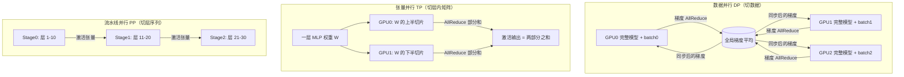
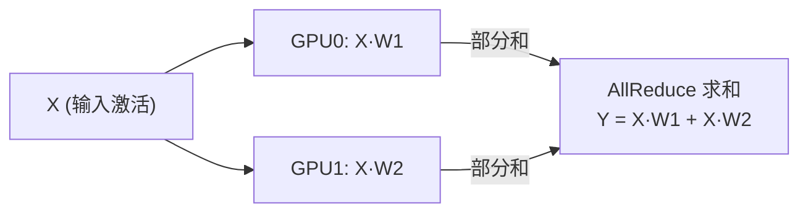
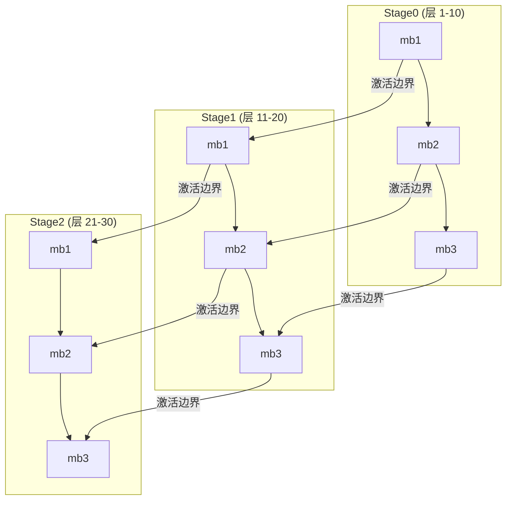

# Ch13：数据并行、模型并行与流水线并行

> 单卡放不下大模型、单卡算得不够快怎么办？本课系统讲解三种最基本的并行范式：
> 数据并行（DP/DDP）、张量并行（TP）与流水线并行（PP）——它们分别切「数据」、
> 切「层内张量」、切「层序列」，换来的是三种截然不同的通信模式。
> 学完本课你能讲清楚：每 step 每种并行各通信多少字节、为什么 TP 只能放机内、
> 为什么大模型训练要把三者组合起来。

## 学习目标

- 理解数据并行 DDP 的原理：每卡一份模型、各算各的 batch、梯度 AllReduce 求平均
- 理解张量并行 TP 的原理：层内矩阵切分 + 前向/反向多次 AllReduce 的通信模式
- 理解流水线并行 PP 的原理：层间切分 + microbatch 流水调度 + 激活边界传输
- 掌握三种并行的通信量公式（每 step 每 GPU 传输字节数）与适用场景
- 能根据模型规模与硬件拓扑设计 DP/TP/PP 的组合方案

## 核心概念

### 1. 三种并行范式全景

「并行」本质上是回答两个问题：**把什么切开？切完怎么通信？**

| 并行范式 | 切什么 | 每张卡有什么 | 通信时机 | 通信内容 |
|----------|--------|--------------|----------|----------|
| 数据并行 DP | 数据 batch | 完整模型副本 | 每 step 一次 | 全量梯度 AllReduce |
| 张量并行 TP | 单层的权重矩阵 | 每层的 1/P 切片 | 每层多次 | 层内激活 AllReduce |
| 流水线并行 PP | 层序列 | 连续的若干层 | 每 microbatch | 激活/梯度边界张量 |



> 关键认知：三种并行花的都是「通信换资源」——DP 用通信同步梯度、TP 用通信拼装
> 激活、PP 用通信传递边界。通信模式决定了它们各自的适用边界。

### 2. 数据并行 DDP：梯度 AllReduce 求平均

**为什么需要**：数据量太大，单卡一个 epoch 要算到天荒地老。把 batch 切成 P 份，
P 张卡各训一份，每 step 结束后把梯度同步一下，让所有卡保持「同一个模型」。

**DDP 的核心公式**：DDP 要求每张卡的模型参数始终一致，做法是**梯度求平均**：

```
θ ← θ − lr · (1/P) · Σ(Δθ_i)        # Δθ_i 为第 i 张卡的梯度
```

而 `(1/P) · Σ` 在分布式里就是一次 **AllReduce（求和）** 再除以 P。所以：

> **DDP 平均梯度 = 一次梯度 AllReduce**。这是本课第一条技术红线。

每 step 通信量（Ring AllReduce，每 GPU 传输字节数）：

```
DP 通信量 = 2(P-1)/P × 模型字节数
```

P 越大，单卡梯度同步的**总传输量越接近 2 倍模型大小**（Ring 带宽上界），
同时延迟项 2(P-1)×α 线性增长——这是 DDP 加卡效率下降的根本原因（Ch17 展开）。

### 3. 张量并行 TP：层内切分 + AllReduce

**为什么需要**：单卡放不下某一层的权重（如 70B 模型的 FFN 层宽达 28K 维）。
把一层的权重矩阵按行/列切到 P 张卡上，前向算完后再 AllReduce 拼回完整结果。

以 MLP 层 `Y = f(X·W)` 为例，把 W 按列切为 `W1, W2`：



每个 Transformer 层在**前向**要做 2 次 AllReduce（QKV 投影一次、MLP 一次），
**反向**还要 2 次 AllReduce，合计每层 4 次。因此：

```
TP 通信量 = 4 × L × 2(P-1)/P × 单层消息字节数      # L = 层数
```

**为什么 TP 一般只用 8 卡内**：TP 的通信发生在**单层计算的 critical path 上**，
每次 AllReduce 不结束，下一层就算不了。通信次数 = 4×L（每次前反向都要），
远多于 DP 的每 step 1 次。P 增大时环形越来越长、延迟累加，所以 TP 依赖
节点内 NVLink（900GB/s）的低延迟，跨机做 TP 基本不可行。

### 4. 流水线并行 PP：层间切分 + microbatch

**为什么需要**：当模型层数多到单卡放不下（而单层又能放下）时，把层按顺序
切成 P 段，每卡一段。卡之间只传递「边界激活张量」。

朴素做法是 batch 整块算：卡 0 算完传给卡 1，卡 1 算完传给卡 2……此时任何
时刻只有 1 张卡在算，利用率 = 1/P。**microbatch** 解决这个问题：把 batch
切成 B 个小块，像工厂流水线一样让相邻 stage 同时处理不同 microbatch：



每 step 通信量（前向 B 个 microbatch 各传 P-1 次 + 反向同样）：

```
PP 通信量 = 2(P-1) × B × 激活张量字节数        # B = microbatch 数
```

PP 的特点：**单条消息极小**（一个激活张量）、**频次高**、不占计算 critical path
（可被流水线气泡掩盖），对跨机带宽最友好。代价是**流水线气泡**：启动和排空阶段
有 stage 空闲，microbatch 数越多气泡占比越小。

### 5. 三者组合与适用场景

| 场景 | 首选 | 理由 |
|------|------|------|
| 模型能单卡放下，只嫌慢 | DP | 通信最小（每 step 一次 AllReduce），实现最简单 |
| 单层就超过单卡显存 | TP | 层内切分是唯一选择，但只能放机内 |
| 层多但单层不大（70B+） | PP | 跨机友好，通信不占计算关键路径 |
| 超大规模（千卡训练 70B+） | TP×PP×DP 组合 | 机内 TP、机间 PP、最外层 DP 摊薄梯度同步 |

典型生产配置：**8 路 TP（机内 NVLink）× 4 路 PP（机间）× 16 路 DP = 512 卡**。

## 关键代码

完整可运行 Demo 见 `demos/ch13/main.py`（`python demos/ch13/main.py`）。
核心自实现——三种并行的每 step 通信量计算：

```python
"""
ch13 核心代码：DP / TP / PP 每 step 通信量计算（自实现）
"""
import sys
import os
sys.path.insert(0, os.path.abspath(os.path.join(os.path.dirname(__file__), "..", "shared")))

def ring_allreduce_volume_per_gpu(message_bytes: float, P: int) -> float:
    """Ring AllReduce 每 GPU 传输字节数 = 2(P-1)/P × m。"""
    return 2 * (P - 1) / P * message_bytes

def dp_comm_per_step(model_bytes: float, P: int) -> float:
    """数据并行：每 step 全量梯度一次 AllReduce。"""
    return ring_allreduce_volume_per_gpu(model_bytes, P)

def tp_comm_per_step(layer_msg_bytes: float, num_layers: int, P: int) -> float:
    """张量并行：每层 4 次 AllReduce（前向 2 + 反向 2）。"""
    per_allreduce = ring_allreduce_volume_per_gpu(layer_msg_bytes, P)
    return 4 * num_layers * per_allreduce

def pp_comm_per_step(act_bytes: float, num_stages: int, num_microbatches: int) -> float:
    """流水线并行：每 microbatch 相邻 stage 传 1 个激活 + 1 个梯度。"""
    return 2 * (num_stages - 1) * act_bytes * num_microbatches

# 7B 模型示例：32 层 | hidden=4096 | seq=2048 | 2B/元素
model_bytes = 7e9
layer_msg_bytes = 2048 * 4096 * 2      # 16MB/层
num_layers, microbatches = 32, 8
P = 8
print(f"DP : {dp_comm_per_step(model_bytes, P)/1e9:.2f} GB/step")
print(f"TP : {tp_comm_per_step(layer_msg_bytes, num_layers, P)/1e9:.2f} GB/step")
print(f"PP : {pp_comm_per_step(layer_msg_bytes, P, microbatches)/1e9:.2f} GB/step")
```

运行结果（P=8）：

```
DP : 12.25 GB/step
TP : 3.76 GB/step
PP : 1.88 GB/step
```

> 三个数字直观展示了通信模式的差异：DP 每次同步全模型梯度（最大）、TP 每次
> 只同步单层张量但要来 4×L 次（最频繁）、PP 只传边界（最小且可被气泡掩盖）。
> 注意 DP 的通信随 P 增长（12.25 → 13.56 GB，P=8 → 32），这就是 AllReduce
> 的 2m 带宽上界在起作用。

## 课堂练习

### ⭐ 基础：手推通信量公式

取 13B 模型（40 层，hidden=5120，seq=2048，2B/元素），P=8，microbatch=16：
1. 分别手算 DP / TP / PP 的每 step 通信量（字节）
2. 与 `demos/ch13/main.py` 的运行结果对比，验证公式
3. 说明三种并行各自的「通信频次」各是多少（每 step 几次集合通信）

### ⭐⭐ 进阶：设计 70B 模型的并行方案

70B 模型，隐藏层 8192、80 层、单层权重约 4.5GB（FP16）。单机 8×A100-80G，
节点间 IB 400Gb/s：
1. 为什么 TP 只能取 8（节点内）？如果取 4，每卡放一层需要多少显存？
2. PP 取 2 或 4 时，节点间每 microbatch 传多少字节？
3. DP 在最外层，为什么它的 AllReduce 通信「可以被计算掩盖」？

### ⭐⭐⭐ 挑战：实现一个并行方案选择器

扩展 `demos/ch13/main.py`：写一个 `choose_plan(model_layers, hidden, seq, gpus_per_node)`
函数，输入模型与硬件拓扑，输出满足「单卡显存 ≤ 80GB」的最小并行组合
（约束：TP ≤ 8、PP ≥ 1、DP ≥ 1），并打印每 step 总通信量。
提示：单卡显存需求 ≈ 参数量×16B/P + 激活，先算 TP 决定单层能否放下，
再算 PP 决定层序列如何切，最后 DP 摊薄剩余数据量。

## 常见问题 Q&A

**Q1：DDP 里梯度「求平均」为什么是一次 AllReduce，不是 AllReduce 再除以 P？**
A：AllReduce 默认是求和归约，`sum` 之后再本地除以 P 就是平均值。PyTorch DDP 的
实现正是如此：先 `all_reduce(grad)` 求和，再除以 world_size。所以「DDP 平均梯度
= 梯度 AllReduce」指的是整个求平均过程对应一次 AllReduce 通信，而不是说 AllReduce
本身做的是平均。

**Q2：TP 为什么不能跨机？DP 为什么可以？**
A：TP 的通信在单层计算的 critical path 上——每次 AllReduce 不结束，下一层就算
不了，且每层要 4 次、共 4×L 次；一旦跨机，延迟从微秒级涨到数十微秒级，GPU 将
长时间空转。DP 的 AllReduce 每 step 只有一次，且发生在反向结束后、下个 step
开始前，可以借 gradient bucket 与下个 step 的计算重叠（Ch17 详解），因此对
跨机带宽的容忍度高得多。

**Q3：PP 的 microbatch 越多越好吗？**
A：不完全是。microbatch 数 B 越大，流水线气泡占比 ≈ (P-1)/(P+B) 越小，但每个
microbatch 都要传一遍边界激活，通信总量 = 2(P-1)×B×激活字节数 线性增长；且
B 太大时反向重计算（activation checkpoint）的显存收益会被稀释。工程上 B 取
P 的 2-4 倍（如 P=4 时 B=8~16）是常见折中，具体以实测通信占比为准。

## 小结

| 要点 | 说明 |
|------|------|
| DP 原理 | 每卡完整模型副本 + 各算各的 batch + 每 step 梯度 AllReduce 求平均 |
| TP 原理 | 层内矩阵切分，每层前向 2 + 反向 2 共 4 次 AllReduce，限机内 |
| PP 原理 | 层序列切分 + microbatch 流水调度 + 激活边界传输，跨机友好 |
| DP 通信量 | 2(P-1)/P × 模型字节数（每 step 1 次，消息最大） |
| TP 通信量 | 4 × L × 2(P-1)/P × 单层消息（次数最多、延迟敏感） |
| PP 通信量 | 2(P-1) × B × 激活字节数（消息最小、可被气泡掩盖） |
| 组合策略 | 机内 8×TP × 机间 4×PP × 最外层 16×DP = 千卡方案 |

## 下一章预告

三种并行范式都要靠集合通信把数据搬来搬去——DP 的梯度同步、TP 的激活拼装，
底层都是同一批原语（Broadcast/AllReduce/AllGather）。Ch14 将深入这些
**集合通信原语**，并推导 Ring AllReduce 的通信复杂度公式
O(2(P-1)/P·m)——这是理解一切分布式通信开销的数学底座。
