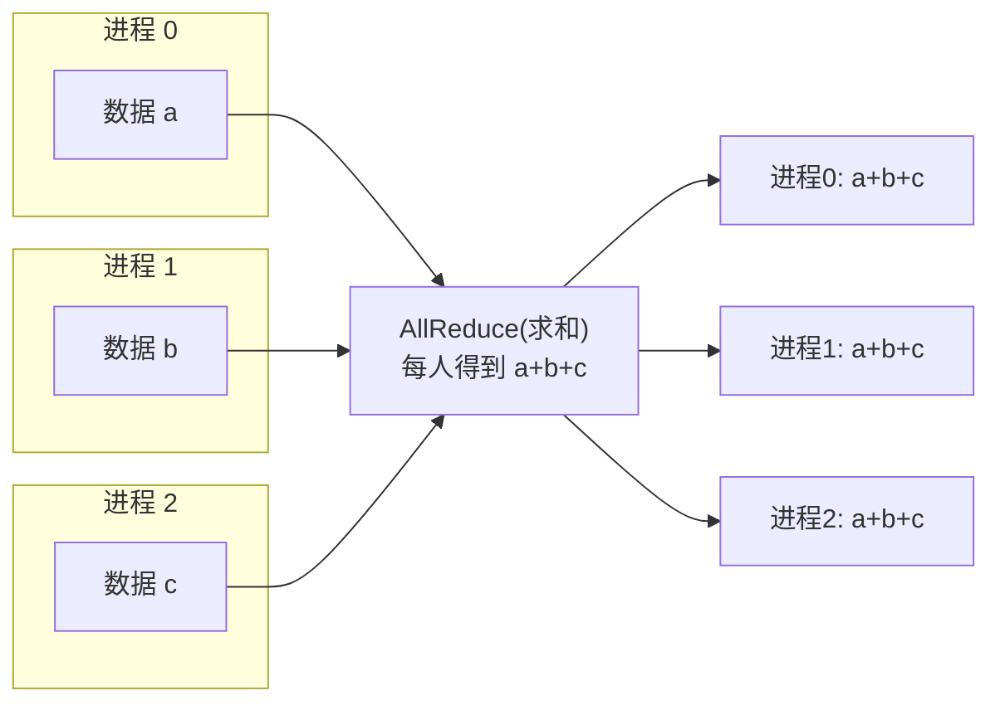
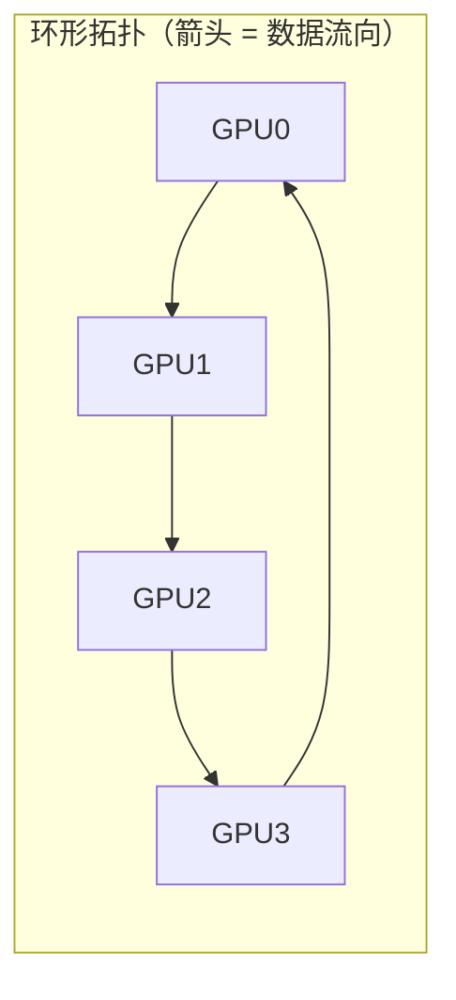
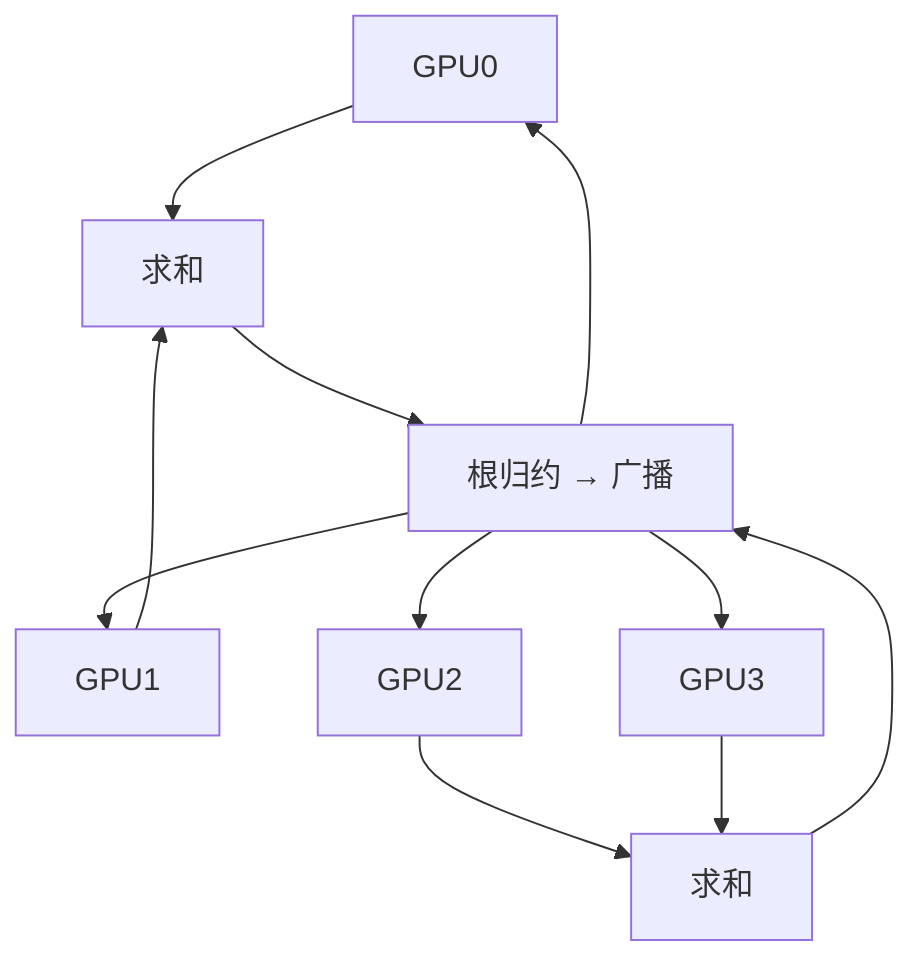

# Ch14：集合通信原语与通信复杂度

> 上一课三种并行范式都要「搬数据」——搬的底层动作，就是集合通信原语。
> 本课先把 Broadcast/Reduce/AllGather/ReduceScatter/AllReduce 讲透，
> 再推导两种经典 AllReduce 实现（Ring 与 Tree）的复杂度，并亲手用 Python
> 分片模拟一遍 Ring AllReduce，从第一性原理理解
> **O(2(P-1)/P·m)** 这个分布式训练最常用的公式。

## 学习目标

- 掌握六大集合通信原语（Broadcast/Reduce/AllGather/ReduceScatter/AllReduce/Scatter）的语义
- 理解 DDP 的梯度同步为什么是一次 AllReduce（求和归约）
- 掌握 Ring AllReduce 的两阶段流程（scatter-reduce + all-gather）与分片思想
- 能推导并复述复杂度公式：每 GPU 传输量 = 2(P-1)/P × m
- 理解 Tree AllReduce 的时间模型 O(logP) 及其与 Ring 的取舍

## 核心概念

### 1. 六大集合通信原语

集合通信（Collective Communication）描述「一组进程共同完成的一次数据交换」。
假设有 P 个进程、每进程持有数据 m 字节，六种原语的语义如下：

| 原语 | 输入 → 输出 | 典型用途 |
|------|-------------|----------|
| Broadcast | 1 个进程的 m → 所有人各一份 | 广播模型参数、配置文件 |
| Reduce | 所有人的 m → 1 个进程的归约结果 | 汇总 loss/指标 |
| Scatter | 1 个进程的 m → 每人 m/P 片 | 分发分片数据 |
| AllGather | 每人 m/P 片 → 所有人拿到完整 m | 聚合每卡的梯度分片 |
| ReduceScatter | 所有人 m → 每人 m/P 的归约结果 | 梯度分片归约（ZeRO-2） |
| AllReduce | 所有人的 m → 所有人相同归约结果 | 梯度同步（DDP） |



> 关键认知：DDP 每 step 的梯度同步「求和再除以 P」就是一次 AllReduce。
> 而 AllReduce 可以由「ReduceScatter + AllGather」两步拼成——这正是
> Ring 算法和 ZeRO-2 分片梯度通信的底层结构。

### 2. AllReduce 的朴素实现与问题

最简单的实现是「主进程收集再广播」（类似 Reduce + Broadcast）：

1. 所有人把自己的 m 字节发给进程 0：**P-1 次传输，共 (P-1)·m 字节**
2. 进程 0 归约后把结果广播给所有人：**又是 (P-1)·m 字节**

总传输 = 2(P-1)·m 字节，其中进程 0 要同时处理 P-1 路数据，既是**带宽瓶颈**
又是**单点故障**。当 P 很大时（如 64 卡梯度同步 14GB），这完全不可用。

Ring 算法正是为了消除这个瓶颈而生的。

### 3. Ring AllReduce：分片 + 两次环传

核心思想：把 m 字节**切成 P 片**（每片 m/P），所有进程排成一个环，每轮只跟
**相邻的两个进程**通信——不存在任何热点，所有链路满载。



**阶段 1：Scatter-Reduce（P-1 轮，边传边累加）**

第 k 轮（k = 0..P-2）：进程 r 把分片 `(r-k) mod P` 发给后继 `(r+1) mod P`，
同时从前驱 `(r-1) mod P` 收到分片 `(r-k-1) mod P` 并**累加**。

| 轮次 | GPU0 发送 | GPU0 接收 | GPU0 分片 3 的内容 |
|------|-----------|-----------|--------------------|
| 0 | 分片0 | 分片3 | c3(0) + c3(3) |
| 1 | 分片3 | 分片2 | c2(0) + c2(2) + c2(3) |
| 2 | 分片2 | 分片1 | c1(0) + c1(1) + c1(2) + c1(3) ← 完整归约 |

P-1 轮后，每个进程恰好持有**一个分片的完整归约结果**（分片 `(r+1) mod P`）。

**阶段 2：All-Gather（P-1 轮，只传不累加）**

把各进程手里那个「归约好的分片」沿环再传一圈，覆盖所有进程。

| 轮次 | GPU0 发送 | GPU0 接收 |
|------|-----------|-----------|
| 0 | 分片1（已归约） | 分片0 |
| 1 | 分片0 | 分片3 |
| 2 | 分片3 | 分片2 |

2(P-1) 轮后，每个进程都持有**全部 P 个分片的归约结果** = 完整 AllReduce。

### 4. 复杂度推导：O(2(P-1)/P·m)

每轮每个进程收发 1 片（m/P 字节），共 2(P-1) 轮：

```
每 GPU 传输量 = 2(P-1) × (m/P) = 2(P-1)/P × m 字节
```

| P | 每 GPU 相对传输量 2(P-1)/P | 含义 |
|---|----------------------------|------|
| 2 | 100% × m | 单条链路对发 |
| 4 | 150% × m | |
| 8 | 175% × m | |
| 16 | 187.5% × m | |
| 64 | 196.9% × m | 逼近 200% 上界 |

**两个重要结论**（技术红线）：
1. **每 GPU 传输量随 P 增大趋近 2m**：这是 Ring AllReduce 的带宽上界，
   也是「加卡不能线性加速」的通信根因之一
2. **总轮数 = 2(P-1)，延迟项 2(P-1)×α 线性增长**：大 P 时延迟主导，
   小消息（< 1MB）尤其明显——此时该换 Tree 算法

时间模型（α = 单次发送延迟，β = 带宽）：

```
T_ring ≈ 2(P-1)/P × m/β + 2(P-1) × α
```

### 5. Tree AllReduce：用并行换深度

Ring 是「串行轮数多、每轮带宽利用率高」；Tree 反其道而行——二叉树的
**每一层并行归约**，深度只有 O(logP)：



```
T_tree ≈ 2log2(P) × (m/β + α)
```

| 维度 | Ring | Tree |
|------|------|------|
| 每 GPU 传输量 | 2(P-1)/P × m（≈2m 上界） | O(logP × m) |
| 延迟轮数 | 2(P-1) 轮 | 2log2(P) 轮 |
| 带宽利用率 | 高（链路全忙） | 低（逐层串行转发） |
| 大消息（>256MB） | **更优** | 较差 |
| 小消息（<1MB） | 较差 | **更优** |

工程实践：NCCL 按消息大小选择——大消息走 Ring（带宽最优）、小消息走 Tree
（延迟低）、小规模全互联用 Clique（Ch15 详解拓扑感知）。

## 关键代码

完整可运行 Demo 见 `demos/ch14/main.py`（`python demos/ch14/main.py`）。
核心自实现——用列表模拟 Ring AllReduce 的分片传递过程：

```python
"""
ch14 核心代码：Ring AllReduce 分片模拟（列表模拟环传）
"""
def ring_allreduce_sim(P, chunk_values):
    """chunk_values[rank][chunk] = rank 上第 chunk 片的数值。
    返回每 rank 归约后的完整结果（所有 rank 最终完全相同）。
    """
    buf = [[chunk_values[r][c] for c in range(P)] for r in range(P)]
    sent_chunks = 0

    # ---- 阶段 1：Scatter-Reduce（P-1 轮，边传边累加） ----
    for step in range(P - 1):
        for r in range(P):
            recv_idx = (r - step - 1) % P      # 本轮接收的分片号
            src = (r - 1) % P                  # 前驱
            buf[r][recv_idx] += buf[src][recv_idx]   # 接收并累加
            sent_chunks += 1

    # ---- 阶段 2：All-Gather（P-1 轮，只传不累加） ----
    for step in range(P - 1):
        for r in range(P):
            recv_idx = (r - step) % P
            src = (r - 1) % P
            buf[r][recv_idx] = buf[src][recv_idx]
            sent_chunks += 1

    return buf, sent_chunks

# 验证：P=4，每 rank 4 个分片
chunks = [
    [1, 2, 3, 4],
    [10, 20, 30, 40],
    [100, 200, 300, 400],
    [1000, 2000, 3000, 4000],
]
buf, sent = ring_allreduce_sim(4, chunks)
for r in range(4):
    print(f"rank{r}: {buf[r]}")   # 全部输出 [1111, 2222, 3333, 4444]
print(f"每 rank 收发分片数 = {sent // 4} = 2(P-1) = {2*3}  ← 复杂度自证")
```

运行结果（节选）：

```
rank0: [1111, 2222, 3333, 4444]
rank1: [1111, 2222, 3333, 4444]
rank2: [1111, 2222, 3333, 4444]
rank3: [1111, 2222, 3333, 4444]
正确性校验: [OK] 通过（与暴力求和一致）
```

> 模拟验证了三条红线：① 结果与暴力求和完全一致；② 每 rank 收发 2(P-1) 个分片，
> 即 2(P-1)/P × m 字节；③ 总轮数 2(P-1)，环长每增 1，通信轮数线性增长。
> Demo 同时还绘制了 P=2..64 的 Ring vs Tree 时间曲线——注意 Ring 的传输
> 时间趋于饱和（趋近 2m/β），而 Tree 仍在随 logP 增长。

## 课堂练习

### ⭐ 基础：手推复杂度并验证

1. 手工推导 Ring AllReduce：P=4、m=1000 字节，每 GPU 最终传输多少字节？
2. 修改 `ring_allreduce_sim` 使每个分片包含 3 个元素（列表），验证传输元素数
   仍满足 2(P-1)/P × m
3. 在 `demos/ch14/main.py` 中把 P 改成 8，观察每个 rank 的输出并核对

### ⭐⭐ 进阶：自己实现 Tree AllReduce

参考课文的 Tree 时间模型，写一个 `tree_allreduce_sim(P, chunk_values)`：
1. 二叉树归约：叶子向父节点发数据求和，根节点得到全量结果
2. 再从根向下广播到所有叶子
3. 统计每层传输量，验证总传输 ≈ 2×log2(P)×m（每进程）
4. 与 Ring 模拟对比：P=16 时谁的总传输少？谁更均衡？

### ⭐⭐⭐ 挑战：从模拟走向带宽模型

把 Ring 模拟扩展成「时间模型」：假设每轮传输耗时 = 分片大小/带宽 + 固定延迟。
1. 给定 m=14GB、β=900GB/s、α=5μs，求 P=2..64 的 Ring 总时间，并绘制曲线
2. 在曲线上标出「带宽主导区」与「延迟主导区」的分界点（找通信时间随 P
   不再明显增长的位置）
3. 解释：为什么大模型训练梯度 AllReduce 时，P 从 16 加到 64 时间几乎不变，
   但小消息（如 TP 层内 AllReduce）却对 P 极其敏感？

## 常见问题 Q&A

**Q1：Ring AllReduce 的时间公式里，为什么有人写 2(P-1)/P·m/β，有人写 2m/β？**
A：两者说的是不同口径。`2(P-1)/P × m/β` 是**每 GPU** 的传输量（严格正确）；
当 P 很大时 2(P-1)/P ≈ 2，所以很多博客直接写「约 2m/β」。工程估算用 2m/β
方便，面试推导要能给出带 (P-1)/P 的精确形式。

**Q2：AllReduce 为什么可以由 ReduceScatter + AllGather 组成？**
A：AllReduce 的结果是「所有人拿到相同的全量归约」。拆两步：先 ReduceScatter
——把每个人的 m 分成 P 片，沿环归约，让每个人各自持有**一个分片的归约结果**
（这是 Ring 的阶段 1）；再 AllGather——把归约好的分片广播给所有人（阶段 2）。
两步合起来恰好完成 AllReduce，这就是 Ring 算法的数学本质，也是 ZeRO-2 分片
梯度通信的直接依据。

**Q3：我的机器只有 4 卡，学这些公式有意义吗？**
A：有意义。首先，即便 4 卡，AllReduce 的 (P-1)/P 也直接影响每 step 通信量；
其次，NCCL 的时间模型（α/β 模型）是面试与调优的基础语言——读 nccl-tests
输出、判断「通信是否成为瓶颈」都靠它。更重要的是：**复杂度是设计权衡的工具**，
Ch15-Ch17 的所有结论（TP 放机内、FSDP 通信 1.5×DDP、加卡不加速）都建立在这
节课的两个公式之上。

## 小结

| 要点 | 说明 |
|------|------|
| 六大原语 | Broadcast/Reduce/Scatter/AllGather/ReduceScatter/AllReduce |
| DDP 梯度同步 | 一次梯度 AllReduce（求和后除以 P 即平均） |
| Ring 两阶段 | scatter-reduce（P-1 轮累加）+ all-gather（P-1 轮广播） |
| Ring 复杂度 | 每 GPU 传输 = 2(P-1)/P × m，总轮数 = 2(P-1) |
| 带宽上界 | P 增大时每 GPU 传输趋近 2m，大 P 下延迟主导 |
| Tree 复杂度 | 深度 2log2(P)，每进程传输 O(logP × m)，适合小消息 |
| 工程取舍 | 大消息 Ring、小消息 Tree；NCCL 自动选择 |

## 下一章预告

理解了原语与复杂度，下一步是它们在真实系统里的样子：NCCL 如何感知 GPU 拓扑、
在 NVLink/PCIe/跨机之间自动选择 Ring/Tree/Clique？`NCCL_DEBUG` 和 nccl-tests
又该怎么读？Ch15「NCCL 原理、拓扑分析与性能调优」将把理论接到真实集群上。
