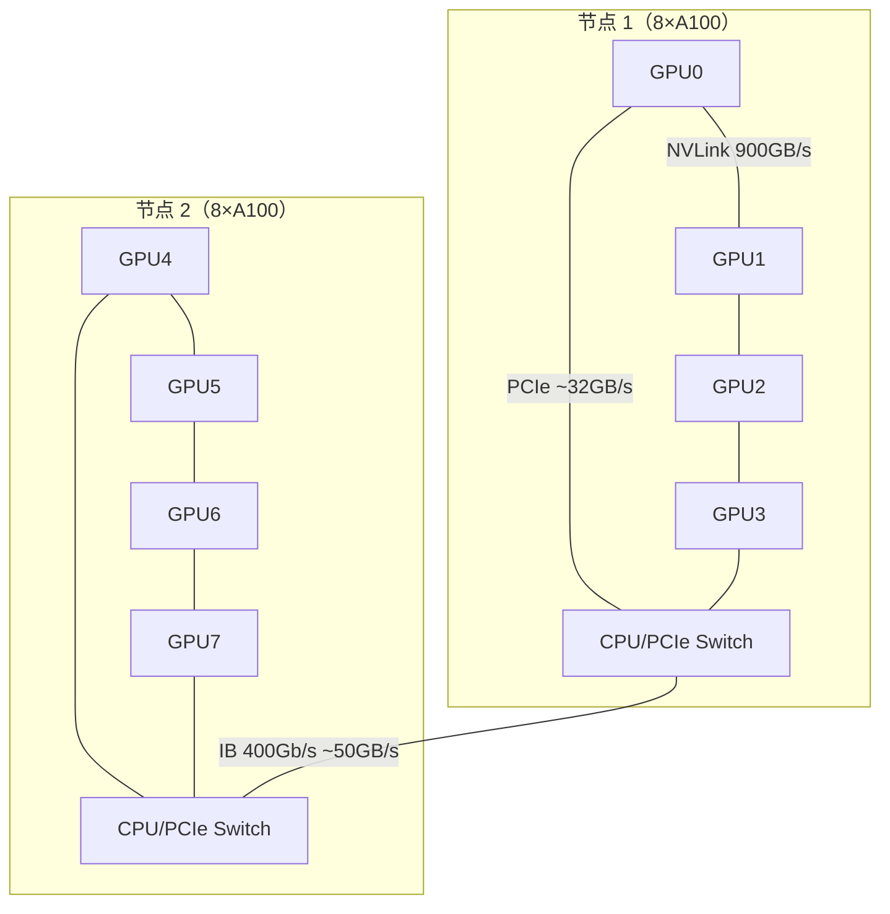
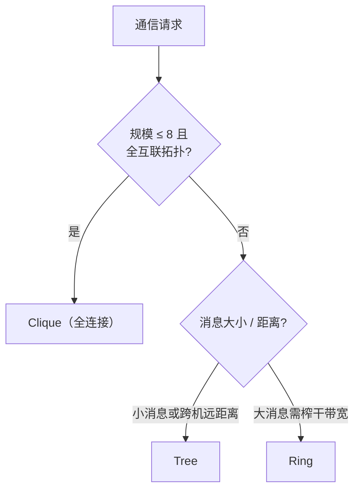

# Ch15：NCCL 原理、拓扑分析与性能调优

> 集合通信原语有了，谁来实现？在 GPU 集群上，答案是 NCCL（NVIDIA Collective
> Communications Library）。本课讲清 NCCL 是什么、它如何感知 NVLink/PCIe/跨机
> 拓扑并自动选择 Ring/Tree/Clique 算法，以及 `NCCL_DEBUG` 与 nccl-tests 这套
> 实战调优工具怎么用——把 Ch14 的复杂度公式变成集群上的实测数字。

## 学习目标

- 理解 NCCL 的定位：GPU 专用集合通信库，位于 PyTorch 与硬件之间
- 掌握拓扑感知三要素（NVLink / PCIe / 跨机互联）及其带宽数量级
- 理解 Ring / Tree / Clique 三种算法被选择的条件与代价
- 会用 `NCCL_DEBUG` 解读通信初始化信息，知道关键环境变量的作用
- 会用 nccl-tests 的 `all_reduce_perf` 测量 busbw 并判断带宽利用率

## 核心概念

### 1. NCCL 是什么

NCCL 是 NVIDIA 提供的**多 GPU / 多节点集合通信库**，对上层暴露
Broadcast/AllReduce/AllGather 等原语，对底层根据 GPU 拓扑自动选择通信算法、
协议与路径。PyTorch 的 `torch.distributed` 在 GPU 后端默认就调用 NCCL。

```
PyTorch 训练代码
      │  torch.distributed (NCCL 后端)
      ▼
  NCCL ──拓扑检测──▶ Ring / Tree / Clique ──▶ NVLink / PCIe / IB / RoCE
      ▼
  CUDA / GPU
```

**为什么不能直接用 MPI**：MPI 面向 CPU 网络通信设计，不理解 GPU 显存、NVLink
和 GPUDirect RDMA；NCCL 直接在 GPU 显存之间搬数据（免去 CPU 中转），
并针对 GPU 拓扑做算法选择。

### 2. 拓扑感知：NVLink / PCIe / 跨机

NCCL 会先通过 NVML 探测每张 GPU 的连接路径，构建一张拓扑图，然后才选择算法。
互联带宽的数量级决定了「什么样的通信应该走哪条路」：

| 互联 | 典型带宽 | 延迟 | 覆盖范围 |
|------|----------|------|----------|
| NVLink 4 | ~900GB/s（双向） | ~1μs | 节点内 8 卡 |
| NVLink 3 | ~600GB/s | ~1μs | 节点内 8 卡 |
| PCIe 4.0 x16 | ~32GB/s | ~10μs | 节点内（需过 CPU） |
| IB NDR 400Gb/s | ~50GB/s | ~1-2μs | 跨节点 |
| IB HDR 200Gb/s | ~25GB/s | ~2μs | 跨节点 |
| 10GbE | ~1.25GB/s | ~100μs | 跨节点（不推荐训练） |



> 关键认知：同一份 14GB 梯度，走 NVLink 约 27ms，走 PCIe 约 750ms，
> 走 10GbE 超过 19 秒——**通信一定要优先发生在最快的链路上**。

### 3. Ring / Tree / Clique：算法选择逻辑

NCCL 运行时按「消息大小 + 拓扑」从候选算法中选择：

| 算法 | 适用条件 | 优点 | 缺点 |
|------|----------|------|------|
| Clique（全连接） | 小规模 + 全互联拓扑 | 一跳直达，延迟最低 | 只适用于 8 卡以内 |
| Tree | 跨节点、小消息 | 深度 O(logP)，延迟低 | 带宽利用率低 |
| Ring | 大消息、任意规模 | 带宽利用率最高（≈2m 上界） | 轮数多、延迟线性增长 |



真实 NCCL 更复杂：会按代价模型在 Ring/Tree（及 NVLS、CollNet 等扩展）之间
动态评分，`NCCL_ALGO` 可强制指定。**理解选择逻辑比背结论重要**：Clique 省延迟、
Ring 省带宽、Tree 省深度——它们都是 Ch14 复杂度公式的直接应用。

### 4. 调优参数：NCCL_DEBUG 与环境变量

`NCCL_DEBUG=INFO` 是定位一切通信问题的第一步，它会打印：
- 拓扑检测结果（每张 GPU 走哪条路径）
- 选用的算法与协议（`Ring`/`Tree`/`Clique`，`LL`/`LL128`/`Simple`）
- 每步通信的发送/接收方与传输字节数

| 环境变量 | 作用 | 常用取值 |
|----------|------|----------|
| `NCCL_DEBUG` | 日志级别 | `INFO`（排障）、`WARN`（生产） |
| `NCCL_ALGO` | 强制算法 | `Ring`、`Tree`、`All`（自动） |
| `NCCL_PROTO` | 通信协议 | `LL`、`LL128`、`Simple`（NVLink 上 LL128 吞吐最高） |
| `NCCL_BUFFSIZE` | 通信缓冲区大小 | `64M`（默认） |
| `NCCL_SOCKET_IFNAME` | 跨机走哪张网卡 | `eth0`、`ib0` |
| `NCCL_IB_DISABLE` | 是否禁用 IB | `0`（启用）、`1` |
| `NCCL_TOPO_FILE` | 手动指定拓扑文件 | 检测异常时兜底 |
| `NCCL_MAX_NCHANNELS` | 通信通道数 | 调大可提升大消息吞吐 |

### 5. nccl-tests：把理论变成实测数字

nccl-tests 是 NVIDIA 官方的 NCCL 基准工具，核心看 `all_reduce_perf`：

```bash
git clone https://github.com/NVIDIA/nccl-tests
cd nccl-tests && make CUDA_HOME=/usr/local/cuda NCCL_HOME=/usr/lib/x86_64-linux-gnu
# 8 卡全量归约，消息从 8B 扫到 8GB
mpirun -np 8 -hostfile hosts ./build/all_reduce_perf -b 8 -e 8G -f 2 -g 1
```

关键输出列：

| 列 | 含义 | 判断标准 |
|----|------|----------|
| `size` | 消息大小 | — |
| `time(us)` | 单次 AllReduce 耗时 | 小消息看这里（延迟） |
| `algbw` | 算法带宽 = size/time | 越大越好 |
| `busbw` | 总线带宽 = algbw × 2(P-1)/P | 与链路理论峰值比 → 利用率 |

**怎么读结果**：
- `busbw` 接近 NVLink 双向带宽（如 450GB/s）→ 机内通信已拉满
- `busbw` 只有峰值的 50% 以下 → 查拓扑（跨机是否误走 PCIe？）、换
  `NCCL_ALGO`/`NCCL_PROTO`、检查 IB 网卡与交换机
- 小消息（<1MB）关注 `time(us)`，大消息（>256MB）关注 `busbw`

## 关键代码

完整可运行 Demo 见 `demos/ch15/main.py`（`python demos/ch15/main.py`）。
核心内容——不同互联带宽下同一批数据的通信时间对比（纯模拟）：

```python
"""
ch15 核心代码：NCCL 拓扑选择说明 + 不同互联带宽对比（模拟）
"""
import sys
import os
sys.path.insert(0, os.path.abspath(os.path.join(os.path.dirname(__file__), "..", "shared")))
from dist_sim import ring_allreduce_time

links = [
    ("NVLink 4 机内",      900e9),   # ~900GB/s
    ("PCIe 4.0 x16 机内",   32e9),   # ~32GB/s
    ("IB NDR 400Gb/s 跨机", 50e9),   # ~50GB/s
    ("IB HDR 200Gb/s 跨机", 25e9),   # ~25GB/s
    ("10GbE 以太网",         1.25e9), # ~1.25GB/s
]
msg = 7e9 * 2      # 7B 模型 × 2B 梯度 = 14GB
P = 8
print(f"{'互联':<20}{'Ring(ms)':>12}")
base = None
for name, bw in links:
    t = ring_allreduce_time(P, msg, bw) * 1e3
    if base is None:
        base = t
    print(f"{name:<20}{t:>12.1f}   {t/base:>6.1f}x 相对 NVLink")
```

运行结果（节选，P=8、14GB 梯度）：

```
互联                    Ring(ms)
NVLink 4 机内              27.4    1.0x 相对 NVLink
PCIe 4.0 x16 机内         765.8   28.0x 相对 NVLink
IB NDR 400Gb/s 跨机       490.1   17.9x 相对 NVLink
IB HDR 200Gb/s 跨机       980.1   35.8x 相对 NVLink
10GbE 以太网             19600.1  716.3x 相对 NVLink
```

> Demo 还会打印 NCCL 拓扑选择逻辑（Clique/Tree/Ring 决策树）与 nccl-tests
> 完整用法。看完输出的三个教训：① TP 必须放 NVLink 节点内；② 跨机最低
> 也要上 IB，10GbE 训练不可行；③ 调优先看 NCCL_DEBUG 的拓扑，再动环境变量。

## 课堂练习

### ⭐ 基础：读懂 NCCL_DEBUG 输出

运行 `NCCL_DEBUG=INFO` 跑一次 2 卡 all_reduce_perf（或阅读课程 Demo 中的说明），
回答：
1. NCCL 检测到了什么拓扑（每张卡的 PCIe/NVLink 路径）？
2. 它选了哪个算法与协议？为什么（消息多大）？
3. `NET/IB` 与 `NET/Socket` 两条日志分别代表什么？

### ⭐⭐ 进阶：busbw 利用率诊断

在 8 卡机器上跑 `all_reduce_perf -b 8M -e 4G -f 2 -g 1`，记录 1GB 消息的
`algbw` 与 `busbw`：
1. 计算 busbw / 理论峰值（查 `gpu_specs.py` 中该卡 NVLink 带宽）得到利用率
2. 若利用率 < 80%，依次尝试 `NCCL_ALGO=Ring`、`NCCL_PROTO=LL128`、
   `NCCL_MAX_NCHANNELS=32`，记录每个变量的效果
3. 用 `demos/ch15/main.py` 的模拟结果交叉验证：你的实测 busbw 对应哪种互联？

### ⭐⭐⭐ 挑战：设计一个跨机通信方案

两节点各 8×A100（NVLink 机内、IB NDR 机间），训练 70B 模型，TP=8 必须放机内：
1. PP 边界在机间，每 microbatch 传 1 个激活张量（seq=2048×hidden=8192×2B），
   算机间单次传输耗时（用 dist_sim 的时间模型）
2. 若 microbatch=8，每 step 机间总通信量多少？占每 step 总时间的百分比？
3. 结论：跨机通信应该「传大块少次数」（调大 microbatch 激活）还是
   「传小块多次」？为什么这与节点内 TP 的选择相反？

## 常见问题 Q&A

**Q1：NCCL 为什么比直接用 MPI 快这么多？**
A：三个原因：① GPUDirect RDMA——GPU 显存之间直接 DMA，不经 CPU/主机内存中转；
② 拓扑感知——NCCL 检测 NVLink/PCIe 路径，选择最短最优路径（如避免跨 CPU 的
PCIe 桥接）；③ 算法与协议自适应——按消息大小在 Ring/Tree/Clique 间切换，
用 LL128 低延迟协议降低单条消息的握手开销。MPI 通常不具备这三者。

**Q2：`NCCL_DEBUG=INFO` 日志太多，生产上能用吗？**
A：不能。INFO 级日志每个通信操作都会打印，训练时会产生海量日志并拖慢性能。
生产用 `NCCL_DEBUG=WARN`（只打印错误与关键警告）；需要定位问题时临时开
INFO 跑小规模实验，定位后立即关掉。另一种做法是配 `NCCL_DEBUG_FILE` 把
INFO 日志写到文件，避免污染标准输出。

**Q3：调大 `NCCL_MAX_NCHANNELS` 一定能提升吞吐吗？**
A：不一定。通道数越多，大消息的并行度越高（多条链路同时传），但也占用更多
SM 与显存资源，且通道间需要聚合/分片开销。小消息场景通道多是浪费。正确做法
是在 nccl-tests 上扫通道数（如 2/4/8/16/32），用实测 busbw 选最优，再把这个
值固化到训练环境的启动脚本里。

## 小结

| 要点 | 说明 |
|------|------|
| NCCL 定位 | GPU 专用集合通信库，torch.distributed 的 GPU 后端 |
| 拓扑三要素 | NVLink（900GB/s 机内）/ PCIe（32GB/s）/ IB（25-50GB/s 跨机） |
| 算法选择 | Clique（小规模全互联）/ Tree（小消息跨机）/ Ring（大消息榨带宽） |
| 调优参数 | NCCL_DEBUG / NCCL_ALGO / NCCL_PROTO / NCCL_IB_DISABLE |
| 实测工具 | nccl-tests all_reduce_perf，看 busbw 与理论峰值比 |
| 调优流程 | 读拓扑 → 测 busbw → 换算法/协议 → 固化环境变量 |

## 下一章预告

通信链路摸清了，下一课解决「显存放不下」的问题：ZeRO 把优化器状态、梯度、
参数逐级分片，FSDP 用 all-gather + reduce-scatter 在训练中按需组装。
Ch16「FSDP、ZeRO 与分布式显存优化」将给出可量化的显存账本——你能亲手算出
70B 模型到底需要多少张卡。
