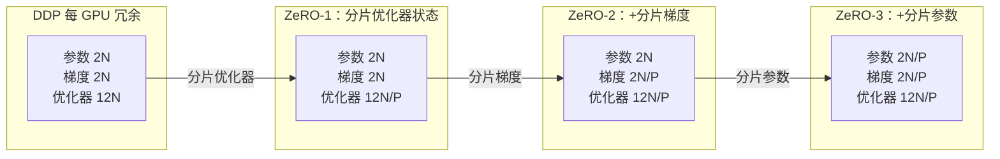
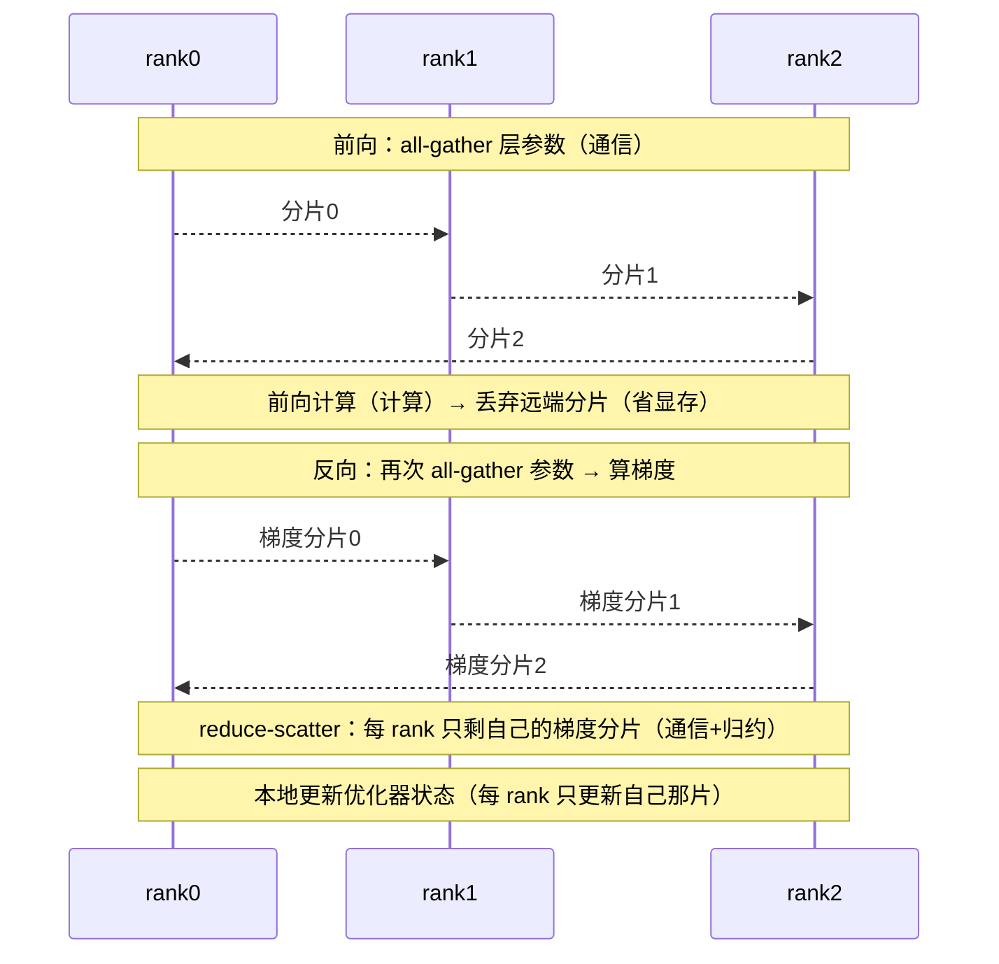

# Ch16：FSDP、ZeRO 与分布式显存优化

> 通信问题解决后，显存成了新瓶颈：70B 模型训练态每参数要 16 字节（参数 2B +
> 梯度 2B + Adam 状态 12B），单卡 80G 装不下。ZeRO 的思路是把这些数据按
> rank 分片、用通信换显存，FSDP 就是它的工程化实现。
> 本课给出精确的显存账本公式，并讲透 FSDP 的 all-gather / reduce-scatter 流程。

## 学习目标

- 会算训练的显存账本：参数 2B + 梯度 2B + 优化器状态 12B（Adam）每参数字节数
- 掌握 ZeRO 三阶段的分片对象：优化器状态 → +梯度 → +参数
- 理解 FSDP 原理：每层 forward/backward 前 all-gather 参数、backward 后 reduce-scatter 梯度
- 掌握显存-通信权衡：FSDP 显存省 16×、通信约为 DDP 的 1.5 倍
- 能根据模型规模与硬件选择 DDP / ZeRO-2 / FSDP 并估算所需卡数

## 核心概念

### 1. 为什么需要：先算显存账本

训练一个大模型的显存需求，每参数（以 BF16 混合精度 + Adam 为例）：

| 项目 | 每参数字节 | 说明 |
|------|-----------|------|
| 参数（BF16） | 2B | 前向计算用的权重副本 |
| 梯度（BF16） | 2B | 反向计算得到 |
| 优化器主权重（FP32） | 4B | Adam 需要高精度更新 |
| Adam 一阶矩 m（FP32） | 4B | |
| Adam 二阶矩 v（FP32） | 4B | |
| **合计** | **16B** | 尚未计入激活显存 |

```
70B 模型：70e9 × 16B = 1120GB  →  A100-80G 需要 14 张卡（仅参数态！）
7B 模型 ：7e9 × 16B = 112GB    →  单卡 A100-80G 装不下
```

**结论**：显存优化的本质是「把每 GPU 都要复制一份的数据」按 rank 分片。
哪些数据可以分片？优化器状态、梯度、参数——这就是 ZeRO 的三个阶段。

### 2. ZeRO 三阶段：分片对象逐级扩大

ZeRO（Zero Redundancy Optimizer，DeepSpeed）按「冗余度从高到低」逐级消除
数据复制。N 为参数量、P 为分片数、每 GPU 占用：

| 阶段 | 分片内容 | 每 GPU 显存公式 | 7B、P=8 |
|------|----------|-----------------|---------|
| 基线（DDP） | 不分片 | 16N | 112GB |
| ZeRO-1 | 优化器状态 | 2N×2 + 12N/P = 4N + 12N/P | 38.5GB |
| ZeRO-2 | 优化器状态 + 梯度 | 2N + 14N/P | 26.25GB |
| ZeRO-3 | 优化器状态 + 梯度 + 参数 | 16N/P | 14GB |



**通信代价逐级增加**：分片越多，训练时需要远程取的数据越多——
ZeRO-1 与 DDP 通信相同（梯度仍全量 AllReduce），ZeRO-2 用 reduce-scatter +
all-gather（与 AllReduce 同阶），ZeRO-3 每层都要 all-gather 参数。

### 3. FSDP 原理：all-gather + reduce-scatter 按需组装

FSDP（Fully Sharded Data Parallel，PyTorch 官方实现）是 ZeRO-3 的工程化
版本：**所有 rank 持有一份完整模型参数的 1/P 分片**。训练时按需组装。

**前向**（每个 transformer 层）：
1. all-gather：把该层参数的 P 个分片拼成完整参数（通信）
2. 用完整参数做前向计算（计算）
3. forward 结束立即丢弃非本 rank 的分片，只保留自己的 1/P（省显存）

**反向**：
1. 再次 all-gather 该层参数（若未保存前向副本）
2. 计算本层梯度（对本 rank 的分片求平均）
3. reduce-scatter：所有 rank 的梯度按分片归约，每个 rank 只保留自己的 1/P
4. 优化器状态在本地更新本 rank 的分片



### 4. 显存-通信权衡：DDP vs FSDP

| 维度 | DDP | FSDP |
|------|-----|------|
| 每 GPU 显存（7B） | 112GB | 14GB（P=8） |
| 显存随 P 缩放 | 不缩放 | 1/P 线性下降 |
| 每 step 通信 | 1 次全量梯度 AllReduce | all-gather 参数 ×2 + reduce-scatter 梯度 |
| 通信量（每 GPU） | ≈ 2(P-1)/P × 2N | ≈ 3(P-1)/P × 2N ≈ **1.5× DDP** |
| 适用场景 | 显存够用、追求最低通信 | 大模型、显存受限 |

> **技术红线：FSDP 的通信为什么是 1.5×DDP？** DDP 每 step 做一次消息大小为
> 梯度（2N 字节）的 AllReduce，每 GPU 传输 ≈ 2(P-1)/P × 2N。FSDP 每 step 做
> 三次集合通信：前向 all-gather 参数 + 反向 all-gather 参数 + reduce-scatter
> 梯度，每次传输 ≈ (P-1)/P × 2N，合计 ≈ 3(P-1)/P × 2N，恰好是 DDP 的 1.5 倍。

**折中方案**：`ShardingStrategy.SHARD_GRAD_OP`（≈ ZeRO-2）——只分片梯度和
优化器状态，参数不分片，通信量与 DDP 相当，显存省 8×（7B 时 26GB），是
「通信敏感场景」的常用选择。

### 5. 与 DDP 的本质区别

| | DDP | FSDP |
|---|-----|------|
| 参数分布 | 每 rank 全量副本 | 每 rank 1/P 分片 |
| 梯度同步 | AllReduce（全量） | reduce-scatter（分片） |
| 优化器状态 | 每 rank 全量 | 每 rank 只更新自己的分片 |
| 前向是否需要通信 | 否 | 是（每层 all-gather） |
| 显存-通信取向 | 通信最小化 | 显存最小化 |

两者都是数据并行（每 rank 算不同 batch），**只是「同步什么」的方式不同**：
DDP 同步完整梯度（AllReduce），FSDP 按需组装参数再分片归约梯度
（all-gather + reduce-scatter）。FSDP 可以无缝叠加 TP/PP 组成混合并行。

## 关键代码

完整可运行 Demo 见 `demos/ch16/main.py`（`python demos/ch16/main.py`）。
核心自实现——FSDP 显存模型计算器（输入参数量与分片数 → 输出各阶段显存与通信开销）：

```python
"""
ch16 核心代码：FSDP 显存模型计算器（自实现）
"""
def ddp_memory(n, bp=2, obp=12):
    """DDP：每 GPU 完整 参数+梯度+优化器状态。"""
    return n * (bp * 2 + obp)

def zero1_memory(n, P, bp=2, obp=12):
    """ZeRO-1：分片优化器状态。"""
    return n * bp * 2 + n * obp / P

def zero2_memory(n, P, bp=2, obp=12):
    """ZeRO-2：分片优化器状态 + 梯度。"""
    return n * bp + n * (bp + obp) / P

def zero3_memory(n, P, bp=2, obp=12):
    """ZeRO-3 / FSDP：参数、梯度、优化器状态全分片。"""
    return n * (bp * 2 + obp) / P

def ddp_comm_per_step(n, P, bp=2):
    """DDP：一次全量梯度 AllReduce，每 GPU 传输 2(P-1)/P × 2N。"""
    return 2 * (P - 1) / P * n * bp

def fsdp_comm_per_step(n, P, bp=2):
    """FSDP：前向 all-gather + 反向 all-gather + reduce-scatter = 3 次集合通信。"""
    return 3 * (P - 1) / P * n * bp

n, P = 7e9, 8
print(f"DDP 每 GPU   : {ddp_memory(n)/1e9:.1f} GB")
print(f"ZeRO-1 每 GPU: {zero1_memory(n, P)/1e9:.1f} GB")
print(f"ZeRO-2 每 GPU: {zero2_memory(n, P)/1e9:.1f} GB")
print(f"FSDP 每 GPU  : {zero3_memory(n, P)/1e9:.1f} GB")
print(f"FSDP/DDP 通信比: {fsdp_comm_per_step(n,P)/ddp_comm_per_step(n,P):.2f}")
```

运行结果（7B、P=8）：

```
DDP 每 GPU   : 112.0 GB
ZeRO-1 每 GPU: 38.5 GB
ZeRO-2 每 GPU: 26.2 GB
FSDP 每 GPU  : 14.0 GB
FSDP/DDP 通信比: 1.50
```

> Demo 还包含 DDP vs FSDP 的显存曲线（P=1..64）与每 step 通信时间对比，
> 以及交互式输入：你可以输入任意参数量与分片数，实时得到四张显存账本。
> 亲手改几个数字（比如 70B、P=64），会深刻理解「显存不是瓶颈了，通信才是」。

## 课堂练习

### ⭐ 基础：显存账本手工计算

用课上公式计算（每参数 16B，激活暂不计）：
1. 13B 模型 DDP 需要多少 GB？多少张 A100-80G？
2. 13B、P=16 时 ZeRO-1/ZeRO-2/FSDP 各需多少 GB？
3. 用 `demos/ch16/main.py` 的交互模式验证你的答案

### ⭐⭐ 进阶：通信时间换算

7B 模型、P=8、NVLink 900GB/s：
1. DDP 与 FSDP 每 step 各通信多少字节？换算成毫秒？
2. 若每 step 纯计算 0.5s，FSDP 相对 DDP 的通信占比各是多少？
3. 换成跨机 IB 50GB/s，FSDP 通信占比会变成多少？结论是什么？

### ⭐⭐⭐ 挑战：FSDP 的通信裁剪

FSDP 每 step 通信 ≈ 1.5×DDP，但工程上可以裁剪：
1. 前向 all-gather 的参数如果「延迟丢弃」并复用给反向，可省掉反向的
   第二次 all-gather——通信降为多少倍 DDP？（提示：2 次集合通信）
2. 阅读 PyTorch FSDP 的 `ShardingStrategy` 枚举，说出 `FULL_SHARD` 与
   `SHARD_GRAD_OP` 各自的通信/显存特征
3. 结合 Ch14 的复杂度公式，解释为什么 FSDP 与 DDP 的通信量之比
   (P-1)/P 项可以约掉，最终稳定在 1.5 附近

## 常见问题 Q&A

**Q1：FSDP 和 ZeRO-3 是同一个东西吗？**
A：显存效果上等价（参数/梯度/优化器状态全部按 rank 分片），但实现细节不同：
ZeRO-3 是 DeepSpeed 的实现（partition 粒度、通信调度由 ZeRO 引擎管理），
FSDP 是 PyTorch 官方实现（以模块/层为粒度，配合 `auto_wrap_policy` 自动切分）。
两者互换了术语很常见——面试时说「FSDP 工程上等价于 ZeRO-3」是安全且正确的表述。

**Q2：FSDP 为什么每层要 all-gather 两次参数，不能存下来复用吗？**
A：能，但要付显存代价。保存前向 all-gather 的完整参数副本，反向直接复用，
可把通信降到 2/3（≈DDP 的 1.0-1.2 倍），但每层都要暂存完整参数，显存占用
回到「参数全量复制」的水平。PyTorch FSDP 默认不保存，靠「反向重新 all-gather」
来省显存——这正是「显存-通信权衡」在实现层面的体现。

**Q3：FSDP 的优化器状态在哪更新？需要同步吗？**
A：在**每个 rank 本地**更新自己持有的那 1/P 分片。因为梯度已经过
reduce-scatter 归约，每个 rank 只拥有自己分片的梯度，对应的优化器状态也只
存在于该 rank——天然无冗余，也就不需要额外的同步。这也是 ZeRO 系列省显存
的核心：把「全量复制 + 全局同步」变成「分片 + 本地更新」。

## 小结

| 要点 | 说明 |
|------|------|
| 显存账本 | 每参数 16B = 参数 2B + 梯度 2B + 优化器状态 12B（Adam） |
| ZeRO-1 | 分片优化器状态，4N + 12N/P，通信同 DDP |
| ZeRO-2 | 分片优化器状态 + 梯度，2N + 14N/P |
| ZeRO-3 / FSDP | 全部按 rank 分片，16N/P，通信 ≈ 1.5×DDP |
| FSDP 流程 | forward/backward 前 all-gather 参数，backward 后 reduce-scatter 梯度 |
| 折中方案 | SHARD_GRAD_OP ≈ ZeRO-2：显存省 8×，通信与 DDP 相当 |
| 权衡原则 | 显存够用用 DDP，大模型用 FSDP，通信敏感用 ZeRO-2 |

## 下一章预告

显存解决了，最后的敌人是**通信**：Ch16 算出的 1.5× 通信量、Ch13 的梯度同步、
Ch14 的 (P-1)/P 上界——它们叠加在一起，导致大规模训练最常见的现象
「加卡不加速」。Ch17 将量化通信占比、演示计算-通信 Overlap（gradient bucket、
流水线 overlap），给出定位与解决「加卡不加速」的完整方法。
