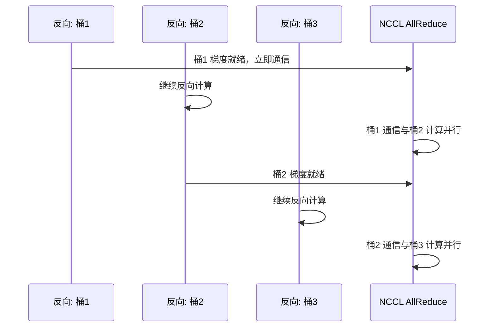
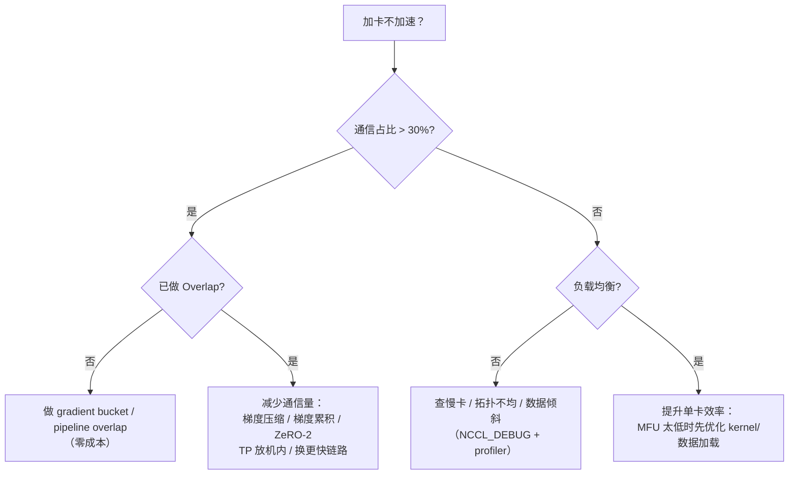

# Ch17：大规模训练中的通信瓶颈分析

> 分布式训练做到最后，几乎所有人都会撞上同一个墙：**加卡不加速**。
> 4 卡跑得比 2 卡快，64 卡却和 32 卡一样快。本课给出完整的分析框架：
> 通信占比怎么算、计算-通信怎么 Overlap（gradient bucket / pipeline overlap）、
> 负载不均如何拖垮全局、扩展效率公式长什么样，以及加卡不加速的三大根因与对策。

## 学习目标

- 会计算通信占比（comm/(compute+comm)）并据此判断通信是否成为瓶颈
- 理解计算-通信 Overlap 的两种实现：梯度分桶（gradient bucket）与流水线 overlap
- 理解负载均衡（木桶效应）：慢卡如何拖垮全局 step 时间
- 掌握扩展效率（scaling efficiency）定义：实际加速/理想加速
- 能诊断「加卡不加速」的三大根因并给出对应优化手段

## 核心概念

### 1. 通信占比：一切分析的第一步

定义：一个训练 step 中通信时间占总时间的比例。

```
通信占比 = T_comm / (T_compute + T_comm)
```

| 通信占比 | 含义 | 扩展效率上界（Ch14 模型） |
|----------|------|---------------------------|
| 5% | 通信可忽略，加速接近线性 | 95% |
| 20% | 需要注意 | 80% |
| 40% | 通信明显拖后腿 | 60% |
| 60% | 严重瓶颈，加卡几乎无效 | 40% |
| 80% | GPU 大部分时间在等通信 | 20% |

> 关键认知：**通信占比 = 100% − 扩展效率上界**。任何优化动作之前，先算这笔账——
> 占比 5% 时调 NCCL 是浪费时间，占比 60% 时不调通信加再多卡也白搭。

**怎么测量**：`torch.profiler` 时间线里把所有集合通信（`nccl:*`）耗时加起来，
除以 step 总时间；或用 nccl-tests（Ch15）单独测通信时间，再与 profiler 的
计算时间拼起来估算。

### 2. 计算-通信 Overlap：零成本提速

通信占比高不代表一定要减少通信量——**让通信时间不占 step 时间**是更优先的
手段。原理：通信与计算使用不同的硬件资源（NVLink/IB 与 SM/显存），可以并行。

**手段一：梯度分桶（gradient bucket）**

DDP 默认把参数按注册顺序分成约 25MB 的桶（bucket）。反向传播按参数顺序进行，
**一个桶的梯度算完就立即 AllReduce**，不必等全部反向结束：



理想情况下，通信被**完全藏进**剩余反向计算，step 时间 = max(计算, 通信)。

**手段二：流水线 overlap**

Ch13 的 PP 中，stage i 计算第 b+1 个 microbatch 时，与 stage i+1 之间
的激活传输和第 b 个 microbatch 的计算重叠——通信藏进流水线气泡。

**Overlap 收益的量化**（模拟，见关键代码）：

```
无 overlap  : step = T_compute + T_comm
完美 overlap: step = max(T_compute, T_comm)
```

### 3. 负载均衡：木桶效应

全局 step 时间 = **所有 rank 中最慢的那个** step 时间。只要有一个 rank 掉队
（慢卡、拓扑不均、热点 key、数据倾斜），全体都等它：

```
T_step(全局) = max_i(T_step(rank_i)) ≥ 平均时间
```

| 负载不均来源 | 典型场景 | 对策 |
|--------------|----------|------|
| 硬件差异 | 异构混部（A100 + 4090） | 同构部署、按快慢卡配 batch |
| 拓扑不均 | 部分卡跨 CPU 走 PCIe | 用 NCCL 拓扑感知选机 |
| 通信热点 | 8 卡 Ring 中某链路更慢 | 换 Tree/Clique、增大通道数 |
| 数据倾斜 | MoE 专家负载不均 | 负载均衡路由（Ch26 详述） |

### 4. 扩展效率：加卡的数学收益

定义（强扩展，数据并行）：

```
扩展效率 = 实际加速 / 理想加速 = (T_step(1) / T_step(P)) / P
```

用 Ch14 的时间模型展开（每 GPU 计算随 P 反比缩小、通信随 P 增长）：

```
T_step(P) = T_compute(1)/P + T_ring(P)
效率 = T_step(1) / (P × T_step(P))
```

| P | 计算(ms) | 通信(ms) | 占比 | 加速比 | 效率 |
|---|----------|----------|------|--------|------|
| 2 | 500 | 15.6 | 3% | 1.94x | 97% |
| 8 | 125 | 27.3 | 18% | 6.57x | 82% |
| 16 | 62.5 | 29.3 | 32% | 10.89x | 68% |
| 32 | 31.2 | 30.4 | 49% | 16.21x | 51% |
| 64 | 15.6 | 31.3 | 67% | 21.33x | 33% |

（7B 模型、14GB 梯度、NVLink 900GB/s，计算基量 1s/step）

### 5. 加卡不加速的三大根因与对策



三大根因对照表：

| 根因 | 诊断信号 | 对策 |
|------|----------|------|
| ① 通信占比过高 | profiler 显示 GPU 大量等待 nccl | Overlap → 减通信量 → 换链路 |
| ② 计算-通信未 Overlap | step 时间 ≈ 计算 + 通信（严格相加） | 梯度分桶、流水线 overlap、CUDA Graph |
| ③ 负载不均 | 各 rank profiler 时间差异 >10% | 查拓扑、查慢卡、查数据倾斜 |

**特别提醒**：先别急着怪通信——用 `torch.profiler` 看 GPU 利用率（MFU）。
如果单卡 MFU 只有 20%，那么加卡前先优化 kernel/数据加载（Ch18 展开），
否则「把低效的卡翻倍」只会放大浪费。

## 关键代码

完整可运行 Demo 见 `demos/ch17/main.py`（`python demos/ch17/main.py`）。
核心自实现——step 时间模型（计算随 P 反比、通信随 P 增长）+ Overlap 收益模拟：

```python
"""
ch17 核心代码：通信占比、扩展效率与 Overlap 模拟（自实现）
"""
import sys
import os
sys.path.insert(0, os.path.abspath(os.path.join(os.path.dirname(__file__), "..", "shared")))
from dist_sim import ring_allreduce_time, comm_ratio

def compute_time_per_step(P, work_1gpu):
    """理想数据并行：总工作量固定，每 GPU 承担 1/P。"""
    return work_1gpu / P

def step_time(P, work_1gpu, grad_bytes, bw, latency, overlap=0.0):
    """step 时间；overlap∈[0,1]，1 = 通信完全藏进计算。"""
    comp = compute_time_per_step(P, work_1gpu)
    comm = ring_allreduce_time(P, grad_bytes, bw, latency)
    if overlap <= 0:
        return comp + comm
    return comp + comm - overlap * min(comp, comm)

# 7B 模型，每 step 纯计算 1s（P=1），14GB 梯度，NVLink 900GB/s
work, grad, bw, lat = 1.0, 7e9 * 2, 9e11, 5e-6
print(f"{'P':>4} | {'无overlap(ms)':>14} | {'完美overlap(ms)':>16} | {'提升':>8}")
for P in [2, 8, 16, 32, 64]:
    t_no = step_time(P, work, grad, bw, lat, 0.0) * 1e3
    t_ov = step_time(P, work, grad, bw, lat, 1.0) * 1e3
    print(f"{P:>4} | {t_no:>14.1f} | {t_ov:>16.1f} | {t_no/t_ov:>7.2f}x")
```

运行结果（节选）：

```
  P |   无overlap(ms) |    完美overlap(ms) |       提升
  2 |          515.6 |            500.0 |    1.03x
  8 |          152.3 |            125.0 |    1.22x
 16 |           91.8 |             62.5 |    1.47x
 32 |           61.7 |             31.2 |    1.97x
 64 |           46.9 |             31.3 |    1.50x
```

> Demo 还输出了 P=2..64 的通信占比与扩展效率曲线（能看到 P=32→64 的「平台期」，
> 即加卡不加速），以及 overlap 比例对 step 时间的影响曲线。注意 P=32 时
> 完美 overlap 让 step 从 61.7ms 降到 31.2ms——**Overlap 等于免费加了 1 倍的卡**。

## 课堂练习

### ⭐ 基础：算通信占比

用 `demos/ch17/main.py` 或手算（7B、NVLink）：
1. P=8、P=32 时通信占比各是多少？
2. 若通信占比 40%，P=16 的扩展效率理论上限是多少？
3. 什么情况下「调 NCCL 参数」优先级最高？什么情况下应该先优化单卡效率？

### ⭐⭐ 进阶：Overlap 的收益量化

1. 修改 `step_time` 的 overlap 参数为 0.5，重跑 P=8/16/32 的 step 时间
2. 推导部分 overlap 模型：为什么完美 overlap 时 step = max(计算, 通信)？
3. 用 `torch.profiler` 观察你训练脚本里的 DDP：通信是否与反向计算重叠？
   （gradient bucket 的默认 bucket_cap_mb 是多少？改小/改大各有什么影响？）

### ⭐⭐⭐ 挑战：给 512 卡训练做一次瓶颈诊断

你负责一个 512 卡（64 节点）70B 模型训练，报障「64→128 卡反而变慢」：
1. 列出诊断顺序（profiler → 通信占比 → 拓扑 → 负载均衡），每一步要什么数据
2. 假设通信占比 45%、无 overlap、MFU 35%——列出优先级最高的三个优化动作
3. 估算：若三个动作全部落地（overlap 完美 + 通信量减半 + MFU 提到 60%），
   step 时间大约能缩短到什么比例？（写出计算过程）

## 常见问题 Q&A

**Q1：为什么 P 从 32 加到 64，Ring AllReduce 时间几乎不变，step 却不降了？**
A：两个独立原因叠加：① Ring 的传输量 2(P-1)/P × m 已接近 2m 上界，P 再大
带宽不增加；② 每 GPU 计算量 = 1/P 持续下降，当通信时间（~31ms）超过计算
时间（15.6ms）后，step 时间被通信主导，加卡只会让通信占比更高、效率更低。
这正是「加卡不加速」的数学本质：**计算随 P 线性下降，通信随 P 逼近常数上界**。

**Q2：gradient bucket 的桶大小怎么调？**
A：桶越大，单次 AllReduce 消息越大（带宽利用率高），但最后一个桶要等更多
反向算完才启动，overlap 窗口变小；桶越小，通信启动越早、overlap 越多，但
小消息延迟占比高。PyTorch DDP 默认 `bucket_cap_mb=25`，是多数场景的平衡点。
调优方法：profiler 观察反向末尾是否有「通信等待」，有则减小桶；观察通信
本身带宽利用率低，则增大桶。也可以显式设置 `torch.distributed._DDP_FINALIZE`
自定义分桶。

**Q3：通信占比很低，为什么加卡还是不加速？**
A：那就不是通信问题，按顺序排查：① **单卡效率**——MFU 低（数据加载、kernel
碎片化、内存不足），用 profiler 看 GPU 利用率；② **负载均衡**——是否有一张慢卡
在拖全体（用 profiler 对比各 rank 时间）；③ **非并行部分**——如每 step 的
checkpoint、评估、采样等串行开销；④ **强扩展的固有极限**——batch 太小时
计算量不足，Amdahl 定律的串行比例开始主导。

## 小结

| 要点 | 说明 |
|------|------|
| 通信占比 | comm/(compute+comm)，是一切分析的第一步，占比=100%-效率上界 |
| Overlap 手段 | 梯度分桶（DDP 默认 25MB）+ 流水线 overlap（PP） |
| Overlap 收益 | 理想情况 step = max(计算, 通信)，等于免费加卡 |
| 负载均衡 | 全局 step = 最慢 rank 的 step，慢卡拖垮全体 |
| 扩展效率 | 实际加速/理想加速，随 P 增大必然下滑（通信上界） |
| 加卡不加速 | 三大根因：通信占比高 / 未 Overlap / 负载不均（或单卡效率低） |
| 分析流程 | profiler 看占比与 MFU → overlap → 减通信 → 查负载 |

## 下一章预告

模块 3 的分布式训练告一段落。但 Ch17 反复提到的一个工具还没深入：
`torch.profiler` 的时间线——通信占比、MFU、bubble、慢卡全靠它定位。
进入模块 4，Ch18「PyTorch Profiler 全链路性能定位」将把它从头到尾拆开：
算子级耗时、GPU/CPU 时间线、内存分析，让「加卡不加速」的诊断从经验变成流程。
