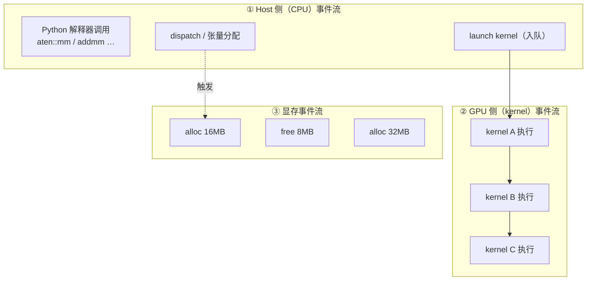
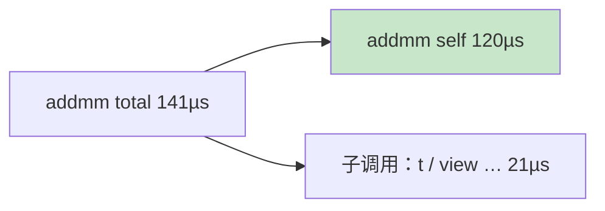
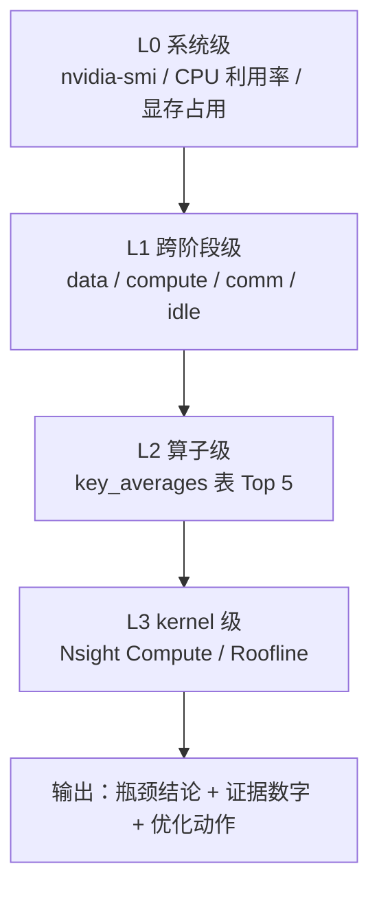

# Ch18：PyTorch Profiler 全链路性能定位

> 从 Ch10 的「单机单卡 Profiler 入门」到本章的「全链路性能定位」，区别在于**视角**：
> Ch10 解决「我的训练脚本为什么慢」，Ch18 解决「慢到底发生在哪一段链路——
> 是数据加载、算子计算、显存分配，还是 kernel launch 之间的空隙」。
> 本章把 torch.profiler 的四种产出（时间线、算子汇总表、内存分析、跨阶段分解）
> 串成一套「从整体到局部」的定位方法论，并输出可直接复用的《全链路分析清单》。

## 学习目标

- 掌握 torch.profiler 的完整调用方式：schedule 采样、record_shapes、profile_memory、导出 chrome trace
- 能读懂全链路时间线：host 侧事件、GPU kernel 事件、显存事件三层的对应关系
- 会用 `key_averages().table()` 做算子级耗时分布排序，区分 self time 与 total time
- 会用内存分析定位显存/内存峰值来源（profile_memory + 峰值显存 API）
- 能做跨阶段分解（数据加载 vs 计算 vs 通信），并用「从整体到局部」的方法输出分析清单

## 核心概念

### 1. 全链路时间线：三层事件流

一次训练（或推理）在 Profiler 眼里不是「一个函数」，而是**并行发生的三股事件流**：



| 事件流 | 用哪个 API 看 | 回答什么问题 |
|--------|--------------|-------------|
| Host 侧 | `ProfilerActivity.CPU`，`self_cpu_time_total` | CPU 是不是瓶颈？下发是否跟不上 GPU？ |
| GPU 侧 | `ProfilerActivity.CUDA`，`self_cuda_time_total` | 每个 kernel 真实执行多久？GPU 是否空闲？ |
| 显存事件 | `profile_memory=True` + 内存汇总表 | 谁分配了最大内存？峰值多少？ |

> **关键认知**：GPU 行出现大片空白（而不是 kernel 色块），说明 GPU 在**等**——
> 等数据、等同步、等 CPU 下发。这是 launch 开销和 kernel 碎片化的直接证据，
> 也是 Ch19/Ch20 要解决的问题。

### 2. 算子级耗时分布：self time vs total time

`key_averages()` 把采集窗口内的所有事件按算子名聚合，`table()` 输出排序表。
读表时最容易混淆的是两个时间列：

| 列名 | 含义 | 用途 |
|------|------|------|
| `Self CPU/CUDA` | 算子**自身**执行的时间（不含子调用） | 判断「谁真的在干活」 |
| `CPU/CUDA total` | 算子及其内部子调用的总时间 | 判断「整个调用链」 |



**为什么需要**：backward 算子（如 `AddmmBackward0`）的 total 时间很大、self 很小，
说明时间耗在内部真正的 `aten::mm` 上——排错时要看 self 时间才知道该优化哪个原子算子。
而 `train_step` 这类 record_function 标记的 total 接近 100%，用来计算单步耗时。

### 3. 内存分析：找「谁吃掉了显存」

`profile_memory=True` 后，汇总表会多出 `CPU Mem` / `Self CPU Mem`（GPU 上为
`Self CUDA Mem`）两列。峰值显存用 `torch.cuda.max_memory_allocated()` 直接读取。

**为什么需要**：OOM 是训练/推理最常踩的坑。先确认「峰值在哪产生、由哪个算子分配」，
再决定对策：减小 batch、换 dtype（FP16/BF16）、梯度检查点、换布局——而不是盲调。

### 4. 跨阶段分析：数据加载 vs 计算 vs 通信

沿 Ch01 的 step 分解思想，把一次 step 拆成四段时间：

| 阶段 | 测量方法 | 占比高时的优化方向 |
|------|---------|-------------------|
| data 数据加载 | DataLoader 迭代器取一个 batch 计时 | num_workers / 预取 / 磁盘 IO / 提前搬到设备 |
| compute 计算 | 前向+反向+step 计时 | 算子优化、torch.compile（Ch19） |
| comm 通信 | 多卡 AllReduce 计时（无多卡则模拟） | 梯度压缩、Overlap、换互联（Ch13-17） |
| idle 空闲 | 墙钟总时间 − 前三者 | CUDA Graph、算子融合（Ch20） |

### 5. 定位方法论：从整体到局部



**为什么需要**：直接开 Nsight Compute 深挖单个 kernel 是最高效的「局部」手段，
但如果瓶颈根本在数据加载，你只是在优化一个不重要的 kernel。
先整体后局部保证「优化的东西就是最慢的东西」。

## 关键代码

### 代码 1：profiler 核心四步（可直接复制使用）

```python
# 运行方式：python demos/ch18/main.py（无 GPU 走 CPU 模式，一样出表）
import torch
from torch.profiler import profile, ProfilerActivity, record_function, schedule

device = "cuda" if torch.cuda.is_available() else "cpu"
activities = [ProfilerActivity.CPU]
if device == "cuda":
    activities.append(ProfilerActivity.CUDA)      # GPU 上追加 CUDA 事件采集

with profile(activities=activities,
             schedule=schedule(wait=0, warmup=2, active=3, repeat=1),
             record_shapes=True,                  # 记录输入 shape（定位动态 shape）
             profile_memory=True) as prof:        # 开启内存采集
    for _ in range(6):                            # 2 步 warmup + 3 步 active + 1 步缓冲
        with record_function("train_step"):       # 自定义区间，时间线里更好读
            x = torch.randn(64, 128, device=device)
            out = model(x)
            loss = loss_fn(out, y)
            opt.zero_grad(); loss.backward(); opt.step()
        prof.step()                               # 推进 schedule 状态机

# ① 算子级耗时分布（按 GPU/CPU self time 排序）
sort_key = "self_cuda_time_total" if device == "cuda" else "self_cpu_time_total"
print(prof.key_averages().table(sort_by=sort_key, row_limit=20))
# ② 内存汇总表（按自分配内存排序）
mem_key = "self_cuda_memory_usage" if device == "cuda" else "self_cpu_memory_usage"
print(prof.key_averages().table(sort_by=mem_key, row_limit=10))
# ③ 全链路时间线（chrome://tracing 或 https://ui.perfetto.dev 打开）
prof.export_chrome_trace("trace.json")
# ④ GPU 峰值显存
if device == "cuda":
    print(f"峰值显存: {torch.cuda.max_memory_allocated()/1e6:.1f} MB")
```

### 代码 2：跨阶段分解（配合 `kernel_bench.timed` 与 `metrics`）

```python
# 运行方式：python demos/ch18/main.py（内部就是这段逻辑）
from kernel_bench import timed
from metrics import TrainingStepBreakdown, critical_path_check

records = []
with timed("data 加载一个 batch", records=records):
    xb, yb = next(loader)                     # 数据加载阶段
with timed("compute 前向+反向+step", records=records):
    train_one_step(xb, yb)                    # 计算阶段
with timed("comm 模拟 AllReduce", records=records):
    allreduce_gradients(model)                # 通信阶段（无多卡则模拟）

bd = TrainingStepBreakdown(
    compute_s=records[1][1], comm_s=records[2][1], data_s=records[0][1], idle_s=0.0)
print(critical_path_check(bd))                # 规则引擎给出瓶颈提示
```

## 课堂练习

### ⭐ 基础：读懂一张汇总表

运行 `python demos/ch18/main.py`（无 GPU 也可），观察输出表，回答：
1. 按 self time 排序，Top 3 算子分别属于「计算密集 / 访存密集 / 数据搬运」哪一类？
2. `train_step` 的 total 时间接近 100%，这说明了什么？它能用来算单步耗时吗？
3. 内存表里 `aten::mm` 的 Self CPU Mem 最大，你能解释它分配了什么吗？

### ⭐⭐ 进阶：给自己的训练脚本加一次全链路定位

把「代码 1」套到你自己的一段训练/推理代码上，完成：
1. 用 schedule 保证 warmup=2、active=3，避免冷启动污染数据
2. 导出 chrome trace，用 perfetto 打开，截取一张「GPU 行有空白的片段」
3. 对照清单 L1 判断：空白是因为等数据、等同步，还是 kernel 本身太短？
4. 给出「一句瓶颈结论 + 证据数字 + 优化动作」，写进你的笔记

### ⭐⭐⭐ 挑战：设计一次「内存峰值消减」实验

目标：把某个训练脚本的显存峰值降低 ≥30%。要求：
1. 先用 profiler 内存表 + `max_memory_allocated()` 建立基线（记录峰值数字）
2. 假设三个候选方案：减小 batch、换 BF16、对部分层开梯度检查点
3. 用**单变量对照**逐一验证（Ch01 方法论），记录每个方案的内存与耗时变化
4. 输出对比表 + 结论：为什么某个方案收益最大？是否牺牲了训练速度？

## 常见问题 Q&A

**Q1：`key_averages().table()` 里的 self 和 total 差很多，我该看哪个？**
A：定位「哪个原子算子慢」看 **self**（算子自己干活的时长）；评估「整条调用链
（如 backward）花多久」看 **total**。self 大而 total 小 = 算子本身耗时长；
self 小而 total 大 = 时间在子调用里，要继续向下钻取。Ch10 里我们把
`self_cuda_time_total` 作为排序键，正是为了聚焦原子 kernel。

**Q2：CPU 模式跑 profiler，数据有什么参考价值？**
A：参考价值在**结构**而非绝对数值：算子占比分布、瓶颈类别映射（mm/addmm → 计算密集、
elementwise → 访存密集）、内存分配来源分析在 CPU 上同样成立。绝对数值受 CPU 型号与
线程数影响，不能当作 GPU 上的预期。有 GPU 时务必重跑 CUDA 采集，结论以 GPU 为准。

**Q3：时间线上 GPU 有大片空白，是什么原因？怎么办？**
A：GPU 空闲的三个典型原因：① 等数据（DataLoader 未预取，IO 串行）→ 加 num_workers、
开预取；② 等同步（频繁 `.item()` / `.cpu()` / `torch.cuda.synchronize`）→ 移出热路径；
③ kernel 碎片化（大量微小 kernel 顺序 launch，每次都有 1-10µs 启动开销）→
算子融合 / torch.compile / CUDA Graph（Ch19、Ch20 就是为此准备的）。先用时间线
判断是哪种，再对症下药。

## 小结

| 要点 | 说明 |
|------|------|
| 全链路三层事件 | Host 侧 / GPU kernel / 显存事件，profiler 并行采集 |
| 算子汇总表 | key_averages + sort_by=self time；self 找原子算子，total 找调用链 |
| 内存分析 | profile_memory=True + 内存汇总表 + max_memory_allocated() |
| 跨阶段分解 | data / compute / comm / idle 四段，占比高者优先优化 |
| schedule 采样 | wait / warmup / active 状态机，warmup 必不可少 |
| 定位方法论 | L0 系统 → L1 跨阶段 → L2 算子 → L3 kernel，从整体到局部 |

## 下一章预告

Ch18 告诉我们「瓶颈在哪」，Ch19 给出第一把「自动优化」的钥匙——**torch.compile**：
它用 Dynamo 把 eager 代码捕获成计算图，再让 Inductor 生成融合 kernel，
自动完成算子融合、死代码消除、常量折叠等图级优化。下一课我们对比
eager vs compiled 的真实加速比，并讲清动态 shape 为什么是它的天敌。
