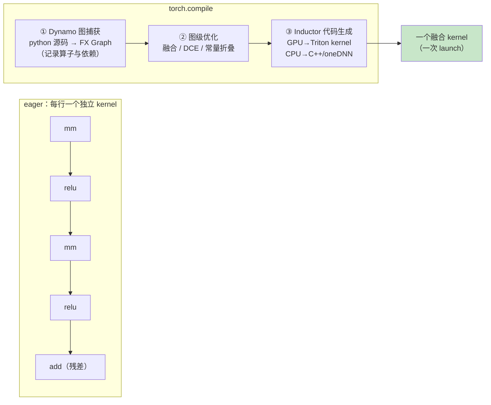
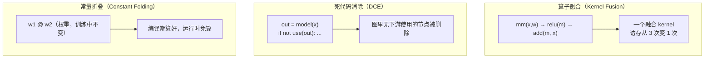
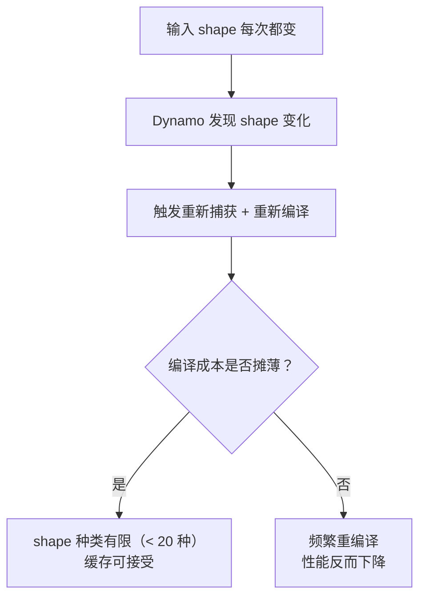

# Ch19：torch.compile 与计算图优化

> eager 模式下的 PyTorch 是「一行一行地解释执行」：每个算子独立 dispatch、独立分配
> 中间张量、独立 launch。torch.compile 打破了这个模式——它先把你的 Python 代码
> **捕获成一张计算图（Dynamo）**，再对图做全局优化，最后让 **Inductor** 生成
> 高效的底层代码（GPU 上是 Triton kernel，CPU 上是 C++/oneDNN）。
> 本章拆解这条编译流水线，讲清图优化有哪些类型、三种 mode 的取舍、
> 以及动态 shape 为什么是它最大的天敌。

## 学习目标

- 理解 torch.compile 的两段式架构：Dynamo 图捕获 + Inductor 代码生成
- 掌握三类图级优化：算子融合、死代码消除（DCE）、常量折叠
- 会用三种 compile mode（default / reduce-overhead / max-autotune）并说明取舍
- 能设计 eager vs compiled 的对照实验，正确测量并解释加速比
- 能识别动态 shape 等限制场景，写出带容错的 compile 接入代码

## 核心概念

### 1. 两段式架构：Dynamo 捕获，Inductor 生成



| 组件 | 作用 | 类比 |
|------|------|------|
| Dynamo | 在 Python 解释层拦下模型前向，捕获算子调用序列为 FX Graph | 编译器前端（解析 + IR） |
| Inductor | 把 FX Graph 翻译成 Triton/C++ 代码并编译 | 编译器后端（代码生成） |
| 图级优化 | 融合、DCE、常量折叠，发生在生成底层代码之前 | 中端优化（pass） |

> **关键认知**：torch.compile **不是**把每个算子变快，而是**消除多余的算子与
> 开销**——把 5 个 kernel 变 1 个、把没用的计算删掉、把 launch 次数降下来。
> 一个已经接近硬件峰值的 GEMM，编译后大概率还是 1.0x。

**为什么需要 compile**：eager 模式的性能天花板是「每算子独立 dispatch 的
开销总和」——小模型里大量 elementwise 算子各读一次写一次全局内存，访存
浪费往往比计算本身还大。计算图一旦建立，编译器就能跨越算子的边界做全局
决策，这是手工逐算子优化（Ch08-12）难以企及的视角。

### 2. 三类图级优化



| 优化类型 | 原理 | 收益来源 | 典型场景 |
|---------|------|---------|---------|
| 算子融合 | 相邻访存型算子合并，中间结果留在寄存器/SMEM | 减少全局内存往返 | elementwise 链、残差、LayerNorm |
| 死代码消除 | 删除对输出无贡献的计算节点 | 省掉无用 kernel | 有分支/调试残留的模型 |
| 常量折叠 | 编译期预计算常量表达式 | 运行时少算 | 静态权重、固定 shape 的 reshape |

### 3. 三种 mode 的取舍

| mode | 行为 | 编译时间 | 运行时收益 | 适用场景 |
|------|------|---------|-----------|---------|
| `default` | 标准 Inductor 优化 | 中等 | 好 | 训练（编译一次长期复用） |
| `reduce-overhead` | default + CUDA Graph（GPU） | 中高 | 最好 | 小模型/短 kernel/推理 |
| `max-autotune` | 对每个算子自动调优（搜 Triton 配置） | 很慢 | 略好 | 推理前离线编译 |

> **为什么需要 mode**：编译时间与运行收益是 trade-off。训练时模型参数每步都在变，
> 编译只付一次，所以 default 足够；推理时 kernel 固定，reduce-overhead 的 CUDA Graph
> 还能顺带消灭 launch 开销（与 Ch20 殊途同归）；max-autotune 用大量编译时间换
> 最后几个百分点的收益，适合「编译一次、服务千万次」。

### 4. 动态 shape：compile 的天敌



| 场景 | 后果 | 对策 |
|------|------|------|
| batch 每步变化（训练） | 反复重编译 | 固定 batch；或让 shape 种类受限 |
| 推理时请求长度不同 | 频繁重捕获 | 用静态 shape + KV Cache 填充；或退回 eager |
| 图内 Python 控制流 | Dynamo 捕获不完整 | `torch.compiler.disable` 划出热路径 |

## 关键代码

### 代码 1：三行接入 + 对照实验（可直接复制运行）

```python
# 运行方式：python demos/ch19/main.py
import time, statistics, torch

model = torch.nn.Sequential(          # 带残差的 MLP（融合收益的典型目标）
    torch.nn.Linear(256, 512), torch.nn.ReLU(),
    torch.nn.Linear(512, 512), torch.nn.ReLU(),
    torch.nn.Linear(512, 256))

# ① 容错接入（Dynamo 不可用时回退 eager，不崩溃）
try:
    compiled = torch.compile(model, mode="reduce-overhead")
    COMPILED = True
except (RuntimeError, NotImplementedError) as e:
    print(f"[compile 不可用] {e}")
    compiled, COMPILED = model, False

# ② 对照实验：同一输入，只切换 eager / compiled（单变量）
x = torch.randn(256, 256)

def bench(fn, iters=30, warmup=5):
    for _ in range(warmup): fn()
    ts = []
    for _ in range(iters):
        t0 = time.perf_counter(); fn()
        if torch.cuda.is_available(): torch.cuda.synchronize()
        ts.append((time.perf_counter() - t0) * 1000)
    return statistics.mean(ts), statistics.stdev(ts)

if COMPILED:
    compiled(x)                       # 首次调用触发真实编译（不计时）
    e_mean, e_std = bench(lambda: model(x))
    c_mean, c_std = bench(lambda: compiled(x))
    print(f"eager    : {e_mean:7.2f} ± {e_std:5.2f} ms")
    print(f"compile  : {c_mean:7.2f} ± {c_std:5.2f} ms")
    print(f"加速比: {e_mean / c_mean:.2f}x")
```

### 代码 2：Dynamo 不可用时的标准错误处理（本 Demo 演示路径）

```python
# 本环境（Python 3.12 + torch 2.2）Dynamo 会抛 RuntimeError，
# 正确的工程做法是捕获并降级：
try:
    model = torch.compile(model, mode="reduce-overhead")
    print("✅ 已开启编译")
except RuntimeError as e:
    print(f"⚠️ torch.compile 不可用（{e}），回退 eager 继续运行")
    # 业务照常跑，只是没有编译收益

# 部分算子不支持编译时，把不稳定代码划出图外：
@torch._dynamo.disable
def data_dependent_branch(x):
    return x.sum() if x.dim() > 2 else x.flatten()
```

## 课堂练习

### ⭐ 基础：跑通对照实验并解释数字

运行 `python demos/ch19/main.py`，回答：
1. 你的环境走的是「真实对比」还是「API 讲解」路径？为什么？
2. 对照实验里为什么要固定同一个输入 `x`、warmup 后再计时？（提示：Ch01 单变量）
3. 加速比表的规律是什么？为什么「大 GEMM」场景收益趋近 1.0x？

### ⭐⭐ 进阶：给一个真实模型接上 compile 并做收益验证

找一个你常用的模型（或 Ch18 的 MLP），完成：
1. 用「代码 1」接入 compile，分别跑 eager 与 compiled 各 30 次，记录均值与波动
2. 用 accelerate 比、方差说明：收益是稳定的还是噪声级的？
3. 打印编译耗时（首次调用），并估算：如果训练 1000 步，编译成本被摊薄到多少？
4. 尝试 mode 换成 `max-autotune`，对比编译时间与收益变化，得出结论

### ⭐⭐⭐ 挑战：制造并修复一个「动态 shape 事故」

1. 构造一个模型，每 10 步把 batch 换成 64/128/256 循环（动态 shape）
2. 用 profiler 或日志观察：shape 变化时是否触发重编译？编译耗时多少？
3. 设计修复方案：固定 batch / 限制 shape 种类 / 关闭该处的编译
4. 输出「修复前 vs 修复后」的耗时对比，解释为什么动态 shape 是编译的大敌

## 常见问题 Q&A

**Q1：compile 到底快在哪？我的模型是几个大 GEMM，还有必要开吗？**
A：快在「消除多余开销」：算子融合减少访存与 kernel 数、CUDA Graph 减少 launch、
DCE/常量折叠删掉无用计算。如果你的模型就是几个大 GEMM（已接近硬件峰值），
编译收益确实趋近 1.0x——这不是失败，说明你的 eager 已经足够好。判断方式：
先 profile（Ch18）看 kernel 数、launch 间隙和访存占比，再决定要不要开。

**Q2：为什么我的环境一调 torch.compile 就报 "Dynamo is not supported on Python 3.12+"？**
A：这是 Python 3.12 与 torch 2.2 及更早版本不兼容的已知限制（Dynamo 对这些组合
显式禁用）。对策：升级 torch ≥ 2.3（官方支持 3.12），或换用支持的 Python 版本。
生产代码务必用 try/except 包裹 compile，保证环境异常时回退 eager 而不是崩溃——
这也是本课程 Demo 演示「错误处理路径」的原因。

**Q3：训练时该用哪个 mode？推理呢？**
A：训练：`default` 或 `reduce-overhead`（GPU 上后者还能用 CUDA Graph 减少
launch，对小模型训练很划算），编译时间可接受且只付一次。推理：固定 shape、
kernel 可复用，优先 `reduce-overhead`，追求极致再上 `max-autotune`（编译很慢，
适合编译一次服务多次的离线部署）。总原则：**编译时间 × 复用处数 ≪ 节省的总运行时间**
才值得开。

## 小结

| 要点 | 说明 |
|------|------|
| 两段式架构 | Dynamo 捕获 FX Graph → Inductor 生成 Triton/C++ 代码 |
| 三类图优化 | 算子融合 / 死代码消除 / 常量折叠 |
| 三种 mode | default / reduce-overhead（+CUDA Graph）/ max-autotune |
| 收益来源 | 消除多余开销，不是让单算子超峰值 |
| 动态 shape | 反复重编译是最大限制，固定/限制 shape 种类 |
| 容错接入 | try/except 回退 eager，环境不满足也不崩溃 |

## 下一章预告

torch.compile 的 `reduce-overhead` 在 GPU 上已经悄悄用上了 **CUDA Graph**。
下一课我们把这块「黑盒」拆开：Kernel Launch 的 1-10µs 开销到底从哪来、
`torch.cuda.CUDAGraph` 如何「捕获一次、回放多次」、以及小模型/短 kernel/低 batch
场景为什么能拿到 3-5 倍收益。
