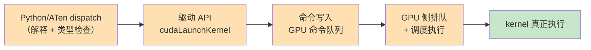
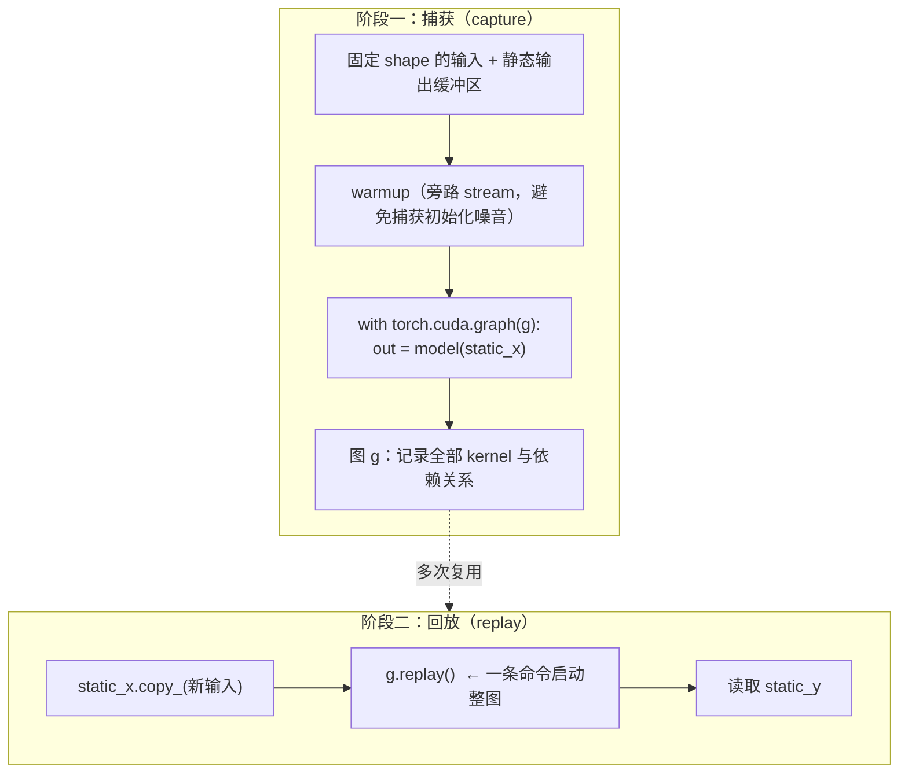
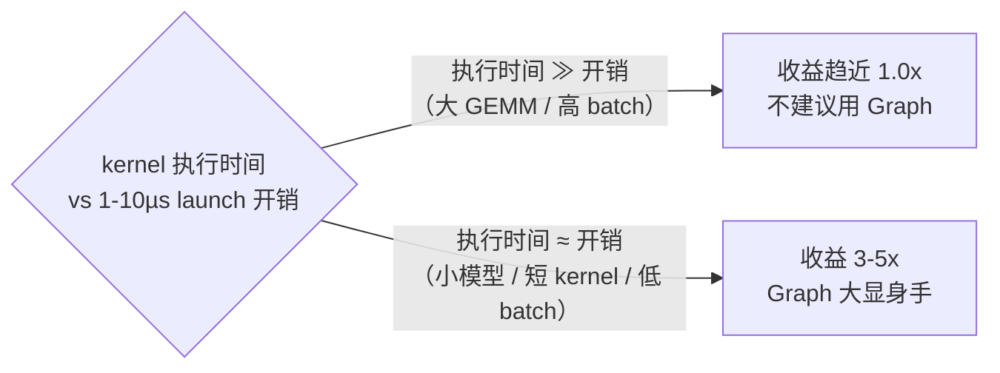
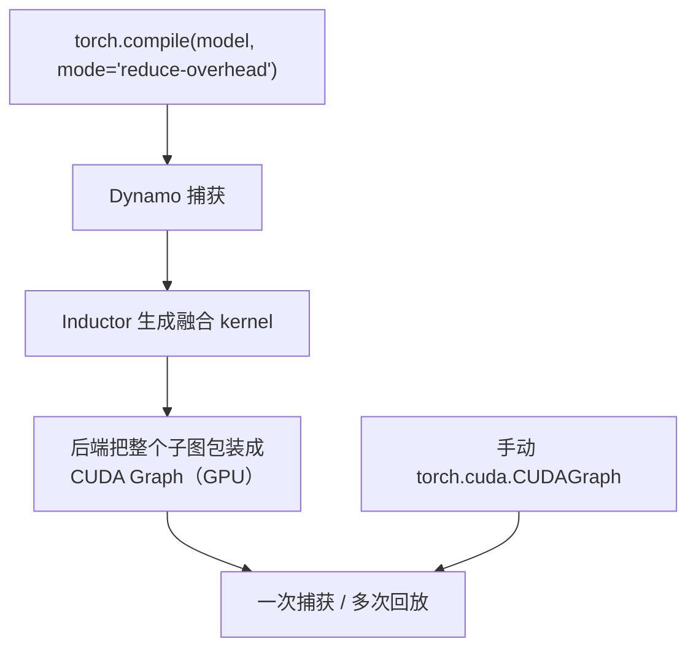

# Ch20：CUDA Graph 与运行时开销优化

> Ch19 讲的是「少算」（图优化），Ch20 讲的是「少等」——把 GPU 上每个 kernel
> 之间**排队、调度、启动**的时间压缩掉。一次 kernel launch 有 1-10µs 的固定开销，
> 小模型一个前向要 launch 几十次，纯启动开销就能吃掉大半耗时。CUDA Graph 把
> 一串 kernel「捕获」成一整张图，回放时**一条命令**启动全部 kernel，
> 这是小模型推理和短 kernel 场景最锋利的优化工具。

## 学习目标

- 说清 Kernel Launch 开销的四个来源（dispatch、驱动调用、入队、GPU 调度）
- 掌握 CUDA Graph「捕获一次、回放多次」的完整流程与静态缓冲区的约束
- 能判断 CUDA Graph 的适用场景（小模型 / 短 kernel / 低 batch / 固定 shape）
- 理解 torch.compile(mode="reduce-overhead") 与 CUDA Graph 的关系与分工
- 会用 `kernel_bench.launch_overhead_measure` 实测并量化 launch 开销

## 核心概念

### 1. Kernel Launch 开销从哪来

一次 `kernel<<<...>>>()` 不是「瞬间开始执行」，而是一串串行步骤：



| 开销来源 | 量级（经验值） | 能否消除 |
|---------|---------------|---------|
| Python/ATen dispatch | ~0.5-2 µs | 少调 Python：图捕获后一次调用 |
| 驱动 API + 命令入队 | ~1-5 µs | CUDA Graph 回放：一次入队整图 |
| GPU 排队与调度 | ~0.5-3 µs | Graph 内 kernel 已排好，免调度等待 |

> **数值假设**：单次 launch 总开销约 **1-10 µs/kernel**（NVIDIA 文档与业界实测的
> 典型范围）。放大演示时我们取 5 µs 作假设。累积效应：一个 30 算子的模型 =
> 30 × 5 µs = **150 µs 纯开销**；若每个 kernel 只跑 ~10 µs，开销占比超过 90%。

### 2. 捕获与回放：CUDA Graph 的两段式生命周期



| 步骤 | 代码 | 关键点 |
|------|------|--------|
| 固定输入输出 | `static_x = torch.randn(batch, dim, device="cuda")` | shape 不可变，地址固定 |
| warmup | 旁路 stream 上先跑 3 次 | 避免 CUDA 上下文初始化被捕获 |
| 捕获 | `with torch.cuda.graph(g): out = model(static_x)` | 捕获期间禁止同步/数据依赖 |
| 回放 | `static_x.copy_(new); g.replay()` | 输入输出都走静态缓冲区 |

> **为什么需要**：捕获把「每次 launch 都要重付的开销」变成「只付一次」。
> 回放时 GPU 按图内预排好的依赖直接执行，CPU 侧只有一次 `replay()` 调用，
> launch 间隙被彻底消除。

### 3. 适用场景：小模型 / 短 kernel / 低 batch



| 场景 | launch 开销占比 | Graph 收益 |
|------|----------------|-----------|
| 大 GEMM 4096³ | 低（执行时间占主导） | ~1.0-1.1x |
| 5 层小 MLP、batch=8 | 高 | ~2-3x |
| elementwise 短 kernel 链 | 很高 | ~4-5x |
| 大模型 Decode 步（单 token） | 高（每步几十个短 kernel） | 显著（推理框架标配） |

**限制**：动态 shape（每次 shape 变都要重新捕获）、图内数据依赖分支、
Python 控制流、CPU-GPU 同步点——都会让捕获失败或失效。

### 4. 与 torch.compile(mode="reduce-overhead") 的关系



| 手段 | 控制粒度 | 上手难度 | 适合 |
|------|---------|---------|------|
| 手动 CUDAGraph | 完全控制（静态缓冲区、stream） | 高 | 需要精确掌控的推理服务 |
| torch.compile reduce-overhead | 自动（能编译的子图自动变 Graph） | 低 | 大多数场景，动态 shape 会自动退避 |

> **共同前提**：固定 shape、无数据依赖分支。CPU 上 reduce-overhead 的 Graph
> 部分不生效，只剩算子融合收益（Ch19）。

## 关键代码

### 代码 1：度量 launch 开销（`kernel_bench.launch_overhead_measure`）

```python
# 运行方式：python demos/ch20/main.py（无 GPU 走 CPU per-op 度量路径）
from kernel_bench import launch_overhead_measure

result = launch_overhead_measure(inner_ns=5000)   # 5000 次微小 kernel
# 有 GPU：打印「单次微小 kernel 平均耗时（含 launch 开销）：X.X µs」
# 无 GPU：返回 {"cpu_only": True}，Demo 改用 CPU per-op 度量演示同一概念
```

### 代码 2：CUDA Graph 捕获与回放（完整可运行）

```python
# 运行方式：有 GPU 时 python demos/ch20/main.py 会真实执行这段
import torch

batch, dim = 128, 256
model = torch.nn.Sequential(
    torch.nn.Linear(dim, dim), torch.nn.ReLU(),
    torch.nn.Linear(dim, dim), torch.nn.ReLU(),
).cuda().eval()

static_x = torch.randn(batch, dim, device="cuda")
static_y = torch.empty(batch, dim, device="cuda")

# ① 旁路 stream warmup（把 CUDA 初始化噪音挡在图外）
s = torch.cuda.Stream()
s.wait_stream(torch.cuda.current_stream())
with torch.cuda.stream(s):
    for _ in range(3):
        static_y.copy_(model(static_x))
torch.cuda.current_stream().wait_stream(s)

# ② 捕获：一条上下文把整个前向记录进图
g = torch.cuda.CUDAGraph()
with torch.cuda.graph(g):
    static_y.copy_(model(static_x))

# ③ 对比：normal launch vs graph replay
import time
n = 200
torch.cuda.synchronize()
t0 = time.perf_counter()
for _ in range(n):
    static_y.copy_(model(static_x))     # 每次单独 launch
torch.cuda.synchronize()
normal_ms = (time.perf_counter() - t0) / n * 1000

torch.cuda.synchronize()
t0 = time.perf_counter()
for _ in range(n):
    g.replay()                          # 一条命令启动整图
torch.cuda.synchronize()
graph_ms = (time.perf_counter() - t0) / n * 1000

print(f"normal launch: {normal_ms:.4f} ms | graph replay: {graph_ms:.4f} ms "
      f"| 加速比 {normal_ms/graph_ms:.2f}x")
```

## 课堂练习

### ⭐ 基础：复现并量化 launch 开销

运行 `python demos/ch20/main.py`，回答：
1. 你的环境走了 GPU 实测还是 CPU per-op 度量路径？分别得到多少 µs/op？
2. 用「30 算子 × 5 µs = 150 µs」的估算，算一下 30 算子模型 launch 开销占总
   耗时的比例（假设每 kernel 执行 10 µs 与 100 µs 两种情况）。
3. 为什么大 GEMM 场景 Graph 收益小？用「执行时间 vs launch 开销」解释。

### ⭐⭐ 进阶：给「小模型推理」套上 CUDA Graph

找一个固定 shape 的小推理模型，完成：
1. 用「代码 2」接入 CUDAGraph，跑 normal vs replay 各 200 次，记录加速比
2. 故意制造一次「动态 shape」：replay 前把 static_x 换成不同 shape，观察报错
3. 思考：推理服务里 batch 会变化，如何用「shape 分桶」保持 Graph 收益？
   （每个 shape 一桶、各捕一张图，按需回放）

### ⭐⭐⭐ 挑战：实现一个「多 shape Graph 池」

设计并实现一个支持 2-3 种 batch 的 Graph 池：
1. 对 batch ∈ {1, 8, 32} 各捕获一张图（共用模型权重）
2. 输入来了按 batch 选择对应图回放，模拟推理服务的 shape 路由
3. 对比三种方案耗时：纯 eager / 单 Graph（只支持一种 shape） / Graph 池
4. 输出对比表，说明真实推理服务为什么需要「图池 + 分桶」而不是单张图

## 常见问题 Q&A

**Q1：CUDA Graph 和 torch.compile 我该用哪个？**
A：优先级建议：先 `torch.compile(model, mode="reduce-overhead")`——它能自动融合
算子再包 Graph，动态 shape 时还会自动退避，成本最低。若编译路径无法覆盖你的
场景（比如手控输入输出缓冲区、多 stream 编排），再手动上 `torch.cuda.CUDAGraph`。
两者原理相同（捕获→回放），区别只是「自动 vs 手动」的粒度。

**Q2：Graph 捕获报错（shape 变了 / 遇到同步），怎么办？**
A：逐条排查：① 输入输出必须用固定 shape 的静态缓冲区，任何 `.shape` 变化都会
导致重新捕获；② 捕获期间禁止 `torch.cuda.synchronize()`、`.item()`、`.cpu()`
等同步操作；③ 图内不能有数据依赖的 Python 分支（如 `if x.sum() > 0`）——把它
移到图外处理。若模型本身确实动态，考虑「shape 分桶 + 多图池」（练习 ⭐⭐⭐）。

**Q3：launch 开销真的是 1-10µs 吗？为什么有的文章说更小？**
A：1-10 µs/kernel 是 NVIDIA 官方文档与工程实践中普遍引用的典型范围，其中
CPU 侧 dispatch + 驱动调用占大头，与 CPU 型号、驱动版本、是否开启 stream
有关；GPU 侧调度部分通常 < 1µs。实际测量受环境差异影响，所以课程 Demo
在 GPU 上**实测**、无 GPU 时用 CPU per-op 度量给量级感受，并在演示数据上
明确标注「假设 5 µs」。做性能预测时以自己环境的实测为准。

## 小结

| 要点 | 说明 |
|------|------|
| launch 开销 | 1-10 µs/kernel（dispatch + 驱动 + 入队 + 调度） |
| 捕获 | 固定 shape + 静态缓冲区 + 旁路 stream warmup |
| 回放 | `g.replay()` 一条命令启动整图，开销从 N 次变 1 次 |
| 适用场景 | 小模型 / 短 kernel / 低 batch / 固定 shape |
| 限制 | 动态 shape、数据依赖分支、同步点 |
| 与 compile 关系 | reduce-overhead 内部就是 CUDA Graph，自动 vs 手动之分 |

## 下一章预告

Module 4 到此收官：Ch18 定位瓶颈、Ch19 少算、Ch20 少等，Compiler 与 Runtime
优化手段已经齐备。从 Ch21 起进入 **Module 5：大模型推理系统**——把视角从
「单个模型怎么跑得快」拉高到「整个服务怎么扛住高并发」：TTFT/TPOT 指标、
Continuous Batching 调度、KV Cache 显存管理，推理优化的主战场才刚刚开始。
