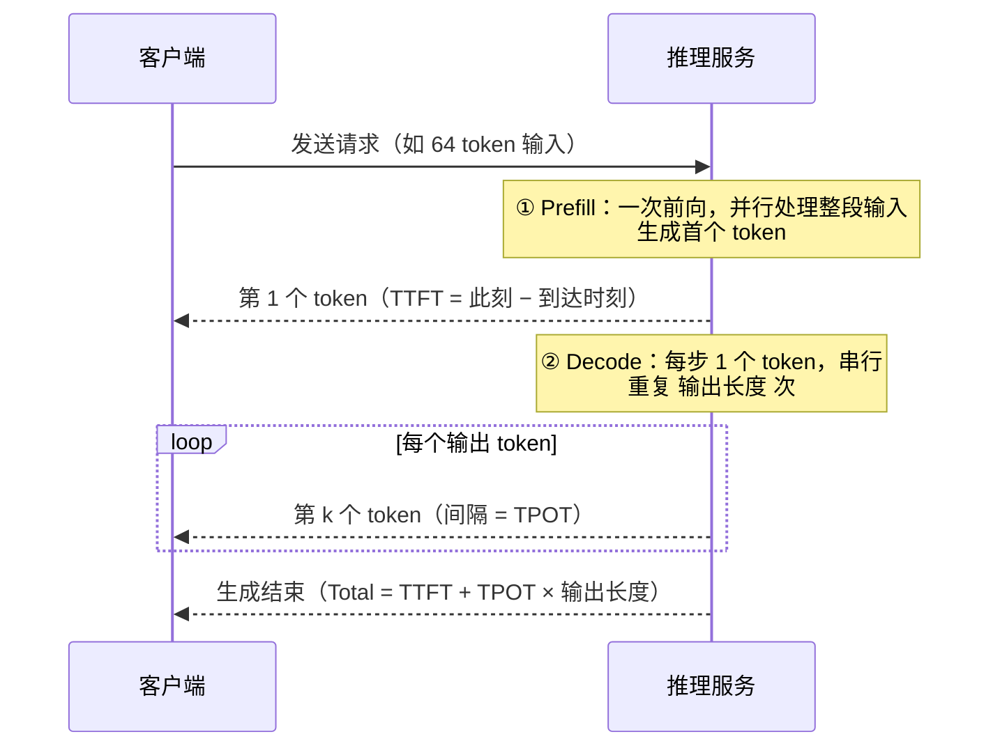
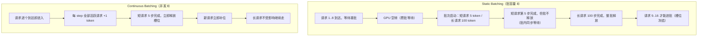

# Ch21：推理性能指标与 Continuous Batching

> 前 20 章我们把训练侧从指标到算子到分布式到编译逐个打通，从本章开始进入
> **大模型推理系统**——这是 AI Infra 里离钱最近、也是优化杠杆最大的战场：
> 同样的 8 块卡，有人只扛 8 路并发，有人扛 48 路，差距就来自 Batching 策略。
> 本章先建立推理侧的三个黄金指标（TTFT / TPOT / ITL），再回答一个核心问题：
> 为什么 Continuous Batching（连续批）能把吞吐拉高数倍？

## 学习目标

- 掌握推理侧三个时延指标 TTFT / TPOT / ITL 的精确定义与测量口径，能拆解一次请求的时延构成
- 理解自回归生成与「逐 token 串行」的本质约束，能解释为什么批处理是推理吞吐的根本手段
- 对比 Static Batching 与 Continuous Batching：能说出静态批的 3 个损耗来源（攒批空转、批内同步、槽位冻结）
- 运行 `demos/ch21/main.py` 复现「同样 48 个请求，连续批比静态批快约 2 倍」的实验
- 能解释 vLLM / SGLang 用 Continuous Batching 把单机并发推高数倍的原理，并说出并发上限（带宽预算）的存在

## 核心概念

### 1. 一次 LLM 推理请求的时间轴

一次文本生成请求 = **Prefill（输入处理）** + **Decode（逐 token 生成）** 两段：



| 指标 | 全称 | 定义 | 关注的问题 | 受什么影响 |
|------|------|------|-----------|-----------|
| TTFT | Time To First Token | 请求到达 → 首个输出 token 出现 | 「第 1 个字多快」 | Prefill 并行度、排队、批大小 |
| TPOT | Time Per Output Token | 相邻两个输出 token 的时间间隔 | 「后面的字多快」 | Decode 带宽、并发争用 |
| ITL | Inter-Token Latency | 同上（流式场景的别名） | 流式体验 | ≈ TPOT（线性 Decode 时） |
| Total | 端到端时延 | 到达 → 生成完成 | 整段对话耗时 | TTFT + TPOT×长度 |

> **关键认知**：TPOT ≈ 10ms 时，输出 256 token 就要 2.5 秒。用户感知的「快」
> 一半来自 TTFT（首字），一半来自 TPOT（每字）——优化要同时盯两个。

### 2. 为什么必须做 Batching？

自回归生成是**逐 token 串行**的：第 t 个 token 依赖前 t−1 个。这带来一个反直觉的结论——
**解码阶段 GPU 算力利用率极低**：

- 每步只算 1 个 token：7B 模型每步约 14 GFLOPs，而 H100 FP16 峰值 989 TFLOPS
- 每步却要重读一遍全部权重（14 GB）→ 被带宽钉死在 ~10ms/步
- 算力使用率 < 1%，**带宽是唯一瓶颈**

既然每步的算力是「白送的」，那就让**多个请求共享同一步**：一个 step 同时喂给 10 个请求，
每个请求各出一个 token。带宽不变（读一遍权重 14GB），产出却变成 10 个 token——
这就是 Batching 的全部秘密：**用不花钱的算力，摊薄必须花的带宽**。

| Batching 策略 | 工作机制 | 优点 | 缺点 |
|--------------|---------|------|------|
| Static Batching | 攒够 N 个请求组成一批，整批同进同出 | 实现简单、规则清晰 | 短请求等长请求、GPU 空转 |
| Continuous Batching | 每 step 完成后动态补位/移除 | 吞吐高、无空转 | 调度复杂、需 Paged KV 配合 |
| 动态批 + 并发上限 | 连续批 + 限制最大并发数 | 吞吐与 TPOT 可权衡 | 并发上限即带宽预算 |

### 3. Static Batching 的三个损耗来源



- **L1 攒批空转**：批次不满时 GPU 等待，batch_size 越大、请求到达越稀疏越严重
- **L2 批内同步**：批内最短请求完成后必须等最慢者，尾延迟传染给整批
- **L3 槽位冻结**：已完成请求仍占着槽位，新请求进不来

Continuous Batching 把三者全部消除：每 step 来一个收一个、请求独立推进、完成即释放补位。
Demo 中 48 个混合长度请求（20% 长 / 80% 短）：静态批 489 步完成、平均等待 262 步；
连续批 276 步、平均等待 80 步——**吞吐 1.77x、时延同时下降**。

### 4. 吞吐提升的边界：带宽预算

连续批不是并发越大越好。每多一路并发，decode 步长都会因带宽争用而恶化
（Demo 中近似：每 +1 路，TPOT ≈ +12%）。于是存在一个**最优并发**：
- 并发太低：GPU 算力闲置，吞吐爬不上去
- 并发太高：每路 TPOT 暴涨，P99 时延不可接受
- 工程解：**max_concurrent = 显存能装下的 KV Cache 数 ∩ 带宽预算内的并发数**

## 关键代码

### 代码 1：TTFT / TPOT / ITL 计算（可直接复制使用）

```python
# 运行方式：python demos/ch21/main.py
from metrics import LatencyMetrics

ttft_ms = 120.0          # Prefill 阶段耗时（输入 64 token）
tpot_ms = 18.0           # 每输出 token 时延
output_len = 128
lm = LatencyMetrics(ttft_ms=ttft_ms, tpot_ms=tpot_ms,
                    total_ms=ttft_ms + tpot_ms * output_len)
print(lm.summary())
# {'TTFT(ms)': 120.0, 'TPOT(ms)': 18.0, 'ITL(ms)': 18.0, 'Total(ms)': 2424.0}
```

### 代码 2：修正版连续批处理器（关键逻辑）

> 注意：共享库 `scheduler.py` 的简化版 ContinuousBatcher 会在并发满时丢弃溢出请求，
> 且 demo 复用了被修改的 Request 对象。本 Demo 实现了修正版（溢出进 pending 队列、
> 每次运行使用全新请求副本），结果才是可信的。

```python
class ContinuousBatcherV2:
    def __init__(self, max_concurrent):
        self.max_concurrent = max_concurrent

    def run(self, arrivals):
        active, pending = [], deque()
        qi = step = completed = 0
        total_wait = 0.0
        while completed < len(arrivals):
            while qi < len(arrivals) and arrivals[qi].arrival_step <= step:
                if len(active) < self.max_concurrent:
                    active.append(arrivals[qi])      # 有槽位直接进
                else:
                    pending.append(arrivals[qi])     # 溢出进等待队列
                qi += 1
            for r in active:                          # 每请求独立 +1 token
                r.done_tokens += 1
            done = [r for r in active if r.finished]
            completed += len(done)
            for r in done:
                total_wait += (step + 1) - r.arrival_step
            active = [r for r in active if not r.finished]
            while len(active) < self.max_concurrent and pending:
                active.append(pending.popleft())      # 完成即补位
            step += 1
        return {"steps": step, "avg_wait": total_wait / completed}
```

### 代码 3：批容量扫描实验

```python
# 完整实验见 demos/ch21/main.py part3
for bs in [4, 8, 16]:
    s = StaticFixedBatch(bs).run(fresh_copies(arrivals))
    c = ContinuousBatcherV2(bs).run(fresh_copies(arrivals))
    print(bs, s["steps"], c["steps"], f"{s['steps']/c['steps']:.2f}x")
# 4   → 916 vs 457 = 2.00x
# 8   → 489 vs 276 = 1.77x
# 16  → 309 vs 195 = 1.58x
```

结论：批容量越小，静态批的攒批空转占比越高，连续批优势越大；但无论批容量多大，
**连续批始终更快、平均时延更低**。

## 课堂练习

### ⭐ 基础：手推一次请求的时延拆解

假设 TPOT = 15ms、TTFT = 90ms、输出长度 = 512 token：
1. 计算 Total 时延；如果输出翻倍（1024 token），Total 增加多少？
2. 如果用 Continuous Batching 把并发从 1 提到 8，TPOT 每 +1 路恶化 12%，新的 TPOT 是多少？
   对比「吞吐翻了 8 倍」与「TPOT 涨了 2 倍」，说明为什么并发不是越多越好。
3. 用 `LatencyMetrics` 验证你的计算。

### ⭐⭐ 进阶：改造调度器做「等待窗口」批处理

真实系统用「攒满 OR 超时」两条件触发：队列攒满 batch_size **或** 距首批到达超过
`window_ms`（如 50ms）就启动一批。修改 `ContinuousBatcherV2` 支持该策略，对比：
- 纯连续批（无窗口）vs 窗口批（窗口 50ms）的吞吐与平均等待
- 窗口越小 TTFT 越低但批更碎，窗口越大批更整但首字越慢——画出权衡

### ⭐⭐⭐ 挑战：实现带宽感知的并发上限

给调度器加上「decode 步长 = D_BASE × (1 + 0.15 × (并发−1))」的带宽争用模型（参考
`demos/ch23/main.py`），把 `max_concurrent` 从 4 扫到 32，测量：
1. 总吞吐（tokens/s）随并发的曲线，找到吞吐拐点
2. P95 TPOT 随并发的曲线，找到 SLO（如 TPOT ≤ 25ms）约束下的最大并发
3. 用一份「吞吐 × P99 达标率」的联合指标选最优并发，并解释为什么生产上
   并发上限本质是「带宽预算」而不是「显存预算」

## 常见问题 Q&A

**Q1：TTFT、TPOT、ITL 到底差在哪？面试怎么说？**
A：TTFT 是「到达 → 首 token」，本质是 Prefill 段的时延，取决于输入长度与并行度；
TPOT 是「相邻输出 token 的间隔」，本质是 Decode 段的时延，取决于带宽与并发争用；
ITL 是流式场景对 TPOT 的别称——在线性自回归 Decode 阶段两者数值几乎相同。
一句话：**TTFT 看首字，TPOT 看每字**。

**Q2：静态批在什么场景下不输连续批？**
A：当请求长度非常均匀且到达率稳定（如离线批量打分任务）时，批内同步等待不存在，
静态批的规则简单反而省调度开销。但在线交互（聊天、文档问答）长度天然长尾，
静态批的 3 个损耗全部放大——这就是在线服务普遍转向连续批的原因。

**Q3：连续批的并发上限到底由什么决定？**
A：三层约束叠加：① 显存——每个活跃请求要占 KV Cache，显存装不下就 OOM；
② 带宽——并发高了每步读权重的时间摊薄，但 TPOT 随并发恶化，超过 SLO 就不可用；
③ 算力——并发极高时算力反而成为新的瓶颈（此时的 TPOT 恶化更陡）。工程上
先算显存上限，再压测扫描找「吞吐 × TPOT-SLO」双目标最优点。

## 小结

| 要点 | 说明 |
|------|------|
| TTFT | 到达 → 首 token，反映 Prefill 效率与排队，优化看并行度与批调度 |
| TPOT / ITL | 相邻输出 token 间隔，反映 Decode 带宽，随并发恶化 |
| Total | TTFT + TPOT × 输出长度，用户体感的主指标 |
| 自回归瓶颈 | 每步 1 token、串行依赖、算力利用率 <1%，带宽才是瓶颈 |
| Static Batching | 攒批空转 + 批内同步 + 槽位冻结三个损耗，长短混合时最伤 |
| Continuous Batching | 动态补位，吞吐高且时延低，是 vLLM/SGLang 的吞吐基石 |
| 并发上限 | 显存预算 ∩ 带宽预算，压测扫描找吞吐×TPOT 平衡点 |

## 下一章预告

Batching 提高并发后，第一个卡脖子的问题就是**显存**：每个活跃请求都要缓存 KV，
并发越高 KV Cache 越大，很快把显存吃光。Ch22 将给出 KV Cache 的显存公式
`2·L·kv_heads·head_dim·seq·batch·dtype`，介绍 GQA 如何把 KV 头压到 1/4，
以及 Paged Attention 的分页思想为什么能根治显存碎片。
