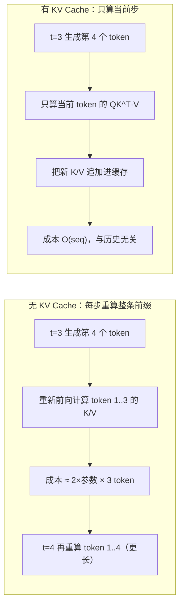
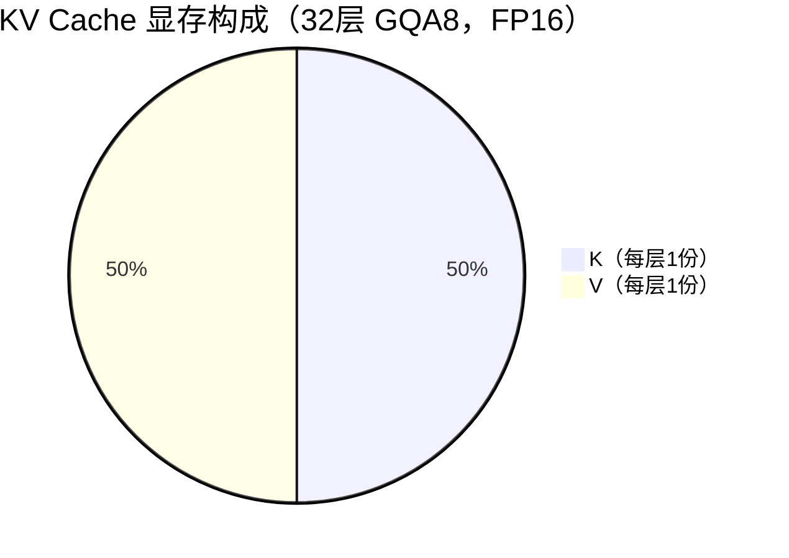
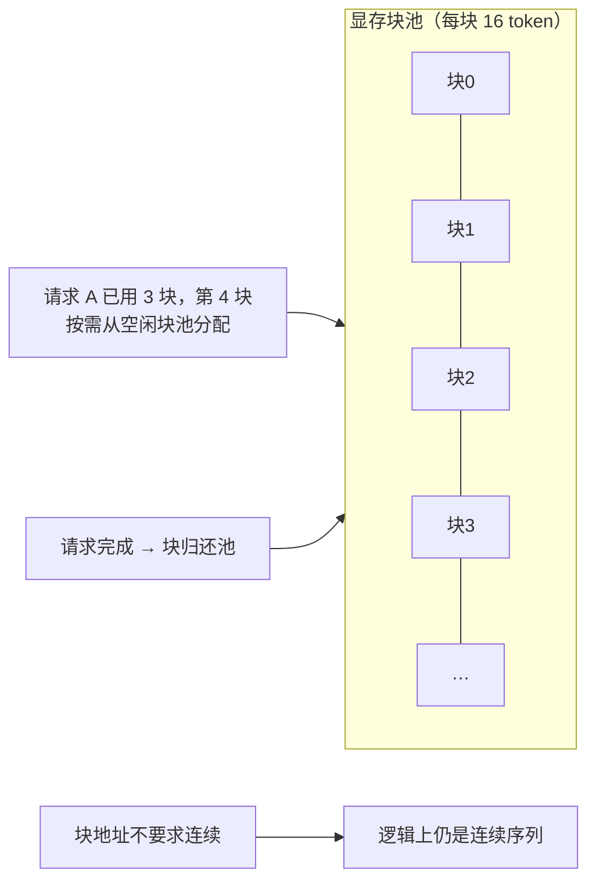

# Ch22：KV Cache、Paged Attention 与显存管理

> Ch21 说连续批能把并发推高，但有一个隐形天花板：**每个活跃请求都要把已生成的
> token 的 K/V 缓存下来**，这部分显存随「并发 × 序列长度」爆炸式增长。
> 本章先把 KV Cache 的显存公式推导到能背下来的程度，再讲 GQA 压缩 KV 头、
> Paged Attention 分页管理显存，最后用真实 GPU 参数做一次显存规划。

## 学习目标

- 能默写并解释 KV Cache 显存占用公式 `2·L·kv_heads·head_dim·seq·batch·dtype_bytes`，弄清每个因子的来源
- 理解 KV Cache 存在的必要性：无缓存时每步重算整条前缀的成本为何不可接受
- 理解 MHA → GQA 的动机与代价：KV 头从 32 压到 8，显存和 KV 写带宽同时除以 4
- 掌握 Paged Attention 的分页思想：块分配、内部碎片消除、按需增长的机制
- 能对给定 GPU 做显存规划：权重 + 激活 + KV 预算拆分，估算可并发会话数

## 核心概念

### 1. KV Cache 是什么、为什么必须有

注意力计算需要 `Q·K^T·V`：每个新 token 都要与**之前所有 token** 的 K/V 做交互。
如果没有缓存，每生成一个新 token，都要把前面整段历史的 K/V 重新前向计算一遍：



| 方案 | 每步成本 | 累计成本（生成 T token） | 结论 |
|------|---------|------------------------|------|
| 无缓存 | 2×params×seq（重算整条前缀） | ≈ params×T² | 生成越长越无法承受 |
| 有缓存 | O(seq)（仅注意力） | ≈ T²/2 | 必需品，不是可选项 |

Demo 量化：7B 模型生成到 4096 token 时，无缓存累计计算量是有缓存的 **28000 倍**
（14 GFLOPs/token × 4096 的前缀重算 vs 0.5 MFLOPs/token 的注意力）。

### 2. KV Cache 显存公式：一个因子一个来源

```
显存字节数 = 2 × L × kv_heads × head_dim × seq × batch × dtype_bytes
             └K┘└V┘ └─层数──┘ └─每头维度──┘ └序列长┘ └并发┘ └精度──┘
```

| 因子 | 含义 | 典型值（7B GQA 模型） |
|------|------|----------------------|
| 2 | K 和 V 各一份 | 2 |
| L | 层数，每层各存一份 | 32 |
| kv_heads | KV 头数（MHA 时 = Q 头数；GQA 时更小） | 8 |
| head_dim | 每头维度 | 128 |
| seq | 每请求的已生成 token 数 | 2048 |
| batch | 并发请求数 | 8 |
| dtype_bytes | 每个元素字节数（FP16=2） | 2 |

单请求 2048 token：`2×32×8×128×2048×2 = 268 MB`；
8 路并发各 2048：`2.15 GB`。**显存 = seq × batch 双线性增长**，这就是为什么
「长上下文」和「高并发」不能同时贪。



### 3. GQA：用 KV 头换显存

MHA（Multi-Head Attention）每个 Q 头配一个 K/V 头；GQA（Grouped-Query Attention）
让一组 Q 头共享一个 K/V 头：

| 方案 | Q 头 | KV 头 | KV 显存 | 质量影响 |
|------|------|-------|---------|---------|
| MHA | 32 | 32 | 4x | 基线 |
| GQA | 32 | 8（每 4 个 Q 共享 1 组 KV） | 1x | 极小（近似研究结论） |
| GQA | 32 | 4 | 0.5x | 可接受 |
| MQA | 32 | 1 | 0.125x | 有退化风险 |

关键认知：**Q 头数决定注意力表达力，KV 头数决定 KV 显存与写带宽**。GQA 保留 32
个 Q 头不动（注意力质量不变），只压缩 K/V 头——Llama 2/3、Mistral、DeepSeek 等
主流模型全部采用。代价是同一组 Q 共享 KV 带来的近似，实测质量损失可忽略。

### 4. Paged Attention：分页消除碎片

连续分配（contiguous）的问题：每请求要预留「最长可能长度」的 KV 空间，但实际
生成的序列长短不一，预留即浪费；且碎片化导致「显存够却 OOM」。

Paged Attention（vLLM 首创）的思想借自操作系统分页：



| 分配方式 | 预留方式 | 内部碎片 | 块复用 | 代表实现 |
|---------|---------|---------|--------|---------|
| 连续分配 | 按最坏长度预留 | 高（长度差异越大越浪费） | 无 | naive 推理 |
| 分页分配 | 按需 16-token 一页 | 只有页尾 1 页的零头 | 有（归还即复用） | vLLM PagedAttention |

Demo 数据：20 个请求，长度 64/128/256 混合，连续分配按 256 预留需 320 块，
分页分配实际只用 208 块——**省 35%**，且块池共享天然支持并发扩缩。

### 5. 显存规划：权重、激活、KV 三分预算

推理服务一块 GPU 的显存去向：

| 去向 | 占比特征 | 优化手段 |
|------|---------|---------|
| 模型权重 | 固定（14B 权重 = 28GB BF16） | 量化（FP8/INT4）、张量并行 |
| 激活/中间张量 | 与 batch×seq 相关，峰值有限 | 融合算子、chunked prefill |
| KV Cache | 随并发×序列动态增长 | GQA、量化、分页、限额 |
| 运行时/通信缓冲 | 固定小头 | 预留即可 |

Demo 里 H100 80G 上 14B 模型（权重 28G + 激活 4G + 预留 8G）剩约 37G 给 KV：
每 token 128KB → 4096 上下文可并发 74 路、8192 上下文 37 路。**并发数 = 显存预算 /
(每 token KV × 平均上下文长度)**，这是推理服务容量规划的第一道算术题。

## 关键代码

### 代码 1：显存公式（可直接复制使用）

```python
# 运行方式：python demos/ch22/main.py
from kv_cache import kv_cache_bytes

# L=32, Q头32, head_dim=128, seq=4096, batch=8, FP16, GQA 8 个 KV 头
gb = kv_cache_bytes(32, 32, 128, 4096, 8, 2, num_kv_heads=8) / 1e9
print(f"{gb:.2f} GB")          # 4.29 GB

mha = kv_cache_bytes(32, 32, 128, 4096, 8, 2) / 1e9     # 17.18 GB (MHA)
```

### 代码 2：分页分配器（共享库实现）

```python
from kv_cache import PageAllocator

pa = PageAllocator(block_size=16, total_blocks=100)   # 16 token/块，共 100 块
got = pa.alloc(6)          # 分配 6 块 → 96 token 容量
print(pa.stats())          # {'total': 100, 'free': 94, 'used': 6}
```

### 代码 3：缓存 vs 重算成本对比

```python
from kv_cache import KVCacheEngine

engine = KVCacheEngine(32, 32, 128, num_kv_heads=8)
for pos in [64, 1024, 4096]:
    c = engine.compute_attention_cost(pos, cached=True)
    nc = engine.compute_attention_cost(pos, cached=False)
    print(pos, c["compute_ops"], nc["compute_ops"] + nc["recompute_ops"])
```

### 代码 4：并发容量估算

```python
gpu_gb, weight_gb, act_gb, reserve_gb = 80, 28, 4, 8
kv_budget = (gpu_gb - weight_gb - act_gb - reserve_gb) * 1e9   # 37.25 GB
per_token = 2 * 32 * 8 * 128 * 2                               # 128 KB/token
for seq in [1024, 4096]:
    print(seq, int(kv_budget / (per_token * seq)))   # 可并发会话数
# 1024 → 298；4096 → 74
```

## 课堂练习

### ⭐ 基础：手算三档模型的 KV 显存

对以下三个模型各算一份「单请求 seq=4096、8 路并发、FP16」的 KV Cache 显存：
1. L=32, Q头=32（MHA），head_dim=128
2. L=32, Q头=32（GQA-8），head_dim=128
3. L=64, Q头=48（GQA-8），head_dim=128（对照：层数翻倍的影响）
并用 `kv_cache_bytes` 验证。解释为什么第 2 档适合 7B 级在线服务、第 3 档适合长上下文模型。

### ⭐⭐ 进阶：给 H100 做显存规划

用 `gpu_specs.get_spec("H100_SXM")` 与 `get_spec("L40S")` 分别规划：
1. 14B 模型（BF16 权重 28GB）+ 4GB 激活 + 8GB 预留下，可并发会话数随
   平均上下文长度（1k / 4k / 8k）的变化
2. 若改用 FP8 KV Cache（dtype_bytes=1），并发数提升多少？
3. 若改成 INT4 权重（权重 14GB），省下的显存又能多扛多少并发？
把两卡结果列成表格对比，讨论「买显存」vs「压缩 KV」哪个更划算。

### ⭐⭐⭐ 挑战：实现块池共享的分页模拟

在 `PageAllocator` 基础上实现一个多请求生命周期模拟：
- 20 个请求陆续到达，每个请求需要 4~16 块（长度不等），生成完成后释放
- 连续分配策略：每请求预留最大 16 块 → 统计块池峰值与浪费
- 分页策略：按需分配、完成即还 → 统计块池峰值与块复用次数
- 对比两种策略在「块池总量 150」下各自的 OOM 次数与浪费块数
提示：把块分配/释放看成操作系统内存管理，OOM = 块池耗尽。

## 常见问题 Q&A

**Q1：KV Cache 到底放 K 还是 V？为什么是「2」倍？**
A：注意力里 `Q·K^T` 要用到历史 K，`softmax 结果·V` 要用到历史 V，两者都要保留，
所以每层每组 KV 头是 K 一份 + V 一份，因子 2。如果只留 K 或只留 V，下一个 token
的注意力就算不出来——这也是「KV Cache」名字里 K 和 V 都要出现的由来。

**Q2：GQA 的 KV 头数可以无限压缩吗？**
A：不能。KV 头过少（如 MQA 的 1 个）会让多组 Q 头共享同一份 K/V，注意力多样性
下降，长上下文与复杂推理场景出现可观测的质量退化。工业界的经验区间：
7B~14B 用 GQA-8 或 GQA-4；70B 级常用 GQA-8。压缩 KV 头是显存换质量，要压到什么
程度应以评测为准。

**Q3：Paged Attention 和普通「动态扩容的连续数组」有什么本质区别？**
A：连续数组扩容要整块搬移（copy），且每请求独占一段地址空间、无法与其他请求
共享未用部分；分页把地址空间逻辑化——物理块不连续但逻辑连续，扩容只加一页，
空闲块跨请求共享。更关键的是**块级共享**：前缀相同的请求（如多轮对话复用系统
提示词）可以共享 KV 块，这是连续分配做不到的（vLLM 的 prefix caching 卖点）。

## 小结

| 要点 | 说明 |
|------|------|
| KV Cache 必要性 | 无缓存每步重算整条前缀，累计成本 ≈ params×T²，生成越长越不可行 |
| 显存公式 | 2·L·kv_heads·head_dim·seq·batch·dtype_bytes，seq×batch 双线性爆炸 |
| GQA | Q 头保留表达力、KV 头压缩显存与写带宽，主流大模型的标配 |
| 分页思想 | 16-token 一页、按需分配、块池共享，消灭预留浪费与碎片 OOM |
| 显存规划 | 权重 + 激活 + KV + 预留四段预算，并发 = KV 预算 / (每 token KV × 长度) |
| 生产联动 | KV 限额（max_seq_len）是并发与上下文的终极天平 |

## 下一章预告

显存问题解决后，回到 Ch21 遗留的第二个矛盾：**Prefill 想吃算力、Decode 想吃带宽，
两阶段挤在一起互相拖累**。Ch23 将量化两阶段的资源特性差异，引入先来先服务、
抢占、动态批等调度策略，并回答「GPU 时间片该在 Prefill 和 Decode 之间怎么分」——
这是 Ch25 PD 分离架构的铺垫。
