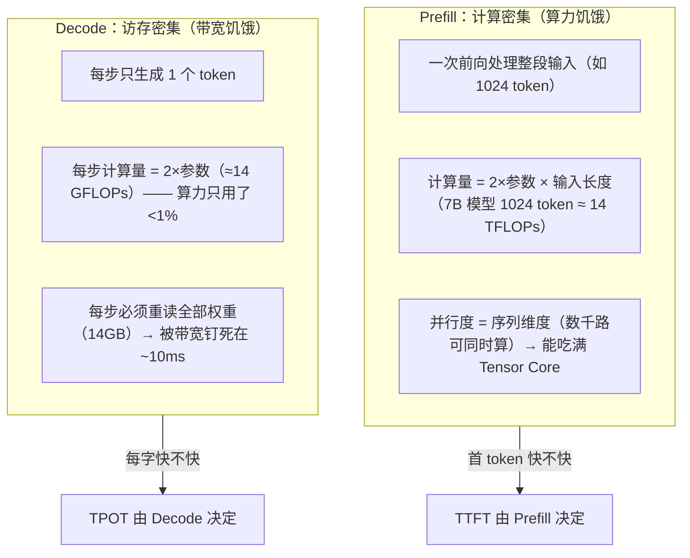
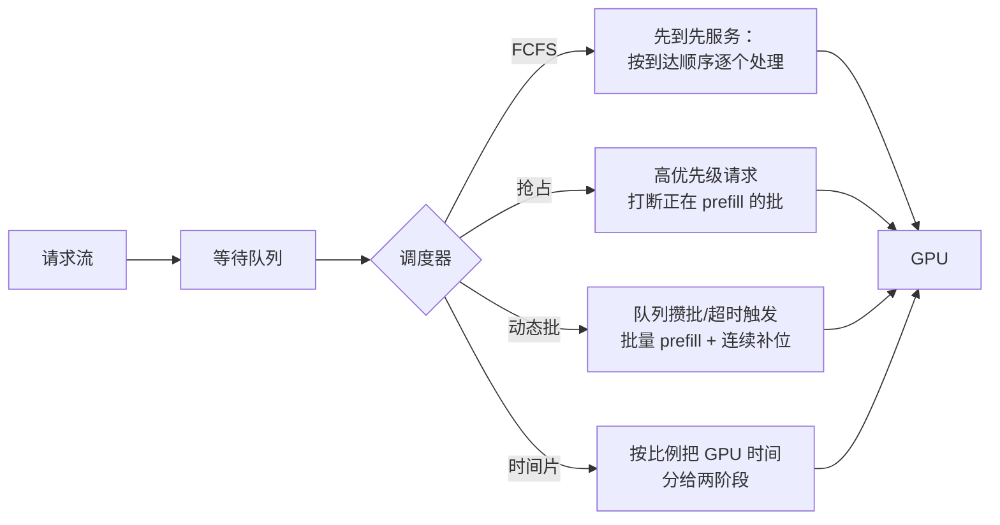
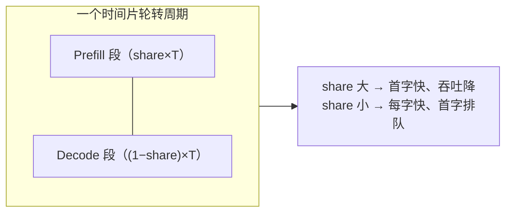

# Ch23：Prefill、Decode 与推理调度

> Ch21 讲批处理解决「带宽浪费」，Ch22 讲 KV Cache 解决「显存账本」，本章回到一个
> 更本质的问题：一次请求的两种阶段——**Prefill（输入处理）与 Decode（逐 token 生成）**——
> 对 GPU 资源的需求南辕北辙，调度器该怎么分配资源？为什么有的策略「首字快但总吞吐
> 低」，有的反过来？本章先量化两阶段特性，再实现一个简化调度模拟器，最后回答
> 「时间片在 Prefill 与 Decode 之间怎么分」。

## 学习目标

- 定量理解 Prefill 与 Decode 的资源特性差异：计算量、并行度、瓶颈类型（Roofline 视角）
- 理解调度器面对的三种基本策略：先来先服务（FCFS）、抢占（Preemption）、动态批（Dynamic Batching）
- 运行 `demos/ch23/main.py` 的简化调度模拟器，复现「批量 prefill 摊薄启动开销、TTFT 反而更低」
- 能解释 GPU 时间片分配（prefill_share）对吞吐 / TTFT / TPOT 的权衡，并理解最优比例随负载迁移
- 能说出「静态分配永远无法同时讨好两类负载」的结论，为 Ch25 PD 分离埋下伏笔

## 核心概念

### 1. 两阶段特性：宽问题 vs 窄问题

一次生成请求的两段，对 GPU 的需求完全不同：



| 特性 | Prefill | Decode |
|------|---------|--------|
| 计算量 | 大（2×params×输入长度） | 小（2×params） |
| 并行度 | 高（序列维度） | 低（单 token） |
| 瓶颈 | 算力（compute-bound） | 带宽（memory-bound） |
| 吞吐提升手段 | 批合并（拼算力） | 控制并发（带宽预算） |
| 用户感知 | TTFT | TPOT |

Demo 量化：7B 模型上，Prefill 的 1024 token 一次算 14 TFLOPs（~34ms）；
Decode 每步 14 GFLOPs 却要读 14GB 权重 → 步长 = max(0.01ms 算力, 7ms 带宽) = 7ms，
**算力利用率 0.2%**。

### 2. 调度策略全景

调度器是请求流与 GPU 资源之间的「红绿灯」：



| 策略 | 机制 | 优点 | 缺点 |
|------|------|------|------|
| FCFS | 请求按到达顺序逐个 prefill、再 decode | 公平、实现简单 | 无批合并，短输入 prefill 利用率低 |
| 抢占 | 新请求（或高优先级请求）打断当前 prefill 批 | TTFT 可控 | 被打断的批重算浪费 |
| 动态批 | 攒满 batch_size 或超时窗口触发批量 prefill | prefill 吞吐高 | 攒批延迟轻微抬高 TTFT |
| 时间片轮转 | 按比例把 GPU 时间分给 prefill/decode | 无饿死、可量化 | 比例静态、不随负载漂移 |

### 3. 批量 Prefill：为什么「拼批」比「单飞」快

Prefill 是计算密集的：一个短输入（如 128 token）的 prefill 只是一次小 GEMM，
**序列太短，GPU 并行度喂不饱**。把多个短输入拼成一个批，就拼出一片大算力。
代价是每批有固定启动开销（调度 + kernel launch + 显存分配），所以：

- FCFS 每个请求单独 prefill → 每请求付一次启动开销，吞吐 = 5000 tok/s（利用率 25%）
- 动态批最多 8 个一起 prefill → 开销摊薄到 1/8，吞吐 20000 tok/s 饱和

Demo 数据（40 请求，85% 短输入）：批量 prefill 让全部 prefill 完成时刻从 6.3s
提前到 1.7s（**3.8x**），平均 TTFT 从 2677ms 降到 570ms——攒批延迟被更快的
prefill 完全抵消。

### 4. 时间片分配：prefill_share 的天平

GPU 同一时刻只能干一件事（本课程模型里 prefill 与 decode 互斥）。调度器用
时间片比例 `prefill_share` 控制资源分配：



| prefill_share | 吞吐（decode 主导负载） | 平均 TTFT | 平均 TPOT | 解读 |
|---------------|----------------------|-----------|-----------|------|
| 0.1 | 高 | 4448ms（爆表） | 35.5ms | decode 拿大头，但 prefill 排队 |
| 0.3 | 较高 | 1255ms | 52.8ms | 折中 |
| 0.5 | 中 | 561ms | 55.3ms | 均衡 |
| 0.7 | 低 | 376ms | 56.3ms | prefill 抢戏，吞吐掉 3 成 |
| 0.9 | 很低 | 450ms | 56.9ms | 吞吐崩 6 倍 |

Demo 还扫描了 **prefill 主导负载**（长输入短输出）：最优 share 从 0.1 移到 0.3——
**最优分配比例随负载迁移，静态分配无法同时讨好两类负载**。这正是 Ch25
PD 分离架构要解决的矛盾。

## 关键代码

### 代码 1：简化调度模拟器核心（时间片模型）

```python
# 完整代码见 demos/ch23/main.py（可直接运行复现）
class PrefillDecodeSim:
    def __init__(self, requests, prefill_share=0.5, batch_mode="dynamic"):
        self.reqs = requests
        self.prefill_share = prefill_share        # GPU 时间片给 prefill 的比例
        self.batch_mode = batch_mode              # "single"(FCFS) / "dynamic"
        self.prefill_queue = deque()
        self.batch, self.batch_remain = [], 0.0
        self.decode = {}                          # 活跃 decode 请求
        self._decode_credit = 0.0

    def run(self):
        t, done_count = 0.0, 0
        while done_count < len(self.reqs):
            # 1) 到达 → prefill 队列
            while self.q < len(self.reqs) and self.reqs[self.q].arrival <= t:
                self.prefill_queue.append(self.reqs[self.q]); self.q += 1
            # 2) prefill：分到 prefill_share×DT 的时间
            if self.prefill_queue or self.batch:
                if not self.batch:
                    n = min(BATCH_CAP, len(self.prefill_queue)) if self.batch_mode == "dynamic" else 1
                    self.batch = [self.prefill_queue.popleft() for _ in range(n)]
                    self.batch_remain = FIXED_OH + sum(r.in_len for r in self.batch) / pref_speed(n)
                self.batch_remain -= self.prefill_share * DT
                if self.batch_remain <= 0:        # 完成 → 进 decode
                    for r in self.batch:
                        r.ttft = t - r.arrival
                        self.decode[r.req_id] = r
                    self.batch = []
            # 3) decode：分到 (1−prefill_share)×DT 的时间
            B = len(self.decode)
            if B > 0:
                step_dur = D_BASE * (1 + D_CONTENTION * (B - 1))   # 带宽争用
                self._decode_credit += (1 - self.prefill_share) * DT
                while self._decode_credit >= step_dur:
                    self._decode_credit -= step_dur
                    # 所有活跃请求 +1 token，完成的移除（记录 TPOT 样本）
            t += DT
        return summarize(self.reqs, t)
```

> 关键设计：**时间片轮转保证无饿死**——无论 prefill 队列多长，decode 每周期
> 都拿到 (1−share) 的时间；模型里 Decode 步长随并发数恶化
> `D_BASE × (1 + 0.15×(B−1))`，模拟带宽争用。

### 代码 2：两阶段特性量化

```python
# 7B 模型，H100（989 TFLOPS FP16，2 TB/s 带宽）
flops_per_tok = 2 * 7e9                      # 每 token 前向
pref_flops = 1024 * flops_per_tok            # Prefill 一次算整段输入
compute_ms = flops_per_tok / 989e12 * 1e3    # 算力耗时
bw_ms = 14e9 / 2e12 * 1e3                    # 带宽耗时（重读 14GB 权重）
print(f"Prefill={pref_flops/1e12:.0f}TFLOPs, Decode 步长=max({compute_ms:.2f}ms, {bw_ms:.0f}ms)")
```

### 代码 3：prefill_share 扫描

```python
# 完整扫描见 demos/ch23/main.py part3
for share in [0.1, 0.3, 0.5, 0.7, 0.9]:
    res = PrefillDecodeSim(fresh(reqs), prefill_share=share).run()
    print(share, res["tokens_s"], res["avg_ttft_ms"], res["avg_tpot_ms"])
```

## 课堂练习

### ⭐ 基础：手推时间片权衡

给定 decode 主导负载（总 prefill 工作量 0.8s、总 decode 工作量 28.8s）：
1. prefill_share=0.5 与 0.2 时，理论总耗时分别是多少（忽略争用）？
2. 为什么 prefill 工作量只有 0.8s 时，把 share 开到 0.5 反而总耗时翻倍？
3. 用 Demo 的负载 A 复现并验证你的推导。

### ⭐⭐ 进阶：给模拟器加「抢占」策略

当前 `PrefillDecodeSim` 是时间片轮转（无抢占）。给它加一个抢占开关：
- 当 prefill 队列长度超过阈值（如 8）时，立即中止当前 prefill 批，把已完成进度
  记录在批对象上（断点续跑），先让 decode 走 N 步再恢复
- 对比「时间片轮转」vs「抢占式」在突发请求（50 个请求瞬间到达）下的 TTFT P95 与吞吐
提示：断点续跑需要在 batch 上记录 `done_tokens_sum`，恢复时减去即可。

### ⭐⭐⭐ 挑战：实现「等待窗口」自适应批

生产系统的动态批用「攒满 OR 超时」触发，避免空闲期无限等待：
1. 实现 `window_ms` 参数：队列首个请求等待超过 window_ms 就立即启动当前批
2. 扫描 window_ms ∈ {0, 20, 50, 100, 500}ms，观察平均 TTFT 与吞吐：
   窗口越小 TTFT 越低但批越碎（启动开销多）；窗口越大批越整但首字越慢
3. 找到「吞吐 ≥ 某阈值 且 TTFT ≤ 某阈值」的窗口区间，解释窗口与
   prefill_share 两个旋钮各自该调谁

## 常见问题 Q&A

**Q1：为什么说 Decode 是访存密集？它明明也有矩阵乘法？**
A：Decode 每步的 GEMM 很小（1 个 token × 全权重），算力上只花 ~0.01ms；
但这一步要先把全部权重从 HBM 搬进寄存器（14GB），带宽 2TB/s → 7ms。7ms ≫ 0.01ms，
瓶颈是「搬权重」而不是「算」。这正是 Roofline 模型（Ch03）的判据：算术强度
= FLOPs/字节 远低于转折点 → memory-bound。

**Q2：FCFS 逐个 prefill 为什么 TTFT 反而比批量 prefill 高？**
A：直觉上「先到先服务、到了就做」应该更快，但别忘了 GPU 一次只能干一件事：
逐个 prefill 时每个短输入只喂饱 25% 算力，prefill 总时长被拉长 4 倍，
后到的请求排队更久。批量 prefill 虽然要等批凑齐（最多攒批窗口），但每批吞吐
高 4 倍，排队反而更短。**批调度的收益 = 算力利用率提升 vs 攒批延迟的净差值**，
Demo 中净收益为正（TTFT 2677ms → 570ms）。

**Q3：prefill_share 应该谁来决定？**
A：理论上由负载的输入/输出比决定：输入越长越该多分 prefill。工程上有三条路：
① 静态配置——按历史负载标定，简单但怕漂移；② 动态调节——实时统计排队长度
与 TPOT，PID 式调节 share；③ 彻底解耦——让 Prefill 和 Decode 各占一个 GPU 池
（Ch25 PD 分离），不再共享时间片。前两者是「分蛋糕」，第三者是把蛋糕切开，
各管各的——这也是工业界从 vLLM 走向 DistServe/SGLang PD 分离的原因。

## 小结

| 要点 | 说明 |
|------|------|
| Prefill 特性 | 计算密集、并行度高、算力饥饿，决定 TTFT |
| Decode 特性 | 访存密集、并行度低、带宽饥饿，决定 TPOT |
| FCFS | 公平但短输入利用率低，批量 prefill 是吞吐钥匙 |
| 抢占 | 中断当前批保证关键请求 TTFT，代价是重算与复杂性 |
| 动态批 | 攒批/超时触发，摊薄启动开销，TTFT 反而更低 |
| 时间片分配 | prefill_share 越大首字越快、吞吐越低；最优值随负载迁移 |
| 关键结论 | 静态分配无法同时讨好两类负载 → PD 分离是出路 |

## 下一章预告

Prefill 与 Decode 的资源矛盾要到 Ch25 才真正解法，但 Ch24 先解决另一个瓶颈：
**自回归的串行步长**——每步只能出一个 token，算力大量闲置。推测解码
（Speculative Decoding）用小模型提前「猜」未来的 token，大模型一次性并行验证，
理论上能把单流生成提速 2~3 倍。下一章我们将推导它的加速比公式并用 numpy 模拟验证。
