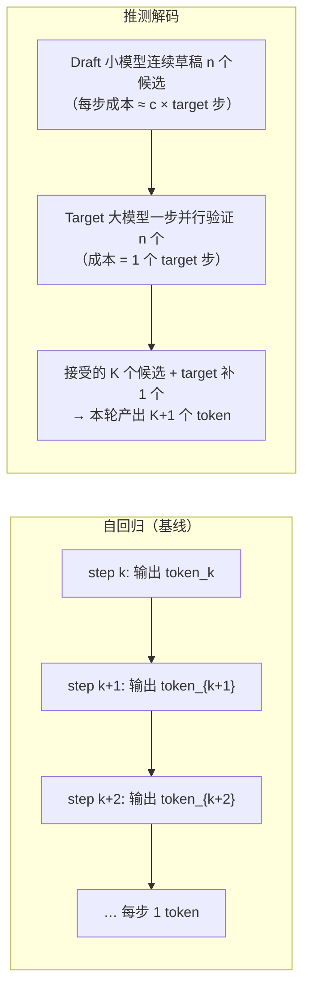
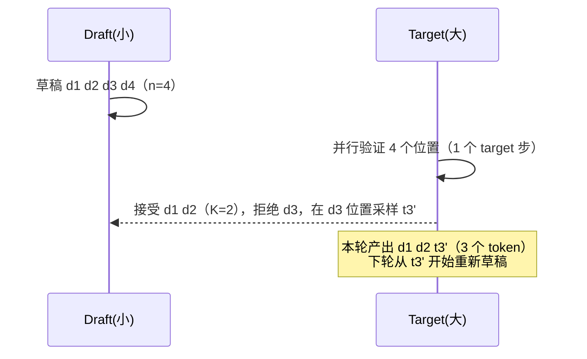

# Ch24：推测解码与生成加速

> Ch21-23 讲的是「让 GPU 同时服务更多请求」（批维度），本章换一个维度：
> **让单个请求走得更快**。自回归生成每步只能出一个 token，算力大量闲置——
> 推测解码（Speculative Decoding）用一个小而快的 Draft 模型提前「猜」出未来
> n 个 token，再用大模型一次性并行验证，把「一步一 token」变成「一步多 token」。
> 本章推导加速比公式，并用 numpy 蒙特卡洛模拟验证。

## 学习目标

- 理解自回归生成的串行瓶颈：为什么 decode 阶段 GPU 算力利用率不到 1%
- 掌握推测解码的两阶段流水：Draft 草稿（n 个候选）→ Target 并行验证
- 能推导并说出期望产出公式 `E[N] = (1 − α^(n+1)) / (1 − α)` 的由来
- 掌握加速比公式 `加速比 = E[N] / (1 + n·c)` 及工程简化式，能解释接受率 α、
  草稿长度 n、代价比 c 三者的作用方向
- 运行 `demos/ch24/main.py`，用蒙特卡洛验证公式并找到工程上划算的 (n, α) 组合

## 核心概念

### 1. 自回归瓶颈：一步一个 token 的代价



| 对比 | 每轮步数 | 每轮产出 | 算力利用 |
|------|---------|---------|---------|
| 自回归 | 1 步 | 1 token | <1%（每步只算 1 token） |
| 推测解码 | 1 验证 + n 草稿 | K+1 个 token（K ≤ n） | 验证步吃满并行度 |

**直觉**：decode 每步算力只用了 0.2%（Ch23 已算），多出来的算力「借」给一个
小 draft 模型白赚候选 token。Draft 模型通常是 target 的 1/10~1/100 大小、
共享 tokenizer 与部分层，与 target 分布越接近，接受率越高。

### 2. 草稿-验证协议

1. **草稿**：Draft 模型以当前序列为条件，连续自回归生成 n 个候选 token
2. **验证**：Target 模型对「当前序列 + n 个候选」做一次前向，并行计算每个候选
   位置的目标分布，从前往后检查候选是否落在 target 的 top-p 采样集内（或
   等价于概率匹配采样）
3. **接受**：连续接受的最长前缀 K 个候选直接输出；第一个被拒绝的位置由 target
   重新采样一个 token 补上；本轮产出 K+1 个 token
4. **回退**：新序列 = 旧序列 + 接受的 K+1 个 token，下一轮以它为条件重新草稿



> 关键正确性保证：**拒绝回退保证输出分布与 target 完全一致**——推测解码是
> 无损加速（对采样分布而言），不是近似方法。这是它与「早停/近似采样」的本质区别。

### 3. 加速比公式的推导

设：
- α = 每个草稿 token 被 target 接受的**独立概率**（接受率，0<α<1）
- n = 草稿长度
- c = draft 单步代价 / target 单步代价（c 通常 0.01~0.1）

**第一步：每轮期望产出 token 数。**

令随机变量 N = 每轮产出 token 数。N = K + 1，其中 K 为连续接受数。
事件「至少连续接受 k 个」的概率（逐 token 独立近似）为 α^k，于是：

```
E[N] = Σ_{k=0}^{n} P(N > k)
     = Σ_{k=0}^{n} α^k
     = (1 − α^(n+1)) / (1 − α)          （等比数列求和）
```

**第二步：每轮成本。**

每轮 = n 次 draft 前向 + 1 次 target 验证 = n·c + 1（target 当量步）。

**第三步：加速比。**

```
加速比 = E[N] / (1 + n·c)
```

- α→1（全接受）：E[N]→n+1，加速比→(n+1)/(1+n·c)；c→0 时→n+1（理想上限）
- α→0（全拒绝）：E[N]→1，加速比→1/(1+n·c)<1 —— **α 太低还不如不推测**

**工程简化公式**（预算估算用，偏保守）：

每 token 期望成本 = α·(1/n) + (1−α)·1（接受则把验证步摊到 n 个候选上，
拒绝则整步 target 白做、还要 target 补 1 个）：

```
加速比 ≈ 1 / (α/n + (1 − α))
      ≡ 1 / (β + (1−β)/n)      （记拒绝率 β = 1−α）
```

> 两种写法等价：**若 γ 表示接受率用 `1/(α/n + (1−α))`；若 γ 表示拒绝率则用
> `1/(γ + (1−γ)/n)`**。注意把 γ 的语义说清楚，否则方向会反。

| α | n | 精确公式 E[N] | 简化公式 | 模拟（c=0） |
|---|---|---:|---:|---:|
| 0.5 | 4 | 1.94 | 1.60 | 1.94 |
| 0.8 | 4 | 3.36 | 2.50 | 3.38 |
| 0.9 | 4 | 4.10 | 3.08 | 4.10 |
| 0.95 | 8 | 7.40 | 5.93 | 7.40 |

模拟与精确公式一致（误差 <0.5%）；简化公式略保守，作为工程预算安全。

### 4. Draft 代价：加速比的第一杀手

| c（draft/target 代价比） | 加速比（α=0.8, n=4, E[N]=3.36） |
|---|---:|
| 0.00（draft 免费） | 3.36x |
| 0.05 | 2.80x |
| 0.10 | 2.40x |
| 0.25 | 1.68x |
| 0.50 | 1.12x |

结论：**draft 必须又小又快**。工程约束：
- draft 大小：target 的 1/10 左右（或用 target 的浅层子网络）
- 关键实现技巧：draft 共享 target 的 KV Cache 或使用并行解码（如 Medusa 的
  多头预测），避免草稿阶段重复算 KV
- 还有「草稿验证无损性」要求：target 的采样逻辑必须严格复现，否则输出分布漂移

## 关键代码

### 代码 1：期望产出公式与蒙特卡洛验证（可直接复制使用）

```python
# 运行方式：python demos/ch24/main.py
import numpy as np

def exact_expected_tokens(alpha, n):
    """E[N] = (1 − α^(n+1)) / (1 − α)。"""
    return (1 - alpha ** (n + 1)) / (1 - alpha) if alpha < 1 else (n + 1)

def sim_expected_tokens(alpha, n, rounds=40000, seed=0):
    """蒙特卡洛：每轮生成 n 个伯努利(α)，取第一个 0 前的连续 1 数 K，产出 K+1。"""
    rng = np.random.default_rng(seed)
    accept = rng.random((rounds, n)) < alpha
    pref = np.cumprod(accept.astype(int), axis=1)      # 前缀全 1 才为 1
    return pref.sum(axis=1).mean() + 1.0

for a, n in [(0.8, 4), (0.9, 8)]:
    print(a, n, sim_expected_tokens(a, n), exact_expected_tokens(a, n))
```

### 代码 2：加速比与代价折算

```python
def speedup(alpha, n, c):
    return exact_expected_tokens(alpha, n) / (1 + n * c)

print(speedup(0.8, 4, 0.0))    # 3.36x
print(speedup(0.8, 4, 0.1))    # 2.40x
print(speedup(0.8, 4, 0.5))    # 1.12x
```

### 代码 3：草稿长度扫描（找最划算的 n）

```python
for n in [1, 2, 4, 8, 16]:
    e = exact_expected_tokens(0.75, n)
    print(n, f"{e:.2f}", f"{e/(1+n*0.05):.2f}", f"{e/(1+n*0.1):.2f}")
# n=4 附近收益开始放缓；n≥8 后被 draft 代价拖累，加速比回落
```

## 课堂练习

### ⭐ 基础：套公式算三组配置

用精确公式与简化公式分别计算：
1. α=0.7, n=4, c=0 → 加速比？
2. α=0.9, n=8, c=0.1 → 加速比？（注意 n·c=0.8 的侵蚀）
3. α=0.5, n=8, c=0 → 加速比？对比 α=0.9 的 n=8，说明接受率为什么是第一要素
用 `demos/ch24/main.py` 的蒙特卡洛验证第 2 组。

### ⭐⭐ 进阶：推导「最优草稿长度」的边界

对固定 α=0.8，用 `speedup(α, n, c)` 扫描 n ∈ {1..32}：
1. c=0 时加速比随 n 单调递增吗？增长趋势是什么形状（1+α+α²+… 的尾巴）？
2. c=0.1 与 c=0.2 时，加速比的峰值分别出现在 n=几？为什么 c 越大最优 n 越小？
3. 用数值结果说明「草稿长度不是越长越好」，并给出你所在场景（α≈0.8, c≈0.1）
   的建议 n。

### ⭐⭐⭐ 挑战：实现带拒绝回退的端到端模拟

把 `sim_expected_tokens` 扩展成完整的生成模拟：
- 目标：生成固定长度 L=2000 的序列，draft 每轮草稿 n=4
- 用两个预先定好的「伪分布」模拟 draft 与 target（如 draft 是 target 的
  截断/近似分布，接受率通过两者 KL 距离反推）
- 每轮：草稿 → 并行验证（1 步）→ 接受 K 个 → 从第 K+1 位重新草稿
- 统计：总步数 vs 基线（L 步），得到实测加速比；与公式 `E[N]/(1+n·c)` 对比
- 附加题：记录每一轮实际接受数 K 的分布，验证它服从截断几何分布
  P(K=k)=(1−α)α^k（k<n）

## 常见问题 Q&A

**Q1：推测解码会改变模型输出吗？**
A：不会（对采样分布而言）。验证步严格按 target 的分布采样：被接受的候选必须
落在 target 的 top-p 集合内，被拒绝的位置用 target 重新采样补足——最终输出序列
的分布与纯 target 自回归**逐 token 等价**。这也是它被称为「无损加速」的原因。
实现时必须保证 target 的采样逻辑（温度、top-p、随机种子）在验证步与自回归步
完全一致。

**Q2：接受率 α 怎么测？为什么有时候很低？**
A：α 是 draft 与 target 分布相似度的直接度量。工程上先离线采样一批 prompt，
统计 draft 候选被 target 接受的比例。α 低的原因：① draft 模型太小，分布偏离大；
② 推理/数学等「强约束」任务，target 的高概率 token 很集中，draft 猜不中；
③ 采样温度过低（贪心解码）时接受率天然下降。α < 0.6 时建议考虑
Medusa/多头预测等「同一模型自预测」方案。

**Q3：推测解码和 KV Cache / Batching 能叠加吗？**
A：能，且必须叠加才能在生产落地。推测解码收益在单流；连续批的收益在多流
并发——两者正交。但要注意：验证步要一次处理 n 个位置的并行注意力，对 KV Cache
的访问模式与普通 decode 不同；vLLM 把推测解码实现为「token 流水线」融入
Continuous Batching 的调度循环。工程上通常先上 Continuous Batching 拿吞吐，
再在单流延迟敏感的场景（如流式聊天首字后的体验）叠加推测解码。

## 小结

| 要点 | 说明 |
|------|------|
| 串行瓶颈 | 自回归每步 1 token、算力利用率 <1%，多余算力可借给 draft |
| 草稿-验证 | Draft 草稿 n 个 → Target 并行验证 → 接受 K+1 个，拒绝即回退 |
| 无损性 | 拒绝回退保证输出分布与纯 target 逐 token 等价 |
| 期望产出 | E[N] = (1 − α^(n+1))/(1 − α)，等比求和得来 |
| 加速比 | E[N] / (1 + n·c)；α 决定分子，c 决定分母的侵蚀 |
| 工程简化式 | 1/(α/n + (1−α))，或记拒绝率 β 为 1/(β + (1−β)/n) |
| 最优 n | 随 c 增大而减小，常见 n=4~8；draft 必须又小又快 |

## 下一章预告

推测解码解决「单请求走多快」，Ch25 回到 Ch23 留下的调度矛盾并给出根治方案：
**Prefill/Decode 分离（PD Disaggregation）**——让 Prefill 和 Decode 各占一个
GPU 池，中间用 KV 迁移衔接。我们将模拟「合设 vs 分离」在混合负载下的吞吐与时延，
看到分离架构如何让 TPOT 稳定、吞吐提升，以及它付出的 KV 迁移代价。
