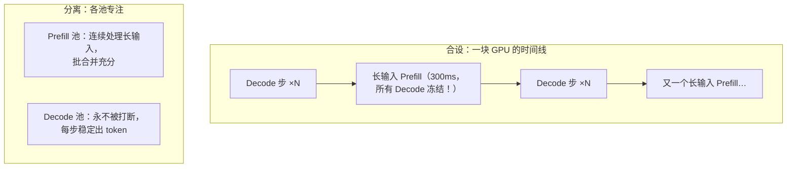
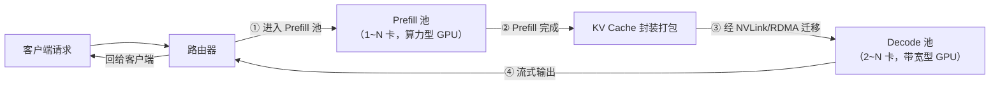
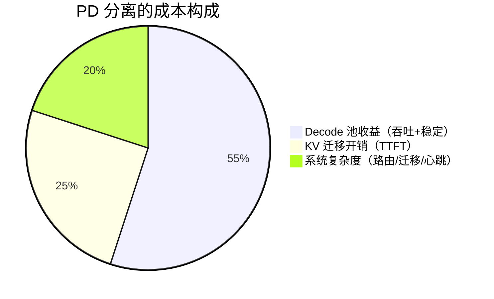

# Ch25：Prefill/Decode 分离架构

> Ch23 的结尾留下一个死结：Prefill 想吃算力、Decode 想吃带宽，共用一块 GPU 只能
> 用时间片「分蛋糕」，而最优比例随负载漂移、静态配置永远顾此失彼。本章给出
> 工业界的根治方案——**PD 分离（Prefill/Decode Disaggregation）**：把 Prefill 和
> Decode 拆到不同的 GPU 池，用 KV Cache 迁移衔接。先讲动机与架构，再用自实现
> 调度模拟对比「合设 vs 分离」的吞吐、TTFT、TPOT 与稳定性。

## 学习目标

- 说清 PD 分离的动机：两阶段资源特性冲突、合设下 Decode 被 Prefill 打断的机理
- 画出 PD 分离的架构：Prefill 池 + Decode 池 + 路由 + KV 迁移，讲清请求生命周期
- 运行 `demos/ch25/main.py` 复现「分离比合设吞吐高约 1.5x、TPOT 更稳定、TTFT 略增」
- 理解 KV 迁移的量化代价（2·L·kv_heads·head_dim·in_len·dtype / 带宽），能估算迁移时延
- 能说出 PD 分离的优缺点与适用边界，以及它与 Ch21 连续批、Ch24 推测解码的叠加关系

## 核心概念

### 1. 动机：合设的 Decode 为什么总被打断

合设（co-located）架构下，每块 GPU 同时承担 Prefill 与 Decode。长输入的
Prefill 是一次大计算（几十 TFLOPs、耗时数百 ms），期间同卡的所有 Decode
请求被迫停顿：



| 合设的痛点 | 表现 | 根因 |
|-----------|------|------|
| Decode 被 prefill 冻结 | TPOT 抖动（P95/P50 高）、流式体验差 | 同一 GPU 时间互斥 |
| Prefill 碎片化 | 批合并不充分，短输入利用率低 | 每卡请求被 round-robin 打散 |
| 容量规划困难 | 加卡不知道是加给谁 | 两阶段共享池，无法独立伸缩 |

### 2. 架构：两个池 + 一个路由器 + KV 迁移



请求生命周期：
1. 到达 → 路由器送入 **Prefill 池**（按输入长度、池负载均衡）
2. Prefill 池一次性处理整段输入，产出首 token 与**全量 KV Cache**
3. KV Cache 被序列化并通过高速互联（NVLink ~50-100GB/s 有效）迁往 **Decode 池**
4. Decode 池逐 token 生成，把 token 流式回给客户端；生成结束释放 KV

| 组件 | 职责 | 关键设计 |
|------|------|---------|
| 路由器 | 请求分流、池间调度 | 按池负载、池间 KV 热度感知 |
| Prefill 池 | 批合并最大化 prefill 吞吐 | 集中攒批、chunked prefill 控首字 |
| KV 迁移 | 跨池搬运缓存 | 边 prefill 边传输（流水线）压缩时延 |
| Decode 池 | 稳定 decode、按并发上限扩容 | 永不被打断，TPOT 可控 |

### 3. KV 迁移的代价

KV 大小 = `2·L·kv_heads·head_dim·in_len·dtype`（注意：这里用**输入长度**，
因为 prefill 结束时缓存的正是整段输入 + 首 token 的 KV）。

| 输入长度 | KV 大小（L32, GQA8, dim128, FP16） | 迁移时延（50GB/s） |
|---------|-----------------------------------|-------------------|
| 512 | 67 MB | 1.3 ms |
| 2048 | 268 MB | 5.4 ms |
| 4096 | 537 MB | 10.7 ms |

迁移时延直接计入 TTFT。工程对策：
- **流水线重叠**：KV 按层/按块边 prefill 边传，首块就绪即可开始 decode
- **高带宽互联**：同机 NVLink 就近迁移；跨机用 RDMA（时延更高，池间尽量同机）
- **前缀共享**：prompt 前缀相同的请求在 Prefill 池直接复用已缓存 KV（前缀缓存）

### 4. 分离架构的收益与代价

Demo 数据（48 个混合请求，60% 聊天型 + 40% 文档型，3 块 GPU）：

| 指标 | 合设（3 卡时间片） | PD 分离（1 Prefill + 2 Decode） | 差异 |
|------|------------------|-------------------------------|------|
| 总耗时 | 8.6s | 5.9s | 分离快 31% |
| 吞吐（tok/s） | 6820 | 9930 | **+1.46x** |
| TTFT 平均 | 192ms | 344ms | 分离 +152ms（KV 迁移） |
| TPOT P50 | 48.0ms | 34.0ms | 分离更快 |
| TPOT P95/P50 | 1.52 | 1.29 | **分离更稳定** |
| 平均完成时延 | 5504ms | 3682ms | 分离低 33% |

> 关键观察：**分离不是免费午餐**——TTFT 因 KV 迁移变高，但吞吐、TPOT、稳定性
> 全面占优。对「TTFT 不敏感、TPOT/吞吐敏感」的离线/高并发场景收益巨大；
> 对「首字极敏感」的交互场景要用流水线重叠把迁移藏进 prefill。



## 关键代码

### 代码 1：合设 GPU（时间片轮转）核心逻辑

```python
# 完整模拟见 demos/ch25/main.py（可直接运行）
class GpuUnit:
    def __init__(self, role):                # "both" / "prefill" / "decode"
        self.role = role
        self.prefill_queue = deque()
        self.batch, self.batch_remain = None, 0.0
        self.decode = {}                     # req_id -> Req
        self.acc = 0.0
        self.mode = "decode"
        self.slice_left = SLICE_S            # 时间片 20ms

    def decode_step(self, t):
        B = len(self.decode)
        if B == 0:
            self.acc = 0.0
            return 0
        step_dur = D_BASE * (1 + D_CONT * (B - 1))   # 带宽争用
        self.acc += DT
        if self.acc < step_dur:
            return 0
        self.acc -= step_dur
        for rid, r in list(self.decode.items()):     # 每请求 +1 token
            r.completion_times.append(t)
            r.out_len -= 1
            if r.out_len == 0:
                del self.decode[rid]
        return len(...)  # 完成数
```

### 代码 2：合设与分离的调度主循环

```python
def run_colocated(reqs, n_gpus=3):
    gpus = [GpuUnit("both") for _ in range(n_gpus)]
    while done < len(reqs):
        # 到达 → 轮转分卡
        gpus[reqs[qi].req_id % n_gpus].prefill_queue.append(reqs[qi])
        for gpu in gpus:
            gpu.slice_left -= DT
            if gpu.slice_left <= 0:            # 时间片到点，切换模式
                gpu.mode = "decode" if gpu.mode == "prefill" else "prefill"
                gpu.slice_left = SLICE_S
            if gpu.mode == "prefill":
                gpu.try_start_batch()
                for r in gpu.advance_prefill(DT):   # 完成 → 同卡 decode
                    gpu.decode[r.req_id] = r
            else:
                done += gpu.decode_step(t)

def run_disaggregated(reqs, n_prefill=1, n_decode=2):
    pref = [GpuUnit("prefill") for _ in range(n_prefill)]
    dec  = [GpuUnit("decode")  for _ in range(n_decode)]
    transfer = []                                # (ready_time, req)
    # prefill 完成 → 计算 KV 迁移时延 → 到期后进入 decode 池
    ttr = kv_bytes_for(r.in_len) / TRANSFER_BW
    transfer.append((t + ttr, r))
```

### 代码 3：KV 迁移字节数与时延

```python
def kv_bytes_for(in_len, L=32, kv_heads=8, head_dim=128):
    return 2 * L * kv_heads * head_dim * in_len * 2.0   # FP16

print(kv_bytes_for(3000) / 1e6, "MB")     # 393 MB
print(kv_bytes_for(3000) / 50e9 * 1e3, "ms")  # 7.9 ms @ 50GB/s
```

## 课堂练习

### ⭐ 基础：手算 KV 迁移时延

对 L=32、GQA8、head_dim=128、FP16 的模型：
1. 输入 2048 token 的 KV 大小与 50GB/s 下的迁移时延
2. 若把 KV 量化成 FP8，时延减半吗？（提示：字节数减半）
3. 若 Decode 池每 token 生成 10ms，迁移 5.4ms 占单请求总时延（64 token）的多少比例？
用 `demos/ch25/main.py` 的 `kv_bytes_for` 验证。

### ⭐⭐ 进阶：扫描分离池比例

修改 `run_disaggregated` 的 `n_prefill/n_decode`（总卡数保持 3）：
1. 1+2（本章默认）、2+1、以及尝试 4 卡下的 1+3 / 2+2 / 3+1
2. 记录各配置的吞吐、TTFT、TPOT，解释为什么聊天型负载偏爱 decode 池更大
3. 引入一个「负载漂移」场景（模拟到一半突然全是短问答），观察静态比例的失效
   ——并说明生产上为什么需要池间弹性（Burst 调度或池内混部）

### ⭐⭐⭐ 挑战：实现「边 prefill 边迁移」的流水线

当前 Demo 是 prefill 全部完成才传输（TTFT 含完整迁移时延）。真实系统把 KV
切成块、边 prefill 边传：
1. 把 KV 按层切成 N 片（如 8 片），prefill 完成第 i 片就开始传第 i 片
2. 迁移结束 = max(prefill 完成, 最后一片传完)；首片到达即可让 decode 先跑
3. 对比「串行迁移」vs「流水线迁移」的 TTFT 与总耗时（流水线应显著压低 TTFT）
4. 讨论：KV 片数越多首字越快，但调度/握手开销越大——找到平衡点

## 常见问题 Q&A

**Q1：PD 分离和 Ch21 的 Continuous Batching 冲突吗？**
A：不冲突，是两层优化。Continuous Batching 解决「单池内的并发调度」——Decode 池
内部照样用连续批；PD 分离解决「池间的资源切分」——不再用时间片抢一块 GPU。
工业界（vLLM、SGLang、DistServe）的路线是：**每池内 Continuous Batching +
池间 PD 分离 + 单流推测解码**，三层叠加。

**Q2：分离后 TTFT 变高了，交互场景怎么办？**
A：TTFT 增量 = KV 迁移时延，必须用三种手段压下去：① 流水线迁移（边 prefill
边传，见挑战练习）；② 就近放置（Prefill 池与 Decode 池同机柜，NVLink 而非 RDMA）；
③ chunked prefill——把 prefill 切成块，第一块算完就能出首 token 并同时开始传输。
当迁移时延被藏进 prefill 后，分离的 TTFT 可做到与合设基本持平，而 TPOT 与吞吐
的收益保留。

**Q3：什么时候不该用 PD 分离？**
A：① 请求量小（几路并发）时，分离的调度/迁移固定开销占比过高，不如合设；
② KV 巨大的长上下文场景，迁移带宽成为新瓶颈（可用「prefill 与 decode 共享
KV 的 mixed 部署」过渡）；③ 对首字时延要求极苛刻的实时场景，需先验证迁移
流水线是否满足 SLO。判断标准一句话：**当 Decode 是吞吐瓶颈且请求量足够大时，
分离才划算**——这也是为什么它被大厂在线推理广泛采用而小规模服务未必。

## 小结

| 要点 | 说明 |
|------|------|
| 分离动机 | 两阶段资源冲突，合设下 Decode 被 Prefill 冻结，TPOT 抖动 |
| 架构 | 路由 → Prefill 池（算力型）→ KV 迁移 → Decode 池（带宽型） |
| KV 迁移 | 大小 = 2·L·kv_heads·head_dim·in_len·dtype，时延 = 大小/带宽 |
| 收益 | 吞吐 +1.46x、TPOT 更低且稳定（P95/P50 1.52→1.29） |
| 代价 | TTFT 增（迁移时延）、池比例静态、系统复杂度上升 |
| 优化叠加 | 池内连续批 + 池间 PD 分离 + 单流推测解码，三层独立可叠加 |
| 适用边界 | Decode 为瓶颈且请求量大才划算；长上下文/极低首字场景需谨慎 |

## 下一章预告

PD 分离解决「服务怎么组织」，MoE 解决「模型本身怎么更省」：把 FFN 拆成 N 个专家、
token 按需路由到 top-k，用稀疏计算把「算力×参数量」的解耦做到极致。Ch26 将讲
MoE 的结构与 Router、专家并行（EP）的通信代价、负载均衡 aux loss，以及为什么
MoE 是当前大模型性价比的终局答案——最后用路由模拟看 token 是怎么被分赃不均的。
