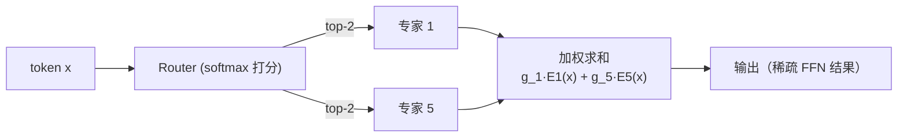
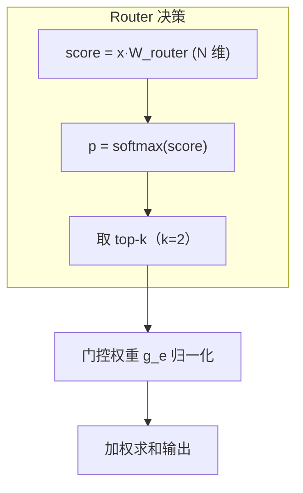
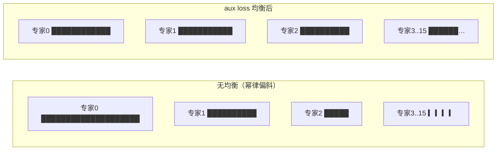
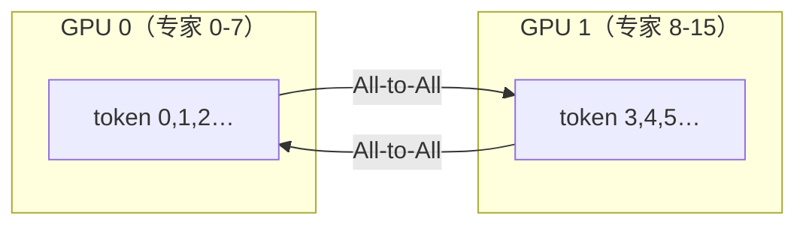

# Ch26：MoE 模型的训练与推理优化

> 前面 5 章都在讲「让已有模型跑得更快」，本章讲「让模型本身更省」——**MoE
> （Mixture of Experts，混合专家）**。把 FFN 层替换成 N 个并行专家，Router 把每个
> token 路由到 top-k 个专家，用稀疏计算把「参数量」和「激活计算量」解耦：
> 参数翻 8 倍，每 token 只算 1/4 的专家。DeepSeek、Mixtral、Qwen-MoE 等
> 最前沿模型全部靠它把性价比拉满。本章讲清结构、训练、推理三条线，
> 并用路由模拟看负载不均衡的真相。

## 学习目标

- 理解 MoE 的结构：Dense FFN → N 个专家 + Router，top-k 路由的机制与计算量账本
- 理解专家并行（EP）的动机与代价：每 token 的 All-to-All 通信量与跨卡路由
- 理解负载不均衡问题与 aux loss 的数学形式，能运行路由模拟复现「均衡后丢 token 减半」
- 理解 MoE 推理的独特开销：token 路由、专家显存（all experts in memory）、容量因子
- 能说出 MoE 训练的关键点：路由的冷启动、aux loss 系数、EP 下的通信重叠

## 核心概念

### 1. MoE 结构：算力与参数的解耦

传统 Dense 模型的 FFN：每个 token 都要过同一个 FFN（激活计算量 = 2×参数量）。
MoE 把 FFN 复制成 N 份（专家），Router 为每个 token 选 top-k 个专家：



| 对比 | Dense FFN | MoE（N=8, top-2） |
|------|-----------|-------------------|
| 参数量 | P | 8P（全部常驻显存） |
| 每 token 激活计算量 | 2P | 2×2×P（只算 2 个专家） |
| 计算/参数比 | 1 | 1/4（参数利用率降低，但性价比提升） |
| 每 token 显存读取 | 全部权重 | 被路由的 2 个专家权重（访存减 4 倍） |

> 关键认知：MoE 用「显存换计算」——所有专家都占显存（8 倍参数），但每个 token
> 只激活 k/N 的计算与访存。训练时 batch 很大、各路 token 各找各的专家 → GPU
> 算力被填满；推理时 decode 每 token 只读被选中的专家 → 访存压力也按 k/N 下降。
> 这就是「MoE 同时赢训练与推理」的数学基础。

### 2. Router 与 top-k 路由

Router 是 MoE 的「交通警察」，输出每个专家被选中的概率分布：

- 打分：`score_e = x · W_router`（线性层），对 N 个专家打分
- 归一化：`p_e = softmax(score)_e`，得到选择概率
- 选路：取概率最高的 k 个专家（top-k），输出 `Σ_{e∈top-k} g_e·E_e(x)`，
  其中门控权重 `g_e = p_e / Σ_{e∈top-k} p_e`（归一化保证总和为 1）



| 超参数 | 作用 | 典型值 | 调大/调小的影响 |
|--------|------|--------|----------------|
| N（专家数） | 参数量与容量 | 8/16/64 | 越大越强，显存与通信越贵 |
| k（top-k） | 每 token 激活专家数 | 1/2 | k=1 最省但表达弱，k=2 平衡 |
| capacity factor | 专家容量 = C×(T·k/N) | 1.0~1.5 | 越小越省但丢 token 越多 |

### 3. 负载不均衡：路由的自然倾向

真实语料里 token 分布高度偏斜：某些「专家」几乎人人要（泛化 token），
另一些门可罗雀。若不干预：

- 热门专家超载：超过容量因子后被 drop（token 信息丢失）或排队
- 冷门专家闲置：参数占显存、算力空转
- 训练时反向传播倾斜，热门专家过拟合、冷门专家欠训练



**aux loss（辅助负载均衡损失）**的经典形式（GShard / Switch Transformer）：

```
L_aux = α · N · Σ_{e=1}^{N} f_e · P_e
```

- `f_e` = 被路由到专家 e 的 token 占比（真实使用率）
- `P_e` = 所有 token 对专家 e 的平均 router 概率（期望使用率）
- 当某个专家「被选得多（f_e 大）且概率高（P_e 大）」时损失变大 → 梯度把路由
  概率拉向均匀；α 通常 0.01~0.1，避免喧宾夺主压坏主任务损失

Demo 模拟（16 专家、20k token、top-2、幂律偏斜）：原始路由 max/avg 负载比
6.41、容量 1.0 时丢 token 55%；aux loss 均衡后负载比降到 3.78、丢 token 36%——
**热门专家的爆满明显缓解**。真实系统里还要配合 capacity factor 与 token
drop+residual 策略兜底。

### 4. 专家并行（EP）与 All-to-All 通信

EP 把 N 个专家分到 P 张卡上。问题是：**token 的路由是全局的**——卡 A 上的
token 可能被路由到卡 B 上的专家。于是每个 transformer 层都要做一次
**All-to-All 全交换**：



| 通信项 | 量级 | 说明 |
|--------|------|------|
| 每 token 发送激活 | hidden × dtype（如 4096×2B = 8KB） | 每个被路由的专家一份 |
| 单层通信量 | T×k×(1−1/P)×hidden×dtype | 跨卡部分才需要传输 |
| 每层两次 | 专家 FFN 前传 + 结果回传 | 一次前向两次 All-to-All |

Demo 估算：64 专家 / 8 卡、8192 token、top-2，单层通信 ≈ 14336 token × 8KB ≈
0.1GB——NVLink 下不到 1ms，跨机 RDMA（25GB/s）则要 ~5ms，成为吞吐瓶颈。
**工程对策**：专家按层切分并尽量放同机（NVLink）、路由局部性约束（把 token 往
本地专家引导）、通信与专家计算流水线重叠。

### 5. MoE 训练与推理的工程要点

| 环节 | 关键问题 | 工程做法 |
|------|---------|---------|
| 训练 | 路由冷启动、负载均衡 | aux loss + capacity factor + 路由初始化均匀 |
| 训练 | EP 通信开销 | All-to-All 与计算重叠、通信量压缩（top-1 场景） |
| 推理 | 所有专家必须常驻显存 | N× 参数显存；用 EP/量化摊到多卡 |
| 推理 | 动态 token 路由 | 与 Continuous Batching 的调度循环融合（vLLM） |
| 推理 | decode 的访存 | 只读 top-k 专家权重，配合 KV 显存账本（Ch22） |
| 系统 | 专家负载漂移 | 在线统计专家热度，必要时重排专家位置（re-shuffle） |

## 关键代码

### 代码 1：top-k 路由与专家负载统计（可直接复制使用）

```python
# 运行方式：python demos/ch26/main.py
import numpy as np

def softmax(x, axis=-1):
    e = np.exp(x - x.max(axis=axis, keepdims=True))
    return e / e.sum(axis=axis, keepdims=True)

def route_tokens(logits, k=2):
    topk = np.argsort(-logits, axis=1)[:, :k]         # [T, k] 专家索引
    probs = softmax(logits)
    return topk, np.take_along_axis(probs, topk, axis=1)

def expert_load(topk_idx, E):
    load = np.zeros(E, dtype=int)
    np.add.at(load, topk_idx.ravel(), 1)              # 统计每个专家被选中次数
    return load

logits = np.random.default_rng(0).normal(
    np.array([3,2,1,.5,0,0,-.5,-1])[None,:], 0.8, size=(12, 8))
idx, prob = route_tokens(logits, k=2)
print(expert_load(idx, 8))   # [11 10 3 0 0 0 0 0]  ← 热门专家爆满
```

### 代码 2：aux loss 均衡效果对比

```python
# 幂律偏斜 logits → 均衡迭代（用 (1/E − p) 修正项模拟 aux loss 梯度）
bal = logits.copy()
for _ in range(3):
    p = softmax(bal).mean(axis=0)            # 当前平均选择分布
    bal = bal + (1 / E - p) * 2.0            # 向均匀修正
load_raw, load_bal = expert_load(idx_raw, E), expert_load(idx_bal, E)
# 负载比 6.41 → 3.78，容量 1.0 时丢 token 率 55% → 36%
```

### 代码 3：EP 通信量估算

```python
E, T, k, P = 64, 8192, 2, 8
frac_cross = 1 - (E // P) / E                 # 第二个专家在别的卡的概率 ≈ 87.5%
comm_tokens = T * k * frac_cross
comm_bytes = comm_tokens * (2 * 4096)         # hidden=4096, FP16
print(f"{comm_bytes/1e9:.2f} GB")             # ≈ 0.12 GB（单层单次）
```

## 课堂练习

### ⭐ 基础：手算 MoE 的算力账本

N=16、k=2、每专家 FFN 参数 500M：
1. MoE 总参数量与 Dense（单 FFN）对比
2. 每个 token 的实际激活计算量（FLOPs）与参数利用率
3. 推理时每 token 需要读入的权重字节数（FP16）——对比 Dense 需要读全部
说明为什么「参数翻 16 倍，decode 访存反而降 8 倍」。

### ⭐⭐ 进阶：扫描 capacity factor

修改 `part2_imbalance_vs_balanced`，把容量因子从 0.8 扫到 1.5：
1. 分别统计「原始路由」与「均衡后」的丢 token 率曲线
2. 容量因子=1.2 时，均衡的收益还剩多少？容量因子越大均衡的必要性如何变化？
3. 结合「容量越大显存越浪费」的约束，给出你推荐的 (capacity, 是否均衡) 组合
   ——并解释生产上为什么二者要一起调。

### ⭐⭐⭐ 挑战：实现带通信代价的 EP 训练模拟

把 Demo 扩展成「EP 训练」的通信-计算模拟：
1. 模拟一个 MoE 层：T 个 token 路由到 8 卡上的 64 专家（每卡 8 个），
   统计每卡实际收到的 token 数（负载）与跨卡 All-to-All 量
2. 计算该层「计算时间 = max(各卡专家 FFN 时间)」与「通信时间 = 通信量/带宽」，
   观察负载不均如何放大 max（最慢卡决定步长）
3. 对比「无均衡路由」vs「aux loss 均衡后」的训练步长（计算+通信之和），
   量化负载均衡带来的端到端加速
4. 附加题：把专家按「热度」重新排布（re-shuffle）到更平衡的位置，
   对比通信量的变化——体会拓扑感知的负载均衡。

## 常见问题 Q&A

**Q1：MoE 是「稀疏计算」，为什么训练时 GPU 利用率反而高？**
A：稀疏指的是**单个 token** 只激活 k 个专家；但训练时 batch 里有几千上万个 token，
它们分散路由到所有专家——每个专家都收到一批 token，FFN 仍是稠密大矩阵乘。
加上 EP 把所有卡的专家计算并行化，GPU 算力被填满。推理的 decode 才是真正
「单 token 稀疏」的场景，此时 MoE 的收益来自**访存减负**（只读 k/N 的权重）。

**Q2：路由的 top-1 和 top-2 差别大吗？**
A：top-1（Switch Transformer）最省通信（每个 token 只发给一个专家），但单个
专家表达能力有限、负载更难均衡；top-2 是主流（Mixtral、DeepSeek 等），两个
专家互补、负载更平滑，代价是通信量翻倍与路由计算增加。k=2 是「表达力 ×
成本」的甜点，但小模型/k 小场景用 top-1 也常见。

**Q3：为什么说「所有专家都必须常驻显存」？推理怎么扛？**
A：Router 在推理时按 token 实时选专家，无法预知下一 token 会路由到谁——
所以所有 N 个专家的权重都必须驻留显存（或快速可换入），否则会引入换页延迟。
扛法：① EP 把专家摊到多卡（每卡只放 N/P 个）；② FP8/INT4 量化压缩；③
「virtual group」：把模型拆成多个 MoE 层组，每层组的专家子集可独立驻留。
这就是为什么 671B 参数的 DeepSeek-V3（MoE）激活只要 37B，但部署仍需多卡。

## 小结

| 要点 | 说明 |
|------|------|
| MoE 结构 | FFN → N 专家 + Router，top-k 路由，加权求和 |
| 算力账本 | 参数 N×、激活计算 k/N、decode 访存 k/N |
| Router | score→softmax→top-k→门控归一化，k 是表达力与成本的甜点 |
| 负载不均衡 | 幂律偏斜让热门专家爆满，容量溢出丢 token |
| aux loss | L_aux = α·N·Σ f_e·P_e，把路由概率拉向均匀 |
| 专家并行 | 跨卡 All-to-All，通信量 ∝ T×k×(1−1/P)×hidden |
| 工程要点 | EP+量化扛显存、通信重叠、在线专家热度重排 |

## 下一章预告

到这里，Module 5 的推理系统六章全部打通：指标（Ch21）→ 显存（Ch22）→ 调度
（Ch23）→ 单流加速（Ch24）→ 架构解耦（Ch25）→ 模型结构（Ch26）。Ch27 将是
课程压轴：**从性能分析到系统优化的完整工程闭环**——把 8 个综合项目里的所有
方法串成一次端到端压测、定位、优化、验证的真实实战，输出一份可提交的
技术报告。
